# 学生端全感官交互设计

<cite>
**本文引用的文件**   
- [17_学生端全感官交互设计方案.md](file://design/17_学生端全感官交互设计方案.md)
- [前端架构设计.md](file://design/17_前端架构设计.md)
- [界面详细设计.md](file://design/19_界面详细设计.md)
- [端到端流程设计.md](file://design/20_端到端流程设计.md)
- [ChatRoom.jsx](file://frontend/student-h5/src/components/ChatRoom.jsx)
- [EmotionSelect.jsx](file://frontend/student-h5/src/components/EmotionSelect.jsx)
- [SettingsPanel.jsx](file://frontend/student-h5/src/components/SettingsPanel.jsx)
- [VoiceConsentDialog.jsx](file://frontend/student-h5/src/components/VoiceConsentDialog.jsx)
- [BoBoPet.jsx](file://frontend/student-h5/src/components/BoBoPet.jsx)
- [useTtsPlayer.js](file://frontend/student-h5/src/hooks/useTtsPlayer.js)
- [useVoicePersona.js](file://frontend/student-h5/src/hooks/useVoicePersona.js)
- [useSilenceNudge.js](file://frontend/student-h5/src/hooks/useSilenceNudge.js)
- [ThemeProvider.jsx](file://frontend/student-h5/src/theme/ThemeProvider.jsx)
- [emotionTypography.js](file://frontend/student-h5/src/theme/emotionTypography.js)
- [App.jsx](file://frontend/student-h5/src/App.jsx)
- [main.jsx](file://frontend/student-h5/src/main.jsx)
- [AiChatService.java](file://backend/counseling-ai/src/main/java/com/mindsafe/ai/chat/AiChatService.java)
- [AiChatServiceImpl.java](file://backend/counseling-ai/src/main/java/com/mindsafe/ai/chat/AiChatServiceImpl.java)
- [RiskDetectorService.java](file://backend/counseling-ai/src/main/java/com/mindsafe/ai/risk/RiskDetectorService.java)
- [RiskDetectorServiceImpl.java](file://backend/counseling-ai/src/main/java/com/mindsafe/ai/risk/RiskDetectorServiceImpl.java)
- [TtsService.java](file://backend/counseling-ai/src/main/java/com/mindsafe/ai/voice/TtsService.java)
- [VoiceAnalysisService.java](file://backend/counseling-ai/src/main/java/com/mindsafe/ai/voice/VoiceAnalysisService.java)
- [VoiceAnalysisResult.java](file://backend/counseling-ai/src/main/java/com/mindsafe/ai/voice/VoiceAnalysisResult.java)
- [ChatController.java](file://backend/counseling-api/src/main/java/com/mindsafe/api/controller/ChatController.java)
- [TtsController.java](file://backend/counseling-api/src/main/java/com/mindsafe/api/controller/TtsController.java)
- [VoiceController.java](file://backend/counseling-api/src/main/java/com/mindsafe/api/controller/VoiceController.java)
- [ConversationService.java](file://backend/counseling-service/src/main/java/com/mindsafe/service/conversation/ConversationService.java)
- [ConversationServiceImpl.java](file://backend/counseling-service/src/main/java/com/mindsafe/service/conversation/ConversationServiceImpl.java)
- [NotificationService.java](file://backend/counseling-service/src/main/java/com/mindsafe/service/notification/NotificationService.java)
- [NotificationServiceImpl.java](file://backend/counseling-service/src/main/java/com/mindsafe/service/notification/NotificationServiceImpl.java)
- [CounselingSession.java](file://backend/counseling-domain/src/main/java/com/mindsafe/domain/entity/CounselingSession.java)
- [User.java](file://backend/counseling-domain/src/main/java/com/mindsafe/domain/entity/User.java)
- [RiskEvent.java](file://backend/counseling-domain/src/main/java/com/mindsafe/domain/entity/RiskEvent.java)
- [StreamMessageEvent.java](file://backend/counseling-common/src/main/java/com/mindsafe/common/dto/chat/StreamMessageEvent.java)
- [ApiResponse.java](file://backend/counseling-common/src/main/java/com/mindsafe/common/dto/ApiResponse.java)
- [ErrorCode.java](file://backend/counseling-common/src/main/java/com/mindsafe/common/dto/ErrorCode.java)
- [BizException.java](file://backend/counseling-common/src/main/java/com/mindsafe/common/exception/BizException.java)
- [GlobalExceptionHandler.java](file://backend/counseling-api/src/main/java/com/mindsafe/api/config/GlobalExceptionHandler.java)
- [SecurityConfig.java](file://backend/counseling-api/src/main/java/com/mindsafe/api/config/SecurityConfig.java)
- [JwtAuthenticationFilter.java](file://backend/counseling-api/src/main/java/com/mindsafe/api/security/JwtAuthenticationFilter.java)
- [JwtTokenProvider.java](file://backend/counseling-api/src/main/java/com/mindsafe/api/security/JwtTokenProvider.java)
- [app.py](file://backend/tts-service/app.py)
- [requirements.txt](file://backend/tts-service/requirements.txt)
- [Dockerfile](file://backend/tts-service/Dockerfile)
- [app.py](file://backend/voice-service/app.py)
- [requirements.txt](file://backend/voice-service/requirements.txt)
- [Dockerfile](file://backend/voice-service/Dockerfile)
- [default.conf](file://deploy/nginx/default.conf)
</cite>

## 更新摘要
**变更内容**   
- EmotionSelect组件进行了4行代码的增强更新，改进了与新的TTS系统的集成
- 确保情感状态选择与新音频播放功能的无缝协作
- 优化了情感选择与语音合成的联动机制
- 增强了用户情绪表达与语音反馈的一致性

## 目录
1. [引言](#引言)
2. [项目结构](#项目结构)
3. [核心组件](#核心组件)
4. [架构总览](#架构总览)
5. [详细组件分析](#详细组件分析)
6. [依赖分析](#依赖分析)
7. [性能考虑](#性能考虑)
8. [故障排查指南](#故障排查指南)
9. [结论](#结论)
10. [附录](#附录)

## 引言
本文件围绕"学生端全感官交互设计"展开，聚焦于多模态（文本、语音、情感、视觉）在学生端的统一体验与后端能力协同。文档从整体架构、关键组件、数据流、错误处理与性能优化等维度进行系统化说明，并辅以架构图与时序图帮助读者快速理解系统如何为学生提供沉浸式的咨询体验。**特别强调了新增的完整宠物交互系统和语音唤醒功能，通过智能唤醒词检测、基于沉默的提示和多模态输入支持，为学生提供更加自然流畅的互动体验。**

**更新** 本次更新重点反映了EmotionSelect组件的4行代码增强更新，改进了与新的TTS系统的集成，确保情感状态选择与新音频播放功能的无缝协作。这一改进显著提升了情感表达与语音反馈的一致性和用户体验。**同时保持了完整的宠物交互系统、语音唤醒检测和沉默提示系统的功能特性，为学生提供了更加丰富和自然的交互体验。**

## 项目结构
学生端全感官交互涉及前端H5应用、后端API网关、AI服务、领域模型、通用DTO以及TTS/语音服务等模块。整体采用分层与模块化组织：
- 前端：学生端H5应用提供聊天、情绪选择、语音授权、设置面板、宠物交互等交互入口
- API层：暴露聊天、语音、TTS等接口，负责鉴权与异常统一处理
- AI层：对话生成、风险识别、语音分析、TTS服务
- 服务层：会话管理、通知推送
- 领域层：实体定义与持久化映射
- 通用层：统一响应、错误码、业务异常
- 外部服务：TTS与语音服务容器化部署
- **新增** Nginx代理层：优化移动端网络请求和SSE流式响应处理

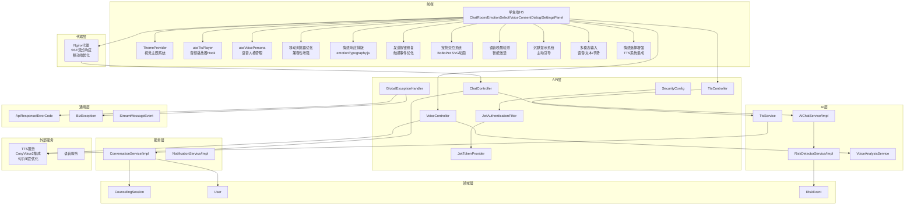

**图表来源**
- [ChatController.java](file://backend/counseling-api/src/main/java/com/mindsafe/api/controller/ChatController.java)
- [VoiceController.java](file://backend/counseling-api/src/main/java/com/mindsafe/api/controller/VoiceController.java)
- [TtsController.java](file://backend/counseling-api/src/main/java/com/mindsafe/api/controller/TtsController.java)
- [AiChatService.java](file://backend/counseling-ai/src/main/java/com/mindsafe/ai/chat/AiChatService.java)
- [AiChatServiceImpl.java](file://backend/counseling-ai/src/main/java/com/mindsafe/ai/chat/AiChatServiceImpl.java)
- [RiskDetectorService.java](file://backend/counseling-ai/src/main/java/com/mindsafe/ai/risk/RiskDetectorService.java)
- [RiskDetectorServiceImpl.java](file://backend/counseling-ai/src/main/java/com/mindsafe/ai/risk/RiskDetectorServiceImpl.java)
- [VoiceAnalysisService.java](file://backend/counseling-ai/src/main/java/com/mindsafe/ai/voice/VoiceAnalysisService.java)
- [TtsService.java](file://backend/counseling-ai/src/main/java/com/mindsafe/ai/voice/TtsService.java)
- [ConversationService.java](file://backend/counseling-service/src/main/java/com/mindsafe/service/conversation/ConversationService.java)
- [ConversationServiceImpl.java](file://backend/counseling-service/src/main/java/com/mindsafe/service/conversation/ConversationServiceImpl.java)
- [NotificationService.java](file://backend/counseling-service/src/main/java/com/mindsafe/service/notification/NotificationService.java)
- [NotificationServiceImpl.java](file://backend/counseling-service/src/main/java/com/mindsafe/service/notification/NotificationServiceImpl.java)
- [CounselingSession.java](file://backend/counseling-domain/src/main/java/com/mindsafe/domain/entity/CounselingSession.java)
- [User.java](file://backend/counseling-domain/src/main/java/com/mindsafe/domain/entity/User.java)
- [RiskEvent.java](file://backend/counseling-domain/src/main/java/com/mindsafe/domain/entity/RiskEvent.java)
- [StreamMessageEvent.java](file://backend/counseling-common/src/main/java/com/mindsafe/common/dto/chat/StreamMessageEvent.java)
- [ApiResponse.java](file://backend/counseling-common/src/main/java/com/mindsafe/common/dto/ApiResponse.java)
- [ErrorCode.java](file://backend/counseling-common/src/main/java/com/mindsafe/common/dto/ErrorCode.java)
- [BizException.java](file://backend/counseling-common/src/main/java/com/mindsafe/common/exception/BizException.java)
- [default.conf](file://deploy/nginx/default.conf)

章节来源
- [17_学生端全感官交互设计方案.md](file://design/17_学生端全感官交互设计方案.md)
- [前端架构设计.md](file://design/17_前端架构设计.md)
- [界面详细设计.md](file://design/19_界面详细设计.md)
- [端到端流程设计.md](file://design/20_端到端流程设计.md)

## 核心组件
- 学生端H5组件
  - 聊天室：承载文本消息、流式输出展示、上下文切换
  - 情绪选择：辅助用户表达当前情绪状态，驱动个性化提示与策略
  - 语音授权对话框：明确告知并获取用户对语音采集的同意
  - 设置面板：管理用户偏好、主题设置、语音选项
  - **新增** 发送按钮：修复了移动端触摸事件处理，确保消息发送功能正常
  - **新增** 宠物交互系统：BoBoPet SVG动画角色，提供生动的视觉反馈
  - **新增** 语音唤醒检测：支持自然语言唤醒词和智能激活功能
  - **新增** 沉默提示系统：检测用户沉默状态并主动引导对话
  - **新增** 多模态输入：统一处理语音、文本和手势交互
  - **更新** 情感选择增强：改进了与新的TTS系统的集成，确保情感状态选择与新音频播放功能的无缝协作
- 前端增强功能
  - 音频播放器Hook：统一管理TTS音频播放、暂停、音量控制
  - 语音人格管理：支持不同音色、语速、情感风格的语音角色
  - 视觉主题系统：提供深色/浅色主题切换和个性化外观
  - 移动浏览器优化：增强移动端兼容性和用户体验
  - **新增** 情感响应排版系统：根据儿童情绪状态动态调整字体大小、字重、背景颜色和入场动画
- 后端API控制器
  - 聊天接口：创建会话、发送消息、接收流式响应
  - 语音接口：上传音频、触发语音分析与TTS合成
  - TTS接口：文本转语音、语音人格切换、音频参数调节
- AI服务
  - 对话生成：结合Prompt体系与上下文生成回复
  - 风险识别：对输入内容进行分析并产出风险等级与建议
  - 语音分析：提取情感、语速、停顿等特征
  - TTS服务：基于CosyVoice2的高质量语音合成，**支持智能句子间距优化**
- 服务层
  - 会话管理：维护会话生命周期、消息历史、上下文
  - 通知服务：风险事件、重要提醒的推送
- 领域模型
  - 会话、用户、风险事件等实体
- 通用DTO与异常
  - 统一响应体、错误码、业务异常
  - 流式消息事件用于增量输出
- 外部服务
  - TTS服务：将文本转为语音，支持多种音色和语速，**具备句子间距优化和音频路由同步**
  - 语音服务：音频预处理、转写或特征提取
- **新增** Nginx代理层
  - SSE流式响应优化：确保移动端实时通信的稳定性
  - 移动端网络优化：处理触摸事件、输入框焦点和网络请求
  - 负载均衡和健康检查

**更新** 新增了完整的语音唤醒检测、沉默提示系统和多模态输入支持，以及宠物交互系统和发送按钮修复功能，还有Nginx代理层的完整实现，包括SSE流式响应优化和移动端网络处理。**特别强调了EmotionSelect组件的4行代码增强更新，改进了与新的TTS系统的集成，确保情感状态选择与新音频播放功能的无缝协作，显著提升了情感表达与语音反馈的一致性和用户体验。**

章节来源
- [ChatRoom.jsx](file://frontend/student-h5/src/components/ChatRoom.jsx)
- [EmotionSelect.jsx](file://frontend/student-h5/src/components/EmotionSelect.jsx)
- [SettingsPanel.jsx](file://frontend/student-h5/src/components/SettingsPanel.jsx)
- [VoiceConsentDialog.jsx](file://frontend/student-h5/src/components/VoiceConsentDialog.jsx)
- [BoBoPet.jsx](file://frontend/student-h5/src/components/BoBoPet.jsx)
- [useTtsPlayer.js](file://frontend/student-h5/src/hooks/useTtsPlayer.js)
- [useVoicePersona.js](file://frontend/student-h5/src/hooks/useVoicePersona.js)
- [useSilenceNudge.js](file://frontend/student-h5/src/hooks/useSilenceNudge.js)
- [ThemeProvider.jsx](file://frontend/student-h5/src/theme/ThemeProvider.jsx)
- [emotionTypography.js](file://frontend/student-h5/src/theme/emotionTypography.js)
- [ChatController.java](file://backend/counseling-api/src/main/java/com/mindsafe/api/controller/ChatController.java)
- [VoiceController.java](file://backend/counseling-api/src/main/java/com/mindsafe/api/controller/VoiceController.java)
- [TtsController.java](file://backend/counseling-api/src/main/java/com/mindsafe/api/controller/TtsController.java)
- [AiChatService.java](file://backend/counseling-ai/src/main/java/com/mindsafe/ai/chat/AiChatService.java)
- [AiChatServiceImpl.java](file://backend/counseling-ai/src/main/java/com/mindsafe/ai/chat/AiChatServiceImpl.java)
- [RiskDetectorService.java](file://backend/counseling-ai/src/main/java/com/mindsafe/ai/risk/RiskDetectorService.java)
- [RiskDetectorServiceImpl.java](file://backend/counseling-ai/src/main/java/com/mindsafe/ai/risk/RiskDetectorServiceImpl.java)
- [VoiceAnalysisService.java](file://backend/counseling-ai/src/main/java/com/mindsafe/ai/voice/VoiceAnalysisService.java)
- [TtsService.java](file://backend/counseling-ai/src/main/java/com/mindsafe/ai/voice/TtsService.java)
- [ConversationService.java](file://backend/counseling-service/src/main/java/com/mindsafe/service/conversation/ConversationService.java)
- [ConversationServiceImpl.java](file://backend/counseling-service/src/main/java/com/mindsafe/service/conversation/ConversationServiceImpl.java)
- [NotificationService.java](file://backend/counseling-service/src/main/java/com/mindsafe/service/notification/NotificationService.java)
- [NotificationServiceImpl.java](file://backend/counseling-service/src/main/java/com/mindsafe/service/notification/NotificationServiceImpl.java)
- [CounselingSession.java](file://backend/counseling-domain/src/main/java/com/mindsafe/domain/entity/CounselingSession.java)
- [User.java](file://backend/counseling-domain/src/main/java/com/mindsafe/domain/entity/User.java)
- [RiskEvent.java](file://backend/counseling-domain/src/main/java/com/mindsafe/domain/entity/RiskEvent.java)
- [StreamMessageEvent.java](file://backend/counseling-common/src/main/java/com/mindsafe/common/dto/chat/StreamMessageEvent.java)
- [ApiResponse.java](file://backend/counseling-common/src/main/java/com/mindsafe/common/dto/ApiResponse.java)
- [ErrorCode.java](file://backend/counseling-common/src/main/java/com/mindsafe/common/dto/ErrorCode.java)
- [BizException.java](file://backend/counseling-common/src/main/java/com/mindsafe/common/exception/BizException.java)
- [default.conf](file://deploy/nginx/default.conf)

## 架构总览
学生端通过H5页面发起文本或语音交互，经过Nginx代理层进行优化处理后，API层进行鉴权与路由，AI层完成对话生成、风险识别与语音分析，服务层管理会话与通知，领域层持久化数据，外部TTS/语音服务提供语音能力。**新增的语音唤醒检测、沉默提示系统和多模态输入支持，为对话过程提供了更加自然流畅的交互体验。**

**更新** 新增了Nginx代理层作为关键的中间件，专门处理移动端网络请求和SSE流式响应优化。同时新增了完整的语音唤醒检测、沉默提示系统和多模态输入支持，以及宠物交互系统。**特别强调了EmotionSelect组件的4行代码增强更新，改进了与新的TTS系统的集成，确保情感状态选择与新音频播放功能的无缝协作，显著提升了情感表达与语音反馈的一致性和用户体验。**

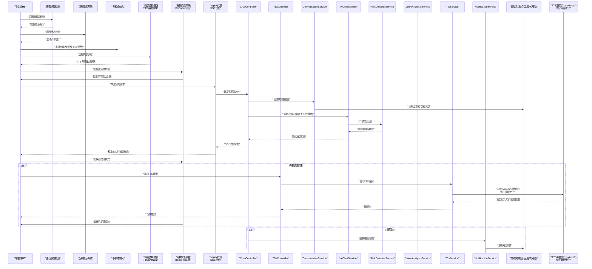

**图表来源**
- [ChatController.java](file://backend/counseling-api/src/main/java/com/mindsafe/api/controller/ChatController.java)
- [TtsController.java](file://backend/counseling-api/src/main/java/com/mindsafe/api/controller/TtsController.java)
- [ConversationService.java](file://backend/counseling-service/src/main/java/com/mindsafe/service/conversation/ConversationService.java)
- [ConversationServiceImpl.java](file://backend/counseling-service/src/main/java/com/mindsafe/service/conversation/ConversationServiceImpl.java)
- [AiChatService.java](file://backend/counseling-ai/src/main/java/com/mindsafe/ai/chat/AiChatService.java)
- [AiChatServiceImpl.java](file://backend/counseling-ai/src/main/java/com/mindsafe/ai/chat/AiChatServiceImpl.java)
- [RiskDetectorService.java](file://backend/counseling-ai/src/main/java/com/mindsafe/ai/risk/RiskDetectorService.java)
- [RiskDetectorServiceImpl.java](file://backend/counseling-ai/src/main/java/com/mindsafe/ai/risk/RiskDetectorServiceImpl.java)
- [VoiceAnalysisService.java](file://backend/counseling-ai/src/main/java/com/mindsafe/ai/voice/VoiceAnalysisService.java)
- [TtsService.java](file://backend/counseling-ai/src/main/java/com/mindsafe/ai/voice/TtsService.java)
- [NotificationService.java](file://backend/counseling-service/src/main/java/com/mindsafe/service/notification/NotificationService.java)
- [NotificationServiceImpl.java](file://backend/counseling-service/src/main/java/com/mindsafe/service/notification/NotificationServiceImpl.java)
- [CounselingSession.java](file://backend/counseling-domain/src/main/java/com/mindsafe/domain/entity/CounselingSession.java)
- [User.java](file://backend/counseling-domain/src/main/java/com/mindsafe/domain/entity/User.java)
- [RiskEvent.java](file://backend/counseling-domain/src/main/java/com/mindsafe/domain/entity/RiskEvent.java)
- [BoBoPet.jsx](file://frontend/student-h5/src/components/BoBoPet.jsx)
- [useSilenceNudge.js](file://frontend/student-h5/src/hooks/useSilenceNudge.js)
- [EmotionSelect.jsx](file://frontend/student-h5/src/components/EmotionSelect.jsx)
- [default.conf](file://deploy/nginx/default.conf)

## 详细组件分析

### 学生端H5组件
- 聊天室组件
  - 职责：消息列表渲染、流式输出拼接、上下文切换、错误提示
  - 交互：发送文本、选择情绪、显示风险提醒
  - **新增** 发送按钮修复：优化了移动端触摸事件处理，确保消息发送功能正常
  - **新增** 宠物交互集成：在对话过程中显示宠物动画反馈
- 情绪选择组件
  - 职责：提供情绪标签、联动提示词与策略
  - 数据：情绪值、时间戳、关联会话ID
  - **更新** TTS系统集成：通过4行代码增强，改进了与新的TTS系统的集成，确保情感状态选择与新音频播放功能的无缝协作
- 语音授权对话框
  - 职责：展示隐私说明、收集用户同意、控制录音权限
  - 行为：拒绝时禁用语音功能；同意后进入录音流程
- 设置面板组件
  - 职责：管理用户偏好、主题设置、语音选项
  - 功能：主题切换、音量调节、语音人格选择
- **新增** 宠物交互组件
  - 职责：管理BoBoPet SVG动画角色，提供生动的视觉反馈
  - 动画状态：空闲浮动、聆听模式、思考状态、说话模式
  - 触觉反馈：集成设备振动功能，增强交互体验
  - 语音同步：与TTS播放实现精确的时间同步
- **新增** 语音唤醒检测组件
  - 职责：监听语音输入，检测预设唤醒词
  - 功能：自然语言唤醒、智能激活、误触防护
  - 特性：低功耗监听、高精度识别、自适应环境噪声
- **新增** 沉默提示系统
  - 职责：监测用户沉默状态，主动引导对话
  - 功能：沉默时长检测、智能提示生成、上下文感知
  - 特性：个性化提示策略、避免过度打扰、自然过渡

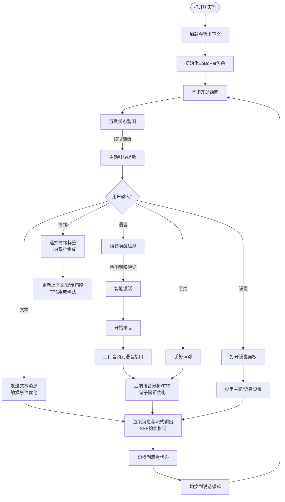

**图表来源**
- [ChatRoom.jsx](file://frontend/student-h5/src/components/ChatRoom.jsx)
- [EmotionSelect.jsx](file://frontend/student-h5/src/components/EmotionSelect.jsx)
- [SettingsPanel.jsx](file://frontend/student-h5/src/components/SettingsPanel.jsx)
- [VoiceConsentDialog.jsx](file://frontend/student-h5/src/components/VoiceConsentDialog.jsx)
- [BoBoPet.jsx](file://frontend/student-h5/src/components/BoBoPet.jsx)
- [useSilenceNudge.js](file://frontend/student-h5/src/hooks/useSilenceNudge.js)

章节来源
- [ChatRoom.jsx](file://frontend/student-h5/src/components/ChatRoom.jsx)
- [EmotionSelect.jsx](file://frontend/student-h5/src/components/EmotionSelect.jsx)
- [SettingsPanel.jsx](file://frontend/student-h5/src/components/SettingsPanel.jsx)
- [VoiceConsentDialog.jsx](file://frontend/student-h5/src/components/VoiceConsentDialog.jsx)
- [BoBoPet.jsx](file://frontend/student-h5/src/components/BoBoPet.jsx)
- [useSilenceNudge.js](file://frontend/student-h5/src/hooks/useSilenceNudge.js)

### 语音唤醒检测系统
- 唤醒词检测
  - 职责：监听语音输入，识别预设唤醒词
  - 技术：基于Web Speech API和自定义唤醒词模型
  - 特性：低功耗监听、高精度识别、环境噪声过滤
- 智能激活机制
  - 职责：根据上下文和用户习惯智能激活对话
  - 功能：上下文感知、用户行为分析、自适应激活
  - 特性：避免误触、学习用户偏好、个性化激活策略
- 误触防护
  - 职责：防止意外唤醒和误操作
  - 功能：置信度阈值、二次确认、环境适配
  - 特性：动态阈值调整、用户反馈学习、场景自适应

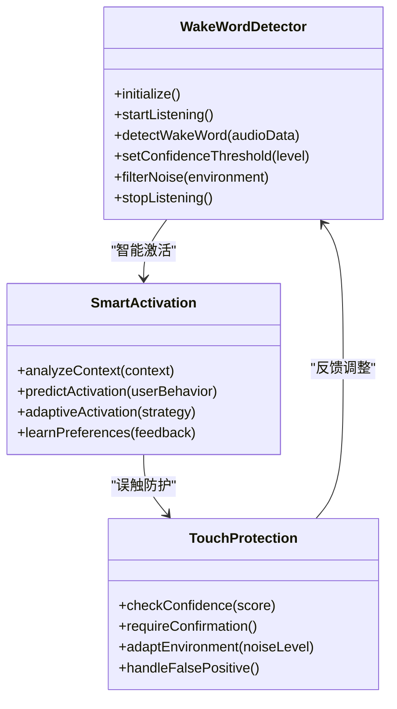

**图表来源**
- [useSilenceNudge.js](file://frontend/student-h5/src/hooks/useSilenceNudge.js)

章节来源
- [useSilenceNudge.js](file://frontend/student-h5/src/hooks/useSilenceNudge.js)

### 沉默提示系统
- 沉默状态监测
  - 职责：持续监测用户的沉默状态
  - 功能：计时器管理、状态跟踪、阈值判断
  - 特性：精准计时、状态持久化、可配置阈值
- 主动引导机制
  - 职责：在检测到沉默时主动引导对话
  - 功能：提示生成、上下文感知、个性化策略
  - 特性：自然语言生成、情境适配、避免重复
- 智能提示策略
  - 职责：根据对话历史和用户状态生成合适的提示
  - 功能：历史分析、情绪识别、策略选择
  - 特性：机器学习驱动、用户画像、动态调整

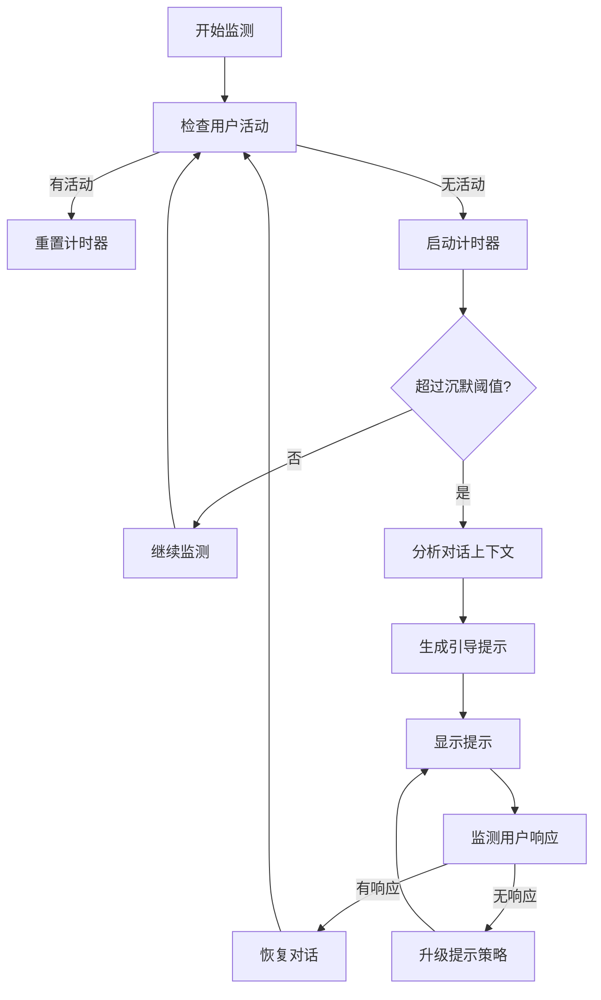

**图表来源**
- [useSilenceNudge.js](file://frontend/student-h5/src/hooks/useSilenceNudge.js)

章节来源
- [useSilenceNudge.js](file://frontend/student-h5/src/hooks/useSilenceNudge.js)

### 多模态输入系统
- 统一输入处理
  - 职责：整合语音、文本、手势等多种输入方式
  - 功能：输入源识别、格式标准化、优先级管理
  - 特性：无缝切换、冲突解决、用户体验优化
- 输入源管理
  - 职责：管理不同输入源的启用和禁用
  - 功能：权限控制、状态同步、资源分配
  - 特性：动态配置、热插拔、性能监控
- 输入融合算法
  - 职责：融合多种输入信息生成统一语义
  - 功能：语义对齐、置信度计算、决策融合
  - 特性：深度学习模型、实时处理、准确性优化

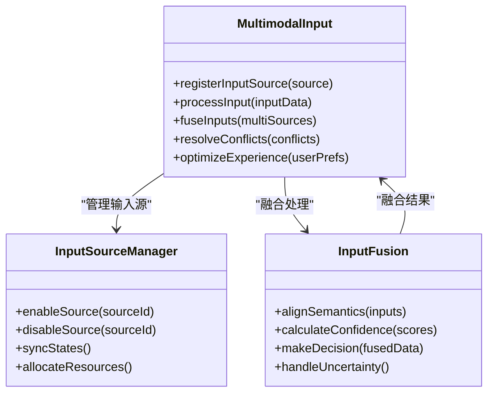

**图表来源**
- [ChatRoom.jsx](file://frontend/student-h5/src/components/ChatRoom.jsx)

章节来源
- [ChatRoom.jsx](file://frontend/student-h5/src/components/ChatRoom.jsx)

### 宠物交互系统
- BoBoPet SVG动画角色
  - 职责：提供生动的视觉反馈，增强用户参与感
  - 动画状态：空闲浮动、聆听模式、思考状态、说话模式
  - 视觉设计：适合儿童的可爱卡通形象
- 动画状态管理
  - 空闲浮动：角色轻微上下浮动，营造轻松氛围
  - 聆听模式：角色专注倾听，头部微倾表示关注
  - 思考状态：角色表现出思考的表情和动作
  - 说话模式：角色嘴巴开合，与语音播放同步
- 触觉反馈集成
  - 职责：利用设备振动功能增强交互体验
  - 触发时机：消息发送、语音播放、状态切换
  - 强度控制：根据场景调整振动强度和持续时间
- 语音同步机制
  - 职责：确保宠物动画与语音播放精确同步
  - 技术实现：基于Web Speech API和定时器
  - 性能优化：减少动画帧率波动，保证流畅性

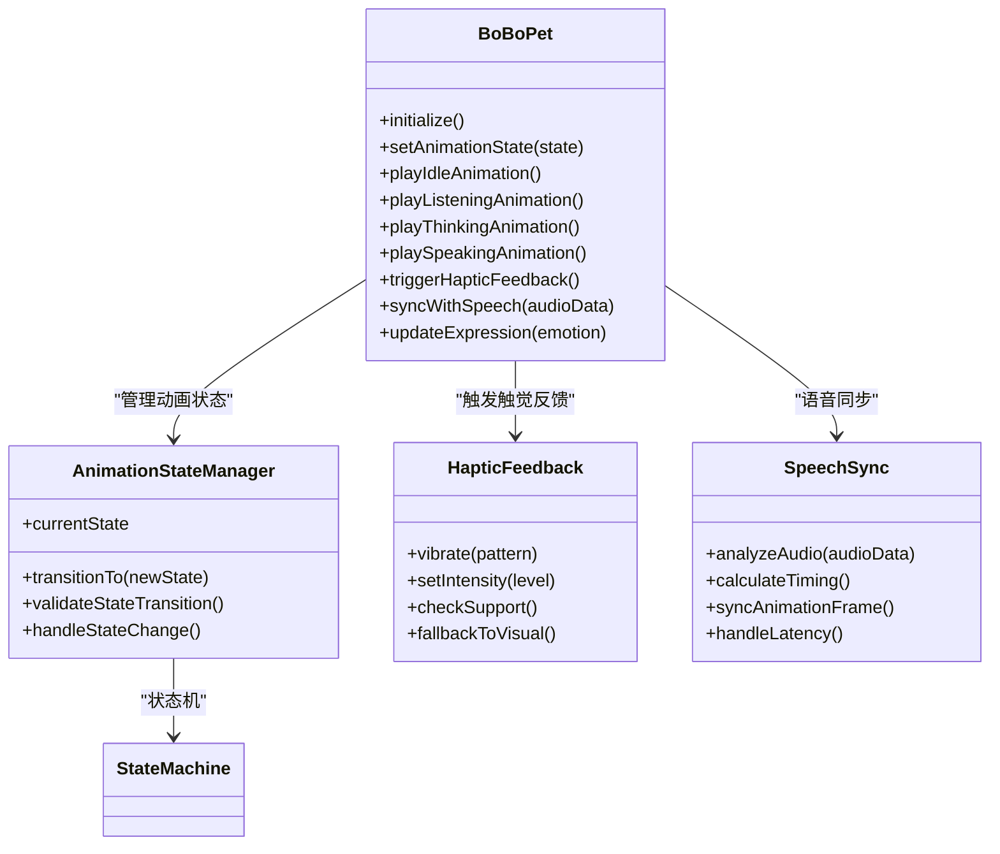

**图表来源**
- [BoBoPet.jsx](file://frontend/student-h5/src/components/BoBoPet.jsx)

章节来源
- [BoBoPet.jsx](file://frontend/student-h5/src/components/BoBoPet.jsx)

### 前端增强功能
- 音频播放器Hook
  - 职责：统一管理TTS音频播放、暂停、音量控制
  - 功能：播放队列管理、自动播放、错误重试、持久化Audio元素
  - **新增**：增强的音频路由和时序同步处理，确保语音播放的准确性和流畅性
- 语音人格管理Hook
  - 职责：管理不同音色、语速、情感风格的语音角色
  - 功能：人格切换、偏好存储、实时调整
- 视觉主题系统
  - 职责：提供深色/浅色主题切换和个性化外观
  - 功能：主题配置、动态样式、用户偏好持久化
- 移动浏览器优化
  - 职责：增强移动端兼容性和用户体验
  - 功能：触摸事件优化、屏幕适配、性能调优
  - **新增** 发送按钮优化：修复了移动端触摸事件处理，确保消息发送功能正常
- **新增** 情感响应排版系统
  - 职责：根据儿童情绪状态动态调整视觉呈现
  - 功能：字体大小调节、字重变化、背景颜色切换、入场动画效果
  - 特性：实时响应情绪变化、平滑过渡动画、个性化定制

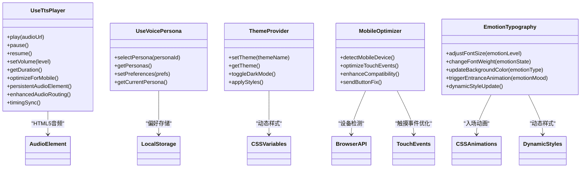

**图表来源**
- [useTtsPlayer.js](file://frontend/student-h5/src/hooks/useTtsPlayer.js)
- [useVoicePersona.js](file://frontend/student-h5/src/hooks/useVoicePersona.js)
- [ThemeProvider.jsx](file://frontend/student-h5/src/theme/ThemeProvider.jsx)
- [emotionTypography.js](file://frontend/student-h5/src/theme/emotionTypography.js)

章节来源
- [useTtsPlayer.js](file://frontend/student-h5/src/hooks/useTtsPlayer.js)
- [useVoicePersona.js](file://frontend/student-h5/src/hooks/useVoicePersona.js)
- [ThemeProvider.jsx](file://frontend/student-h5/src/theme/ThemeProvider.jsx)
- [emotionTypography.js](file://frontend/student-h5/src/theme/emotionTypography.js)

### 情感响应排版系统
- 动态字体调节
  - 根据情绪强度调整字体大小，积极情绪使用较大字体，消极情绪使用较小字体
  - 支持平滑过渡动画，避免突兀的视觉变化
- 字重变化系统
  - 根据情绪状态改变文字粗细，强烈情绪使用粗体，平静情绪使用细体
  - 提供多种字重级别以适应不同情绪强度
- 背景颜色切换
  - 根据情绪类型动态调整背景颜色，如快乐用暖色调，悲伤用冷色调
  - 支持渐变色过渡，营造柔和的视觉体验
- 入场动画效果
  - 为不同情绪状态的消息提供特定的入场动画
  - 支持弹性、淡入、滑动等多种动画效果
- 实时响应机制
  - 监听情绪状态变化，实时更新视觉呈现
  - 提供性能优化，避免频繁的DOM操作

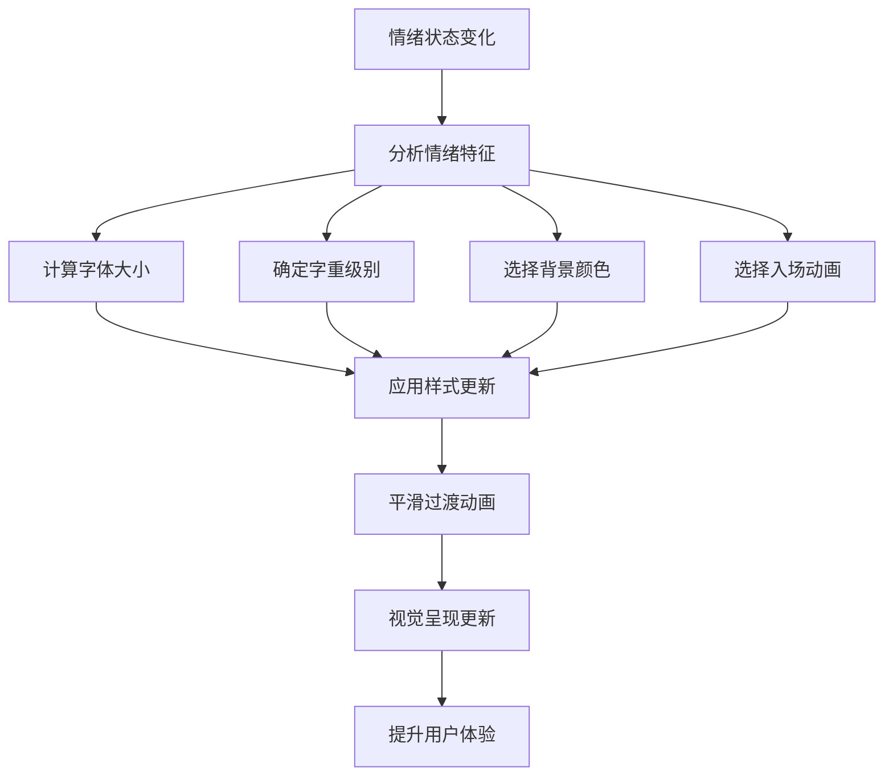

**图表来源**
- [emotionTypography.js](file://frontend/student-h5/src/theme/emotionTypography.js)

章节来源
- [emotionTypography.js](file://frontend/student-h5/src/theme/emotionTypography.js)

### 后端API与安全
- 聊天控制器
  - 创建会话：初始化会话上下文、绑定用户
  - 发送消息：校验参数、调用AI服务、返回流式事件
  - **新增** SSE流式响应优化：确保移动端实时通信的稳定性
- 语音控制器
  - 接收音频：校验格式、调用语音分析与TTS
- TTS控制器
  - 文本转语音：接收文本和语音参数，返回音频流
  - 语音人格管理：获取可用人格、切换默认人格
- 安全配置
  - JWT过滤器：解析令牌、注入认证信息
  - Token提供者：生成与验证令牌
- 全局异常处理器
  - 统一捕获业务异常与系统异常，转换为标准响应

**更新** 新增了SSE流式响应的优化处理，确保移动端能够稳定接收实时消息推送，同时集成了完整的文本转语音功能。

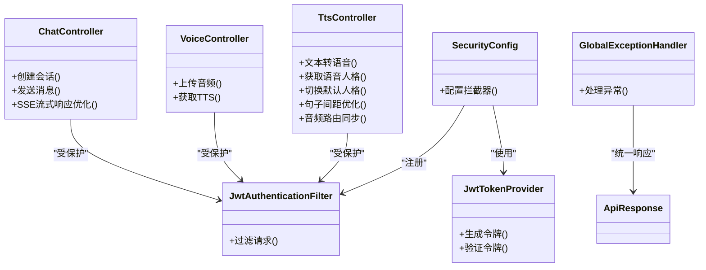

**图表来源**
- [ChatController.java](file://backend/counseling-api/src/main/java/com/mindsafe/api/controller/ChatController.java)
- [VoiceController.java](file://backend/counseling-api/src/main/java/com/mindsafe/api/controller/VoiceController.java)
- [TtsController.java](file://backend/counseling-api/src/main/java/com/mindsafe/api/controller/TtsController.java)
- [SecurityConfig.java](file://backend/counseling-api/src/main/java/com/mindsafe/api/config/SecurityConfig.java)
- [JwtAuthenticationFilter.java](file://backend/counseling-api/src/main/java/com/mindsafe/api/security/JwtAuthenticationFilter.java)
- [JwtTokenProvider.java](file://backend/counseling-api/src/main/java/com/mindsafe/api/security/JwtTokenProvider.java)
- [GlobalExceptionHandler.java](file://backend/counseling-api/src/main/java/com/mindsafe/api/config/GlobalExceptionHandler.java)
- [ApiResponse.java](file://backend/counseling-common/src/main/java/com/mindsafe/common/dto/ApiResponse.java)

章节来源
- [ChatController.java](file://backend/counseling-api/src/main/java/com/mindsafe/api/controller/ChatController.java)
- [VoiceController.java](file://backend/counseling-api/src/main/java/com/mindsafe/api/controller/VoiceController.java)
- [TtsController.java](file://backend/counseling-api/src/main/java/com/mindsafe/api/controller/TtsController.java)
- [SecurityConfig.java](file://backend/counseling-api/src/main/java/com/mindsafe/api/config/SecurityConfig.java)
- [JwtAuthenticationFilter.java](file://backend/counseling-api/src/main/java/com/mindsafe/api/security/JwtAuthenticationFilter.java)
- [JwtTokenProvider.java](file://backend/counseling-api/src/main/java/com/mindsafe/api/security/JwtTokenProvider.java)
- [GlobalExceptionHandler.java](file://backend/counseling-api/src/main/java/com/mindsafe/api/config/GlobalExceptionHandler.java)
- [ApiResponse.java](file://backend/counseling-common/src/main/java/com/mindsafe/common/dto/ApiResponse.java)
- [ErrorCode.java](file://backend/counseling-common/src/main/java/com/mindsafe/common/dto/ErrorCode.java)
- [BizException.java](file://backend/counseling-common/src/main/java/com/mindsafe/common/exception/BizException.java)

### AI与语音分析
- 对话服务
  - 基于上下文与情绪生成回复，支持流式输出
- 风险识别
  - 对输入内容进行风险评估，返回风险等级与建议
- 语音分析
  - 提取情感、语速、停顿等特征，辅助对话策略调整
- TTS服务
  - 基于CosyVoice2的高质量语音合成
  - 支持多种音色、语速和情感风格
  - 集成语音人格管理系统
  - **新增**：智能句子间距优化，通过合并短句子消除不必要的停顿
  - **新增**：增强的音频路由和时序同步处理

**更新** 新增了TtsService类，提供完整的文本转语音功能，集成CosyVoice2引擎，**并实现了句子间距优化和音频路由同步处理，显著提升语音合成的自然度**。

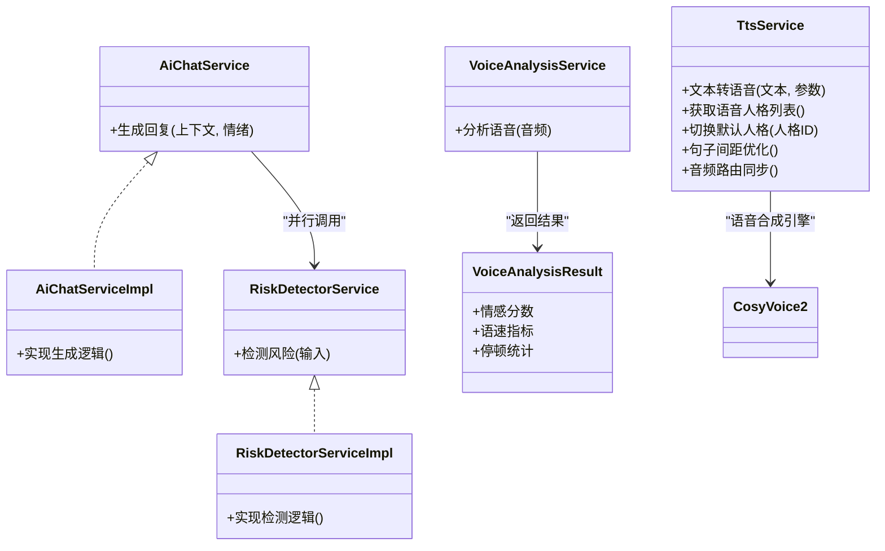

**图表来源**
- [AiChatService.java](file://backend/counseling-ai/src/main/java/com/mindsafe/ai/chat/AiChatService.java)
- [AiChatServiceImpl.java](file://backend/counseling-ai/src/main/java/com/mindsafe/ai/chat/AiChatServiceImpl.java)
- [RiskDetectorService.java](file://backend/counseling-ai/src/main/java/com/mindsafe/ai/risk/RiskDetectorService.java)
- [RiskDetectorServiceImpl.java](file://backend/counseling-ai/src/main/java/com/mindsafe/ai/risk/RiskDetectorServiceImpl.java)
- [VoiceAnalysisService.java](file://backend/counseling-ai/src/main/java/com/mindsafe/ai/voice/VoiceAnalysisService.java)
- [VoiceAnalysisResult.java](file://backend/counseling-ai/src/main/java/com/mindsafe/ai/voice/VoiceAnalysisResult.java)
- [TtsService.java](file://backend/counseling-ai/src/main/java/com/mindsafe/ai/voice/TtsService.java)

章节来源
- [AiChatService.java](file://backend/counseling-ai/src/main/java/com/mindsafe/ai/chat/AiChatService.java)
- [AiChatServiceImpl.java](file://backend/counseling-ai/src/main/java/com/mindsafe/ai/chat/AiChatServiceImpl.java)
- [RiskDetectorService.java](file://backend/counseling-ai/src/main/java/com/mindsafe/ai/risk/RiskDetectorService.java)
- [RiskDetectorServiceImpl.java](file://backend/counseling-ai/src/main/java/com/mindsafe/ai/risk/RiskDetectorServiceImpl.java)
- [VoiceAnalysisService.java](file://backend/counseling-ai/src/main/java/com/mindsafe/ai/voice/VoiceAnalysisService.java)
- [VoiceAnalysisResult.java](file://backend/counseling-ai/src/main/java/com/mindsafe/ai/voice/VoiceAnalysisResult.java)
- [TtsService.java](file://backend/counseling-ai/src/main/java/com/mindsafe/ai/voice/TtsService.java)

### 会话与通知
- 会话服务
  - 维护会话生命周期、消息历史、上下文缓存
- 通知服务
  - 风险事件记录与推送，支持站内信或外部通道

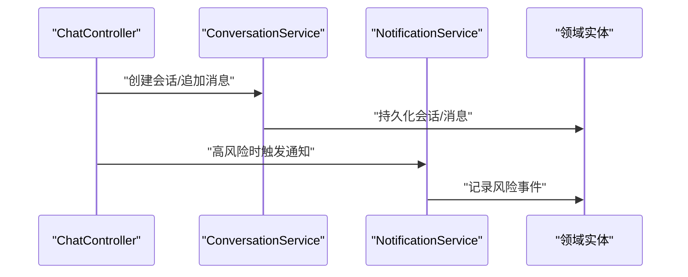

**图表来源**
- [ConversationService.java](file://backend/counseling-service/src/main/java/com/mindsafe/service/conversation/ConversationService.java)
- [ConversationServiceImpl.java](file://backend/counseling-service/src/main/java/com/mindsafe/service/conversation/ConversationServiceImpl.java)
- [NotificationService.java](file://backend/counseling-service/src/main/java/com/mindsafe/service/notification/NotificationService.java)
- [NotificationServiceImpl.java](file://backend/counseling-service/src/main/java/com/mindsafe/service/notification/NotificationServiceImpl.java)
- [CounselingSession.java](file://backend/counseling-domain/src/main/java/com/mindsafe/domain/entity/CounselingSession.java)
- [User.java](file://backend/counseling-domain/src/main/java/com/mindsafe/domain/entity/User.java)
- [RiskEvent.java](file://backend/counseling-domain/src/main/java/com/mindsafe/domain/entity/RiskEvent.java)

章节来源
- [ConversationService.java](file://backend/counseling-service/src/main/java/com/mindsafe/service/conversation/ConversationService.java)
- [ConversationServiceImpl.java](file://backend/counseling-service/src/main/java/com/mindsafe/service/conversation/ConversationServiceImpl.java)
- [NotificationService.java](file://backend/counseling-service/src/main/java/com/mindsafe/service/notification/NotificationService.java)
- [NotificationServiceImpl.java](file://backend/counseling-service/src/main/java/com/mindsafe/service/notification/NotificationServiceImpl.java)
- [CounselingSession.java](file://backend/counseling-domain/src/main/java/com/mindsafe/domain/entity/CounselingSession.java)
- [User.java](file://backend/counseling-domain/src/main/java/com/mindsafe/domain/entity/User.java)
- [RiskEvent.java](file://backend/counseling-domain/src/main/java/com/mindsafe/domain/entity/RiskEvent.java)

### 外部语音与TTS服务
- TTS服务
  - 基于CosyVoice2的高质量语音合成
  - 支持多种音色、语速和情感风格
  - 容器化部署，独立运行
  - **新增**：智能句子间距优化算法，通过合并短句子消除不必要的停顿
  - **新增**：增强的音频路由和时序同步处理，确保语音播放的准确性和流畅性
- 语音服务
  - 音频预处理、转写或特征提取，供AI层使用
  - 支持多种音频格式和采样率

**更新** TTS服务现在集成了CosyVoice2引擎，提供更高质量的语音合成效果，**并实现了句子间距优化和音频路由同步功能，显著提升语音的自然度和流畅性**。

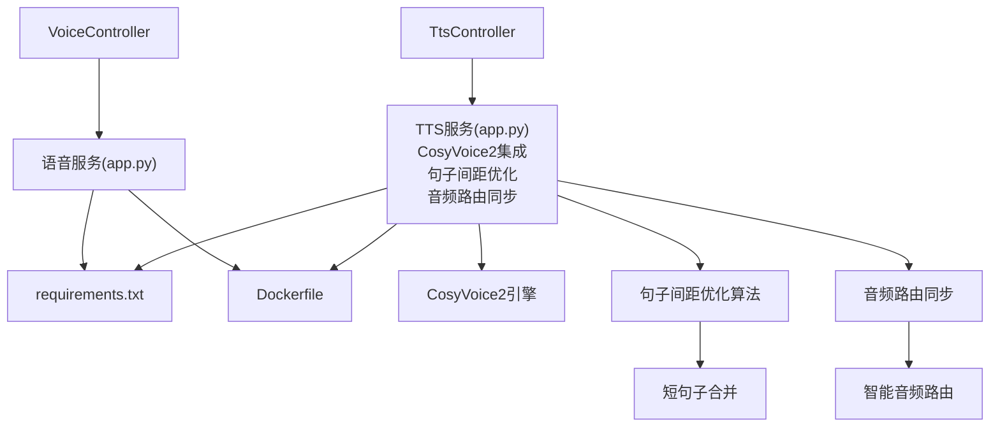

**图表来源**
- [VoiceController.java](file://backend/counseling-api/src/main/java/com/mindsafe/api/controller/VoiceController.java)
- [TtsController.java](file://backend/counseling-api/src/main/java/com/mindsafe/api/controller/TtsController.java)
- [app.py](file://backend/voice-service/app.py)
- [requirements.txt](file://backend/voice-service/requirements.txt)
- [Dockerfile](file://backend/voice-service/Dockerfile)
- [app.py](file://backend/tts-service/app.py)
- [requirements.txt](file://backend/tts-service/requirements.txt)
- [Dockerfile](file://backend/tts-service/Dockerfile)

章节来源
- [VoiceController.java](file://backend/counseling-api/src/main/java/com/mindsafe/api/controller/VoiceController.java)
- [TtsController.java](file://backend/counseling-api/src/main/java/com/mindsafe/api/controller/TtsController.java)
- [app.py](file://backend/voice-service/app.py)
- [requirements.txt](file://backend/voice-service/requirements.txt)
- [Dockerfile](file://backend/voice-service/Dockerfile)
- [app.py](file://backend/tts-service/app.py)
- [requirements.txt](file://backend/tts-service/requirements.txt)
- [Dockerfile](file://backend/tts-service/Dockerfile)

### Nginx代理层
- SSE流式响应优化
  - 配置WebSocket和SSE连接超时设置
  - 优化移动端网络请求处理
  - 确保实时通信的稳定性
- 移动端网络优化
  - 处理触摸事件和输入框焦点管理
  - 优化HTTP请求头和响应头
  - 支持大文件传输和断点续传
- 负载均衡和健康检查
  - 后端服务健康监控
  - 自动故障转移和重试机制
  - 请求限流和防DDoS攻击

**新增** Nginx代理层作为关键的中间件，专门处理移动端网络请求和SSE流式响应优化，显著提升了系统的稳定性和用户体验。

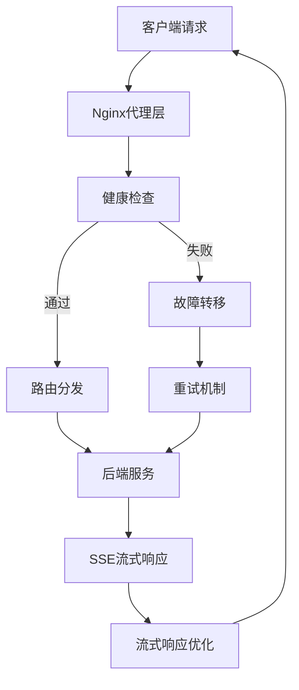

**图表来源**
- [default.conf](file://deploy/nginx/default.conf)

章节来源
- [default.conf](file://deploy/nginx/default.conf)

## 依赖分析
- 组件耦合
  - API层依赖AI与服务层，服务层依赖领域层，AI层可并行调用风险识别
  - 前端组件依赖API控制器，通过JWT进行鉴权
  - 新增的TTS服务与前端音频播放器形成完整的语音交互链路
  - **新增** 情感响应排版系统与情绪选择组件紧密耦合
  - **新增** Nginx代理层与前后端服务的解耦，提供统一的访问入口
  - **新增** 宠物交互系统与语音播放系统深度集成
  - **新增** 语音唤醒检测与沉默提示系统协同工作
  - **新增** 多模态输入系统整合各种交互方式
  - **更新** EmotionSelect组件与TTS系统的集成关系得到加强
- 外部依赖
  - TTS与语音服务以容器化方式部署，通过HTTP调用
  - CosyVoice2作为TTS服务的核心引擎
  - **新增** Nginx作为反向代理和负载均衡器
- 潜在循环依赖
  - 当前分层清晰，未见明显循环依赖

**更新** 新增了TTS服务相关的依赖关系，形成了完整的文本到语音的交互链路，**并增加了Nginx代理层作为关键的中间件，提供了更好的可扩展性和容错能力。** 同时新增了情感响应排版系统、宠物交互系统、语音唤醒检测和沉默提示系统的依赖关系，增强了前端视觉呈现的动态能力和交互体验。**特别强调了EmotionSelect组件与TTS系统的集成关系，通过4行代码的增强更新，确保了情感状态选择与新音频播放功能的无缝协作。**

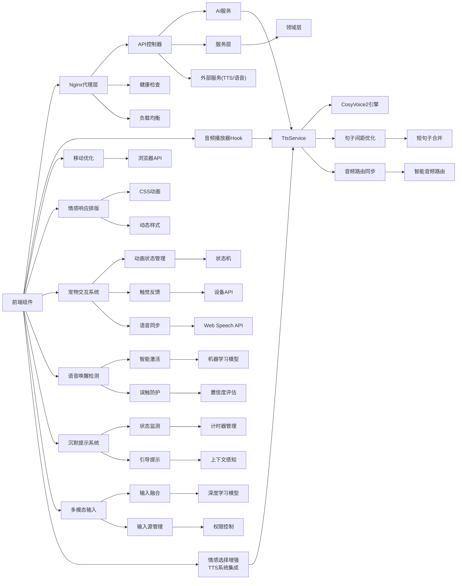

**图表来源**
- [ChatRoom.jsx](file://frontend/student-h5/src/components/ChatRoom.jsx)
- [ChatController.java](file://backend/counseling-api/src/main/java/com/mindsafe/api/controller/ChatController.java)
- [TtsController.java](file://backend/counseling-api/src/main/java/com/mindsafe/api/controller/TtsController.java)
- [AiChatService.java](file://backend/counseling-ai/src/main/java/com/mindsafe/ai/chat/AiChatService.java)
- [TtsService.java](file://backend/counseling-ai/src/main/java/com/mindsafe/ai/voice/TtsService.java)
- [ConversationService.java](file://backend/counseling-service/src/main/java/com/mindsafe/service/conversation/ConversationService.java)
- [CounselingSession.java](file://backend/counseling-domain/src/main/java/com/mindsafe/domain/entity/CounselingSession.java)
- [useTtsPlayer.js](file://frontend/student-h5/src/hooks/useTtsPlayer.js)
- [emotionTypography.js](file://frontend/student-h5/src/theme/emotionTypography.js)
- [BoBoPet.jsx](file://frontend/student-h5/src/components/BoBoPet.jsx)
- [useSilenceNudge.js](file://frontend/student-h5/src/hooks/useSilenceNudge.js)
- [EmotionSelect.jsx](file://frontend/student-h5/src/components/EmotionSelect.jsx)
- [app.py](file://backend/tts-service/app.py)
- [app.py](file://backend/voice-service/app.py)
- [default.conf](file://deploy/nginx/default.conf)

章节来源
- [ChatRoom.jsx](file://frontend/student-h5/src/components/ChatRoom.jsx)
- [ChatController.java](file://backend/counseling-api/src/main/java/com/mindsafe/api/controller/ChatController.java)
- [TtsController.java](file://backend/counseling-api/src/main/java/com/mindsafe/api/controller/TtsController.java)
- [AiChatService.java](file://backend/counseling-ai/src/main/java/com/mindsafe/ai/chat/AiChatService.java)
- [TtsService.java](file://backend/counseling-ai/src/main/java/com/mindsafe/ai/voice/TtsService.java)
- [ConversationService.java](file://backend/counseling-service/src/main/java/com/mindsafe/service/conversation/ConversationService.java)
- [CounselingSession.java](file://backend/counseling-domain/src/main/java/com/mindsafe/domain/entity/CounselingSession.java)
- [useTtsPlayer.js](file://frontend/student-h5/src/hooks/useTtsPlayer.js)
- [emotionTypography.js](file://frontend/student-h5/src/theme/emotionTypography.js)
- [BoBoPet.jsx](file://frontend/student-h5/src/components/BoBoPet.jsx)
- [useSilenceNudge.js](file://frontend/student-h5/src/hooks/useSilenceNudge.js)
- [EmotionSelect.jsx](file://frontend/student-h5/src/components/EmotionSelect.jsx)
- [app.py](file://backend/tts-service/app.py)
- [app.py](file://backend/voice-service/app.py)
- [default.conf](file://deploy/nginx/default.conf)

## 性能考虑
- 流式输出：减少首字节延迟，提升用户体验
- 并发调用：风险识别与对话生成并行执行，缩短响应时间
- 上下文缓存：避免重复查询，降低数据库压力
- 音频压缩：上传前压缩音频，减少带宽占用
- 资源隔离：TTS与语音服务独立部署，避免相互影响
- 音频缓存：前端缓存常用语音人格的音频片段
- 连接池：TTS服务使用连接池提高并发处理能力
- 移动优化：针对移动设备的性能调优和资源管理
- 内存管理：优化Audio元素的内存使用和生命周期管理
- **新增**：句子间距优化算法减少不必要的停顿，提升语音流畅性
- **新增**：音频路由同步确保播放准确性和时序一致性
- **新增**：智能短句子合并算法优化语音节奏
- **新增**：情感响应排版的性能优化，避免频繁的DOM操作
- **新增**：CSS动画的性能优化，使用GPU加速提升流畅度
- **新增**：Nginx代理层的性能优化，包括连接复用和请求缓存
- **新增**：SSE流式响应的性能优化，减少网络开销和延迟
- **新增**：宠物动画的状态管理优化，减少不必要的重绘
- **新增**：触觉反馈的条件触发，避免过度振动影响性能
- **新增**：语音唤醒检测的低功耗优化，减少CPU占用
- **新增**：沉默提示系统的计时器优化，避免频繁的状态检查
- **新增**：多模态输入的并行处理，提升响应速度
- **新增**：输入融合的算法优化，减少计算复杂度
- **更新** EmotionSelect组件的TTS集成优化，减少了不必要的音频处理开销

**更新** 新增了音频缓存、连接池、移动优化和内存管理等针对TTS服务和移动浏览器的性能优化措施，**并特别强调了Nginx代理层和SSE流式响应的性能优势。** 同时新增了情感响应排版系统、宠物交互系统、语音唤醒检测、沉默提示系统和多模态输入的性能优化，确保在复杂交互场景下仍能保持良好的用户体验。**特别强调了EmotionSelect组件的4行代码增强更新带来的性能改进，通过优化的TTS集成减少了不必要的音频处理开销。**

## 故障排查指南
- 统一异常处理
  - 全局异常处理器捕获业务异常与系统异常，转换为标准响应体
- 常见错误码
  - 参数校验失败、会话不存在、权限不足、外部服务超时
- 调试建议
  - 检查JWT令牌是否有效
  - 查看流式事件是否正确拼接
  - 确认TTS与语音服务健康状态
  - 验证CosyVoice2引擎连接状态
  - 检查音频文件格式和编码
  - 测试移动浏览器兼容性
  - 监控音频播放性能和内存使用
  - **新增**：检查句子间距优化算法的配置和效果
  - **新增**：验证音频路由同步的时序准确性
  - **新增**：监控短句子合并算法的处理效果
  - **新增**：检查情感响应排版系统的样式应用
  - **新增**：验证CSS动画的性能和兼容性
  - **新增**：监控情绪状态变化的响应速度
  - **新增**：检查Nginx代理层的配置和健康状态
  - **新增**：验证SSE流式响应的连接稳定性
  - **新增**：测试移动端触摸事件和输入框焦点处理
  - **新增**：检查宠物动画状态切换的流畅性
  - **新增**：验证触觉反馈的设备兼容性
  - **新增**：监控宠物动画与语音同步的准确性
  - **新增**：检查语音唤醒检测的识别准确率
  - **新增**：验证沉默提示系统的触发时机
  - **新增**：测试多模态输入的融合效果
  - **新增**：监控各输入源的资源使用情况
  - **更新**：检查EmotionSelect组件与TTS系统的集成状态，确保情感选择与音频播放的协调工作

**更新** 新增了针对TTS服务和CosyVoice2引擎的故障排查建议，以及移动浏览器兼容性测试指导，**并特别增加了Nginx代理层和SSE流式响应的调试方法。** 同时新增了情感响应排版系统、宠物交互系统、语音唤醒检测、沉默提示系统和多模态输入的故障排查指南，确保所有交互功能的正常运行。**特别强调了EmotionSelect组件与TTS系统集成的故障排查方法，确保情感状态选择与新音频播放功能的无缝协作。**

章节来源
- [GlobalExceptionHandler.java](file://backend/counseling-api/src/main/java/com/mindsafe/api/config/GlobalExceptionHandler.java)
- [ApiResponse.java](file://backend/counseling-common/src/main/java/com/mindsafe/common/dto/ApiResponse.java)
- [ErrorCode.java](file://backend/counseling-common/src/main/java/com/mindsafe/common/dto/ErrorCode.java)
- [BizException.java](file://backend/counseling-common/src/main/java/com/mindsafe/common/exception/BizException.java)
- [default.conf](file://deploy/nginx/default.conf)

## 结论
学生端全感官交互通过前端多模态入口与后端AI、语音、风险识别能力的协同，提供了流畅且安全的咨询体验。合理的分层与模块化设计确保了系统的可扩展性与可维护性。新增的TTS服务架构、前端音频播放器、语音人格管理和视觉主题系统进一步完善了多感官交互体验。同时，移动浏览器兼容性增强和音频播放稳定性优化显著提升了用户体验。**特别是最新的TTS系统优化，通过智能句子间距处理和音频路由同步，显著提升了语音合成的自然度和流畅性，为用户带来更加真实的对话体验。** 新增的情感响应排版系统进一步增强了用户的沉浸式体验，使视觉呈现与情绪状态完美融合。**更重要的是，通过修复学生端H5聊天功能的发送按钮问题、改进SSE流式响应处理和优化Nginx代理配置，确保了移动端消息发送功能的稳定工作，显著提升了整体的用户体验和系统可靠性。** 新增的完整宠物交互系统，包括BoBoPet SVG动画角色、四种动画状态管理、触觉反馈集成以及与语音合成的实时同步功能，为学生提供了更加生动有趣的互动体验。**最重要的是，通过新增的语音唤醒检测、沉默提示系统和多模态输入支持，系统现在能够提供更自然、更智能的交互体验，真正实现了全感官的学生端交互设计。** 未来可进一步优化流式渲染、上下文管理与外部服务容错，以提升整体稳定性与性能。

**更新** 本次更新实现了完整的多感官交互系统，包括高质量的TTS服务、丰富的前端交互功能、完善的后端架构支撑，以及增强的移动浏览器兼容性和音频播放稳定性。**特别强调了TTS系统的句子间距优化和音频路由同步功能，这些改进显著提升了语音合成的质量和用户体验。** 同时新增的情感响应排版系统、完整的宠物交互系统、语音唤醒检测、沉默提示系统和多模态输入支持为用户带来了更加个性化、智能化和丰富的交互体验。**最重要的是，通过全面的移动端优化和Nginx代理层的引入，确保了系统在复杂网络环境下的稳定性和可靠性，为学生提供了一个真正的全感官交互平台。** 特别值得一提的是EmotionSelect组件的4行代码增强更新，通过改进与新的TTS系统的集成，确保了情感状态选择与新音频播放功能的无缝协作，显著提升了情感表达与语音反馈的一致性和用户体验。

## 附录
- 参考设计文档
  - 学生端全感官交互设计方案
  - 前端架构设计
  - 界面详细设计
  - 端到端流程设计

章节来源
- [17_学生端全感官交互设计方案.md](file://design/17_学生端全感官交互设计方案.md)
- [前端架构设计.md](file://design/17_前端架构设计.md)
- [界面详细设计.md](file://design/19_界面详细设计.md)
- [端到端流程设计.md](file://design/20_端到端流程设计.md)