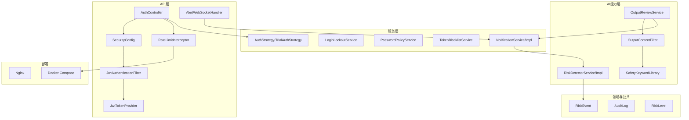
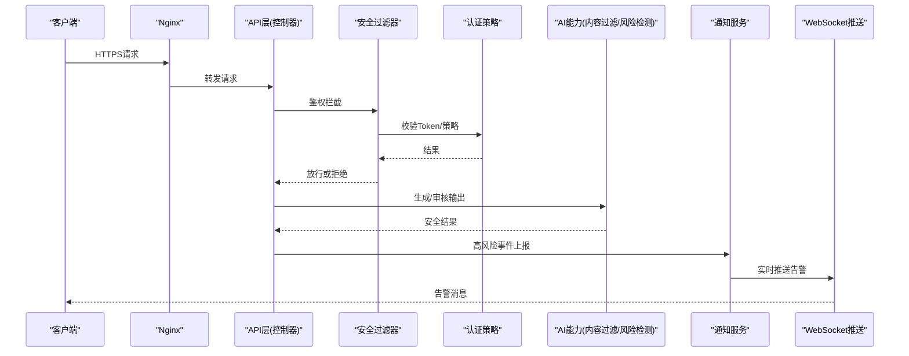
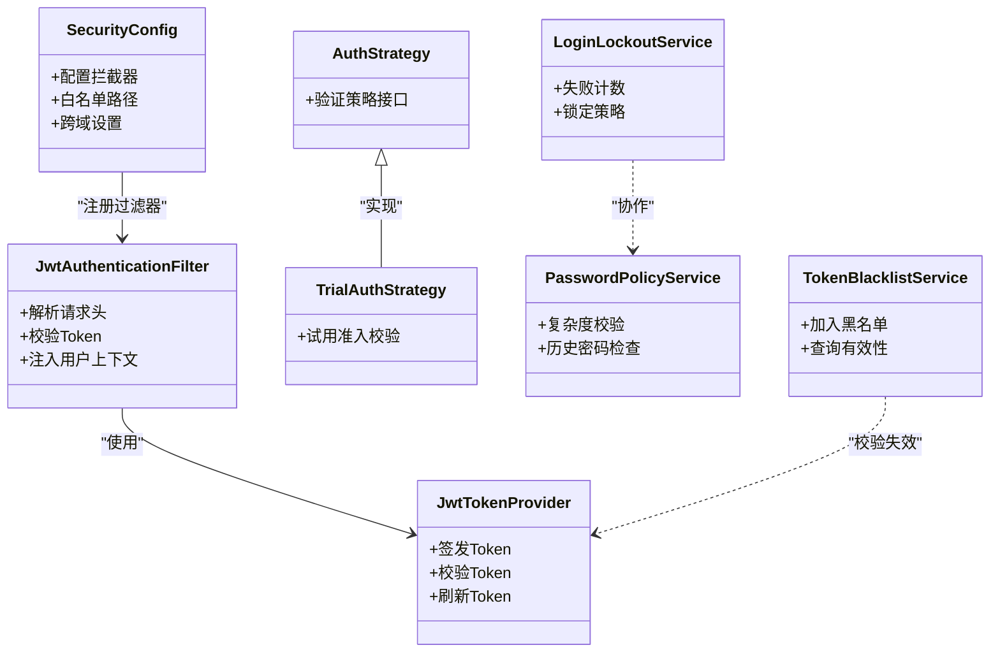
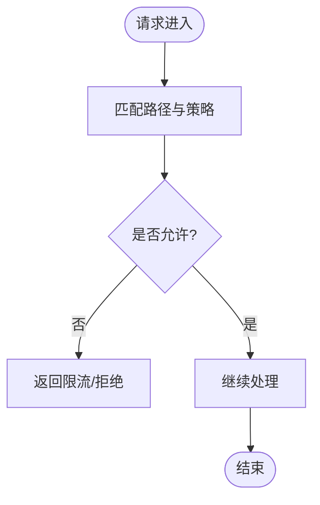
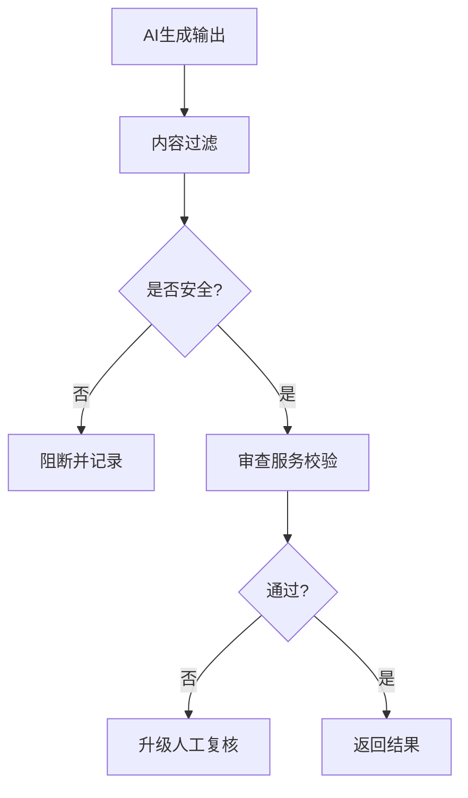
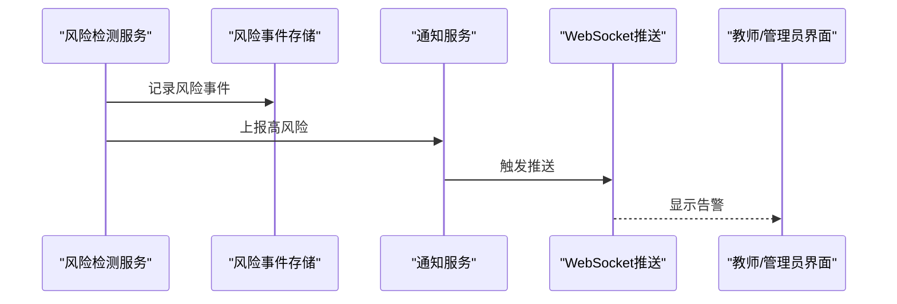
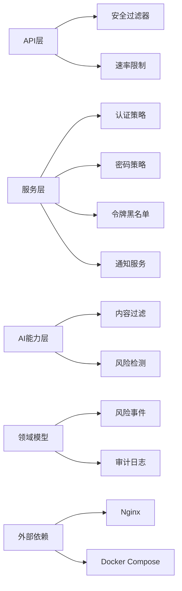

# 安全评估与合规文档

<cite>
**本文引用的文件**   
- [backend/counseling-api/src/main/java/com/mindsafe/api/config/SecurityConfig.java](file://backend/counseling-api/src/main/java/com/mindsafe/api/config/SecurityConfig.java)
- [backend/counseling-api/src/main/java/com/mindsafe/api/security/JwtAuthenticationFilter.java](file://backend/counseling-api/src/main/java/com/mindsafe/api/security/JwtAuthenticationFilter.java)
- [backend/counseling-api/src/main/java/com/mindsafe/api/security/JwtTokenProvider.java](file://backend/counseling-api/src/main/java/com/mindsafe/api/security/JwtTokenProvider.java)
- [backend/counseling-api/src/main/java/com/mindsafe/api/auth/AuthStrategy.java](file://backend/counseling-api/src/main/java/com/mindsafe/api/auth/AuthStrategy.java)
- [backend/counseling-api/src/main/java/com/mindsafe/api/auth/TrialAuthStrategy.java](file://backend/counseling-api/src/main/java/com/mindsafe/api/auth/TrialAuthStrategy.java)
- [backend/counseling-api/src/main/java/com/mindsafe/api/controller/AuthController.java](file://backend/counseling-api/src/main/java/com/mindsafe/api/controller/AuthController.java)
- [backend/counseling-api/src/main/java/com/mindsafe/api/ratelimit/RateLimitInterceptor.java](file://backend/counseling-api/src/main/java/com/mindsafe/api/ratelimit/RateLimitInterceptor.java)
- [backend/counseling-api/src/main/java/com/mindsafe/api/ratelimit/RateLimiter.java](file://backend/counseling-api/src/main/java/com/mindsafe/api/ratelimit/RateLimiter.java)
- [backend/counseling-service/src/main/java/com/mindsafe/service/auth/LoginLockoutService.java](file://backend/counseling-service/src/main/java/com/mindsafe/service/auth/LoginLockoutService.java)
- [backend/counseling-service/src/main/java/com/mindsafe/service/auth/PasswordPolicyService.java](file://backend/counseling-service/src/main/java/com/mindsafe/service/auth/PasswordPolicyService.java)
- [backend/counseling-service/src/main/java/com/mindsafe/service/auth/TokenBlacklistService.java](file://backend/counseling-service/src/main/java/com/mindsafe/service/auth/TokenBlacklistService.java)
- [backend/counseling-service/src/main/java/com/mindsafe/service/safety/OutputSafetyReporterImpl.java](file://backend/counseling-service/src/main/java/com/mindsafe/service/safety/OutputSafetyReporterImpl.java)
- [backend/counseling-ai/src/main/java/com/mindsafe/ai/safety/OutputContentFilter.java](file://backend/counseling-ai/src/main/java/com/mindsafe/ai/safety/OutputContentFilter.java)
- [backend/counseling-ai/src/main/java/com/mindsafe/ai/safety/SafetyKeywordLibrary.java](file://backend/counseling-ai/src/main/java/com/mindsafe/ai/safety/SafetyKeywordLibrary.java)
- [backend/counseling-ai/src/main/java/com/mindsafe/ai/safety/OutputReviewService.java](file://backend/counseling-ai/src/main/java/com/mindsafe/ai/safety/OutputReviewService.java)
- [backend/counseling-ai/src/main/java/com/mindsafe/ai/risk/RiskDetectorService.java](file://backend/counseling-ai/src/main/java/com/mindsafe/ai/risk/RiskDetectorService.java)
- [backend/counseling-ai/src/main/java/com/mindsafe/ai/risk/RiskDetectorServiceImpl.java](file://backend/counseling-ai/src/main/java/com/mindsafe/ai/risk/RiskDetectorServiceImpl.java)
- [backend/counseling-common/src/main/java/com/mindsafe/common/enums/RiskLevel.java](file://backend/counseling-common/src/main/java/com/mindsafe/common/enums/RiskLevel.java)
- [backend/counseling-domain/src/main/java/com/mindsafe/domain/entity/RiskEvent.java](file://backend/counseling-domain/src/main/java/com/mindsafe/domain/entity/RiskEvent.java)
- [backend/counseling-domain/src/main/java/com/mindsafe/domain/entity/AuditLog.java](file://backend/counseling-domain/src/main/java/com/mindsafe/domain/entity/AuditLog.java)
- [backend/counseling-service/src/main/java/com/mindsafe/service/notification/NotificationService.java](file://backend/counseling-service/src/main/java/com/mindsafe/service/notification/NotificationService.java)
- [backend/counseling-service/src/main/java/com/mindsafe/service/notification/NotificationServiceImpl.java](file://backend/counseling-service/src/main/java/com/mindsafe/service/notification/NotificationServiceImpl.java)
- [backend/counseling-api/src/main/java/com/mindsafe/api/websocket/AlertWebSocketHandler.java](file://backend/counseling-api/src/main/java/com/mindsafe/api/websocket/AlertWebSocketHandler.java)
- [backend/counseling-api/src/main/java/com/mindsafe/api/websocket/AlertPushListener.java](file://backend/counseling-api/src/main/java/com/mindsafe/api/websocket/AlertPushListener.java)
- [backend/counseling-api/src/main/java/com/mindsafe/api/config/WebMvcConfig.java](file://backend/counseling-api/src/main/java/com/mindsafe/api/config/WebMvcConfig.java)
- [backend/counseling-app/src/main/resources/application.yml](file://backend/counseling-app/src/main/resources/application.yml)
- [deploy/docker-compose.prod.yml](file://deploy/docker-compose.prod.yml)
- [deploy/nginx/default.conf](file://deploy/nginx/default.conf)
- [design/31_等保二级差距评估.md](file://design/31_等保二级差距评估.md)
</cite>

## 目录
1. [简介](#简介)
2. [项目结构](#项目结构)
3. [核心组件](#核心组件)
4. [架构总览](#架构总览)
5. [详细组件分析](#详细组件分析)
6. [依赖关系分析](#依赖关系分析)
7. [性能考虑](#性能考虑)
8. [故障排查指南](#故障排查指南)
9. [结论](#结论)
10. [附录](#附录)

## 简介
本文件面向“AI心理咨询系统”的安全评估与合规，聚焦认证授权、访问控制、输入输出安全、风险识别与告警、审计与可追溯性、数据与密钥管理、部署与网络安全等方面。文档基于代码仓库中的安全相关实现进行梳理，提供架构图、流程图与问题定位建议，帮助研发、运维与合规人员快速理解并落地改进措施。

## 项目结构
后端采用多模块分层：
- API层：控制器、安全配置、拦截器、WebSocket推送
- 服务层：认证策略、密码策略、令牌黑名单、通知与告警
- AI能力层：内容过滤、关键词库、输出审查、风险检测
- 领域模型：风险事件、审计日志等实体
- 公共模块：风险等级枚举、通用响应与异常
- 应用装配：启动类、数据库迁移、应用配置
- 部署：Docker Compose、Nginx反向代理与监控

图表来源
- [backend/counseling-api/src/main/java/com/mindsafe/api/config/SecurityConfig.java](file://backend/counseling-api/src/main/java/com/mindsafe/api/config/SecurityConfig.java)
- [backend/counseling-api/src/main/java/com/mindsafe/api/security/JwtAuthenticationFilter.java](file://backend/counseling-api/src/main/java/com/mindsafe/api/security/JwtAuthenticationFilter.java)
- [backend/counseling-api/src/main/java/com/mindsafe/api/security/JwtTokenProvider.java](file://backend/counseling-api/src/main/java/com/mindsafe/api/security/JwtTokenProvider.java)
- [backend/counseling-api/src/main/java/com/mindsafe/api/ratelimit/RateLimitInterceptor.java](file://backend/counseling-api/src/main/java/com/mindsafe/api/ratelimit/RateLimitInterceptor.java)
- [backend/counseling-api/src/main/java/com/mindsafe/api/websocket/AlertWebSocketHandler.java](file://backend/counseling-api/src/main/java/com/mindsafe/api/websocket/AlertWebSocketHandler.java)
- [backend/counseling-service/src/main/java/com/mindsafe/service/auth/LoginLockoutService.java](file://backend/counseling-service/src/main/java/com/mindsafe/service/auth/LoginLockoutService.java)
- [backend/counseling-service/src/main/java/com/mindsafe/service/auth/PasswordPolicyService.java](file://backend/counseling-service/src/main/java/com/mindsafe/service/auth/PasswordPolicyService.java)
- [backend/counseling-service/src/main/java/com/mindsafe/service/auth/TokenBlacklistService.java](file://backend/counseling-service/src/main/java/com/mindsafe/service/auth/TokenBlacklistService.java)
- [backend/counseling-service/src/main/java/com/mindsafe/service/notification/NotificationService.java](file://backend/counseling-service/src/main/java/com/mindsafe/service/notification/NotificationService.java)
- [backend/counseling-ai/src/main/java/com/mindsafe/ai/safety/OutputContentFilter.java](file://backend/counseling-ai/src/main/java/com/mindsafe/ai/safety/OutputContentFilter.java)
- [backend/counseling-ai/src/main/java/com/mindsafe/ai/safety/SafetyKeywordLibrary.java](file://backend/counseling-ai/src/main/java/com/mindsafe/ai/safety/SafetyKeywordLibrary.java)
- [backend/counseling-ai/src/main/java/com/mindsafe/ai/safety/OutputReviewService.java](file://backend/counseling-ai/src/main/java/com/mindsafe/ai/safety/OutputReviewService.java)
- [backend/counseling-ai/src/main/java/com/mindsafe/ai/risk/RiskDetectorService.java](file://backend/counseling-ai/src/main/java/com/mindsafe/ai/risk/RiskDetectorService.java)
- [backend/counseling-ai/src/main/java/com/mindsafe/ai/risk/RiskDetectorServiceImpl.java](file://backend/counseling-ai/src/main/java/com/mindsafe/ai/risk/RiskDetectorServiceImpl.java)
- [backend/counseling-common/src/main/java/com/mindsafe/common/enums/RiskLevel.java](file://backend/counseling-common/src/main/java/com/mindsafe/common/enums/RiskLevel.java)
- [backend/counseling-domain/src/main/java/com/mindsafe/domain/entity/RiskEvent.java](file://backend/counseling-domain/src/main/java/com/mindsafe/domain/entity/RiskEvent.java)
- [backend/counseling-domain/src/main/java/com/mindsafe/domain/entity/AuditLog.java](file://backend/counseling-domain/src/main/java/com/mindsafe/domain/entity/AuditLog.java)
- [deploy/nginx/default.conf](file://deploy/nginx/default.conf)
- [deploy/docker-compose.prod.yml](file://deploy/docker-compose.prod.yml)

章节来源
- [backend/counseling-app/src/main/resources/application.yml](file://backend/counseling-app/src/main/resources/application.yml)
- [deploy/docker-compose.prod.yml](file://deploy/docker-compose.prod.yml)
- [deploy/nginx/default.conf](file://deploy/nginx/default.conf)

## 核心组件
- 认证与授权
  - 安全配置与过滤器：统一入口校验、白名单放行、JWT解析与鉴权
  - Token提供者：签发、校验、过期处理
  - 认证策略：支持试用等差异化准入策略
  - 登录锁定与密码策略：防暴力破解、强度校验
  - 令牌黑名单：注销与强制下线
- 输入输出安全
  - 输出内容过滤：敏感词与违规内容拦截
  - 安全关键词库：集中维护、动态更新
  - 输出审查服务：二次校验与人工复核通道
- 风险识别与告警
  - 风险检测服务：规则与模型结合的风险判定
  - 风险事件实体与等级：标准化记录与分级
  - 通知服务与WebSocket：实时推送高风险事件
- 审计与可追溯
  - 审计日志实体：关键操作留痕
  - 业务指标与日志：便于追踪与排障

章节来源
- [backend/counseling-api/src/main/java/com/mindsafe/api/config/SecurityConfig.java](file://backend/counseling-api/src/main/java/com/mindsafe/api/config/SecurityConfig.java)
- [backend/counseling-api/src/main/java/com/mindsafe/api/security/JwtAuthenticationFilter.java](file://backend/counseling-api/src/main/java/com/mindsafe/api/security/JwtAuthenticationFilter.java)
- [backend/counseling-api/src/main/java/com/mindsafe/api/security/JwtTokenProvider.java](file://backend/counseling-api/src/main/java/com/mindsafe/api/security/JwtTokenProvider.java)
- [backend/counseling-api/src/main/java/com/mindsafe/api/auth/AuthStrategy.java](file://backend/counseling-api/src/main/java/com/mindsafe/api/auth/AuthStrategy.java)
- [backend/counseling-api/src/main/java/com/mindsafe/api/auth/TrialAuthStrategy.java](file://backend/counseling-api/src/main/java/com/mindsafe/api/auth/TrialAuthStrategy.java)
- [backend/counseling-service/src/main/java/com/mindsafe/service/auth/LoginLockoutService.java](file://backend/counseling-service/src/main/java/com/mindsafe/service/auth/LoginLockoutService.java)
- [backend/counseling-service/src/main/java/com/mindsafe/service/auth/PasswordPolicyService.java](file://backend/counseling-service/src/main/java/com/mindsafe/service/auth/PasswordPolicyService.java)
- [backend/counseling-service/src/main/java/com/mindsafe/service/auth/TokenBlacklistService.java](file://backend/counseling-service/src/main/java/com/mindsafe/service/auth/TokenBlacklistService.java)
- [backend/counseling-ai/src/main/java/com/mindsafe/ai/safety/OutputContentFilter.java](file://backend/counseling-ai/src/main/java/com/mindsafe/ai/safety/OutputContentFilter.java)
- [backend/counseling-ai/src/main/java/com/mindsafe/ai/safety/SafetyKeywordLibrary.java](file://backend/counseling-ai/src/main/java/com/mindsafe/ai/safety/SafetyKeywordLibrary.java)
- [backend/counseling-ai/src/main/java/com/mindsafe/ai/safety/OutputReviewService.java](file://backend/counseling-ai/src/main/java/com/mindsafe/ai/safety/OutputReviewService.java)
- [backend/counseling-ai/src/main/java/com/mindsafe/ai/risk/RiskDetectorService.java](file://backend/counseling-ai/src/main/java/com/mindsafe/ai/risk/RiskDetectorService.java)
- [backend/counseling-ai/src/main/java/com/mindsafe/ai/risk/RiskDetectorServiceImpl.java](file://backend/counseling-ai/src/main/java/com/mindsafe/ai/risk/RiskDetectorServiceImpl.java)
- [backend/counseling-common/src/main/java/com/mindsafe/common/enums/RiskLevel.java](file://backend/counseling-common/src/main/java/com/mindsafe/common/enums/RiskLevel.java)
- [backend/counseling-domain/src/main/java/com/mindsafe/domain/entity/RiskEvent.java](file://backend/counseling-domain/src/main/java/com/mindsafe/domain/entity/RiskEvent.java)
- [backend/counseling-domain/src/main/java/com/mindsafe/domain/entity/AuditLog.java](file://backend/counseling-domain/src/main/java/com/mindsafe/domain/entity/AuditLog.java)

## 架构总览
整体安全架构遵循“网关前置防护 + 应用层鉴权 + 内容安全 + 风险治理 + 审计与告警”的分层设计。请求经Nginx与速率限制进入API层，由安全过滤器完成身份校验；业务服务调用AI能力进行内容过滤与风险识别；高风险事件通过通知服务与WebSocket实时推送；所有关键操作写入审计日志，形成闭环。

图表来源
- [deploy/nginx/default.conf](file://deploy/nginx/default.conf)
- [backend/counseling-api/src/main/java/com/mindsafe/api/config/SecurityConfig.java](file://backend/counseling-api/src/main/java/com/mindsafe/api/config/SecurityConfig.java)
- [backend/counseling-api/src/main/java/com/mindsafe/api/security/JwtAuthenticationFilter.java](file://backend/counseling-api/src/main/java/com/mindsafe/api/security/JwtAuthenticationFilter.java)
- [backend/counseling-api/src/main/java/com/mindsafe/api/auth/AuthStrategy.java](file://backend/counseling-api/src/main/java/com/mindsafe/api/auth/AuthStrategy.java)
- [backend/counseling-ai/src/main/java/com/mindsafe/ai/safety/OutputContentFilter.java](file://backend/counseling-ai/src/main/java/com/mindsafe/ai/safety/OutputContentFilter.java)
- [backend/counseling-ai/src/main/java/com/mindsafe/ai/risk/RiskDetectorService.java](file://backend/counseling-ai/src/main/java/com/mindsafe/ai/risk/RiskDetectorService.java)
- [backend/counseling-service/src/main/java/com/mindsafe/service/notification/NotificationService.java](file://backend/counseling-service/src/main/java/com/mindsafe/service/notification/NotificationService.java)
- [backend/counseling-api/src/main/java/com/mindsafe/api/websocket/AlertWebSocketHandler.java](file://backend/counseling-api/src/main/java/com/mindsafe/api/websocket/AlertWebSocketHandler.java)

## 详细组件分析

### 认证与授权流程
- 安全配置定义全局拦截路径、白名单与跨域策略
- 认证过滤器解析JWT并注入上下文
- Token提供者负责签名、验签与过期策略
- 认证策略支持试用等差异化准入逻辑
- 登录锁定与密码策略保障账户安全
- 令牌黑名单支持主动失效

图表来源
- [backend/counseling-api/src/main/java/com/mindsafe/api/config/SecurityConfig.java](file://backend/counseling-api/src/main/java/com/mindsafe/api/config/SecurityConfig.java)
- [backend/counseling-api/src/main/java/com/mindsafe/api/security/JwtAuthenticationFilter.java](file://backend/counseling-api/src/main/java/com/mindsafe/api/security/JwtAuthenticationFilter.java)
- [backend/counseling-api/src/main/java/com/mindsafe/api/security/JwtTokenProvider.java](file://backend/counseling-api/src/main/java/com/mindsafe/api/security/JwtTokenProvider.java)
- [backend/counseling-api/src/main/java/com/mindsafe/api/auth/AuthStrategy.java](file://backend/counseling-api/src/main/java/com/mindsafe/api/auth/AuthStrategy.java)
- [backend/counseling-api/src/main/java/com/mindsafe/api/auth/TrialAuthStrategy.java](file://backend/counseling-api/src/main/java/com/mindsafe/api/auth/TrialAuthStrategy.java)
- [backend/counseling-service/src/main/java/com/mindsafe/service/auth/LoginLockoutService.java](file://backend/counseling-service/src/main/java/com/mindsafe/service/auth/LoginLockoutService.java)
- [backend/counseling-service/src/main/java/com/mindsafe/service/auth/PasswordPolicyService.java](file://backend/counseling-service/src/main/java/com/mindsafe/service/auth/PasswordPolicyService.java)
- [backend/counseling-service/src/main/java/com/mindsafe/service/auth/TokenBlacklistService.java](file://backend/counseling-service/src/main/java/com/mindsafe/service/auth/TokenBlacklistService.java)

章节来源
- [backend/counseling-api/src/main/java/com/mindsafe/api/controller/AuthController.java](file://backend/counseling-api/src/main/java/com/mindsafe/api/controller/AuthController.java)
- [backend/counseling-api/src/main/java/com/mindsafe/api/config/SecurityConfig.java](file://backend/counseling-api/src/main/java/com/mindsafe/api/config/SecurityConfig.java)
- [backend/counseling-api/src/main/java/com/mindsafe/api/security/JwtAuthenticationFilter.java](file://backend/counseling-api/src/main/java/com/mindsafe/api/security/JwtAuthenticationFilter.java)
- [backend/counseling-api/src/main/java/com/mindsafe/api/security/JwtTokenProvider.java](file://backend/counseling-api/src/main/java/com/mindsafe/api/security/JwtTokenProvider.java)
- [backend/counseling-api/src/main/java/com/mindsafe/api/auth/AuthStrategy.java](file://backend/counseling-api/src/main/java/com/mindsafe/api/auth/AuthStrategy.java)
- [backend/counseling-api/src/main/java/com/mindsafe/api/auth/TrialAuthStrategy.java](file://backend/counseling-api/src/main/java/com/mindsafe/api/auth/TrialAuthStrategy.java)
- [backend/counseling-service/src/main/java/com/mindsafe/service/auth/LoginLockoutService.java](file://backend/counseling-service/src/main/java/com/mindsafe/service/auth/LoginLockoutService.java)
- [backend/counseling-service/src/main/java/com/mindsafe/service/auth/PasswordPolicyService.java](file://backend/counseling-service/src/main/java/com/mindsafe/service/auth/PasswordPolicyService.java)
- [backend/counseling-service/src/main/java/com/mindsafe/service/auth/TokenBlacklistService.java](file://backend/counseling-service/src/main/java/com/mindsafe/service/auth/TokenBlacklistService.java)

### 速率限制与访问控制
- 拦截器对请求进行频率限制，防止滥用与暴力攻击
- 白名单与路径匹配确保关键接口受控
- 与网关层（Nginx）协同实现多层限流

图表来源
- [backend/counseling-api/src/main/java/com/mindsafe/api/ratelimit/RateLimitInterceptor.java](file://backend/counseling-api/src/main/java/com/mindsafe/api/ratelimit/RateLimitInterceptor.java)
- [backend/counseling-api/src/main/java/com/mindsafe/api/ratelimit/RateLimiter.java](file://backend/counseling-api/src/main/java/com/mindsafe/api/ratelimit/RateLimiter.java)
- [backend/counseling-api/src/main/java/com/mindsafe/api/config/WebMvcConfig.java](file://backend/counseling-api/src/main/java/com/mindsafe/api/config/WebMvcConfig.java)
- [deploy/nginx/default.conf](file://deploy/nginx/default.conf)

章节来源
- [backend/counseling-api/src/main/java/com/mindsafe/api/ratelimit/RateLimitInterceptor.java](file://backend/counseling-api/src/main/java/com/mindsafe/api/ratelimit/RateLimitInterceptor.java)
- [backend/counseling-api/src/main/java/com/mindsafe/api/ratelimit/RateLimiter.java](file://backend/counseling-api/src/main/java/com/mindsafe/api/ratelimit/RateLimiter.java)
- [backend/counseling-api/src/main/java/com/mindsafe/api/config/WebMvcConfig.java](file://backend/counseling-api/src/main/java/com/mindsafe/api/config/WebMvcConfig.java)
- [deploy/nginx/default.conf](file://deploy/nginx/default.conf)

### 输出内容安全与审查
- 输出内容过滤：基于关键词库与规则进行拦截
- 安全关键词库：集中管理、版本化、可热更新
- 输出审查服务：二次校验、人工复核通道、审计记录

图表来源
- [backend/counseling-ai/src/main/java/com/mindsafe/ai/safety/OutputContentFilter.java](file://backend/counseling-ai/src/main/java/com/mindsafe/ai/safety/OutputContentFilter.java)
- [backend/counseling-ai/src/main/java/com/mindsafe/ai/safety/SafetyKeywordLibrary.java](file://backend/counseling-ai/src/main/java/com/mindsafe/ai/safety/SafetyKeywordLibrary.java)
- [backend/counseling-ai/src/main/java/com/mindsafe/ai/safety/OutputReviewService.java](file://backend/counseling-ai/src/main/java/com/mindsafe/ai/safety/OutputReviewService.java)

章节来源
- [backend/counseling-ai/src/main/java/com/mindsafe/ai/safety/OutputContentFilter.java](file://backend/counseling-ai/src/main/java/com/mindsafe/ai/safety/OutputContentFilter.java)
- [backend/counseling-ai/src/main/java/com/mindsafe/ai/safety/SafetyKeywordLibrary.java](file://backend/counseling-ai/src/main/java/com/mindsafe/ai/safety/SafetyKeywordLibrary.java)
- [backend/counseling-ai/src/main/java/com/mindsafe/ai/safety/OutputReviewService.java](file://backend/counseling-ai/src/main/java/com/mindsafe/ai/safety/OutputReviewService.java)

### 风险识别与告警
- 风险检测服务：结合规则与模型进行风险判定
- 风险事件与等级：标准化记录与分级处置
- 通知服务与WebSocket：实时推送高风险事件至前端

图表来源
- [backend/counseling-ai/src/main/java/com/mindsafe/ai/risk/RiskDetectorService.java](file://backend/counseling-ai/src/main/java/com/mindsafe/ai/risk/RiskDetectorService.java)
- [backend/counseling-ai/src/main/java/com/mindsafe/ai/risk/RiskDetectorServiceImpl.java](file://backend/counseling-ai/src/main/java/com/mindsafe/ai/risk/RiskDetectorServiceImpl.java)
- [backend/counseling-common/src/main/java/com/mindsafe/common/enums/RiskLevel.java](file://backend/counseling-common/src/main/java/com/mindsafe/common/enums/RiskLevel.java)
- [backend/counseling-domain/src/main/java/com/mindsafe/domain/entity/RiskEvent.java](file://backend/counseling-domain/src/main/java/com/mindsafe/domain/entity/RiskEvent.java)
- [backend/counseling-service/src/main/java/com/mindsafe/service/notification/NotificationService.java](file://backend/counseling-service/src/main/java/com/mindsafe/service/notification/NotificationService.java)
- [backend/counseling-service/src/main/java/com/mindsafe/service/notification/NotificationServiceImpl.java](file://backend/counseling-service/src/main/java/com/mindsafe/service/notification/NotificationServiceImpl.java)
- [backend/counseling-api/src/main/java/com/mindsafe/api/websocket/AlertWebSocketHandler.java](file://backend/counseling-api/src/main/java/com/mindsafe/api/websocket/AlertWebSocketHandler.java)
- [backend/counseling-api/src/main/java/com/mindsafe/api/websocket/AlertPushListener.java](file://backend/counseling-api/src/main/java/com/mindsafe/api/websocket/AlertPushListener.java)

章节来源
- [backend/counseling-ai/src/main/java/com/mindsafe/ai/risk/RiskDetectorService.java](file://backend/counseling-ai/src/main/java/com/mindsafe/ai/risk/RiskDetectorService.java)
- [backend/counseling-ai/src/main/java/com/mindsafe/ai/risk/RiskDetectorServiceImpl.java](file://backend/counseling-ai/src/main/java/com/mindsafe/ai/risk/RiskDetectorServiceImpl.java)
- [backend/counseling-common/src/main/java/com/mindsafe/common/enums/RiskLevel.java](file://backend/counseling-common/src/main/java/com/mindsafe/common/enums/RiskLevel.java)
- [backend/counseling-domain/src/main/java/com/mindsafe/domain/entity/RiskEvent.java](file://backend/counseling-domain/src/main/java/com/mindsafe/domain/entity/RiskEvent.java)
- [backend/counseling-service/src/main/java/com/mindsafe/service/notification/NotificationService.java](file://backend/counseling-service/src/main/java/com/mindsafe/service/notification/NotificationService.java)
- [backend/counseling-service/src/main/java/com/mindsafe/service/notification/NotificationServiceImpl.java](file://backend/counseling-service/src/main/java/com/mindsafe/service/notification/NotificationServiceImpl.java)
- [backend/counseling-api/src/main/java/com/mindsafe/api/websocket/AlertWebSocketHandler.java](file://backend/counseling-api/src/main/java/com/mindsafe/api/websocket/AlertWebSocketHandler.java)
- [backend/counseling-api/src/main/java/com/mindsafe/api/websocket/AlertPushListener.java](file://backend/counseling-api/src/main/java/com/mindsafe/api/websocket/AlertPushListener.java)

### 审计与可追溯性
- 审计日志实体：记录关键操作、访问与变更
- 业务指标与日志：支撑合规审计与问题定位
- 建议：将审计日志纳入集中式日志平台，建立留存策略与检索索引

章节来源
- [backend/counseling-domain/src/main/java/com/mindsafe/domain/entity/AuditLog.java](file://backend/counseling-domain/src/main/java/com/mindsafe/domain/entity/AuditLog.java)

## 依赖关系分析
- 组件耦合
  - API层依赖安全过滤器与速率限制拦截器
  - 服务层依赖认证策略、密码策略、令牌黑名单与通知服务
  - AI能力层依赖内容过滤、关键词库与风险检测
  - 领域模型为风险事件与审计日志提供数据结构
- 外部依赖
  - Nginx作为反向代理与TLS终止
  - Docker Compose编排服务与网络隔离
  - 数据库持久化风险事件与审计日志

图表来源
- [backend/counseling-api/src/main/java/com/mindsafe/api/config/SecurityConfig.java](file://backend/counseling-api/src/main/java/com/mindsafe/api/config/SecurityConfig.java)
- [backend/counseling-api/src/main/java/com/mindsafe/api/ratelimit/RateLimitInterceptor.java](file://backend/counseling-api/src/main/java/com/mindsafe/api/ratelimit/RateLimitInterceptor.java)
- [backend/counseling-service/src/main/java/com/mindsafe/service/auth/LoginLockoutService.java](file://backend/counseling-service/src/main/java/com/mindsafe/service/auth/LoginLockoutService.java)
- [backend/counseling-service/src/main/java/com/mindsafe/service/auth/PasswordPolicyService.java](file://backend/counseling-service/src/main/java/com/mindsafe/service/auth/PasswordPolicyService.java)
- [backend/counseling-service/src/main/java/com/mindsafe/service/auth/TokenBlacklistService.java](file://backend/counseling-service/src/main/java/com/mindsafe/service/auth/TokenBlacklistService.java)
- [backend/counseling-service/src/main/java/com/mindsafe/service/notification/NotificationService.java](file://backend/counseling-service/src/main/java/com/mindsafe/service/notification/NotificationService.java)
- [backend/counseling-ai/src/main/java/com/mindsafe/ai/safety/OutputContentFilter.java](file://backend/counseling-ai/src/main/java/com/mindsafe/ai/safety/OutputContentFilter.java)
- [backend/counseling-ai/src/main/java/com/mindsafe/ai/risk/RiskDetectorService.java](file://backend/counseling-ai/src/main/java/com/mindsafe/ai/risk/RiskDetectorService.java)
- [backend/counseling-domain/src/main/java/com/mindsafe/domain/entity/RiskEvent.java](file://backend/counseling-domain/src/main/java/com/mindsafe/domain/entity/RiskEvent.java)
- [backend/counseling-domain/src/main/java/com/mindsafe/domain/entity/AuditLog.java](file://backend/counseling-domain/src/main/java/com/mindsafe/domain/entity/AuditLog.java)
- [deploy/nginx/default.conf](file://deploy/nginx/default.conf)
- [deploy/docker-compose.prod.yml](file://deploy/docker-compose.prod.yml)

章节来源
- [backend/counseling-api/src/main/java/com/mindsafe/api/config/SecurityConfig.java](file://backend/counseling-api/src/main/java/com/mindsafe/api/config/SecurityConfig.java)
- [backend/counseling-api/src/main/java/com/mindsafe/api/ratelimit/RateLimitInterceptor.java](file://backend/counseling-api/src/main/java/com/mindsafe/api/ratelimit/RateLimitInterceptor.java)
- [backend/counseling-service/src/main/java/com/mindsafe/service/auth/LoginLockoutService.java](file://backend/counseling-service/src/main/java/com/mindsafe/service/auth/LoginLockoutService.java)
- [backend/counseling-service/src/main/java/com/mindsafe/service/auth/PasswordPolicyService.java](file://backend/counseling-service/src/main/java/com/mindsafe/service/auth/PasswordPolicyService.java)
- [backend/counseling-service/src/main/java/com/mindsafe/service/auth/TokenBlacklistService.java](file://backend/counseling-service/src/main/java/com/mindsafe/service/auth/TokenBlacklistService.java)
- [backend/counseling-service/src/main/java/com/mindsafe/service/notification/NotificationService.java](file://backend/counseling-service/src/main/java/com/mindsafe/service/notification/NotificationService.java)
- [backend/counseling-ai/src/main/java/com/mindsafe/ai/safety/OutputContentFilter.java](file://backend/counseling-ai/src/main/java/com/mindsafe/ai/safety/OutputContentFilter.java)
- [backend/counseling-ai/src/main/java/com/mindsafe/ai/risk/RiskDetectorService.java](file://backend/counseling-ai/src/main/java/com/mindsafe/ai/risk/RiskDetectorService.java)
- [backend/counseling-domain/src/main/java/com/mindsafe/domain/entity/RiskEvent.java](file://backend/counseling-domain/src/main/java/com/mindsafe/domain/entity/RiskEvent.java)
- [backend/counseling-domain/src/main/java/com/mindsafe/domain/entity/AuditLog.java](file://backend/counseling-domain/src/main/java/com/mindsafe/domain/entity/AuditLog.java)
- [deploy/nginx/default.conf](file://deploy/nginx/default.conf)
- [deploy/docker-compose.prod.yml](file://deploy/docker-compose.prod.yml)

## 性能考虑
- 鉴权与限流
  - JWT校验应缓存公钥与黑名单，避免重复计算
  - 速率限制需使用高性能计数器（如Redis），并设置合理阈值
- 内容过滤与风险检测
  - 关键词库加载与匹配应优化为内存字典或布隆过滤器
  - 风险检测可异步化处理，降低主链路延迟
- 告警与通知
  - WebSocket连接池与批量推送，避免单点阻塞
  - 告警去重与合并，减少抖动与风暴
- 审计与日志
  - 异步落盘与采样策略，避免影响主流程
  - 集中式日志平台提升检索效率

[本节为通用指导，不直接分析具体文件]

## 故障排查指南
- 认证失败
  - 检查JWT签名与过期时间、黑名单状态
  - 查看登录锁定策略与密码策略配置
- 内容被误拦截
  - 核对关键词库与过滤规则，必要时添加白名单
  - 启用输出审查服务的复核通道
- 风险告警过多
  - 调整风险阈值与规则权重
  - 增加告警去重与聚合策略
- 审计缺失
  - 确认审计日志写入成功与集中式日志接入
  - 检查日志保留策略与索引

章节来源
- [backend/counseling-api/src/main/java/com/mindsafe/api/security/JwtTokenProvider.java](file://backend/counseling-api/src/main/java/com/mindsafe/api/security/JwtTokenProvider.java)
- [backend/counseling-service/src/main/java/com/mindsafe/service/auth/LoginLockoutService.java](file://backend/counseling-service/src/main/java/com/mindsafe/service/auth/LoginLockoutService.java)
- [backend/counseling-service/src/main/java/com/mindsafe/service/auth/PasswordPolicyService.java](file://backend/counseling-service/src/main/java/com/mindsafe/service/auth/PasswordPolicyService.java)
- [backend/counseling-ai/src/main/java/com/mindsafe/ai/safety/OutputContentFilter.java](file://backend/counseling-ai/src/main/java/com/mindsafe/ai/safety/OutputContentFilter.java)
- [backend/counseling-ai/src/main/java/com/mindsafe/ai/safety/SafetyKeywordLibrary.java](file://backend/counseling-ai/src/main/java/com/mindsafe/ai/safety/SafetyKeywordLibrary.java)
- [backend/counseling-ai/src/main/java/com/mindsafe/ai/safety/OutputReviewService.java](file://backend/counseling-ai/src/main/java/com/mindsafe/ai/safety/OutputReviewService.java)
- [backend/counseling-ai/src/main/java/com/mindsafe/ai/risk/RiskDetectorService.java](file://backend/counseling-ai/src/main/java/com/mindsafe/ai/risk/RiskDetectorService.java)
- [backend/counseling-domain/src/main/java/com/mindsafe/domain/entity/AuditLog.java](file://backend/counseling-domain/src/main/java/com/mindsafe/domain/entity/AuditLog.java)

## 结论
该AI心理咨询系统在安全与合规方面具备较为完善的分层设计与实现，涵盖认证授权、输入输出安全、风险识别与告警、审计与可追溯性等关键环节。建议在以下方面持续优化：强化密钥管理与轮换机制、完善数据脱敏与最小权限原则、增强审计与合规报表能力、建立常态化渗透测试与漏洞扫描流程，以满足等保二级及以上要求。

[本节为总结性内容，不直接分析具体文件]

## 附录
- 等保二级差距评估参考
  - 关注身份鉴别、访问控制、通信完整性与保密性、安全审计、入侵防范、恶意代码防护、数据备份与恢复等控制点
  - 结合本系统实现逐项对照，补齐差距项

章节来源
- [design/31_等保二级差距评估.md](file://design/31_等保二级差距评估.md)
