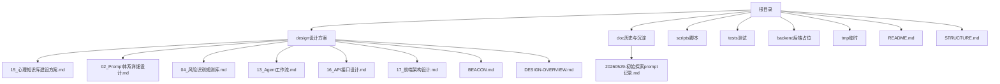
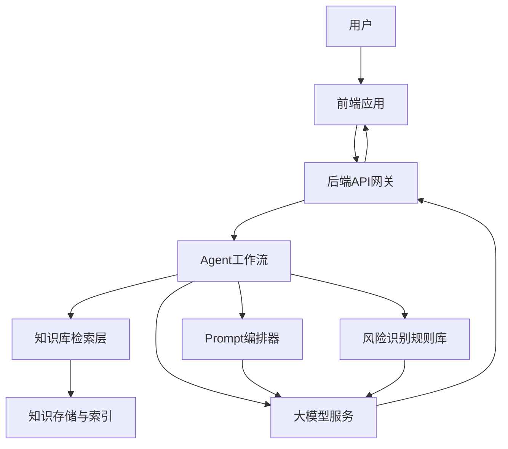
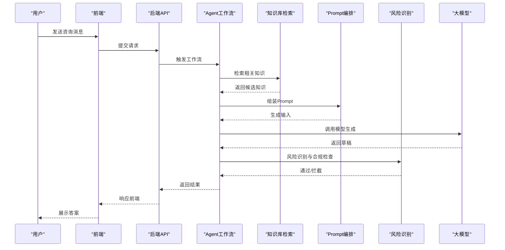
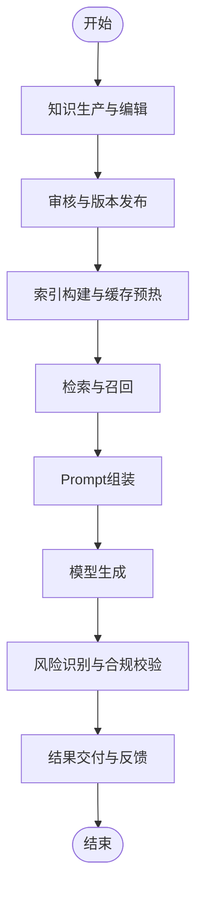
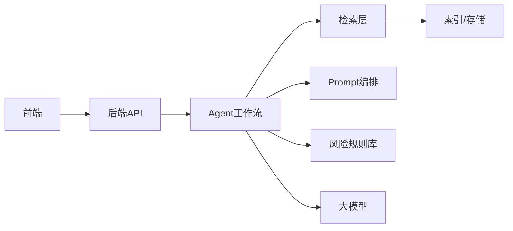

# 心理知识库建设

<cite>
**本文引用的文件**   
- [README.md](file://README.md)
- [STRUCTURE.md](file://STRUCTURE.md)
- [design/15_心理知识库建设方案.md](file://design/15_心理知识库建设方案.md)
- [design/02_Prompt体系详细设计.md](file://design/02_Prompt体系详细设计.md)
- [design/04_风险识别规则库.md](file://design/04_风险识别规则库.md)
- [design/13_Agent工作流.md](file://design/13_Agent工作流.md)
- [design/16_API接口设计.md](file://design/16_API接口设计.md)
- [design/17_前端架构设计.md](file://design/17_前端架构设计.md)
- [design/BEACON.md](file://design/BEACON.md)
- [design/DESIGN-OVERVIEW.md](file://design/DESIGN-OVERVIEW.md)
- [doc/his/20260529-初始探索prompt记录.md](file://doc/his/20260529-初始探索prompt记录.md)
</cite>

## 目录
1. [引言](#引言)
2. [项目结构](#项目结构)
3. [核心组件](#核心组件)
4. [架构总览](#架构总览)
5. [详细组件分析](#详细组件分析)
6. [依赖分析](#依赖分析)
7. [性能考虑](#性能考虑)
8. [故障排查指南](#故障排查指南)
9. [结论](#结论)
10. [附录](#附录)

## 引言
本文件围绕“心理知识库建设”目标，结合仓库中的设计与文档，系统化梳理知识库的范畴、数据模型、检索与治理流程，以及与Prompt体系、Agent工作流、前后端接口的集成方式。目标是帮助非技术读者理解整体方案，同时为工程师提供可落地的实现指引。

## 项目结构
本项目采用“设计先行、文档驱动”的组织方式，核心知识资产集中在 design 目录；历史探索与沉淀在 doc/his；顶层 README 与 STRUCTURE 提供全局导航。

图表来源
- [STRUCTURE.md](file://STRUCTURE.md)
- [README.md](file://README.md)

章节来源
- [README.md](file://README.md)
- [STRUCTURE.md](file://STRUCTURE.md)

## 核心组件
围绕心理知识库建设，系统由以下关键组件构成：
- 知识库本体与分类体系：定义领域概念、关系与层级，支撑检索与推理。
- 知识条目与版本治理：条目化组织知识，支持版本、来源、审核与生命周期管理。
- 检索与召回：面向对话场景的语义检索、关键词匹配与规则过滤。
- Prompt编排与注入：将知识以结构化方式注入到提示词中，提升回答质量与一致性。
- Agent工作流编排：串联检索、生成、校验、反馈等步骤，形成稳定闭环。
- 安全与风控：基于规则库进行风险识别与拦截，保障合规与安全。
- 前后端集成：通过API暴露检索与问答能力，前端负责交互与可视化。

章节来源
- [design/15_心理知识库建设方案.md](file://design/15_心理知识库建设方案.md)
- [design/02_Prompt体系详细设计.md](file://design/02_Prompt体系详细设计.md)
- [design/13_Agent工作流.md](file://design/13_Agent工作流.md)
- [design/04_风险识别规则库.md](file://design/04_风险识别规则库.md)
- [design/16_API接口设计.md](file://design/16_API接口设计.md)
- [design/17_前端架构设计.md](file://design/17_前端架构设计.md)

## 架构总览
下图展示知识库在系统中的位置与交互关系：用户通过前端发起咨询，后端调用Agent工作流，工作流内完成知识检索、Prompt组装、模型生成与风控校验，最终返回结果。

图表来源
- [design/13_Agent工作流.md](file://design/13_Agent工作流.md)
- [design/16_API接口设计.md](file://design/16_API接口设计.md)
- [design/04_风险识别规则库.md](file://design/04_风险识别规则库.md)
- [design/02_Prompt体系详细设计.md](file://design/02_Prompt体系详细设计.md)

## 详细组件分析

### 知识库本体与分类体系
- 目标：建立心理学领域的概念、主题、问题类型与干预策略的分类树，确保知识组织的一致性与可扩展性。
- 建议维度：
  - 主题域：情绪、认知、行为、关系、发展、危机等。
  - 问题类型：常见困扰、量表解读、自助练习、转介标准等。
  - 干预方法：CBT、正念、动机访谈、家庭治疗等。
- 关联关系：概念间包含、并列、因果、适用条件等关系，便于推理与推荐。
- 维护机制：版本化、来源标注、专家审核、定期复盘。

章节来源
- [design/15_心理知识库建设方案.md](file://design/15_心理知识库建设方案.md)

### 知识条目与版本治理
- 条目结构：标题、摘要、正文、标签、适用人群、证据等级、来源链接、创建/更新时间、责任人。
- 版本控制：增量更新、变更日志、回滚策略。
- 审核流程：初审、复审、发布、下线。
- 质量指标：准确性、可读性、时效性、覆盖度。

章节来源
- [design/15_心理知识库建设方案.md](file://design/15_心理知识库建设方案.md)

### 检索与召回
- 多路召回：向量语义检索、关键词倒排、规则匹配、图谱路径检索。
- 重排序：相关性打分、权威度加权、时效衰减、个性化偏好。
- 缓存策略：热点知识缓存、会话级上下文缓存。
- 评估指标：命中率、NDCG、延迟、吞吐。

章节来源
- [design/15_心理知识库建设方案.md](file://design/15_心理知识库建设方案.md)

### Prompt编排与注入
- 模板分层：角色设定、任务说明、约束条件、示例片段、输出格式。
- 动态注入：根据检索结果与用户画像动态拼装上下文。
- 质量控制：去噪、截断、敏感信息脱敏、引用标注。
- 可观测性：Prompt快照、A/B对比、效果追踪。

章节来源
- [design/02_Prompt体系详细设计.md](file://design/02_Prompt体系详细设计.md)

### Agent工作流编排
- 阶段划分：意图识别→知识检索→Prompt组装→模型生成→风控校验→结果格式化→反馈收集。
- 容错与重试：超时降级、失败回退、兜底话术。
- 并行与串行：检索并行、生成串行、校验后置。
- 监控告警：关键节点耗时、错误率、人工介入率。

图表来源
- [design/13_Agent工作流.md](file://design/13_Agent工作流.md)
- [design/16_API接口设计.md](file://design/16_API接口设计.md)
- [design/04_风险识别规则库.md](file://design/04_风险识别规则库.md)
- [design/02_Prompt体系详细设计.md](file://design/02_Prompt体系详细设计.md)

章节来源
- [design/13_Agent工作流.md](file://design/13_Agent工作流.md)

### 安全与风控
- 规则库：自伤/他伤、违法、歧视、隐私泄露等高风险模式。
- 策略：命中即拦截或降级，必要时转人工或提供求助资源。
- 审计：全链路留痕、可追溯、可回放。
- 演练：红蓝对抗、回归测试、阈值调优。

章节来源
- [design/04_风险识别规则库.md](file://design/04_风险识别规则库.md)

### 前后端集成
- 后端API：统一入口、鉴权、限流、幂等、分页、错误码规范。
- 前端架构：路由、状态管理、组件复用、错误边界、无障碍访问。
- 联调与灰度：Mock、沙箱、灰度发布、快速回滚。

章节来源
- [design/16_API接口设计.md](file://design/16_API接口设计.md)
- [design/17_前端架构设计.md](file://design/17_前端架构设计.md)

### 概念总览
下图给出一个不绑定具体代码的概念流程图，帮助理解从“知识生产—入库—检索—生成—风控—交付”的全链路。

[本图为概念示意，无需图表来源]

## 依赖分析
- 内部依赖：
  - Agent工作流依赖知识库检索、Prompt编排与风险识别规则库。
  - 前后端通过API契约解耦，便于独立演进。
- 外部依赖：
  - 大模型服务：生成能力。
  - 向量数据库/搜索引擎：检索与索引。
  - 规则引擎：风控判断。
- 耦合点：
  - Prompt模板变化影响生成稳定性。
  - 规则库升级需回归测试。
  - 检索质量直接影响生成质量。

图表来源
- [design/13_Agent工作流.md](file://design/13_Agent工作流.md)
- [design/16_API接口设计.md](file://design/16_API接口设计.md)
- [design/04_风险识别规则库.md](file://design/04_风险识别规则库.md)
- [design/02_Prompt体系详细设计.md](file://design/02_Prompt体系详细设计.md)

章节来源
- [design/13_Agent工作流.md](file://design/13_Agent工作流.md)
- [design/16_API接口设计.md](file://design/16_API接口设计.md)

## 性能考虑
- 检索优化：
  - 预取与缓存：热点知识、常用问法缓存。
  - 分片与并行：多路召回并行执行，合并重排。
- 生成优化：
  - Prompt裁剪：仅注入必要上下文，减少Token消耗。
  - 流式输出：降低首字延迟，提升体验。
- 风控优化：
  - 规则前置：轻量规则先于模型调用，降低无效成本。
  - 批量校验：对长文本分段检测，避免阻塞。
- 可观测性：
  - 指标埋点：P95/P99延迟、错误率、命中率、人工介入率。
  - 采样与回放：定位瓶颈与异常。

[本节为通用指导，无需章节来源]

## 故障排查指南
- 常见问题定位：
  - 检索为空或低相关：检查索引构建、查询重写、权重配置。
  - 生成不稳定：核对Prompt模板、上下文长度、温度参数。
  - 误拦截/漏拦截：复核规则阈值、样本集、回归用例。
  - 接口超时：查看上游依赖、连接池、重试策略。
- 诊断手段：
  - 全链路Trace：定位慢节点与错误分支。
  - 快照对比：Prompt与检索结果的快照留存。
  - 灰度回滚：快速恢复业务可用性。
- 应急措施：
  - 降级策略：切换兜底话术或人工接管。
  - 熔断隔离：保护下游服务不被拖垮。

章节来源
- [design/13_Agent工作流.md](file://design/13_Agent工作流.md)
- [design/04_风险识别规则库.md](file://design/04_风险识别规则库.md)
- [design/16_API接口设计.md](file://design/16_API接口设计.md)

## 结论
心理知识库建设是高质量AI心理咨询的核心基础设施。通过清晰的分类体系、严格的版本治理、高效的检索召回、稳健的Prompt编排与Agent工作流，以及完善的风控与前后端集成，可在保证安全合规的前提下显著提升用户体验与专业度。建议持续迭代知识质量、优化检索与生成链路，并建立完善的度量与治理体系。

[本节为总结性内容，无需章节来源]

## 附录
- 术语表：
  - 知识条目：最小可复用的知识单元。
  - 召回：从知识库中检索出候选集合的过程。
  - Prompt：用于引导模型生成的结构化输入。
  - Agent：编排多个子任务的智能体。
- 参考文档：
  - 知识库总体方案与落地细节参见知识库建设方案文档。
  - Prompt体系与模板规范参见Prompt体系详细设计。
  - 风险识别与合规策略参见风险识别规则库。
  - 端到端工作流参见Agent工作流文档。
  - 接口契约与前后端协作参见API与前端架构设计。

章节来源
- [design/15_心理知识库建设方案.md](file://design/15_心理知识库建设方案.md)
- [design/02_Prompt体系详细设计.md](file://design/02_Prompt体系详细设计.md)
- [design/04_风险识别规则库.md](file://design/04_风险识别规则库.md)
- [design/13_Agent工作流.md](file://design/13_Agent工作流.md)
- [design/16_API接口设计.md](file://design/16_API接口设计.md)
- [design/17_前端架构设计.md](file://design/17_前端架构设计.md)
- [design/BEACON.md](file://design/BEACON.md)
- [design/DESIGN-OVERVIEW.md](file://design/DESIGN-OVERVIEW.md)
- [doc/his/20260529-初始探索prompt记录.md](file://doc/his/20260529-初始探索prompt记录.md)
