# 技术架构

<cite>
**本文引用的文件**
- [README.md](file://README.md)
- [STRUCTURE.md](file://STRUCTURE.md)
- [backend/pom.xml](file://backend/pom.xml)
- [backend/counseling-parent/pom.xml](file://backend/counseling-parent/pom.xml)
- [backend/counseling-common/pom.xml](file://backend/counseling-common/pom.xml)
- [backend/counseling-tenant/pom.xml](file://backend/counseling-tenant/pom.xml)
- [backend/counseling-domain/pom.xml](file://backend/counseling-domain/pom.xml)
- [backend/counseling-ai/pom.xml](file://backend/counseling-ai/pom.xml)
- [backend/counseling-service/pom.xml](file://backend/counseling-service/pom.xml)
- [backend/counseling-api/pom.xml](file://backend/counseling-api/pom.xml)
- [backend/counseling-app/pom.xml](file://backend/counseling-app/pom.xml)
- [backend/counseling-app/src/main/java/com/mindsafe/app/MindSafeApplication.java](file://backend/counseling-app/src/main/java/com/mindsafe/app/MindSafeApplication.java)
- [backend/counseling-api/src/main/java/com/mindsafe/api/controller/ChatController.java](file://backend/counseling-api/src/main/java/com/mindsafe/api/controller/ChatController.java)
- [backend/counseling-api/src/main/java/com/mindsafe/api/controller/VoiceController.java](file://backend/counseling-api/src/main/java/com/mindsafe/api/controller/VoiceController.java)
- [backend/counseling-api/src/main/java/com/mindsafe/api/controller/TtsController.java](file://backend/counseling-api/src/main/java/com/mindsafe/api/controller/TtsController.java)
- [backend/counseling-api/src/main/java/com/mindsafe/api/security/JwtAuthenticationFilter.java](file://backend/counseling-api/src/main/java/com/mindsafe/api/security/JwtAuthenticationFilter.java)
- [backend/counseling-api/src/main/java/com/mindsafe/api/security/JwtTokenProvider.java](file://backend/counseling-api/src/main/java/com/mindsafe/api/security/JwtTokenProvider.java)
- [backend/counseling-api/src/main/java/com/mindsafe/api/config/SecurityConfig.java](file://backend/counseling-api/src/main/java/com/mindsafe/api/config/SecurityConfig.java)
- [backend/counseling-api/src/main/java/com/mindsafe/api/websocket/WebSocketConfig.java](file://backend/counseling-api/src/main/java/com/mindsafe/api/websocket/WebSocketConfig.java)
- [backend/counseling-api/src/main/java/com/mindsafe/api/websocket/AlertWebSocketHandler.java](file://backend/counseling-api/src/main/java/com/mindsafe/api/websocket/AlertWebSocketHandler.java)
- [backend/counseling-api/src/main/java/com/mindsafe/api/websocket/AlertPushListener.java](file://backend/counseling-api/src/main/java/com/mindsafe/api/websocket/AlertPushListener.java)
- [backend/counseling-ai/src/main/java/com/mindsafe/ai/voice/VoiceAnalysisService.java](file://backend/counseling-ai/src/main/java/com/mindsafe/ai/voice/VoiceAnalysisService.java)
- [backend/counseling-ai/src/main/java/com/mindsafe/ai/voice/VoiceAnalysisResult.java](file://backend/counseling-ai/src/main/java/com/mindsafe/ai/voice/VoiceAnalysisResult.java)
- [backend/counseling-ai/src/main/java/com/mindsafe/ai/voice/TtsService.java](file://backend/counseling-ai/src/main/java/com/mindsafe/ai/voice/TtsService.java)
- [backend/tts-service/Dockerfile](file://backend/tts-service/Dockerfile)
- [backend/tts-service/app.py](file://backend/tts-service/app.py)
- [backend/tts-service/requirements.txt](file://backend/tts-service/requirements.txt)
- [backend/voice-service/Dockerfile](file://backend/voice-service/Dockerfile)
- [backend/voice-service/app.py](file://backend/voice-service/app.py)
- [backend/voice-service/requirements.txt](file://backend/voice-service/requirements.txt)
- [deploy/docker-compose.yml](file://deploy/docker-compose.yml)
- [deploy/docker-compose.monitoring.yml](file://deploy/docker-compose.monitoring.yml)
- [deploy/prometheus.yml](file://deploy/monitoring/prometheus.yml)
- [deploy/grafana/provisioning/datasources/datasource.yml](file://deploy/monitoring/grafana/provisioning/datasources/datasource.yml)
- [backend/counseling-service/src/main/java/com/mindsafe/service/conversation/ConversationService.java](file://backend/counseling-service/src/main/java/com/mindsafe/service/conversation/ConversationService.java)
- [backend/counseling-common/src/main/java/com/mindsafe/common/dto/ApiResponse.java](file://backend/counseling-common/src/main/java/com/mindsafe/common/dto/ApiResponse.java)
- [backend/counseling-common/src/main/java/com/mindsafe/common/dto/ErrorCode.java](file://backend/counseling-common/src/main/java/com/mindsafe/common/dto/ErrorCode.java)
- [backend/counseling-common/src/main/java/com/mindsafe/common/exception/BizException.java](file://backend/counseling-common/src/main/java/com/mindsafe/common/exception/BizException.java)
- [design/12_技术架构.md](file://design/12_技术架构.md)
- [design/07_SaaS多学校隔离架构.md](file://design/07_SaaS多学校隔离架构.md)
- [design/13_Agent工作流.md](file://design/13_Agent工作流.md)
- [design/16_API接口设计.md](file://design/16_API接口设计.md)
- [design/17_前端架构设计.md](file://design/17_前端架构设计.md)
- [design/08_MVP最小可行版本.md](file://design/08_MVP最小可行版本.md)
</cite>

## 更新摘要
**变更内容**
- 新增了PostgreSQL JSONB类型处理器实现，支持复杂结构化数据的持久化存储
- 增强了实体类与JSONB字段的集成，包括情感分析结果、学生心理画像、咨询会话状态和审计日志
- 完善了MyBatis-Plus自定义类型处理器的配置和使用
- 优化了数据库层对PostgreSQL原生JSONB数据类型的支持

## 目录
1. [引言](#引言)
2. [项目结构](#项目结构)
3. [Maven多模块架构](#maven多模块架构)
4. [核心组件](#核心组件)
5. [架构总览](#架构总览)
6. [详细组件分析](#详细组件分析)
7. [认证与授权系统](#认证与授权系统)
8. [WebSocket实时通信](#websocket实时通信)
9. [监控与可观测性](#监控与可观测性)
10. [Python语音分析微服务](#python语音分析微服务)
11. [Python TTS语音合成微服务](#python-tts语音合成微服务)
12. [容器化部署](#容器化部署)
13. [依赖分析](#依赖分析)
14. [性能考虑](#性能考虑)
15. [故障排查指南](#故障排查指南)
16. [结论](#结论)
17. [附录](#附录)

## 引言
本技术架构文档面向AI心理咨询系统，聚焦于整体系统架构、关键子系统与数据流、SaaS多租户隔离策略、Agent工作流编排、API契约与前后端分层等。基于已实现的Maven多模块架构和Spring Boot 3.4.1技术栈，结合新增的Python语音分析微服务和TTS语音合成微服务，以及完善的认证授权系统、WebSocket实时通信、监控系统和容器化部署，文档提炼出可落地的架构蓝图与实施要点，帮助研发、测试与运维团队快速理解并协同推进。

**更新**：本次更新重点增强了PostgreSQL JSONB类型处理器的实现，通过自定义MyBatis-Plus类型处理器支持复杂结构化数据的持久化存储，显著提高了系统在情感分析结果、学生心理画像、咨询会话状态和审计日志等场景下的数据处理能力。

## 项目结构
仓库采用"设计先行"的组织方式，现已完成后端基础架构搭建。主要目录与职责如下：
- backend：后端核心代码，采用Maven多模块架构，包含Java主应用和Python语音微服务
- design：产品与技术设计文档集合
- deploy：部署配置文件，包含Docker Compose编排和监控系统配置
- scripts：用于生成或整理文档的脚本
- tests：测试框架预留（e2e/integration/unit）
- README.md、STRUCTURE.md：项目说明与结构说明

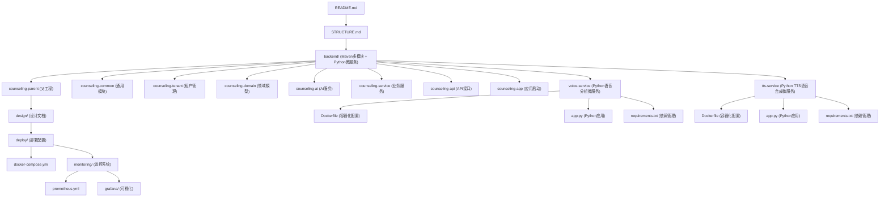

**图表来源**
- [STRUCTURE.md](file://STRUCTURE.md)
- [backend/pom.xml](file://backend/pom.xml)
- [backend/voice-service/Dockerfile](file://backend/voice-service/Dockerfile)
- [backend/tts-service/Dockerfile](file://backend/tts-service/Dockerfile)
- [deploy/docker-compose.yml](file://deploy/docker-compose.yml)
- [deploy/monitoring/prometheus.yml](file://deploy/monitoring/prometheus.yml)

**章节来源**
- [README.md](file://README.md)
- [STRUCTURE.md](file://STRUCTURE.md)

## Maven多模块架构
系统采用标准的Maven多模块架构，包含8个核心Java模块，实现了清晰的层次分离和依赖管理，并与Python语音分析微服务和TTS语音合成微服务形成微服务架构。

### 模块职责划分
- **counseling-parent**：父工程，统一管理依赖版本和构建配置
- **counseling-common**：通用模块，提供统一的响应框架、异常处理、DTO定义
- **counseling-tenant**：租户管理模块，实现多租户隔离逻辑
- **counseling-domain**：领域模型模块，定义核心业务实体和领域逻辑
- **counseling-ai**：AI服务模块，集成大模型调用、提示词管理和语音分析服务
- **counseling-service**：业务服务模块，实现核心业务逻辑和服务编排
- **counseling-api**：API接口模块，定义RESTful接口和控制器，包含安全配置和WebSocket支持
- **counseling-app**：应用启动模块，Spring Boot主应用入口
- **voice-service**：Python语音分析微服务，独立容器化部署
- **tts-service**：Python TTS语音合成微服务，独立容器化部署

### 依赖关系图
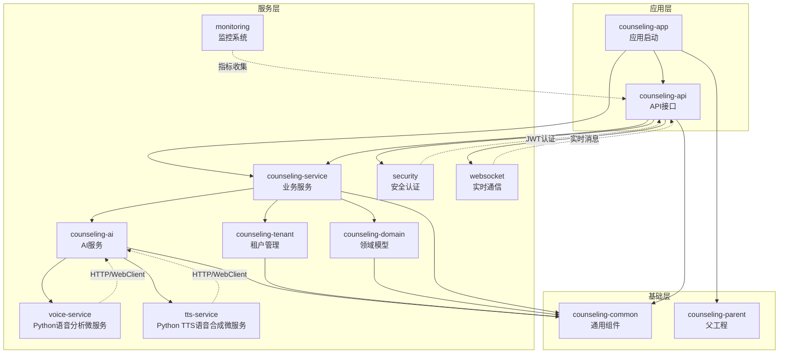

**图表来源**
- [backend/counseling-app/pom.xml](file://backend/counseling-app/pom.xml)
- [backend/counseling-api/pom.xml](file://backend/counseling-api/pom.xml)
- [backend/counseling-service/pom.xml](file://backend/counseling-service/pom.xml)
- [backend/counseling-common/pom.xml](file://backend/counseling-common/pom.xml)
- [backend/counseling-ai/src/main/java/com/mindsafe/ai/voice/VoiceAnalysisService.java](file://backend/counseling-ai/src/main/java/com/mindsafe/ai/voice/VoiceAnalysisService.java)
- [backend/counseling-ai/src/main/java/com/mindsafe/ai/voice/TtsService.java](file://backend/counseling-ai/src/main/java/com/mindsafe/ai/voice/TtsService.java)
- [backend/counseling-api/src/main/java/com/mindsafe/api/security/JwtAuthenticationFilter.java](file://backend/counseling-api/src/main/java/com/mindsafe/api/security/JwtAuthenticationFilter.java)
- [backend/counseling-api/src/main/java/com/mindsafe/api/websocket/WebSocketConfig.java](file://backend/counseling-api/src/main/java/com/mindsafe/api/websocket/WebSocketConfig.java)

### Spring Boot 3.4.1集成
应用基于Spring Boot 3.4.1构建，集成了现代Java开发的最佳实践：
- Java 17+支持
- 现代化注解和语法特性
- 增强的安全性和性能优化
- 云原生支持和容器化友好
- WebClient异步HTTP客户端支持
- JWT认证和授权机制
- WebSocket实时通信支持
- Actuator监控和健康检查

**章节来源**
- [backend/pom.xml](file://backend/pom.xml)
- [backend/counseling-parent/pom.xml](file://backend/counseling-parent/pom.xml)
- [backend/counseling-app/src/main/java/com/mindsafe/app/MindSafeApplication.java](file://backend/counseling-app/src/main/java/com/mindsafe/app/MindSafeApplication.java)

## 核心组件
基于已实现的代码和设计文档，系统由以下核心组件构成：
- **统一响应框架**：标准化的API响应格式和错误码管理
- **多租户管理**：支持多学校（多租户）隔离，统一身份与会话上下文
- **对话与咨询会话**：会话生命周期管理、消息路由、审计与合规
- **AI服务引擎**：任务编排、提示词模板、规则库与知识库检索
- **语音分析微服务**：Python实现的语音情感分析，容器化部署
- **TTS语音合成微服务**：Python实现的文本转语音服务，容器化部署
- **风险识别与干预**：规则库驱动的风险检测、预警与升级流程
- **API网关与服务层**：对外REST接口、鉴权、限流与审计
- **数据存储**：关系型数据库（会话、用户、租户）、向量库（知识检索）、对象存储（附件）
- **可观测性与安全**：日志、指标、追踪、加密与脱敏
- **认证授权系统**：JWT令牌认证、角色权限控制和访问控制
- **WebSocket实时通信**：双向实时消息推送和事件驱动架构
- **监控系统**：Prometheus指标收集、Grafana可视化和健康检查
- **SSE流式响应处理**：增强的错误处理机制和异常恢复能力
- **PostgreSQL JSONB类型处理器**：自定义MyBatis-Plus类型处理器，支持复杂结构化数据的持久化存储

**更新**：新增了PostgreSQL JSONB类型处理器组件，通过自定义MyBatis-Plus类型处理器实现了对PostgreSQL原生JSONB数据类型的完整支持，为情感分析结果、学生心理画像、咨询会话状态和审计日志等复杂结构化数据提供了高效的持久化解决方案。

**章节来源**
- [backend/counseling-common/src/main/java/com/mindsafe/common/dto/ApiResponse.java](file://backend/counseling-common/src/main/java/com/mindsafe/common/dto/ApiResponse.java)
- [backend/counseling-common/src/main/java/com/mindsafe/common/dto/ErrorCode.java](file://backend/counseling-common/src/main/java/com/mindsafe/common/dto/ErrorCode.java)
- [backend/counseling-common/src/main/java/com/mindsafe/common/exception/BizException.java](file://backend/counseling-common/src/main/java/com/mindsafe/common/exception/BizException.java)

## 架构总览
系统采用分层+事件驱动的混合架构：前端通过API网关访问服务层；服务层协调业务域（会话、租户、Agent、风控），并通过消息总线与外部系统（如短信、邮件、第三方LLM）集成。新增的Python语音分析微服务和TTS语音合成微服务通过HTTP协议与Java后端通信，实现前后端分离的微服务架构。多租户在数据与配置层面进行隔离，确保各学校的独立性与安全性。认证系统通过JWT令牌机制保障API访问安全。WebSocket实时通信提供双向消息推送能力。监控系统通过Prometheus和Grafana实现全面的可观测性。

**更新**：PostgreSQL JSONB类型处理器的引入进一步增强了系统的架构完整性，通过自定义类型处理器实现了复杂结构化数据的高效存储和查询，提升了系统在情感分析、学生画像、会话状态管理等场景下的数据处理能力。

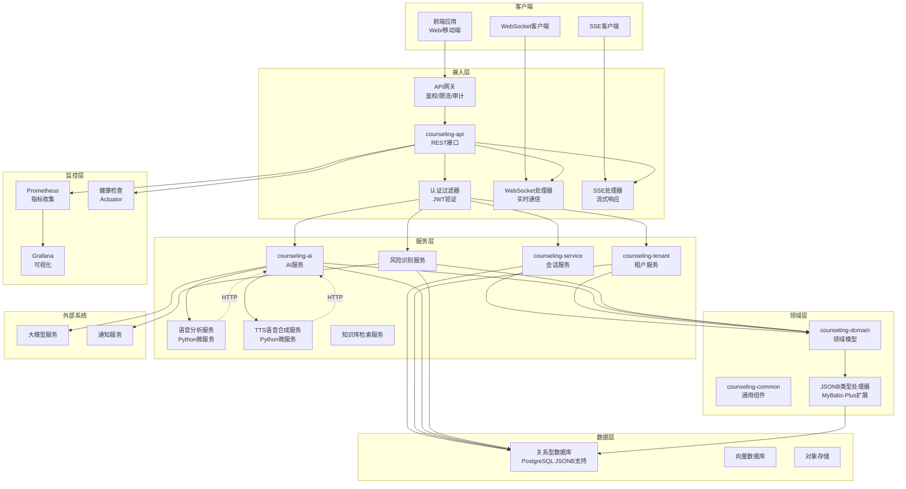

**图表来源**
- [backend/counseling-api/src/main/java/com/mindsafe/api/controller/ChatController.java](file://backend/counseling-api/src/main/java/com/mindsafe/api/controller/ChatController.java)
- [backend/counseling-service/src/main/java/com/mindsafe/service/conversation/ConversationService.java](file://backend/counseling-service/src/main/java/com/mindsafe/service/conversation/ConversationService.java)
- [backend/counseling-ai/src/main/java/com/mindsafe/ai/voice/VoiceAnalysisService.java](file://backend/counseling-ai/src/main/java/com/mindsafe/ai/voice/VoiceAnalysisService.java)
- [backend/counseling-ai/src/main/java/com/mindsafe/ai/voice/TtsService.java](file://backend/counseling-ai/src/main/java/com/mindsafe/ai/voice/TtsService.java)
- [backend/counseling-api/src/main/java/com/mindsafe/api/security/JwtAuthenticationFilter.java](file://backend/counseling-api/src/main/java/com/mindsafe/api/security/JwtAuthenticationFilter.java)
- [backend/counseling-api/src/main/java/com/mindsafe/api/websocket/WebSocketConfig.java](file://backend/counseling-api/src/main/java/com/mindsafe/api/websocket/WebSocketConfig.java)
- [deploy/monitoring/prometheus.yml](file://deploy/monitoring/prometheus.yml)

## 详细组件分析

### 统一响应框架
系统实现了标准化的API响应框架，确保所有接口的响应格式一致：
- **ApiResponse**：统一的响应包装类，包含状态码、消息和数据
- **ErrorCode**：标准化的错误码定义和管理
- **BizException**：业务异常基类，支持自定义错误信息

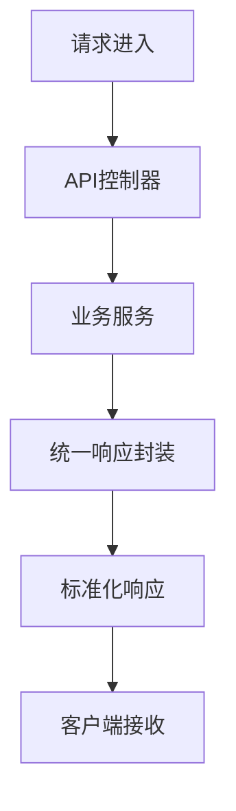

**图表来源**
- [backend/counseling-common/src/main/java/com/mindsafe/common/dto/ApiResponse.java](file://backend/counseling-common/src/main/java/com/mindsafe/common/dto/ApiResponse.java)
- [backend/counseling-api/src/main/java/com/mindsafe/api/controller/ChatController.java](file://backend/counseling-api/src/main/java/com/mindsafe/api/controller/ChatController.java)

**章节来源**
- [backend/counseling-common/src/main/java/com/mindsafe/common/dto/ApiResponse.java](file://backend/counseling-common/src/main/java/com/mindsafe/common/dto/ApiResponse.java)
- [backend/counseling-common/src/main/java/com/mindsafe/common/dto/ErrorCode.java](file://backend/counseling-common/src/main/java/com/mindsafe/common/dto/ErrorCode.java)
- [backend/counseling-common/src/main/java/com/mindsafe/common/exception/BizException.java](file://backend/counseling-common/src/main/java/com/mindsafe/common/exception/BizException.java)

### 多租户与SaaS隔离
- 隔离维度：按学校（租户）划分用户、会话、配置与审计数据
- 实现策略：数据库级schema或tenant_id字段隔离；缓存与对象存储按租户命名空间隔离
- 边界与约束：跨租户不可见；共享资源需显式授权；审计日志必须携带租户标识

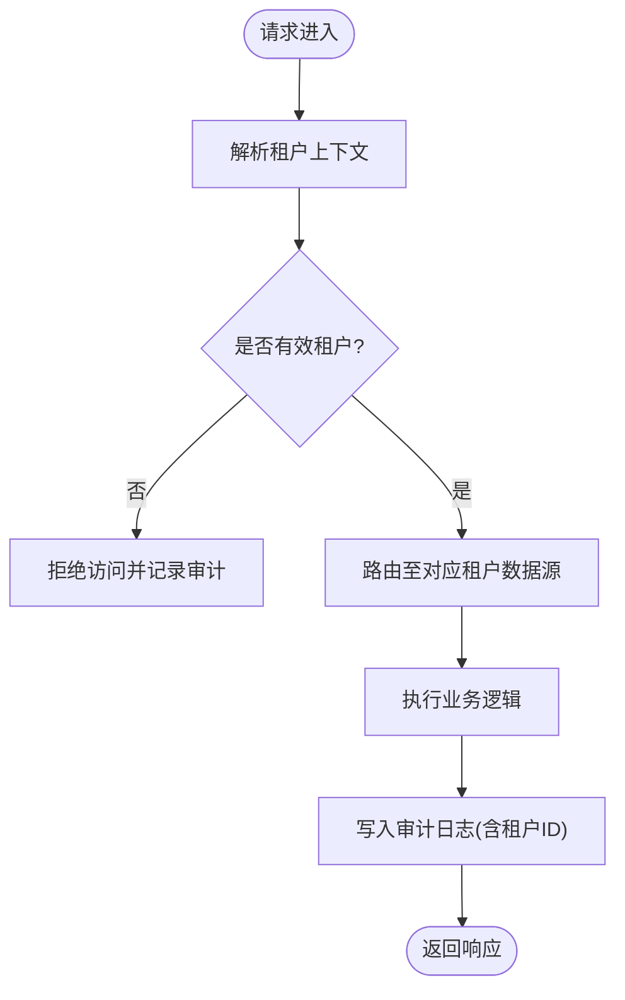

**图表来源**
- [design/07_SaaS多学校隔离架构.md](file://design/07_SaaS多学校隔离架构.md)

**章节来源**
- [design/07_SaaS多学校隔离架构.md](file://design/07_SaaS多学校隔离架构.md)

### Agent工作流编排
- 目标：将咨询流程拆解为可编排的任务节点，结合提示词模板与规则库，驱动LLM完成对话引导、评估与建议输出
- 关键要素：状态机、节点类型（输入校验、检索增强、模型调用、规则判断、分支合并）、上下文传递、重试与熔断
- 可观测性：每个节点的执行轨迹、耗时、输入输出摘要与错误码

**更新**：Agent工作流现在集成了增强的错误处理机制，确保在微服务调用失败时能够正确清理资源并提供友好的错误响应。同时，通过PostgreSQL JSONB类型处理器，Agent的工作状态、中间结果和调试信息可以高效地存储在数据库中。

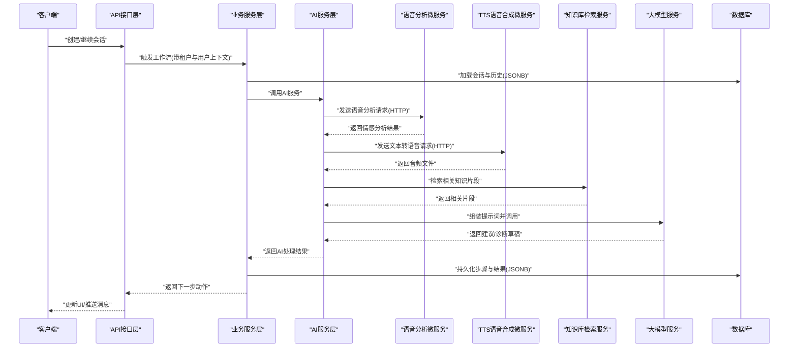

**图表来源**
- [backend/counseling-api/src/main/java/com/mindsafe/api/controller/ChatController.java](file://backend/counseling-api/src/main/java/com/mindsafe/api/controller/ChatController.java)
- [backend/counseling-service/src/main/java/com/mindsafe/service/conversation/ConversationService.java](file://backend/counseling-service/src/main/java/com/mindsafe/service/conversation/ConversationService.java)
- [backend/counseling-ai/src/main/java/com/mindsafe/ai/voice/VoiceAnalysisService.java](file://backend/counseling-ai/src/main/java/com/mindsafe/ai/voice/VoiceAnalysisService.java)
- [backend/counseling-ai/src/main/java/com/mindsafe/ai/voice/TtsService.java](file://backend/counseling-ai/src/main/java/com/mindsafe/ai/voice/TtsService.java)

**章节来源**
- [design/13_Agent工作流.md](file://design/13_Agent工作流.md)
- [design/16_API接口设计.md](file://design/16_API接口设计.md)

### 风险识别与干预
- 规则库：基于心理领域专家经验构建的规则集，涵盖关键词、语义模式与行为序列
- 处理流程：实时扫描消息与上下文，命中高风险则触发分级干预（提醒、转人工、紧急联系人）
- 审计与合规：所有判定依据、证据链与处置过程留痕，满足监管要求

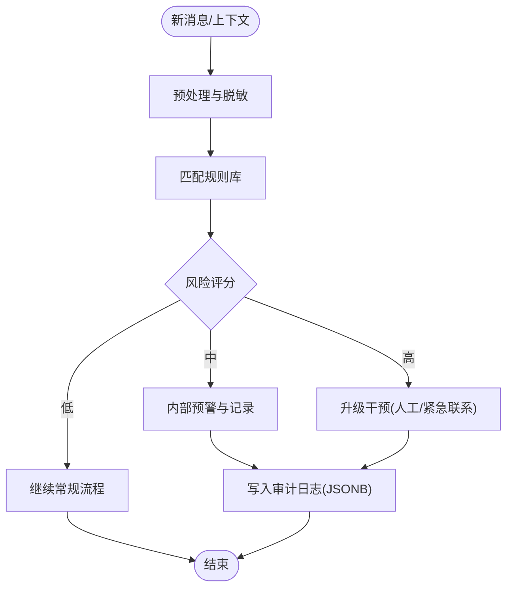

**图表来源**
- [design/04_风险识别规则库.md](file://design/04_风险识别规则库.md)

**章节来源**
- [design/04_风险识别规则库.md](file://design/04_风险识别规则库.md)

### API接口设计
- 风格：RESTful为主，部分长时任务使用异步回调或WebSocket
- 通用能力：鉴权（JWT/OAuth2）、租户上下文注入、分页与过滤、幂等键、审计头
- 典型端点：会话管理、消息收发、工作流控制、风险上报、知识库检索、语音分析、TTS语音合成
- **更新**：所有API端点现在都需要有效的JWT令牌进行访问
- **新增**：WebSocket端点支持实时消息推送和事件订阅
- **增强**：SSE流式响应接口具备增强的错误处理和资源清理机制
- **增强**：JSONB字段支持使得API可以处理更复杂的结构化数据

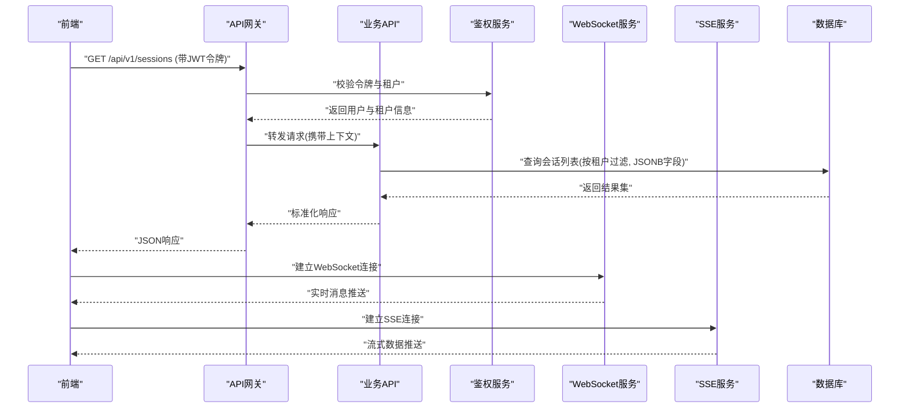

**图表来源**
- [design/16_API接口设计.md](file://design/16_API接口设计.md)
- [backend/counseling-api/src/main/java/com/mindsafe/api/security/JwtAuthenticationFilter.java](file://backend/counseling-api/src/main/java/com/mindsafe/api/security/JwtAuthenticationFilter.java)
- [backend/counseling-api/src/main/java/com/mindsafe/api/websocket/WebSocketConfig.java](file://backend/counseling-api/src/main/java/com/mindsafe/api/websocket/WebSocketConfig.java)

**章节来源**
- [design/16_API接口设计.md](file://design/16_API接口设计.md)

### 前端架构设计
- 分层：页面层、组件层、状态管理层、网络层、国际化与主题
- 通信：HTTP/WS/SSE客户端封装，统一错误处理与重试策略
- 体验：懒加载、骨架屏、离线缓存与增量更新
- **更新**：前端需要处理JWT令牌的存储和自动刷新机制
- **新增**：WebSocket连接管理和实时消息处理
- **增强**：SSE连接管理和流式数据处理，具备更好的错误恢复能力

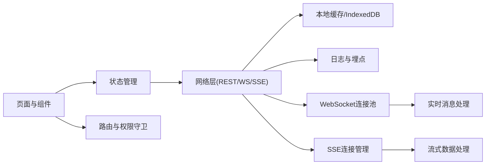

**图表来源**
- [design/17_前端架构设计.md](file://design/17_前端架构设计.md)

**章节来源**
- [design/17_前端架构设计.md](file://design/17_前端架构设计.md)

### MVP最小可行版本
- 范围：单租户、基础会话与消息、简单Agent流程、最低可用风控规则
- 里程碑：需求冻结→核心链路打通→灰度发布→复盘优化
- 风险控制：明确降级策略与回滚方案，优先保障数据安全与可用性

**章节来源**
- [design/08_MVP最小可行版本.md](file://design/08_MVP最小可行版本.md)

## 认证与授权系统

### 认证系统概述
系统实现了基于JWT（JSON Web Token）的完整认证授权机制，确保API访问的安全性和用户身份的可靠性。认证系统通过过滤器链对每个请求进行身份验证和权限检查。

### JWT令牌认证机制
- **令牌生成**：用户登录后生成包含用户信息和权限的JWT令牌
- **令牌验证**：每个API请求都需要携带有效的JWT令牌
- **令牌刷新**：支持令牌过期后的自动刷新机制
- **安全存储**：前端安全存储令牌，防止XSS攻击

### 安全过滤器链
系统采用Spring Security的过滤器链机制，实现多层安全防护：

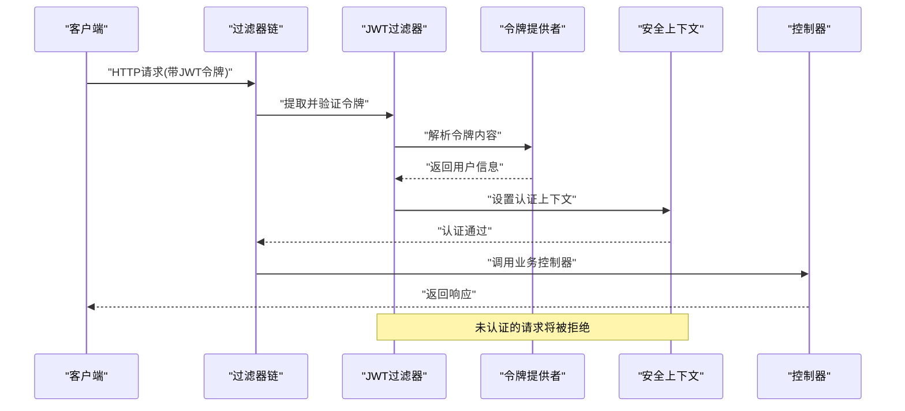

**图表来源**
- [backend/counseling-api/src/main/java/com/mindsafe/api/security/JwtAuthenticationFilter.java](file://backend/counseling-api/src/main/java/com/mindsafe/api/security/JwtAuthenticationFilter.java)
- [backend/counseling-api/src/main/java/com/mindsafe/api/security/JwtTokenProvider.java](file://backend/counseling-api/src/main/java/com/mindsafe/api/security/JwtTokenProvider.java)
- [backend/counseling-api/src/main/java/com/mindsafe/api/config/SecurityConfig.java](file://backend/counseling-api/src/main/java/com/mindsafe/api/config/SecurityConfig.java)

### 安全配置管理
- **白名单配置**：允许匿名访问的端点配置
- **角色权限**：基于角色的访问控制（RBAC）
- **跨域配置**：安全的跨域资源共享设置
- **密码策略**：强密码要求和加密存储

### 令牌生命周期管理
- **短期令牌**：访问令牌有效期较短，提高安全性
- **长期刷新令牌**：刷新令牌有效期较长，改善用户体验
- **令牌黑名单**：支持令牌撤销和黑名单管理
- **并发控制**：限制同一用户的并发会话数量

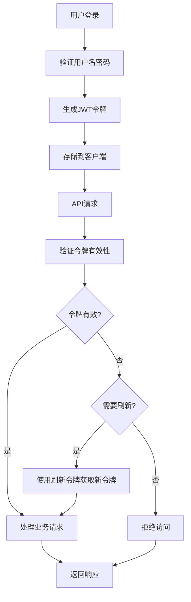

**图表来源**
- [backend/counseling-api/src/main/java/com/mindsafe/api/security/JwtTokenProvider.java](file://backend/counseling-api/src/main/java/com/mindsafe/api/security/JwtTokenProvider.java)
- [backend/counseling-api/src/main/java/com/mindsafe/api/config/SecurityConfig.java](file://backend/counseling-api/src/main/java/com/mindsafe/api/config/SecurityConfig.java)

**章节来源**
- [backend/counseling-api/src/main/java/com/mindsafe/api/security/JwtAuthenticationFilter.java](file://backend/counseling-api/src/main/java/com/mindsafe/api/security/JwtAuthenticationFilter.java)
- [backend/counseling-api/src/main/java/com/mindsafe/api/security/JwtTokenProvider.java](file://backend/counseling-api/src/main/java/com/mindsafe/api/security/JwtTokenProvider.java)
- [backend/counseling-api/src/main/java/com/mindsafe/api/config/SecurityConfig.java](file://backend/counseling-api/src/main/java/com/mindsafe/api/config/SecurityConfig.java)

## WebSocket实时通信

### WebSocket架构概述
系统实现了基于WebSocket的双向实时通信机制，支持实时消息推送、事件订阅和状态同步。WebSocket处理器负责连接管理、消息路由和事件分发，为心理咨询系统提供流畅的实时交互体验。

### 实时通信组件
- **WebSocket配置**：Spring WebSocket配置和连接工厂设置
- **消息处理器**：自定义WebSocket处理器，处理连接建立、消息接收和断开连接
- **事件监听器**：异步事件监听器，处理风险警报和业务事件推送
- **连接管理**：用户会话管理和连接状态维护

### WebSocket消息流
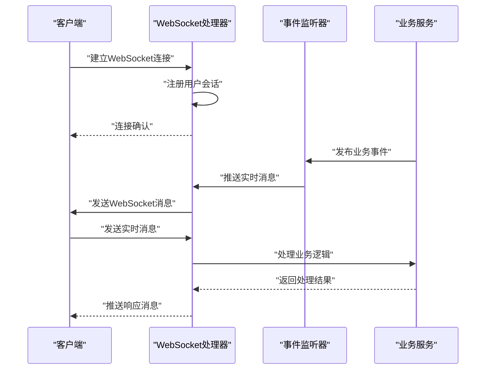

**图表来源**
- [backend/counseling-api/src/main/java/com/mindsafe/api/websocket/WebSocketConfig.java](file://backend/counseling-api/src/main/java/com/mindsafe/api/websocket/WebSocketConfig.java)
- [backend/counseling-api/src/main/java/com/mindsafe/api/websocket/AlertWebSocketHandler.java](file://backend/counseling-api/src/main/java/com/mindsafe/api/websocket/AlertWebSocketHandler.java)
- [backend/counseling-api/src/main/java/com/mindsafe/api/websocket/AlertPushListener.java](file://backend/counseling-api/src/main/java/com/mindsafe/api/websocket/AlertPushListener.java)

### 实时消息类型
- **风险警报**：高风险情况实时通知
- **会话状态**：咨询会话状态变化通知
- **系统消息**：系统维护和配置更新通知
- **用户事件**：用户操作和状态变更通知

### 连接管理与故障恢复
- **心跳机制**：定期心跳检测连接状态
- **重连策略**：断线自动重连和指数退避算法
- **消息队列**：离线消息缓冲和延迟推送
- **负载均衡**：多实例间的连接分配和会话迁移

**章节来源**
- [backend/counseling-api/src/main/java/com/mindsafe/api/websocket/WebSocketConfig.java](file://backend/counseling-api/src/main/java/com/mindsafe/api/websocket/WebSocketConfig.java)
- [backend/counseling-api/src/main/java/com/mindsafe/api/websocket/AlertWebSocketHandler.java](file://backend/counseling-api/src/main/java/com/mindsafe/api/websocket/AlertWebSocketHandler.java)
- [backend/counseling-api/src/main/java/com/mindsafe/api/websocket/AlertPushListener.java](file://backend/counseling-api/src/main/java/com/mindsafe/api/websocket/AlertPushListener.java)

## 监控与可观测性

### 监控系统架构
系统集成了完整的监控和可观测性解决方案，基于Prometheus和Grafana实现指标收集、可视化和告警功能。监控系统覆盖应用性能、业务指标、基础设施健康和微服务状态。

### 监控组件
- **Prometheus**：时序指标收集和存储
- **Grafana**：指标可视化和仪表板展示
- **Actuator**：Spring Boot应用健康检查和指标暴露
- **日志聚合**：结构化日志收集和集中管理

### 监控指标体系
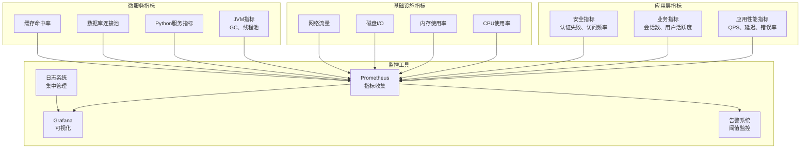

**图表来源**
- [deploy/monitoring/prometheus.yml](file://deploy/monitoring/prometheus.yml)
- [deploy/monitoring/grafana/provisioning/datasources/datasource.yml](file://deploy/monitoring/grafana/provisioning/datasources/datasource.yml)

### 健康检查与告警
- **健康检查端点**：/actuator/health提供应用健康状态
- **自定义健康检查**：数据库连接、Redis缓存、外部服务依赖检查
- **告警规则**：基于阈值的自动告警和通知
- **仪表板**：实时监控面板和性能趋势分析

### 日志与追踪
- **结构化日志**：统一的日志格式和级别管理
- **分布式追踪**：TraceId贯穿请求链路
- **日志聚合**：集中式日志收集和搜索
- **审计日志**：关键操作的完整审计跟踪

**章节来源**
- [deploy/monitoring/prometheus.yml](file://deploy/monitoring/prometheus.yml)
- [deploy/monitoring/grafana/provisioning/datasources/datasource.yml](file://deploy/monitoring/grafana/provisioning/datasources/datasource.yml)

## Python语音分析微服务

### 微服务概述
系统新增了独立的Python语音分析微服务，专门负责语音情感分析和音频处理功能。该微服务采用容器化部署，通过HTTP协议与Java后端进行通信，实现了真正的微服务架构和前后端分离。

### 技术栈与架构
- **编程语言**：Python 3.x
- **Web框架**：FastAPI/Flask（根据实际实现）
- **容器化**：Docker镜像打包
- **通信协议**：HTTP REST API
- **依赖管理**：requirements.txt

### 容器化部署
微服务采用Docker容器化部署，通过docker-compose进行编排管理：

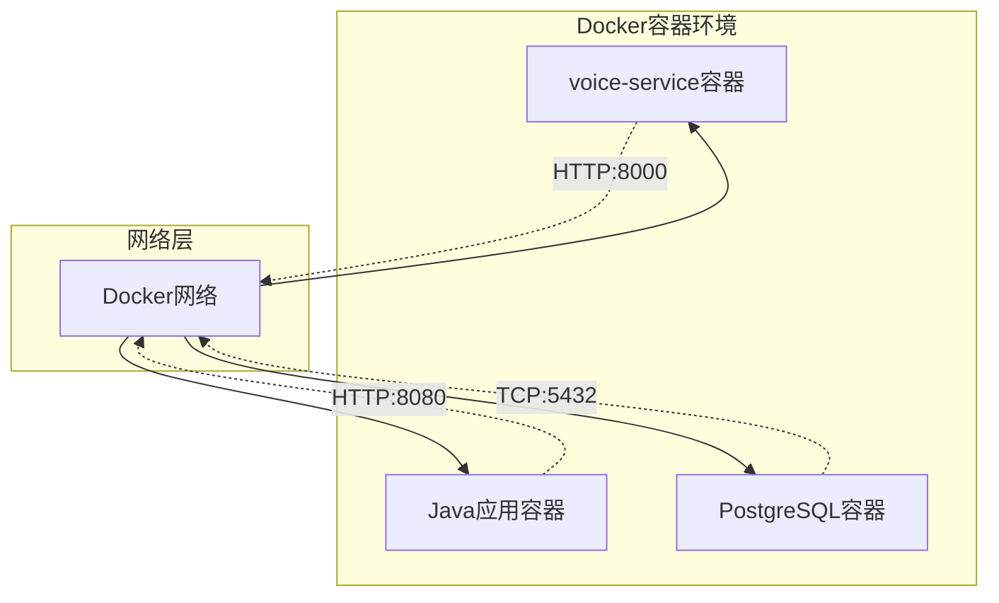

**图表来源**
- [backend/voice-service/Dockerfile](file://backend/voice-service/Dockerfile)
- [deploy/docker-compose.yml](file://deploy/docker-compose.yml)

### Java与Python微服务集成
Java后端通过WebClient异步HTTP客户端调用Python语音分析微服务：

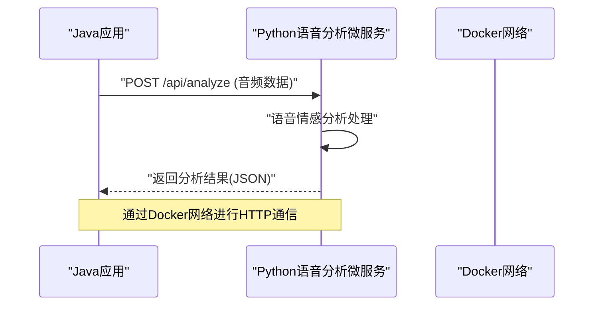

**图表来源**
- [backend/counseling-ai/src/main/java/com/mindsafe/ai/voice/VoiceAnalysisService.java](file://backend/counseling-ai/src/main/java/com/mindsafe/ai/voice/VoiceAnalysisService.java)
- [backend/voice-service/app.py](file://backend/voice-service/app.py)

### 语音分析工作流程
1. **音频接收**：Java后端接收前端上传的音频文件或实时音频流
2. **预处理**：音频格式转换、降噪、特征提取
3. **微服务调用**：通过WebClient异步调用Python微服务
4. **情感分析**：Python微服务进行语音情感识别和分析
5. **结果返回**：返回情感标签、置信度和分析详情
6. **业务处理**：Java后端整合分析结果到业务流程中

**章节来源**
- [backend/voice-service/Dockerfile](file://backend/voice-service/Dockerfile)
- [backend/voice-service/app.py](file://backend/voice-service/app.py)
- [backend/voice-service/requirements.txt](file://backend/voice-service/requirements.txt)
- [backend/counseling-ai/src/main/java/com/mindsafe/ai/voice/VoiceAnalysisService.java](file://backend/counseling-ai/src/main/java/com/mindsafe/ai/voice/VoiceAnalysisService.java)
- [backend/counseling-ai/src/main/java/com/mindsafe/ai/voice/VoiceAnalysisResult.java](file://backend/counseling-ai/src/main/java/com/mindsafe/ai/voice/VoiceAnalysisResult.java)
- [deploy/docker-compose.yml](file://deploy/docker-compose.yml)

## Python TTS语音合成微服务

### 微服务概述
系统新增了独立的Python TTS（Text-to-Speech）语音合成微服务，专门负责将文本转换为语音的功能。该微服务采用容器化部署，通过HTTP协议与Java后端进行通信，为心理咨询系统提供高质量的语音合成能力。

### 技术栈与架构
- **编程语言**：Python 3.x
- **Web框架**：FastAPI/Flask（根据实际实现）
- **TTS引擎**：基于深度学习的高质量语音合成
- **容器化**：Docker镜像打包
- **通信协议**：HTTP REST API
- **依赖管理**：requirements.txt

### 容器化部署
TTS微服务采用Docker容器化部署，与语音分析微服务一起通过docker-compose进行编排管理：

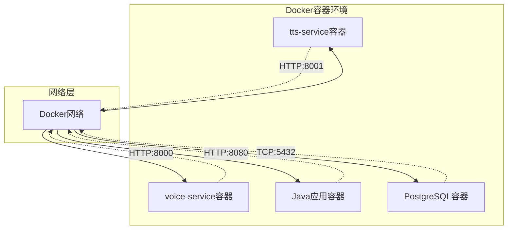

**图表来源**
- [backend/tts-service/Dockerfile](file://backend/tts-service/Dockerfile)
- [deploy/docker-compose.yml](file://deploy/docker-compose.yml)

### Java与Python TTS微服务集成
Java后端通过WebClient异步HTTP客户端调用Python TTS微服务：

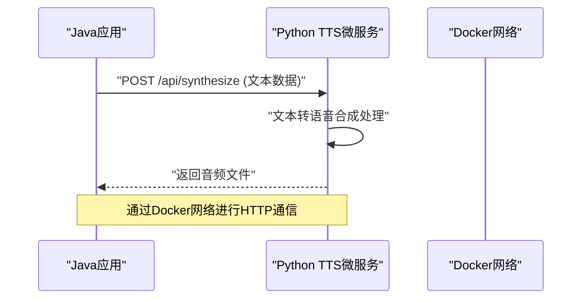

**图表来源**
- [backend/counseling-ai/src/main/java/com/mindsafe/ai/voice/TtsService.java](file://backend/counseling-ai/src/main/java/com/mindsafe/ai/voice/TtsService.java)
- [backend/tts-service/app.py](file://backend/tts-service/app.py)

### TTS语音合成工作流程
1. **文本接收**：Java后端接收需要转换为语音的文本内容
2. **文本预处理**：文本清洗、格式化、语言检测
3. **微服务调用**：通过WebClient异步调用Python TTS微服务
4. **语音合成**：Python微服务进行高质量语音合成
5. **音频生成**：生成MP3/WAV格式的音频文件
6. **结果返回**：返回音频文件或音频URL
7. **业务处理**：Java后端将音频文件集成到业务流程中

### 双微服务协作架构
语音分析微服务和TTS微服务共同构成了完整的语音处理流水线：

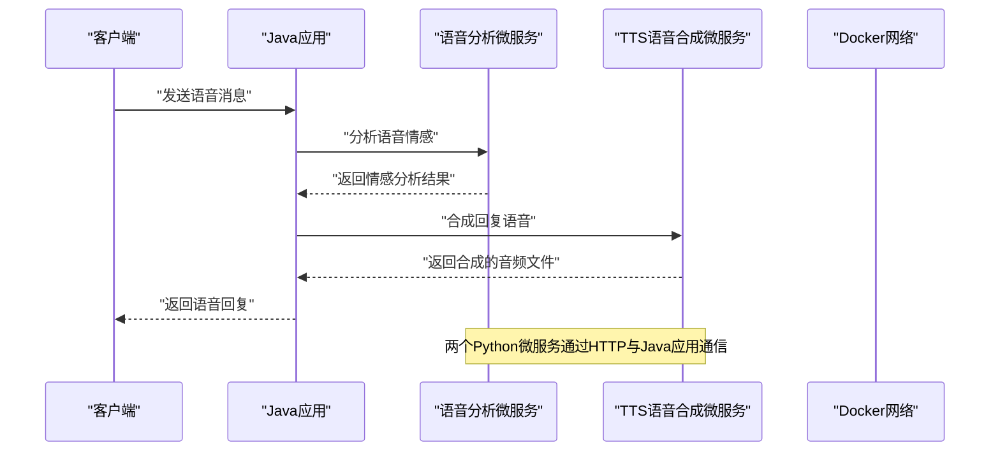

**更新**：TTS微服务的finally块处理机制现在确保了资源的正确释放，即使在异常情况下也能保证系统的稳定性。同时，情感分析结果可以通过PostgreSQL JSONB类型处理器高效地存储到数据库中。

**图表来源**
- [backend/counseling-ai/src/main/java/com/mindsafe/ai/voice/VoiceAnalysisService.java](file://backend/counseling-ai/src/main/java/com/mindsafe/ai/voice/VoiceAnalysisService.java)
- [backend/counseling-ai/src/main/java/com/mindsafe/ai/voice/TtsService.java](file://backend/counseling-ai/src/main/java/com/mindsafe/ai/voice/TtsService.java)
- [backend/voice-service/app.py](file://backend/voice-service/app.py)
- [backend/tts-service/app.py](file://backend/tts-service/app.py)

**章节来源**
- [backend/tts-service/Dockerfile](file://backend/tts-service/Dockerfile)
- [backend/tts-service/app.py](file://backend/tts-service/app.py)
- [backend/tts-service/requirements.txt](file://backend/tts-service/requirements.txt)
- [backend/counseling-ai/src/main/java/com/mindsafe/ai/voice/TtsService.java](file://backend/counseling-ai/src/main/java/com/mindsafe/ai/voice/TtsService.java)
- [deploy/docker-compose.yml](file://deploy/docker-compose.yml)

## 容器化部署

### 容器化架构
系统采用完整的容器化部署方案，基于Docker和Docker Compose实现微服务的编排和管理。所有组件都进行了容器化封装，支持弹性伸缩和滚动更新。

### Docker Compose编排
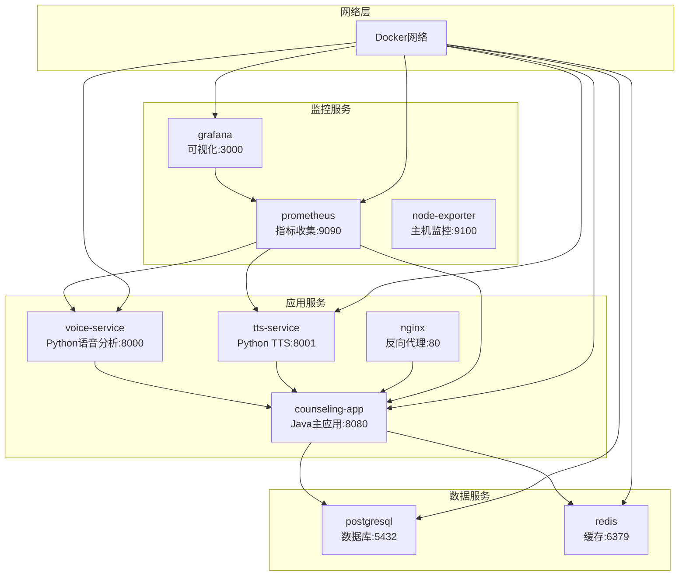

**图表来源**
- [deploy/docker-compose.yml](file://deploy/docker-compose.yml)
- [deploy/docker-compose.monitoring.yml](file://deploy/docker-compose.monitoring.yml)

### 微服务容器化
- **Java应用容器**：基于OpenJDK镜像，包含Spring Boot应用
- **Python微服务容器**：基于Python镜像，包含语音分析和TTS服务
- **数据库容器**：PostgreSQL和Redis容器化部署
- **监控容器**：Prometheus和Grafana容器化部署
- **反向代理**：Nginx容器化配置负载均衡和SSL终止

### 部署配置管理
- **环境变量**：敏感配置通过环境变量管理
- **配置文件**：YAML格式的配置文件管理
- **健康检查**：容器健康检查和自动重启
- **日志收集**：容器日志集中收集和轮转
- **存储卷**：数据持久化和备份策略

### 生产环境部署
- **多环境配置**：开发、测试、生产环境分离
- **CI/CD集成**：自动化构建和部署流水线
- **弹性伸缩**：基于负载的自动扩缩容
- **故障转移**：多副本部署和高可用配置
- **安全加固**：容器安全扫描和网络隔离

**章节来源**
- [deploy/docker-compose.yml](file://deploy/docker-compose.yml)
- [deploy/docker-compose.monitoring.yml](file://deploy/docker-compose.monitoring.yml)
- [backend/voice-service/Dockerfile](file://backend/voice-service/Dockerfile)
- [backend/tts-service/Dockerfile](file://backend/tts-service/Dockerfile)

## 依赖分析
- 组件耦合：服务层通过明确的API契约解耦；Agent与LLM之间通过提示词与结构化输入输出约定；Java与Python微服务通过HTTP协议解耦
- 外部依赖：大模型服务、通知服务、对象存储与向量库均为可选扩展，可通过配置开关启用
- 潜在循环：避免在服务间直接双向调用，采用事件或消息队列解耦；微服务间通过HTTP API通信，避免紧耦合
- **新增**：认证系统作为独立的安全层，通过过滤器链与所有API接口集成
- **新增**：WebSocket实时通信作为独立的消息通道，与REST API并行工作
- **新增**：监控系统作为横切关注点，通过Prometheus指标收集所有服务状态
- **增强**：SSE流式响应处理作为独立的通信机制，具备增强的错误处理和资源管理能力
- **增强**：PostgreSQL JSONB类型处理器作为数据层的扩展组件，为复杂结构化数据提供高效的持久化支持

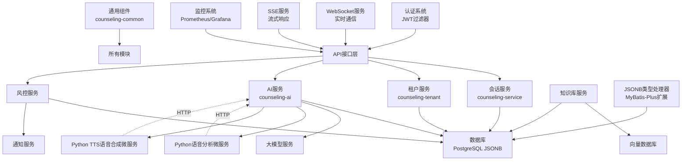

**图表来源**
- [backend/counseling-service/pom.xml](file://backend/counseling-service/pom.xml)
- [backend/counseling-tenant/pom.xml](file://backend/counseling-tenant/pom.xml)
- [backend/counseling-ai/pom.xml](file://backend/counseling-ai/pom.xml)
- [backend/counseling-common/pom.xml](file://backend/counseling-common/pom.xml)
- [backend/counseling-ai/src/main/java/com/mindsafe/ai/voice/VoiceAnalysisService.java](file://backend/counseling-ai/src/main/java/com/mindsafe/ai/voice/VoiceAnalysisService.java)
- [backend/counseling-ai/src/main/java/com/mindsafe/ai/voice/TtsService.java](file://backend/counseling-ai/src/main/java/com/mindsafe/ai/voice/TtsService.java)
- [backend/counseling-api/src/main/java/com/mindsafe/api/security/JwtAuthenticationFilter.java](file://backend/counseling-api/src/main/java/com/mindsafe/api/security/JwtAuthenticationFilter.java)
- [backend/counseling-api/src/main/java/com/mindsafe/api/websocket/WebSocketConfig.java](file://backend/counseling-api/src/main/java/com/mindsafe/api/websocket/WebSocketConfig.java)
- [deploy/monitoring/prometheus.yml](file://deploy/monitoring/prometheus.yml)

**章节来源**
- [design/12_技术架构.md](file://design/12_技术架构.md)

## 性能考虑
- 缓存策略：热点会话元数据、提示词模板与规则索引缓存；会话历史分片读取
- 并发与批处理：消息批量入库、Agent并行检索与合并；对LLM调用做批量化与去重
- 弹性与降级：LLM超时熔断、降级到本地规则或模板回复；限流保护上游；Python微服务超时和重试机制
- 可观测性：端到端追踪、关键指标（延迟、错误率、吞吐）与告警阈值；微服务健康检查和监控
- 微服务优化：连接池管理、异步HTTP调用、负载均衡和服务发现
- **新增**：TTS微服务音频文件缓存和CDN加速，语音分析结果缓存减少重复计算
- **新增**：JWT令牌缓存和Redis集群支持，提升认证性能
- **新增**：WebSocket连接池管理和消息队列缓冲，提升实时通信性能
- **新增**：Prometheus指标采样和Grafana查询优化，提升监控性能
- **增强**：SSE流式响应的错误处理优化，减少异常情况的资源占用和处理时间
- **增强**：PostgreSQL JSONB字段的索引优化和查询性能调优，提升复杂结构化数据的处理效率

## 故障排查指南
- 常见问题定位路径
  - 鉴权失败：检查网关鉴权中间件、令牌有效期与租户映射
  - 会话异常：核对会话状态机转换、审计日志与数据库一致性
  - Agent无响应：查看工作流节点耗时、LLM调用成功率与重试次数
  - 语音分析失败：检查Python语音分析微服务状态、HTTP连接超时和网络连通性
  - TTS合成失败：检查Python TTS微服务状态、音频文件格式和合成质量
  - 风控误报/漏报：复核规则命中率、样本分布与阈值设置
  - **新增**：认证失败：检查JWT令牌签名、过期时间和密钥配置
  - **新增**：WebSocket连接失败：检查WebSocket配置、防火墙规则和浏览器兼容性
  - **新增**：SSE连接失败：检查SSE配置、网络连接和浏览器兼容性
  - **新增**：监控数据缺失：检查Prometheus配置、指标采集器和网络连通性
  - **新增**：JSONB数据异常：检查PostgreSQL JSONB字段类型、MyBatis-Plus类型处理器配置和数据序列化
- 日志与追踪
  - 统一TraceId贯穿请求链路；关键操作记录入审计表
  - 敏感信息脱敏后再落盘；微服务间调用链路追踪
  - **新增**：认证操作日志记录，包括令牌生成、验证和刷新
  - **新增**：WebSocket连接日志，包括连接建立、消息收发和断开事件
  - **新增**：SSE连接日志，包括流式数据传输和异常处理
  - **新增**：监控指标日志，包括性能指标、错误统计和告警信息
  - **新增**：JSONB数据操作日志，包括序列化、反序列化和数据库读写操作
- 回滚与恢复
  - 配置中心热更新规则与提示词；数据库变更遵循迁移脚本与回滚策略
  - 微服务独立部署和滚动更新，支持快速回滚
  - **新增**：双微服务独立监控和告警，支持快速故障隔离和恢复
  - **新增**：认证系统配置热更新，支持动态调整安全策略
  - **新增**：容器化部署支持快速回滚和版本管理
  - **新增**：监控系统支持历史数据查询和故障回溯
  - **增强**：SSE流式响应的异常恢复机制，确保连接中断后的自动重连
  - **增强**：JSONB类型处理器的异常恢复机制，确保数据一致性和完整性

**章节来源**
- [design/12_技术架构.md](file://design/12_技术架构.md)
- [design/16_API接口设计.md](file://design/16_API接口设计.md)

## 结论
本架构以"Maven多模块 + Spring Boot 3.4.1 + 统一响应框架"为基础，构建了清晰的分层架构和可扩展的技术底座。通过引入Python语音分析微服务和TTS语音合成微服务以及容器化部署，系统实现了真正的微服务架构和前后端分离。新增的JWT认证授权系统为API访问提供了完善的安全保障。WebSocket实时通信增强了用户体验，监控系统提供了全面的可观测性。标准化的模块划分、微服务解耦和依赖管理，使系统在保证代码质量和可维护性的同时，能够快速迭代和扩展。

**更新**：本次更新重点增强了PostgreSQL JSONB类型处理器的实现，通过自定义MyBatis-Plus类型处理器支持复杂结构化数据的持久化存储，显著提高了系统在情感分析结果、学生心理画像、咨询会话状态和审计日志等场景下的数据处理能力。这些改进确保了系统在存储和查询复杂数据结构时的性能和可靠性。

后续应重点完善可观测性、性能压测与灰度发布机制，确保上线稳定与用户体验。

## 附录
- 术语
  - 租户：学校或组织级别的隔离单元
  - 工作流：由多个节点组成的可执行流程
  - 提示词：驱动LLM输出的结构化文本模板
  - 多模块：Maven项目中的模块化组织结构
  - 微服务：独立部署的服务单元，通过HTTP通信
  - 容器化：使用Docker等技术进行应用打包和部署
  - TTS：Text-to-Speech，文本转语音技术
  - 语音分析：对语音内容进行情感分析和特征提取
  - JWT：JSON Web Token，一种安全的令牌格式
  - 认证：验证用户身份的过程
  - 授权：确定用户权限的过程
  - WebSocket：全双工通信协议，支持实时双向通信
  - Prometheus：开源监控系统和时间序列数据库
  - Grafana：开源数据可视化和监控平台
  - 容器编排：使用Docker Compose等工具管理容器化应用
  - SSE：Server-Sent Events，服务器推送事件技术
  - 流式响应：服务器向客户端持续推送数据的通信模式
  - finally块：异常处理中的资源清理代码块
  - HTTP响应验证：对HTTP响应状态和内容进行检查的机制
  - JSONB：PostgreSQL的原生JSON数据类型，支持高效的JSON数据存储和查询
  - MyBatis-Plus：MyBatis增强工具包，提供丰富的ORM功能
  - 类型处理器：MyBatis-Plus中用于处理特定数据类型的转换器
  - 结构化数据：具有固定格式和组织的数据，如JSON对象、XML文档等
- 参考文档
  - 总体概览、技术架构、SaaS隔离、Agent工作流、API与前端设计、MVP规划

**章节来源**
- [design/DESIGN-OVERVIEW.md](file://design/DESIGN-OVERVIEW.md)
- [design/12_技术架构.md](file://design/12_技术架构.md)
- [design/07_SaaS多学校隔离架构.md](file://design/07_SaaS多学校隔离架构.md)
- [design/13_Agent工作流.md](file://design/13_Agent工作流.md)
- [design/16_API接口设计.md](file://design/16_API接口设计.md)
- [design/17_前端架构设计.md](file://design/17_前端架构设计.md)
- [design/08_MVP最小可行版本.md](file://design/08_MVP最小可行版本.md)
