# 界面详细设计

<cite>
**本文引用的文件**   
- [design/19_界面详细设计.md](file://design/19_界面详细设计.md)
- [design/17_前端架构设计.md](file://design/17_前端架构设计.md)
- [design/05_老师后台设计.md](file://design/05_老师后台设计.md)
- [design/16_API接口设计.md](file://design/16_API接口设计.md)
- [design/17_学生端全感官交互设计方案.md](file://design/17_学生端全感官交互设计方案.md)
- [frontend/student-h5/src/components/ChatRoom.jsx](file://frontend/student-h5/src/components/ChatRoom.jsx)
- [frontend/student-h5/src/components/EmotionSelect.jsx](file://frontend/student-h5/src/components/EmotionSelect.jsx)
- [frontend/student-h5/src/components/VoiceConsentDialog.jsx](file://frontend/student-h5/src/components/VoiceConsentDialog.jsx)
- [frontend/student-h5/src/App.jsx](file://frontend/student-h5/src/App.jsx)
- [frontend/student-h5/src/index.css](file://frontend/student-h5/src/index.css)
- [README.md](file://README.md)
</cite>

## 更新摘要
**所做更改**   
- 新增学生端全感官交互设计章节，整合语音、视觉、触觉等多模态交互规范
- 添加语音同意对话框组件的详细设计规范
- 扩展情感选择组件的多感官反馈机制
- 增加聊天室组件的语音交互和实时反馈功能
- 补充多模态数据流和状态管理机制
- 更新界面交互流程图以反映全感官体验

## 目录
1. [引言](#引言)
2. [项目结构](#项目结构)
3. [核心组件](#核心组件)
4. [架构总览](#架构总览)
5. [全感官交互设计](#全感官交互设计)
6. [平板适配与双布局系统](#平板适配与双布局系统)
7. [详细组件分析](#详细组件分析)
8. [依赖分析](#依赖分析)
9. [性能考虑](#性能考虑)
10. [故障排查指南](#故障排查指南)
11. [结论](#结论)
12. [附录](#附录)

## 引言
本文件聚焦于"AI心理咨询系统"的界面详细设计，覆盖学生端、教师端与管理员端的页面布局、交互流程、状态流转与数据绑定关系。文档以设计文档为依据，结合前后端接口约定，给出可落地的UI规范、路由组织、组件划分与错误处理策略，帮助前端团队快速实现一致且可维护的用户体验。

**更新** 新增学生端全感官交互设计，包含语音、视觉、触觉等多模态交互规范，以及相应的界面交互流程和状态管理机制。

## 项目结构
本项目采用"设计先行"的组织方式，界面相关的设计说明集中在 design 目录下：
- 界面详细设计：面向各角色页面的布局、导航、表单、列表、弹窗等具体UI规范
- 前端架构设计：前端技术栈、路由组织、状态管理、组件分层与样式体系
- 老师后台设计：教师工作台、班级/学生管理、报告查看等后台界面要点
- API接口设计：前后端交互契约，支撑界面数据加载与提交
- 学生端全感官交互设计：语音、视觉、触觉等多模态交互规范
- README：项目背景与总体说明

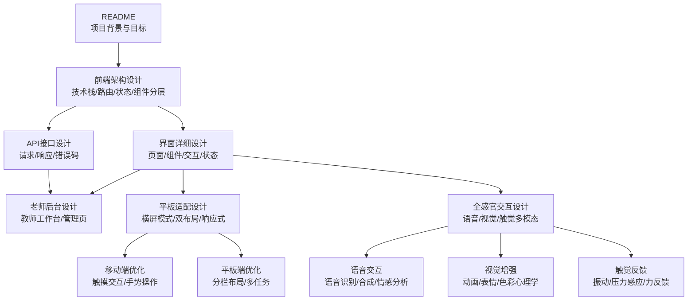

**图表来源**
- [README.md](file://README.md)
- [design/17_前端架构设计.md](file://design/17_前端架构设计.md)
- [design/19_界面详细设计.md](file://design/19_界面详细设计.md)
- [design/16_API接口设计.md](file://design/16_API接口设计.md)
- [design/05_老师后台设计.md](file://design/05_老师后台设计.md)
- [design/17_学生端全感官交互设计方案.md](file://design/17_学生端全感官交互设计方案.md)

**章节来源**
- [README.md](file://README.md)
- [design/17_前端架构设计.md](file://design/17_前端架构设计.md)
- [design/19_界面详细设计.md](file://design/19_界面详细设计.md)
- [design/16_API接口设计.md](file://design/16_API接口设计.md)
- [design/05_老师后台设计.md](file://design/05_老师后台设计.md)
- [design/17_学生端全感官交互设计方案.md](file://design/17_学生端全感官交互设计方案.md)

## 核心组件
围绕三类用户角色，界面由以下核心组件构成：
- 学生端
  - 首页/仪表盘：任务概览、进度、提醒入口
  - 咨询对话页：会话列表、消息流、输入区、快捷提示
  - 测评与量表：量表选择、作答、结果展示
  - 预约与日程：时间槽选择、确认、变更与取消
  - 个人中心：资料编辑、隐私设置、通知偏好
- 教师端
  - 工作台：待办、预警、今日安排
  - 学生管理：列表、详情、标签、备注
  - 报告中心：量表报告、趋势图、导出
  - 排班与资源：时段管理、教室/线上会议室
- 管理员端（如适用）
  - 学校/班级/角色权限配置
  - 全局指标看板与审计日志

上述组件的职责边界清晰，遵循"页面级容器 + 业务组件 + 基础组件"的分层原则，便于复用与维护。

**更新** 新增全感官交互组件：
- 语音同意对话框：语音功能使用前获取用户授权
- 情感可视化组件：实时显示用户情绪状态
- 多模态输入组件：支持文本、语音、表情混合输入
- 触觉反馈管理器：统一处理设备振动和力反馈

**章节来源**
- [design/19_界面详细设计.md](file://design/19_界面详细设计.md)
- [design/05_老师后台设计.md](file://design/05_老师后台设计.md)
- [design/17_学生端全感官交互设计方案.md](file://design/17_学生端全感官交互设计方案.md)

## 架构总览
界面层通过统一的前端架构组织，按角色划分路由与菜单；数据访问通过API层封装，保证一致的请求/响应与错误处理模型。

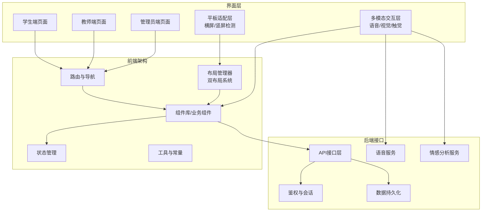

**图表来源**
- [design/17_前端架构设计.md](file://design/17_前端架构设计.md)
- [design/16_API接口设计.md](file://design/16_API接口设计.md)
- [design/17_学生端全感官交互设计方案.md](file://design/17_学生端全感官交互设计方案.md)

## 全感官交互设计

### 多模态交互架构
学生端全感官交互设计基于多模态输入输出架构，支持语音、视觉、触觉等多种交互方式的无缝集成：

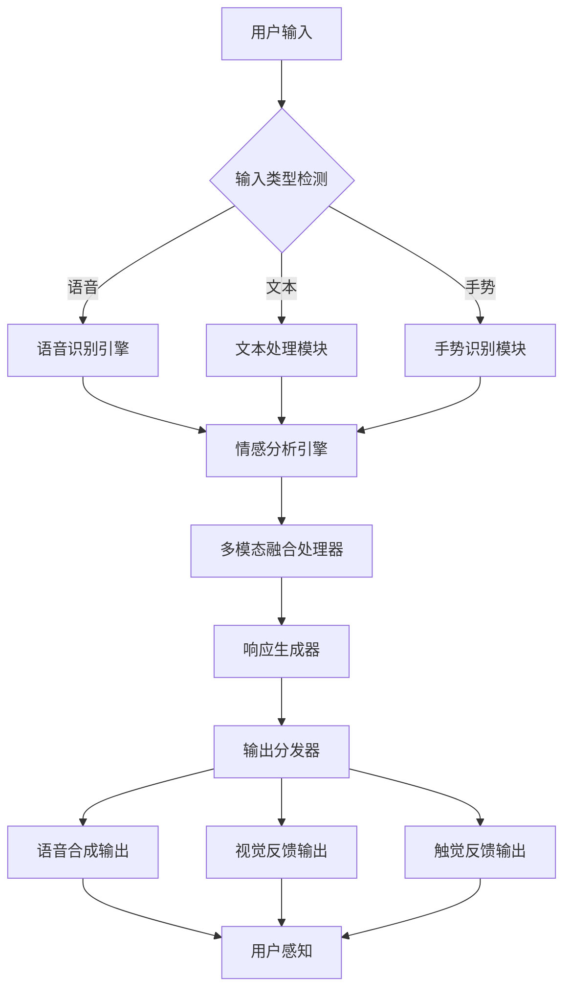

**图表来源**
- [design/17_学生端全感官交互设计方案.md](file://design/17_学生端全感官交互设计方案.md)

### 语音交互设计规范
语音交互作为全感官体验的核心组成部分，需要遵循严格的交互规范：

#### 语音同意机制
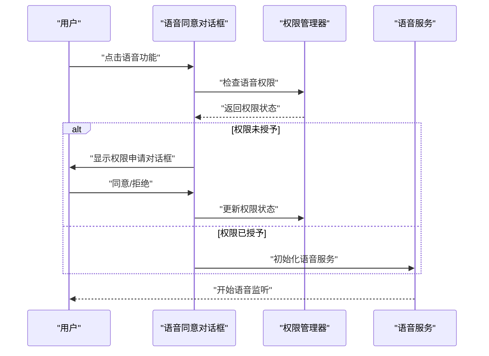

#### 语音情感分析
- **实时情感检测**：通过分析语音语调、语速、音量等特征识别用户情绪状态
- **多维度情感映射**：将语音特征映射到具体的情感维度（快乐、悲伤、愤怒、焦虑等）
- **自适应响应**：根据情感状态调整AI助手的回应方式和语气

### 视觉增强设计
视觉层面通过动画、色彩、表情等元素增强用户体验：

#### 情感可视化
- **动态表情符号**：根据用户情感状态显示相应的表情动画
- **色彩心理学应用**：使用不同颜色传达不同的情感氛围
- **微交互动画**：提供流畅的过渡动画和即时反馈

#### 界面响应性
- **情感驱动的主题切换**：根据用户情绪自动调整界面主题色
- **动态布局调整**：根据情感强度调整信息密度和布局复杂度
- **注意力引导**：通过视觉焦点引导用户关注重要信息

### 触觉反馈机制
触觉反馈为用户提供物理层面的交互体验：

#### 振动模式设计
- **情感反馈振动**：不同情感状态对应不同的振动模式
- **操作确认振动**：关键操作的触觉确认反馈
- **渐进式振动**：根据情感强度调整振动频率和幅度

#### 力反馈支持
- **压力感应输入**：支持长按力度感应的交互方式
- **阻力模拟**：在虚拟操作中模拟真实的物理阻力感

**章节来源**
- [design/17_学生端全感官交互设计方案.md](file://design/17_学生端全感官交互设计方案.md)
- [frontend/student-h5/src/components/VoiceConsentDialog.jsx](file://frontend/student-h5/src/components/VoiceConsentDialog.jsx)

## 平板适配与双布局系统

### Android平板横屏模式专门布局优化
针对Android平板设备在横屏模式下的使用场景，系统实现了专门的布局优化方案：

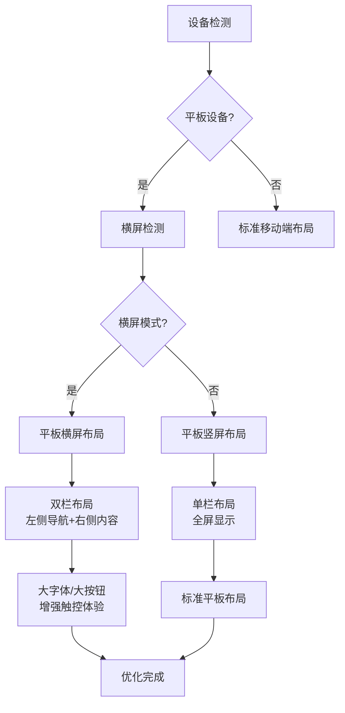

**图表来源**
- [frontend/student-h5/src/App.jsx](file://frontend/student-h5/src/App.jsx)
- [frontend/student-h5/src/index.css](file://frontend/student-h5/src/index.css)

### 双布局系统设计
系统采用双布局架构，根据设备类型和屏幕方向动态切换：

| 布局类型 | 适用设备 | 屏幕方向 | 主要特点 |
|---------|---------|---------|---------|
| 移动端布局 | 手机设备 | 竖屏为主 | 单栏设计、底部导航、全屏内容 |
| 平板端布局 | 平板设备 | 横竖屏自适应 | 双栏设计、侧边导航、分屏显示 |

**平板端布局特性：**
- **横屏模式**：左侧导航栏(宽度25%) + 右侧内容区(宽度75%)
- **竖屏模式**：顶部导航 + 全屏内容区，支持手势展开侧边栏
- **分栏功能**：支持左右分栏显示对话历史和当前对话
- **拖拽调整**：支持用户自定义分栏比例

### 情感选择组件的平板适配方案
情感选择组件针对平板设备进行了专门的适配优化：

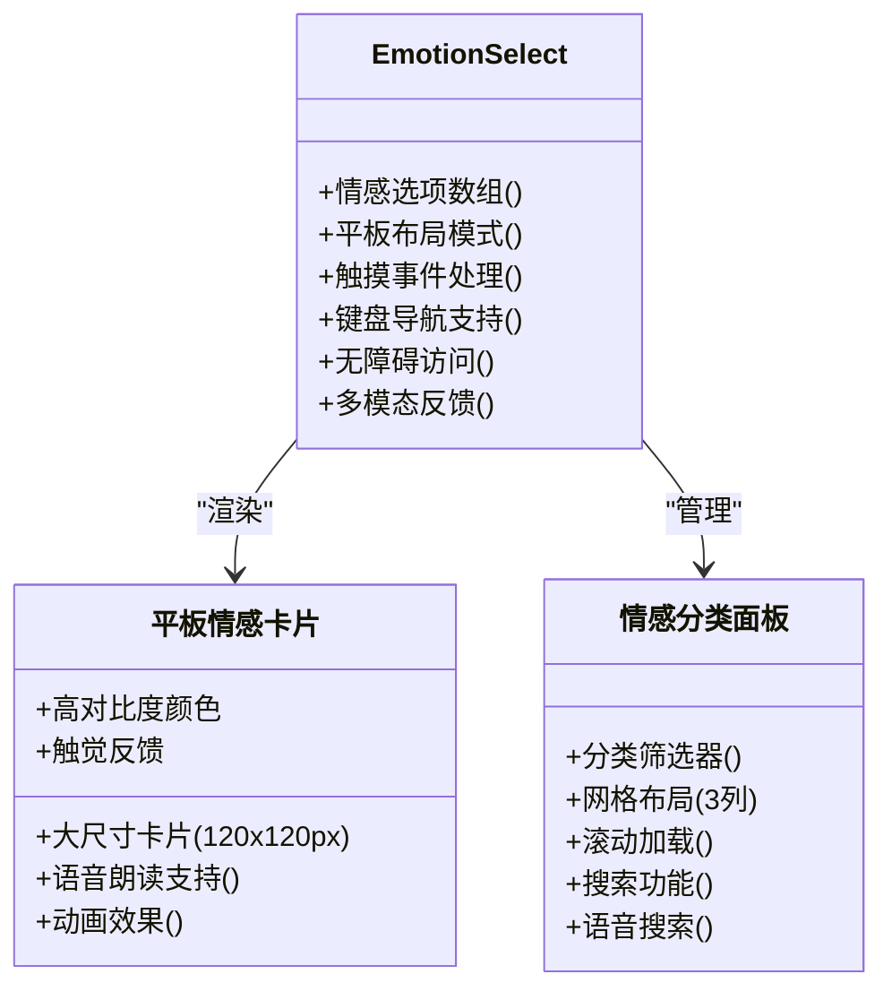

**平板端情感选择优化：**
- **大尺寸卡片**：每个情感选项卡片尺寸为120x120像素，便于触摸操作
- **网格布局**：平板横屏模式下采用3列网格布局，充分利用屏幕空间
- **增强的视觉反馈**：选中状态使用明显的边框变化和阴影效果
- **手势支持**：支持滑动浏览情感选项，双击快速选择
- **键盘导航**：完整的键盘导航支持，Tab键切换，Enter键选择
- **多模态反馈**：结合视觉、听觉、触觉多重反馈机制

**章节来源**
- [frontend/student-h5/src/components/EmotionSelect.jsx](file://frontend/student-h5/src/components/EmotionSelect.jsx)
- [frontend/student-h5/src/index.css](file://frontend/student-h5/src/index.css)

### 聊天室组件的平板优化布局
聊天室组件在平板设备上实现了专门的优化布局：

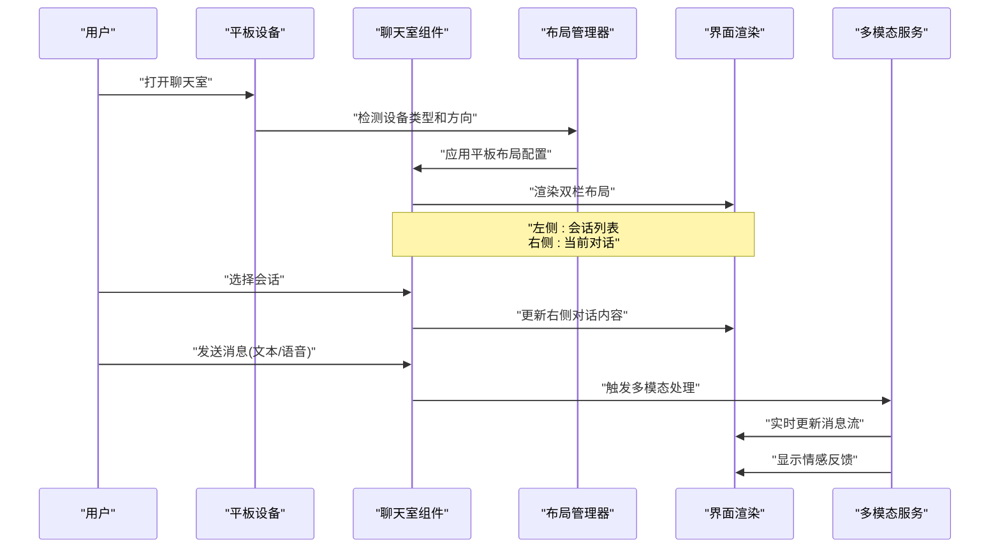

**平板端聊天室优化特性：**
- **双栏布局**：左侧显示会话列表(宽度30%)，右侧显示当前对话(宽度70%)
- **响应式切换**：小屏幕平板自动切换为单栏模式，通过手势切换视图
- **消息预览**：平板横屏模式下，会话列表显示消息预览和时间戳
- **快捷操作**：支持长按会话进行快速操作(删除、置顶、标记已读)
- **分屏支持**：支持Android分屏模式，同时查看多个对话
- **多模态输入**：支持文本、语音、表情混合输入方式

**章节来源**
- [frontend/student-h5/src/components/ChatRoom.jsx](file://frontend/student-h5/src/components/ChatRoom.jsx)

### 移动端和平板端差异化交互体验设计

#### 触摸交互差异
| 交互类型 | 移动端 | 平板端 |
|---------|--------|--------|
| 点击区域 | 最小44x44像素 | 最小60x60像素 |
| 滑动距离 | 短距离滑动(50px+) | 长距离滑动(100px+) |
| 双击缩放 | 禁用 | 可选启用 |
| 长按操作 | 弹出上下文菜单 | 显示操作面板 |
| 手势识别 | 基础手势 | 高级手势组合 |
| 触觉反馈 | 基础振动 | 复杂振动模式 |

#### 布局适配策略
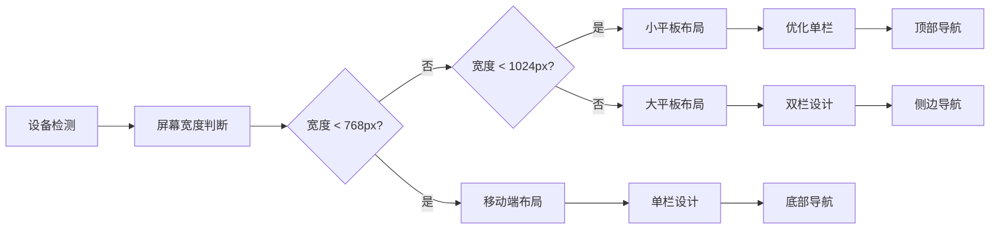

#### 性能优化策略
- **移动端**：优先加载关键资源，减少内存占用
- **平板端**：预加载常用数据，利用更大的屏幕空间展示更多信息
- **网络优化**：平板端支持更高质量图片，移动端使用压缩图片
- **存储策略**：平板端缓存更多历史数据，移动端按需加载
- **多模态优化**：根据设备能力动态调整多模态功能的复杂度

**章节来源**
- [frontend/student-h5/src/App.jsx](file://frontend/student-h5/src/App.jsx)
- [frontend/student-h5/src/index.css](file://frontend/student-h5/src/index.css)

## 详细组件分析

### 学生端：咨询对话页
该页面承载核心交互，包括会话列表、消息流渲染、输入与发送、快捷提示、附件上传、异常提示等。

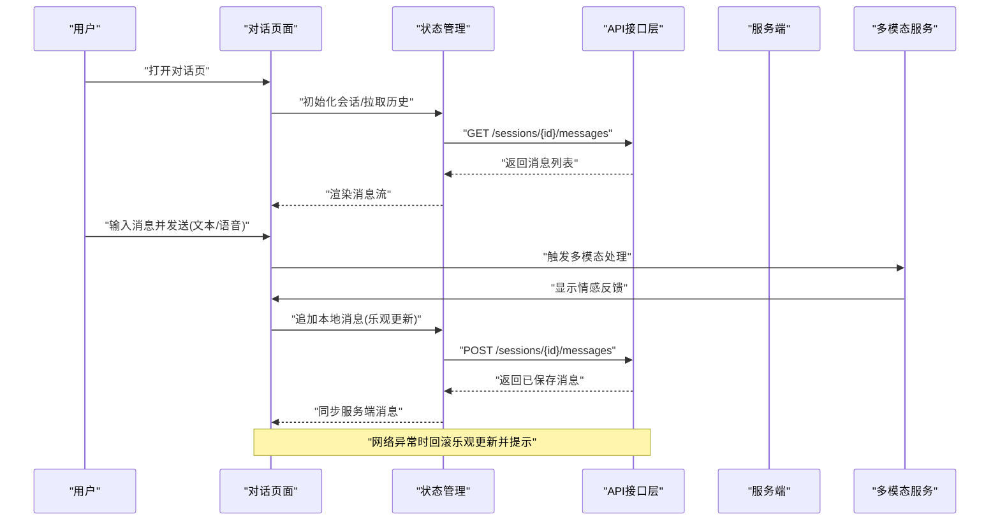

**更新** 平板端对话页新增：
- 双栏布局：左侧会话列表，右侧对话内容
- 分屏模式：支持同时查看多个对话
- 增强的输入体验：大键盘、语音输入、表情面板
- 多模态反馈：结合视觉、听觉、触觉的即时反馈
- 情感可视化：实时显示对话情感变化趋势

**图表来源**
- [design/19_界面详细设计.md](file://design/19_界面详细设计.md)
- [design/16_API接口设计.md](file://design/16_API接口设计.md)
- [design/17_学生端全感官交互设计方案.md](file://design/17_学生端全感官交互设计方案.md)

**章节来源**
- [design/19_界面详细设计.md](file://design/19_界面详细设计.md)
- [design/16_API接口设计.md](file://design/16_API接口设计.md)
- [design/17_学生端全感官交互设计方案.md](file://design/17_学生端全感官交互设计方案.md)

### 学生端：测评与量表
量表流程包含选择、作答、校验、提交与结果展示，需支持中断续答与草稿保存。

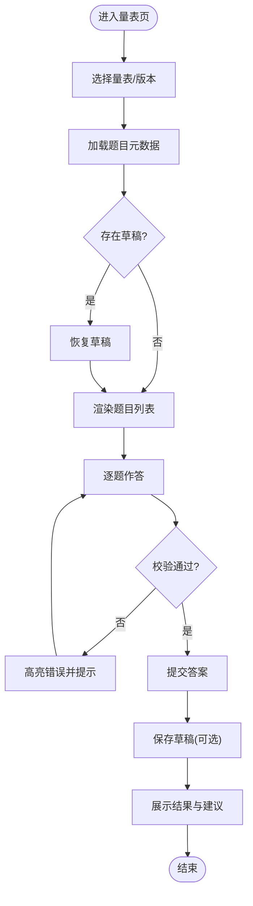

**更新** 平板端量表页面优化：
- 大字体显示：题目和选项字号增大至18px
- 进度指示：顶部显示答题进度条
- 批量操作：支持多选跳过、批量标记
- 结果可视化：平板端展示更丰富的图表分析
- 多感官反馈：答题过程中的触觉和视觉反馈
- 语音辅助：支持语音朗读题目和选项

**图表来源**
- [design/19_界面详细设计.md](file://design/19_界面详细设计.md)

**章节来源**
- [design/19_界面详细设计.md](file://design/19_界面详细设计.md)

### 教师端：工作台与预警
教师工作台聚合待办、预警、日程与快捷操作，强调信息密度与可操作性。

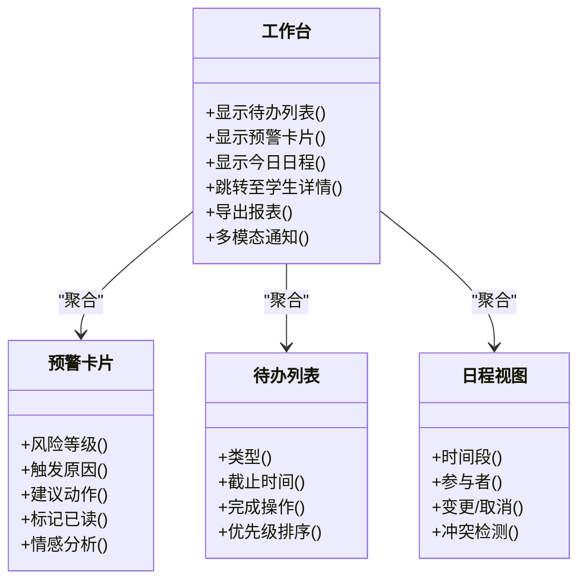

**更新** 平板端教师工作台新增：
- 仪表板布局：多卡片并排显示关键指标
- 拖拽排序：支持自定义工作区布局
- 批量操作：支持批量处理待办事项
- 实时协作：多人协同编辑和评论功能
- 多模态监控：结合视觉、听觉、触觉的综合监控界面

**图表来源**
- [design/05_老师后台设计.md](file://design/05_老师后台设计.md)
- [design/19_界面详细设计.md](file://design/19_界面详细设计.md)

**章节来源**
- [design/05_老师后台设计.md](file://design/05_老师后台设计.md)
- [design/19_界面详细设计.md](file://design/19_界面详细设计.md)

### 通用：登录与权限控制
不同角色的页面与能力受权限控制，界面需在未授权时提供清晰的引导与降级体验。

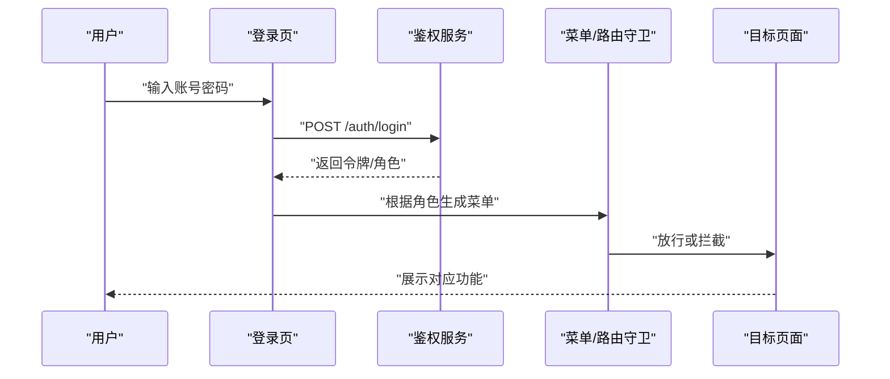

**更新** 平板端登录体验优化：
- 大字体输入框：便于平板设备输入
- 记住登录：支持生物识别登录(指纹/面部)
- 多账户切换：快速切换不同角色账户
- 离线登录：支持离线状态下的基本功能
- 多模态验证：支持语音、手势等多种验证方式

**图表来源**
- [design/16_API接口设计.md](file://design/16_API接口设计.md)
- [design/17_前端架构设计.md](file://design/17_前端架构设计.md)

**章节来源**
- [design/16_API接口设计.md](file://design/16_API接口设计.md)
- [design/17_前端架构设计.md](file://design/17_前端架构设计.md)

## 依赖分析
界面组件对前后端接口的依赖关系如下：
- 页面容器依赖路由与菜单配置
- 业务组件依赖状态管理与API封装
- 基础组件仅关注展示与交互，不直接访问网络
- 错误处理在API层统一收敛，界面层负责呈现

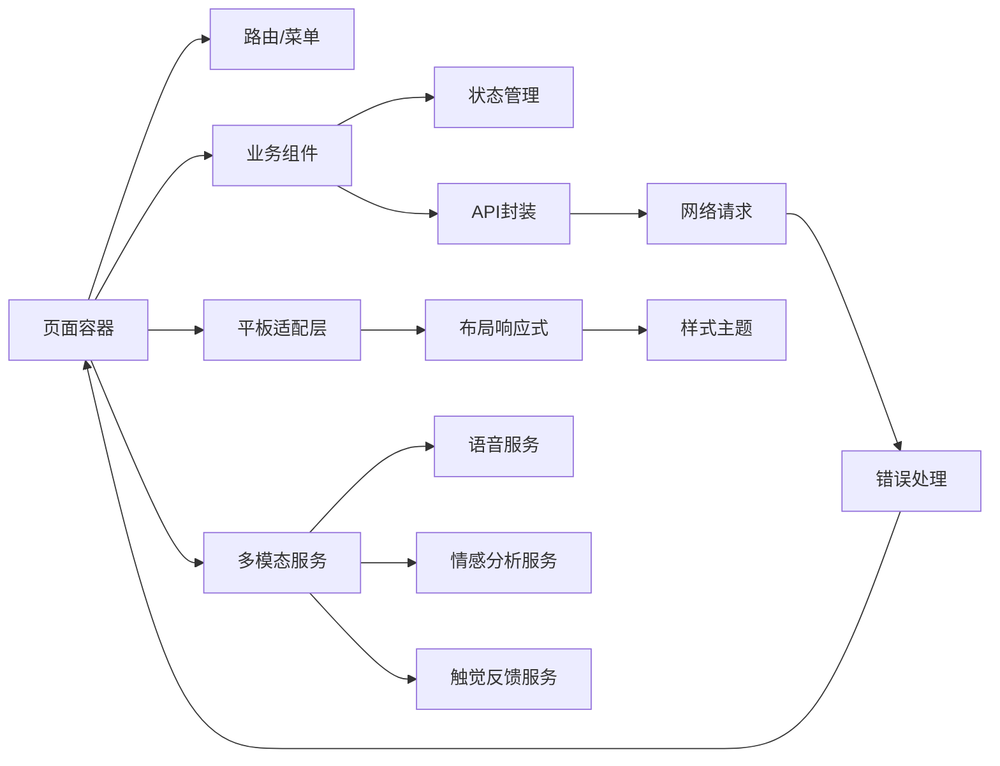

**更新** 新增多模态服务依赖：
- 语音服务：处理语音识别、合成和情感分析
- 情感分析服务：分析用户情感和意图
- 触觉反馈服务：统一管理设备的触觉反馈功能
- 多模态融合器：协调多种交互方式的同步和冲突解决

**图表来源**
- [design/17_前端架构设计.md](file://design/17_前端架构设计.md)
- [design/16_API接口设计.md](file://design/16_API接口设计.md)
- [design/17_学生端全感官交互设计方案.md](file://design/17_学生端全感官交互设计方案.md)

**章节来源**
- [design/17_前端架构设计.md](file://design/17_前端架构设计.md)
- [design/16_API接口设计.md](file://design/16_API接口设计.md)
- [design/17_学生端全感官交互设计方案.md](file://design/17_学生端全感官交互设计方案.md)

## 性能考虑
- 首屏优化：按需加载页面与组件，预取关键数据
- 列表与表格：虚拟滚动、分页与增量更新
- 图片与富文本：懒加载、压缩与缓存策略
- 长列表与消息流：分页加载、去抖与节流
- 离线与弱网：草稿自动保存、重试与友好提示

**更新** 平板端和多模态性能优化：
- **内存管理**：平板端增加内存监控，防止长时间运行导致内存泄漏
- **渲染优化**：使用React.memo和useMemo优化平板端组件重渲染
- **网络优化**：平板端支持HTTP/2和WebSocket连接池
- **存储优化**：IndexedDB缓存策略，支持离线数据同步
- **多模态优化**：异步处理多模态数据，避免阻塞主线程
- **资源管理**：智能卸载不使用的多模态服务，释放系统资源

## 故障排查指南
- 网络异常：统一错误码映射、重试策略与用户提示
- 表单校验：实时校验与批量校验结合，错误定位到字段
- 权限问题：无权限时的降级页面与申请入口
- 数据不一致：乐观更新失败的回滚与冲突解决提示
- 日志与埋点：关键路径埋点，便于复现与定位

**更新** 平板端和多模态特有故障排查：
- **布局错乱**：检查CSS媒体查询和设备检测逻辑
- **触摸事件失效**：验证touch事件监听器和preventDefault调用
- **横竖屏切换异常**：检查orientationchange事件处理和布局重置
- **性能问题**：监控平板端内存使用和CPU占用率
- **语音功能异常**：检查麦克风权限、音频格式支持和网络延迟
- **情感分析错误**：验证情感模型加载状态和分析算法准确性
- **触觉反馈失效**：测试设备振动功能和反馈模式兼容性

**章节来源**
- [design/16_API接口设计.md](file://design/16_API接口设计.md)
- [design/19_界面详细设计.md](file://design/19_界面详细设计.md)
- [design/17_学生端全感官交互设计方案.md](file://design/17_学生端全感官交互设计方案.md)

## 结论
本界面详细设计以学生、教师与管理者为核心视角，明确了页面职责、组件边界、交互流程与数据契约。通过统一的前端架构与API约定，确保界面的一致性与可维护性。新增的平板适配方案和双布局系统进一步提升了多设备用户体验。引入的全感官交互设计为用户提供了更加丰富和自然的交互体验，特别是在情感分析和多模态反馈方面的创新应用。后续可在实际开发中逐步完善交互细节与视觉规范，并持续收集反馈进行迭代优化。

**更新** 全感官交互设计的引入使得系统能够更好地服务于多样化的用户需求，通过语音、视觉、触觉等多模态的有机结合，显著提升了用户体验的沉浸感和自然度。这一设计理念特别适用于心理健康咨询场景，能够为用户提供更加贴心和个性化的服务体验。

## 附录
- 术语表：会话、量表、预警、工作台等
- 参考链接：前端架构设计与API接口设计文档
- **新增** 平板适配指南：设备兼容性矩阵、测试清单、性能基准
- **新增** 全感官交互指南：多模态设计规范、情感分析标准、触觉反馈协议

**更新** 新增全感官交互相关术语：
- **多模态交互**：结合多种感官通道的交互方式
- **情感分析**：通过分析用户行为数据识别情感状态
- **触觉反馈**：通过振动、压力等物理反馈增强交互体验
- **语音情感识别**：通过分析语音特征识别用户情感
- **多模态融合**：协调多种交互方式的同步和一致性
