# 端到端流程设计

<cite>
**本文引用的文件**   
- [README.md](file://README.md)
- [STRUCTURE.md](file://STRUCTURE.md)
- [design/12_技术架构.md](file://design/12_技术架构.md)
- [design/13_Agent工作流.md](file://design/13_Agent工作流.md)
- [design/16_API接口设计.md](file://design/16_API接口设计.md)
- [design/17_前端架构设计.md](file://design/17_前端架构设计.md)
- [design/08_MVP最小可行版本.md](file://design/08_MVP最小可行版本.md)
- [design/05_老师后台设计.md](file://design/05_老师后台设计.md)
- [design/04_风险识别规则库.md](file://design/04_风险识别规则库.md)
- [design/19_界面详细设计.md](file://design/19_界面详细设计.md)
- [design/07_SaaS多学校隔离架构.md](file://design/07_SaaS多学校隔离架构.md)
- [scripts/create_agent_workflow_doc.js](file://scripts/create_agent_workflow_doc.js)
</cite>

## 目录
1. [引言](#引言)
2. [项目结构](#项目结构)
3. [核心组件](#核心组件)
4. [架构总览](#架构总览)
5. [详细组件分析](#详细组件分析)
6. [依赖分析](#依赖分析)
7. [性能考虑](#性能考虑)
8. [故障排查指南](#故障排查指南)
9. [结论](#结论)
10. [附录](#附录)

## 引言
本文件聚焦“端到端流程设计”，从用户发起咨询到AI Agent处理、风险控制、人工介入与结果反馈的全链路进行系统化说明。文档以设计文档为依据，结合前后端交互、Agent工作流、API契约与界面交互，给出可落地的流程图与时序图，帮助读者快速理解系统如何协同完成一次完整的心理咨询服务闭环。

## 项目结构
仓库采用“设计先行”的组织方式，核心流程相关的设计文档集中在 design 目录下；脚本用于生成或辅助维护部分文档；测试与临时目录保留在根级便于工程化使用。整体结构强调：
- 设计文档分层：技术架构、Agent工作流、API契约、前端架构、MVP范围、风险规则、SaaS隔离等
- 脚本工具：自动化生成或更新特定文档（如Agent工作流）
- 测试与临时目录：为后续工程化与迭代预留

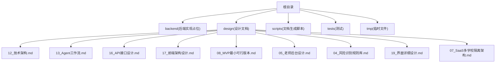

图表来源
- [design/12_技术架构.md](file://design/12_技术架构.md)
- [design/13_Agent工作流.md](file://design/13_Agent工作流.md)
- [design/16_API接口设计.md](file://design/16_API接口设计.md)
- [design/17_前端架构设计.md](file://design/17_前端架构设计.md)
- [design/08_MVP最小可行版本.md](file://design/08_MVP最小可行版本.md)
- [design/05_老师后台设计.md](file://design/05_老师后台设计.md)
- [design/04_风险识别规则库.md](file://design/04_风险识别规则库.md)
- [design/19_界面详细设计.md](file://design/19_界面详细设计.md)
- [design/07_SaaS多学校隔离架构.md](file://design/07_SaaS多学校隔离架构.md)

章节来源
- [README.md](file://README.md)
- [STRUCTURE.md](file://STRUCTURE.md)

## 核心组件
围绕端到端流程，关键组件包括：
- 前端应用：负责用户交互、会话展示、状态同步与错误提示
- API网关与服务层：统一入口、鉴权、路由、限流、审计
- Agent编排引擎：任务分解、策略选择、记忆与上下文管理、工具调用
- 风控与合规：风险识别、告警、升级策略、留痕
- 人工干预通道：教师/咨询师工作台、转交与协作
- 数据与存储：会话记录、知识库、指标与日志

这些组件通过明确定义的API契约与事件流协作，形成“请求-处理-决策-反馈”的闭环。

章节来源
- [design/12_技术架构.md](file://design/12_技术架构.md)
- [design/13_Agent工作流.md](file://design/13_Agent工作流.md)
- [design/16_API接口设计.md](file://design/16_API接口设计.md)
- [design/17_前端架构设计.md](file://design/17_前端架构设计.md)
- [design/04_风险识别规则库.md](file://design/04_风险识别规则库.md)
- [design/05_老师后台设计.md](file://design/05_老师后台设计.md)

## 架构总览
下图展示了端到端主流程的关键参与方与交互顺序：用户在前端发起对话，API网关校验并路由至Agent编排引擎；Agent根据策略调用工具与知识库，过程中触发风控评估；必要时升级到人工；最终将结果返回前端呈现。

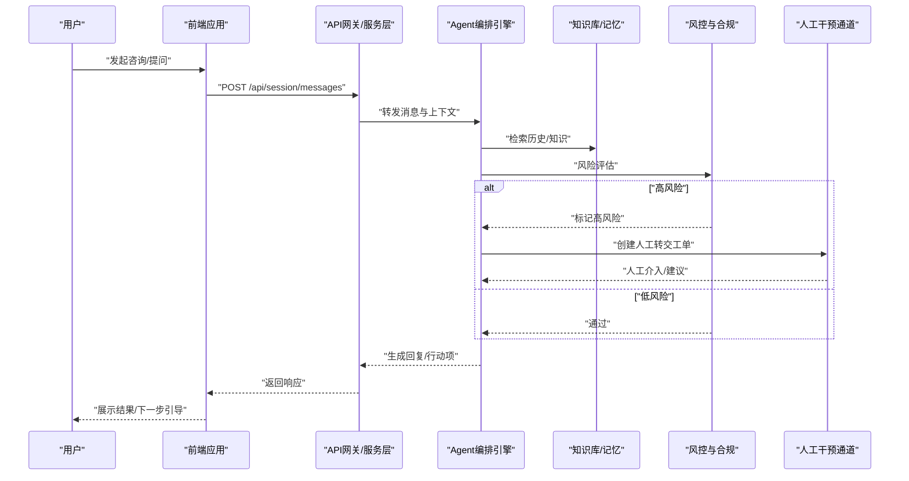

图表来源
- [design/16_API接口设计.md](file://design/16_API接口设计.md)
- [design/13_Agent工作流.md](file://design/13_Agent工作流.md)
- [design/04_风险识别规则库.md](file://design/04_风险识别规则库.md)
- [design/05_老师后台设计.md](file://design/05_老师后台设计.md)

## 详细组件分析

### 用户侧端到端流程（前端→网关→Agent→风控→人工→前端）
该流程覆盖从用户输入到结果展示的完整路径，包含异常分支与重试机制。

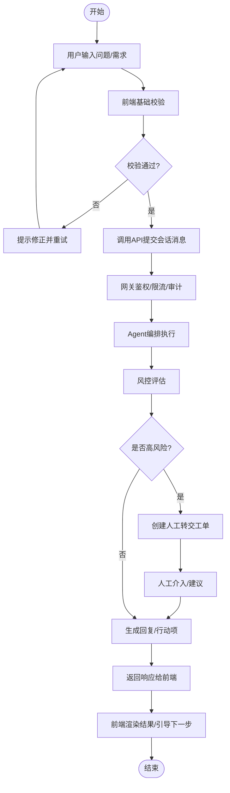

图表来源
- [design/17_前端架构设计.md](file://design/17_前端架构设计.md)
- [design/16_API接口设计.md](file://design/16_API接口设计.md)
- [design/13_Agent工作流.md](file://design/13_Agent工作流.md)
- [design/04_风险识别规则库.md](file://design/04_风险识别规则库.md)
- [design/05_老师后台设计.md](file://design/05_老师后台设计.md)

章节来源
- [design/17_前端架构设计.md](file://design/17_前端架构设计.md)
- [design/16_API接口设计.md](file://design/16_API接口设计.md)
- [design/13_Agent工作流.md](file://design/13_Agent工作流.md)
- [design/04_风险识别规则库.md](file://design/04_风险识别规则库.md)
- [design/05_老师后台设计.md](file://design/05_老师后台设计.md)

### Agent工作流与策略选择
Agent负责将用户意图拆解为可执行步骤，动态选择策略与工具，维护上下文与记忆，并在必要时触发外部能力（如知识库检索、量表评估、预约提醒等）。

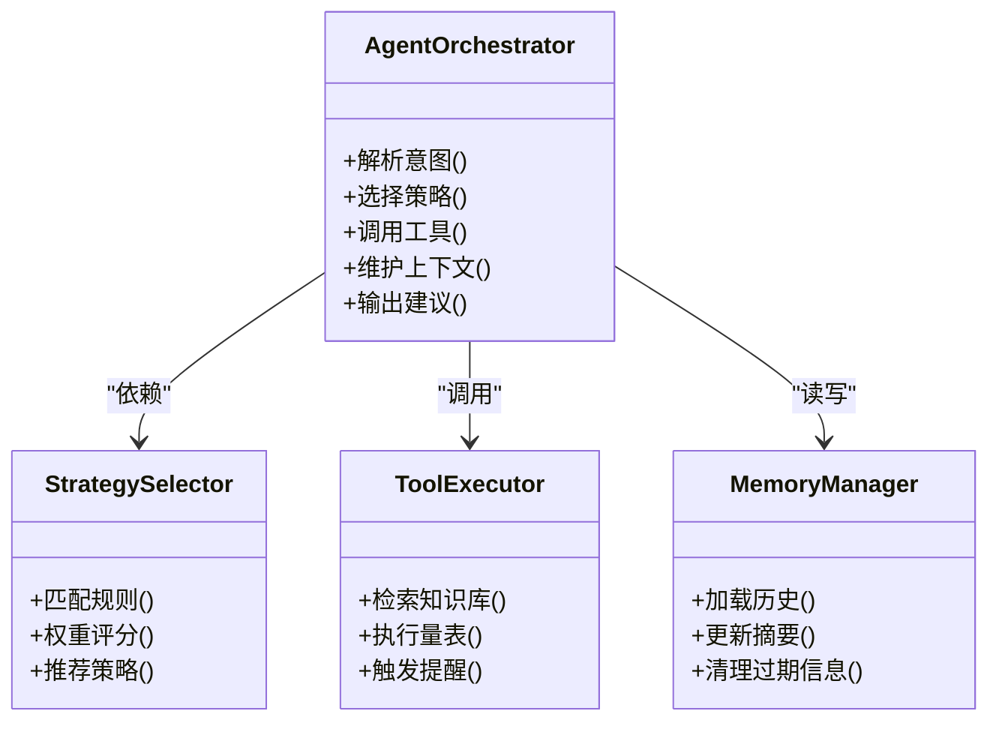

图表来源
- [design/13_Agent工作流.md](file://design/13_Agent工作流.md)

章节来源
- [design/13_Agent工作流.md](file://design/13_Agent工作流.md)

### 风控与合规流程
风控贯穿对话全生命周期，依据规则库对敏感词、情绪倾向、自伤/他伤信号等进行识别与分级，并决定是否需要人工介入或阻断。

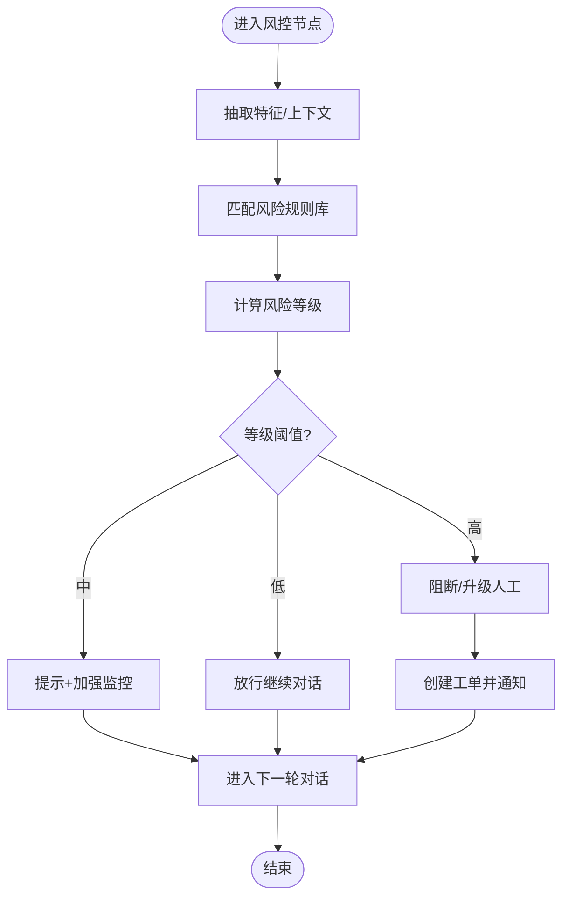

图表来源
- [design/04_风险识别规则库.md](file://design/04_风险识别规则库.md)

章节来源
- [design/04_风险识别规则库.md](file://design/04_风险识别规则库.md)

### 人工干预与教师后台
当风控判定为高风险或用户主动要求时，系统自动创建工单并推送至教师/咨询师后台，支持查看上下文、补充建议、一键回传策略，确保服务连续性与安全性。

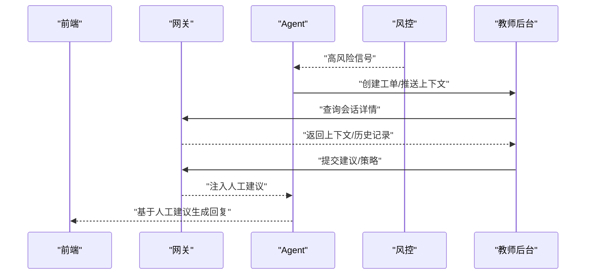

图表来源
- [design/05_老师后台设计.md](file://design/05_老师后台设计.md)
- [design/16_API接口设计.md](file://design/16_API接口设计.md)
- [design/13_Agent工作流.md](file://design/13_Agent工作流.md)

章节来源
- [design/05_老师后台设计.md](file://design/05_老师后台设计.md)
- [design/16_API接口设计.md](file://design/16_API接口设计.md)
- [design/13_Agent工作流.md](file://design/13_Agent工作流.md)

### API契约与数据交换
端到端流程依赖稳定的API契约，包括会话消息、工单管理、策略注入、状态查询等。为保证一致性，所有接口需遵循统一的鉴权、分页、错误码与审计规范。

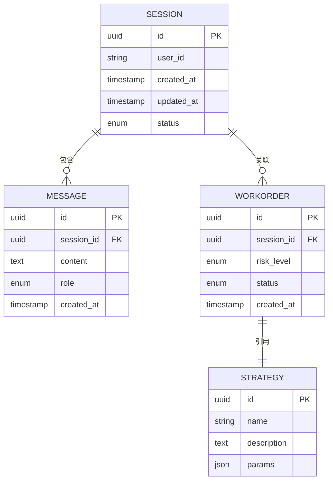

图表来源
- [design/16_API接口设计.md](file://design/16_API接口设计.md)

章节来源
- [design/16_API接口设计.md](file://design/16_API接口设计.md)

### 前端交互与界面细节
前端负责会话列表、聊天窗口、风险提示、人工转交入口与操作反馈。界面设计需保证可读性、可访问性与一致性，并提供清晰的错误提示与重试路径。

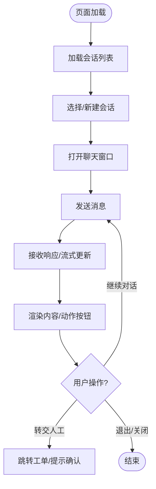

图表来源
- [design/19_界面详细设计.md](file://design/19_界面详细设计.md)
- [design/17_前端架构设计.md](file://design/17_前端架构设计.md)

章节来源
- [design/19_界面详细设计.md](file://design/19_界面详细设计.md)
- [design/17_前端架构设计.md](file://design/17_前端架构设计.md)

### SaaS多学校隔离与租户边界
在多租户场景下，会话、工单、策略与日志均需按租户隔离，确保数据安全与合规。端到端流程需在网关层与Agent层同时考虑租户上下文传递与权限控制。

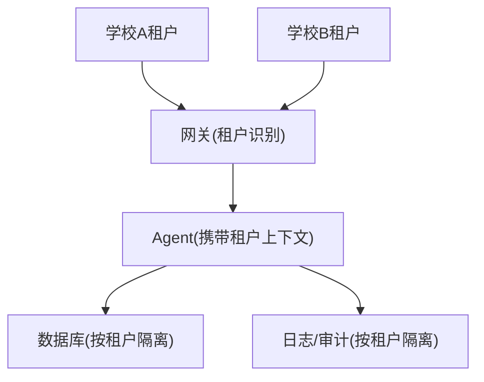

图表来源
- [design/07_SaaS多学校隔离架构.md](file://design/07_SaaS多学校隔离架构.md)

章节来源
- [design/07_SaaS多学校隔离架构.md](file://design/07_SaaS多学校隔离架构.md)

### MVP范围与里程碑
MVP聚焦核心闭环：会话消息、基础Agent策略、最低可用风控与人工转交。通过分阶段交付验证端到端流程的可行性与稳定性。

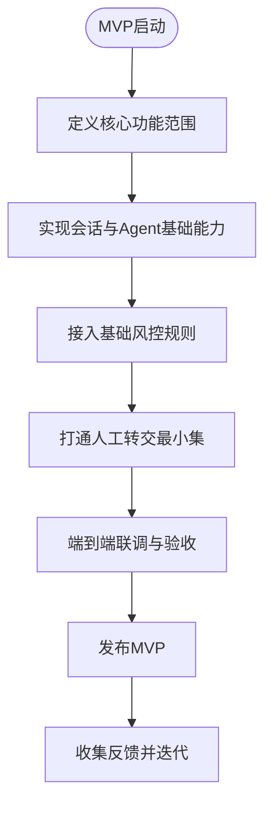

图表来源
- [design/08_MVP最小可行版本.md](file://design/08_MVP最小可行版本.md)

章节来源
- [design/08_MVP最小可行版本.md](file://design/08_MVP最小可行版本.md)

## 依赖分析
端到端流程涉及多层依赖关系：前端依赖API契约，网关依赖鉴权与限流，Agent依赖策略与工具，风控依赖规则库，人工后台依赖工单与上下文数据。以下图展示主要依赖方向。

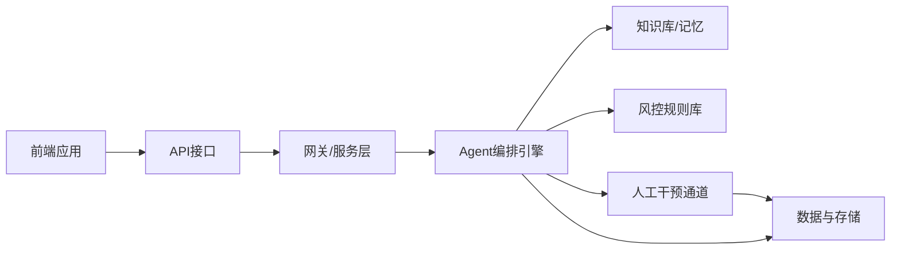

图表来源
- [design/12_技术架构.md](file://design/12_技术架构.md)
- [design/13_Agent工作流.md](file://design/13_Agent工作流.md)
- [design/16_API接口设计.md](file://design/16_API接口设计.md)
- [design/04_风险识别规则库.md](file://design/04_风险识别规则库.md)
- [design/05_老师后台设计.md](file://design/05_老师后台设计.md)

章节来源
- [design/12_技术架构.md](file://design/12_技术架构.md)
- [design/13_Agent工作流.md](file://design/13_Agent工作流.md)
- [design/16_API接口设计.md](file://design/16_API接口设计.md)
- [design/04_风险识别规则库.md](file://design/04_风险识别规则库.md)
- [design/05_老师后台设计.md](file://design/05_老师后台设计.md)

## 性能考虑
- 流式响应：前端逐步渲染，降低首屏延迟
- 缓存与记忆：会话摘要与高频知识缓存，减少重复检索
- 异步与批处理：非关键路径（如审计、指标上报）异步执行
- 限流与熔断：网关层保护后端与Agent资源
- 幂等与重试：消息提交与策略注入具备幂等性，失败可安全重试

[本节为通用指导，不直接分析具体文件]

## 故障排查指南
- 网络与鉴权：检查网关鉴权、令牌有效期、跨域配置
- 会话状态：核对会话ID、消息角色、状态机转换
- Agent策略：查看策略匹配日志、工具调用结果与超时
- 风控误报：复核规则阈值、上下文片段与特征抽取
- 人工转交：确认工单创建、通知推送与回写策略
- 前端渲染：检查流式更新、错误提示与重试按钮

章节来源
- [design/16_API接口设计.md](file://design/16_API接口设计.md)
- [design/13_Agent工作流.md](file://design/13_Agent工作流.md)
- [design/04_风险识别规则库.md](file://design/04_风险识别规则库.md)
- [design/05_老师后台设计.md](file://design/05_老师后台设计.md)

## 结论
端到端流程以“用户-前端-网关-Agent-风控-人工-数据”为主线，通过明确的API契约与策略编排，实现安全、可控且可扩展的心理咨询服务闭环。建议在MVP阶段优先验证核心路径与风控升级机制，随后逐步完善策略库、工具生态与多租户隔离能力。

[本节为总结性内容，不直接分析具体文件]

## 附录
- 文档生成脚本：用于自动化生成或更新Agent工作流等相关文档，提升文档与实现的一致性
- 参考清单：技术架构、Agent工作流、API接口、前端架构、MVP范围、风险规则、SaaS隔离、界面设计

章节来源
- [scripts/create_agent_workflow_doc.js](file://scripts/create_agent_workflow_doc.js)
- [design/12_技术架构.md](file://design/12_技术架构.md)
- [design/13_Agent工作流.md](file://design/13_Agent工作流.md)
- [design/16_API接口设计.md](file://design/16_API接口设计.md)
- [design/17_前端架构设计.md](file://design/17_前端架构设计.md)
- [design/08_MVP最小可行版本.md](file://design/08_MVP最小可行版本.md)
- [design/04_风险识别规则库.md](file://design/04_风险识别规则库.md)
- [design/07_SaaS多学校隔离架构.md](file://design/07_SaaS多学校隔离架构.md)
- [design/19_界面详细设计.md](file://design/19_界面详细设计.md)
