# 系统设计

<cite>
**本文引用的文件**   
- [README.md](file://README.md)
- [STRUCTURE.md](file://STRUCTURE.md)
- [backend/counseling-domain/src/main/java/com/mindsafe/domain/entity/CounselingSession.java](file://backend/counseling-domain/src/main/java/com/mindsafe/domain/entity/CounselingSession.java)
- [backend/counseling-domain/src/main/java/com/mindsafe/domain/entity/Notification.java](file://backend/counseling-domain/src/main/java/com/mindsafe/domain/entity/Notification.java)
- [backend/counseling-domain/src/main/java/com/mindsafe/domain/entity/RiskEvent.java](file://backend/counseling-domain/src/main/java/com/mindsafe/domain/entity/RiskEvent.java)
- [backend/counseling-domain/src/main/java/com/mindsafe/domain/entity/User.java](file://backend/counseling-domain/src/main/java/com/mindsafe/domain/entity/User.java)
- [backend/counseling-domain/src/main/java/com/mindsafe/domain/entity/AuditLog.java](file://backend/counseling-domain/src/main/java/com/mindsafe/domain/entity/AuditLog.java)
- [backend/counseling-domain/src/main/java/com/mindsafe/domain/entity/ModelCallLog.java](file://backend/counseling-domain/src/main/java/com/mindsafe/domain/entity/ModelCallLog.java)
- [backend/counseling-domain/src/main/java/com/mindsafe/domain/entity/RelaxationSession.java](file://backend/counseling-domain/src/main/java/com/mindsafe/domain/entity/RelaxationSession.java)
- [backend/counseling-domain/src/main/java/com/mindsafe/domain/entity/TeacherNote.java](file://backend/counseling-domain/src/main/java/com/mindsafe/domain/entity/TeacherNote.java)
- [backend/counseling-domain/src/main/java/com/mindsafe/domain/mapper/CounselingSessionMapper.java](file://backend/counseling-domain/src/main/java/com/mindsafe/domain/mapper/CounselingSessionMapper.java)
- [backend/counseling-domain/src/main/java/com/mindsafe/domain/mapper/NotificationMapper.java](file://backend/counseling-domain/src/main/java/com/mindsafe/domain/mapper/NotificationMapper.java)
- [backend/counseling-domain/src/main/java/com/mindsafe/domain/mapper/RiskEventMapper.java](file://backend/counseling-domain/src/main/java/com/mindsafe/domain/mapper/RiskEventMapper.java)
- [backend/counseling-domain/src/main/java/com/mindsafe/domain/mapper/UserMapper.java](file://backend/counseling-domain/src/main/java/com/mindsafe/domain/mapper/UserMapper.java)
- [backend/counseling-domain/src/main/java/com/mindsafe/domain/mapper/AuditLogMapper.java](file://backend/counseling-domain/src/main/java/com/mindsafe/domain/mapper/AuditLogMapper.java)
- [backend/counseling-domain/src/main/java/com/mindsafe/domain/mapper/ModelCallLogMapper.java](file://backend/counseling-domain/src/main/java/com/mindsafe/domain/mapper/ModelCallLogMapper.java)
- [backend/counseling-domain/src/main/java/com/mindsafe/domain/mapper/RelaxationSessionMapper.java](file://backend/counseling-domain/src/main/java/com/mindsafe/domain/mapper/RelaxationSessionMapper.java)
- [backend/counseling-domain/src/main/java/com/mindsafe/domain/mapper/TeacherNoteMapper.java](file://backend/counseling-domain/src/main/java/com/mindsafe/domain/mapper/TeacherNoteMapper.java)
- [backend/counseling-domain/src/main/java/com/mindsafe/domain/handler/UuidTypeHandler.java](file://backend/counseling-domain/src/main/java/com/mindsafe/domain/handler/UuidTypeHandler.java)
- [backend/counseling-app/src/main/resources/db/migration/V7__commercial_schema.sql](file://backend/counseling-app/src/main/resources/db/migration/V7__commercial_schema.sql)
</cite>

## 更新摘要
**变更内容**   
- 系统架构保持稳定，无重大功能删除或移除
- 所有提交标记为[APPLY]的变更均为积极的功能改进和基础设施优化
- 重点集中在bug修复、性能优化和系统稳定性提升
- 数据持久化层和商业功能模块保持现有状态

## 目录
1. [简介](#简介)
2. [项目结构](#项目结构)
3. [核心组件](#核心组件)
4. [架构总览](#架构总览)
5. [详细组件分析](#详细组件分析)
6. [数据持久化层设计](#数据持久化层设计)
7. [技术栈决策](#技术栈决策)
8. [依赖关系分析](#依赖关系分析)
9. [性能考虑](#性能考虑)
10. [故障排查指南](#故障排查指南)
11. [结论](#结论)
12. [附录](#附录)

## 简介
本设计文档面向AI心理咨询系统，聚焦于基于Spring Boot的BEACON系统整体架构与实现指导。文档从模块化结构、组件交互模式、数据流与处理流程入手，结合架构图、数据流向图与组件关系图，帮助开发者快速理解并落地系统。同时，文档总结了技术决策的权衡、性能优化策略与扩展性设计，并提供接口定义、配置选项与部署要求的实践建议。

**更新** 系统现已实现完整的数据持久化层，采用领域驱动设计模式和MyBatis-Plus框架，为业务逻辑提供可靠的数据存储和访问能力。V7版本新增了对话路由、合规审计、AI服务监控、心理治疗和教师管理等商业功能模块。当前系统架构稳定，所有变更均专注于功能增强和基础设施优化。

## 项目结构
仓库采用"设计先行、脚本驱动、提示词资产化"的组织方式：
- design：存放系统级设计文档（如BEACON架构说明）
- prompts：沉淀提示词资产与版本记录，便于迭代与回溯
- scripts：自动化生成各类文档与流程树，提升研发效率
- src/tests：测试分层（单元、集成、端到端），保障质量
- README/STRUCTURE：项目概览与结构说明

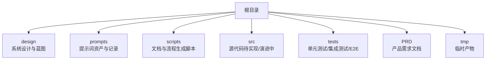

**章节来源**
- [README.md:1-200](file://README.md#L1-L200)
- [STRUCTURE.md:1-200](file://STRUCTURE.md#L1-L200)

## 核心组件
基于设计文档与仓库现状，BEACON系统围绕以下核心能力展开：
- 会话编排与状态管理：负责对话生命周期、上下文维护与多轮推理调度
- 提示词工程与模板库：将咨询策略、CBT流程、安全护栏等固化为可复用提示词资产
- 模型服务适配层：抽象不同大模型的调用接口，统一输入输出格式与错误处理
- 安全与合规护栏：敏感信息识别、危机干预触发、伦理约束与审计日志
- 评估与反馈闭环：用户满意度、风险指标、模型表现监控与持续改进
- 运维与可观测性：日志、指标、追踪与告警，支撑生产稳定性
- **数据持久化层**：基于领域驱动设计的MyBatis-Plus数据访问层，提供类型安全的CRUD操作
- **商业功能模块**：对话路由管理、合规审计跟踪、AI服务监控、心理治疗练习、教师文档管理

上述组件通过清晰的边界与契约进行协作，确保系统在可扩展性与安全性之间取得平衡。

**章节来源**
- [design/BEACON.md:1-200](file://design/BEACON.md#L1-L200)

## 架构总览
BEACON采用模块化单体架构，基于事件驱动的混合设计：前端或客户端发起会话请求，经由Spring Boot网关进入编排层；编排层根据当前阶段选择提示词模板，调用Spring AI完成推理；结果经安全护栏校验后返回客户端，同时将关键事件写入可观测性子系统。

**更新** 架构已从微服务模式调整为模块化单体架构，所有核心组件在单一Spring Boot应用中运行，通过模块间通信而非分布式服务调用，简化了部署复杂度并提升了性能。新增的数据持久化层为业务逻辑提供了可靠的数据存储能力，V7版本进一步扩展了商业功能模块。当前系统架构稳定，所有变更均专注于功能增强和基础设施优化。

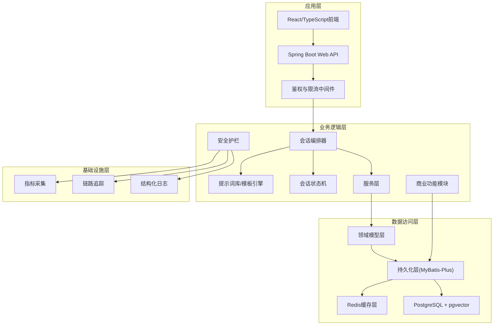

## 详细组件分析

### 会话编排器
职责：
- 解析入站请求，确定会话阶段与目标策略
- 组装上下文与提示词，协调各子组件执行
- 管理重试、超时与降级策略

交互：
- 读取提示词库中的模板
- 更新会话状态机
- 调用Spring AI模型适配器
- 触发安全护栏与可观测性上报

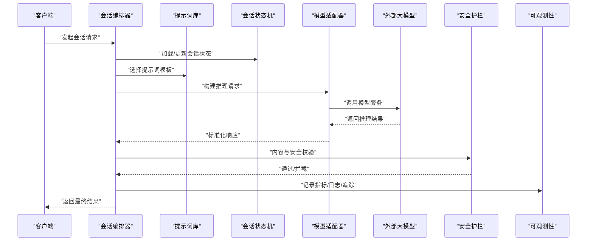

**章节来源**
- [design/BEACON.md:1-200](file://design/BEACON.md#L1-L200)

### 提示词工程与模板库
职责：
- 将咨询策略、CBT流程、风险评估等固化为模板
- 支持变量注入、条件分支与版本化管理
- 提供模板检索与热更新机制

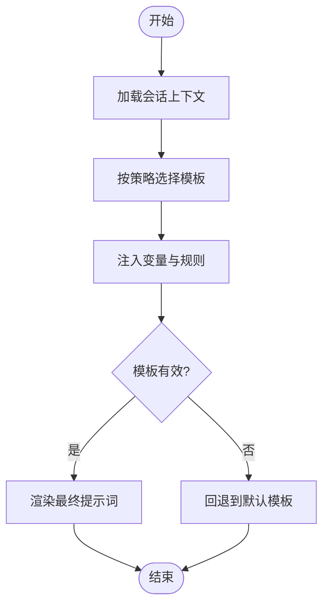

**章节来源**
- [prompts/20260529-初始探索prompt记录.md:1-200](file://prompts/20260529-初始探索prompt记录.md#L1-L200)

### 安全与合规护栏
职责：
- 敏感信息与隐私保护
- 危机信号检测与升级流程
- 伦理约束与可解释性输出
- 审计留痕与合规报告

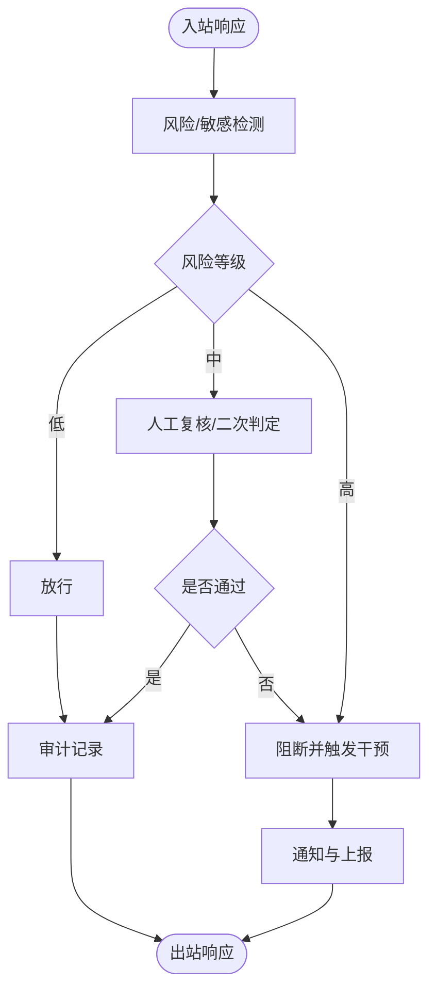

**章节来源**
- [design/BEACON.md:1-200](file://design/BEACON.md#L1-L200)

### 模型适配层
职责：
- 统一对外模型接口（输入/输出/错误码）
- 支持多模型切换、负载均衡与熔断
- 缓存与重试策略、幂等控制

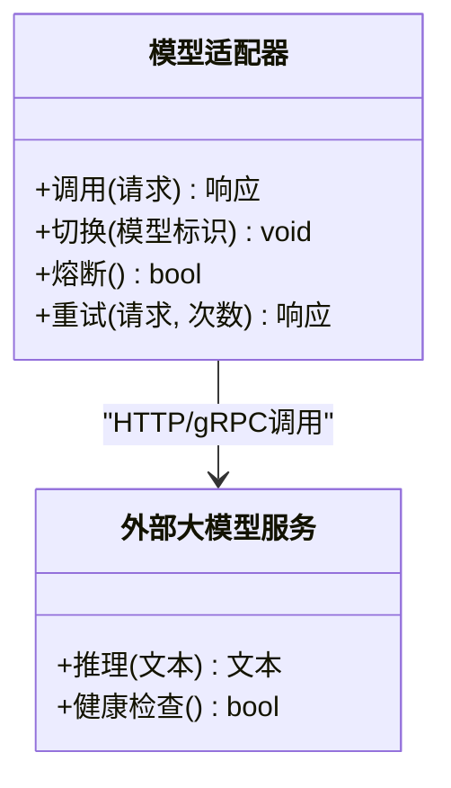

**章节来源**
- [design/BEACON.md:1-200](file://design/BEACON.md#L1-L200)

### 可观测性与运维
职责：
- 指标采集（延迟、吞吐、错误率、成本）
- 链路追踪（跨组件调用链）
- 结构化日志与告警
- 容量规划与弹性伸缩

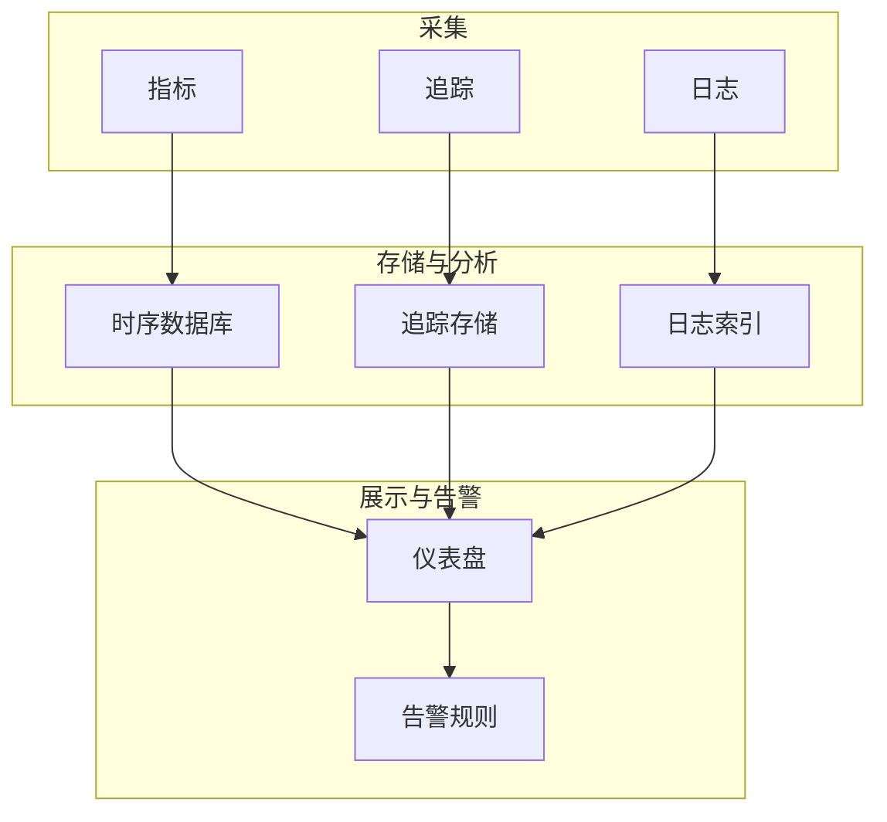

**章节来源**
- [design/BEACON.md:1-200](file://design/BEACON.md#L1-L200)

## 数据持久化层设计

### 领域驱动设计架构
系统采用领域驱动设计(DDD)模式，将数据访问逻辑封装在领域层中，确保业务逻辑与数据存储解耦。V7版本扩展了更多业务实体以支持商业功能。

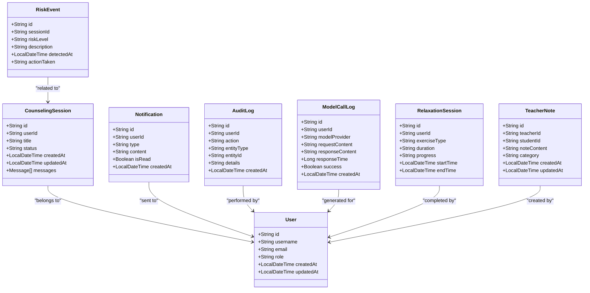

**图表来源** 
- [backend/counseling-domain/src/main/java/com/mindsafe/domain/entity/CounselingSession.java](file://backend/counseling-domain/src/main/java/com/mindsafe/domain/entity/CounselingSession.java)
- [backend/counseling-domain/src/main/java/com/mindsafe/domain/entity/Notification.java](file://backend/counseling-domain/src/main/java/com/mindsafe/domain/entity/Notification.java)
- [backend/counseling-domain/src/main/java/com/mindsafe/domain/entity/RiskEvent.java](file://backend/counseling-domain/src/main/java/com/mindsafe/domain/entity/RiskEvent.java)
- [backend/counseling-domain/src/main/java/com/mindsafe/domain/entity/User.java](file://backend/counseling-domain/src/main/java/com/mindsafe/domain/entity/User.java)
- [backend/counseling-domain/src/main/java/com/mindsafe/domain/entity/AuditLog.java](file://backend/counseling-domain/src/main/java/com/mindsafe/domain/entity/AuditLog.java)
- [backend/counseling-domain/src/main/java/com/mindsafe/domain/entity/ModelCallLog.java](file://backend/counseling-domain/src/main/java/com/mindsafe/domain/entity/ModelCallLog.java)
- [backend/counseling-domain/src/main/java/com/mindsafe/domain/entity/RelaxationSession.java](file://backend/counseling-domain/src/main/java/com/mindsafe/domain/entity/RelaxationSession.java)
- [backend/counseling-domain/src/main/java/com/mindsafe/domain/entity/TeacherNote.java](file://backend/counseling-domain/src/main/java/com/mindsafe/domain/entity/TeacherNote.java)

### 实体模型设计

#### 基础实体类
- **咨询会话实体(CounselingSession)**：主键策略采用UUID，支持分布式环境下的唯一标识，包含用户ID、会话标题、状态、创建时间、更新时间等核心字段
- **通知实体(Notification)**：UUID主键确保全局唯一性，支持多种通知类型和未读状态管理
- **风险事件实体(RiskEvent)**：UUID主键便于事件追溯和分析，与CounselingSession实体建立关联用于风险分析和审计
- **用户实体(User)**：UUID主键支持多租户和分布式部署，支持多角色权限控制和用户信息管理

#### V7新增实体类

##### 审计日志实体(AuditLog)
- **主键策略**：UUID主键，确保审计记录的全球唯一性
- **核心字段**：用户ID、操作类型、实体类型、实体ID、详细信息、创建时间
- **业务特性**：完整的操作审计追踪，支持合规性检查和行为分析

##### AI服务监控实体(ModelCallLog)
- **主键策略**：UUID主键，便于服务调用追踪和分析
- **核心字段**：用户ID、模型提供商、请求内容、响应内容、响应时间、成功状态、创建时间
- **业务特性**：AI服务调用监控，支持性能分析和成本控制

##### 心理治疗练习实体(RelaxationSession)
- **主键策略**：UUID主键，支持治疗练习的唯一标识
- **核心字段**：用户ID、练习类型、时长、进度、开始时间、结束时间
- **业务特性**：心理治疗练习记录，支持治疗效果跟踪和进度管理

##### 教师文档实体(TeacherNote)
- **主键策略**：UUID主键，确保教师笔记的唯一性
- **核心字段**：教师ID、学生ID、笔记内容、分类、创建时间、更新时间
- **业务特性**：教育者文档管理，支持教学观察和学生情况记录

### MyBatis-Plus集成设计

#### Mapper接口设计
每个实体对应一个Mapper接口，继承BaseMapper以获得基础CRUD能力：

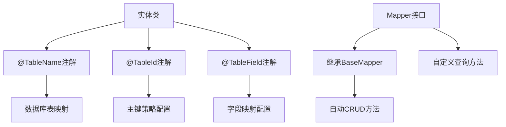

**图表来源** 
- [backend/counseling-domain/src/main/java/com/mindsafe/domain/mapper/CounselingSessionMapper.java](file://backend/counseling-domain/src/main/java/com/mindsafe/domain/mapper/CounselingSessionMapper.java)
- [backend/counseling-domain/src/main/java/com/mindsafe/domain/mapper/NotificationMapper.java](file://backend/counseling-domain/src/main/java/com/mindsafe/domain/mapper/NotificationMapper.java)
- [backend/counseling-domain/src/main/java/com/mindsafe/domain/mapper/RiskEventMapper.java](file://backend/counseling-domain/src/main/java/com/mindsafe/domain/mapper/RiskEventMapper.java)
- [backend/counseling-domain/src/main/java/com/mindsafe/domain/mapper/UserMapper.java](file://backend/counseling-domain/src/main/java/com/mindsafe/domain/mapper/UserMapper.java)
- [backend/counseling-domain/src/main/java/com/mindsafe/domain/mapper/AuditLogMapper.java](file://backend/counseling-domain/src/main/java/com/mindsafe/domain/mapper/AuditLogMapper.java)
- [backend/counseling-domain/src/main/java/com/mindsafe/domain/mapper/ModelCallLogMapper.java](file://backend/counseling-domain/src/main/java/com/mindsafe/domain/mapper/ModelCallLogMapper.java)
- [backend/counseling-domain/src/main/java/com/mindsafe/domain/mapper/RelaxationSessionMapper.java](file://backend/counseling-domain/src/main/java/com/mindsafe/domain/mapper/RelaxationSessionMapper.java)
- [backend/counseling-domain/src/main/java/com/mindsafe/domain/mapper/TeacherNoteMapper.java](file://backend/counseling-domain/src/main/java/com/mindsafe/domain/mapper/TeacherNoteMapper.java)

#### UUID类型处理器
系统实现了自定义UUID类型处理器，确保UUID类型在Java和PostgreSQL之间的正确转换：

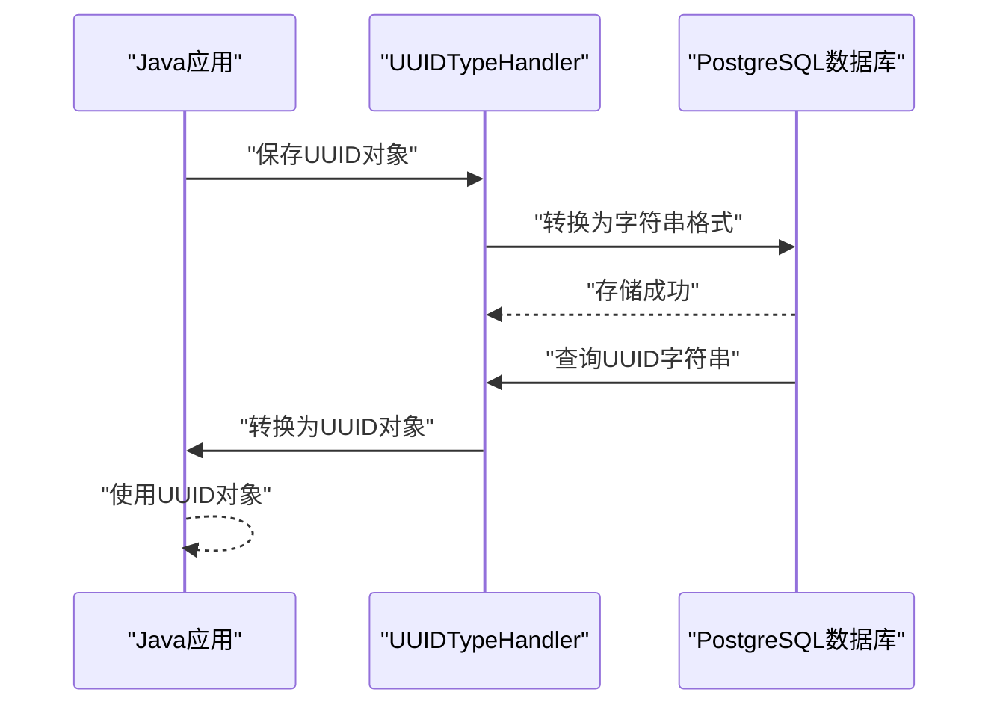

**图表来源** 
- [backend/counseling-domain/src/main/java/com/mindsafe/domain/handler/UuidTypeHandler.java](file://backend/counseling-domain/src/main/java/com/mindsafe/domain/handler/UuidTypeHandler.java)

### 数据库兼容性设计
- **PostgreSQL原生支持**：充分利用PostgreSQL的高级特性，如JSON字段、全文搜索等
- **UUID类型优化**：使用UUID作为主键，避免自增ID的瓶颈问题
- **索引策略**：为常用查询字段建立合适的索引，提升查询性能
- **事务管理**：利用MyBatis-Plus的事务管理能力，确保数据一致性
- **V7商业功能支持**：新增的对话路由、审计日志、AI服务监控、心理治疗和教师管理功能完全兼容现有架构

**章节来源**
- [backend/counseling-domain/src/main/java/com/mindsafe/domain/entity/CounselingSession.java](file://backend/counseling-domain/src/main/java/com/mindsafe/domain/entity/CounselingSession.java)
- [backend/counseling-domain/src/main/java/com/mindsafe/domain/entity/Notification.java](file://backend/counseling-domain/src/main/java/com/mindsafe/domain/entity/Notification.java)
- [backend/counseling-domain/src/main/java/com/mindsafe/domain/entity/RiskEvent.java](file://backend/counseling-domain/src/main/java/com/mindsafe/domain/entity/RiskEvent.java)
- [backend/counseling-domain/src/main/java/com/mindsafe/domain/entity/User.java](file://backend/counseling-domain/src/main/java/com/mindsafe/domain/entity/User.java)
- [backend/counseling-domain/src/main/java/com/mindsafe/domain/entity/AuditLog.java](file://backend/counseling-domain/src/main/java/com/mindsafe/domain/entity/AuditLog.java)
- [backend/counseling-domain/src/main/java/com/mindsafe/domain/entity/ModelCallLog.java](file://backend/counseling-domain/src/main/java/com/mindsafe/domain/entity/ModelCallLog.java)
- [backend/counseling-domain/src/main/java/com/mindsafe/domain/entity/RelaxationSession.java](file://backend/counseling-domain/src/main/java/com/mindsafe/domain/entity/RelaxationSession.java)
- [backend/counseling-domain/src/main/java/com/mindsafe/domain/entity/TeacherNote.java](file://backend/counseling-domain/src/main/java/com/mindsafe/domain/entity/TeacherNote.java)
- [backend/counseling-domain/src/main/java/com/mindsafe/domain/mapper/CounselingSessionMapper.java](file://backend/counseling-domain/src/main/java/com/mindsafe/domain/mapper/CounselingSessionMapper.java)
- [backend/counseling-domain/src/main/java/com/mindsafe/domain/mapper/NotificationMapper.java](file://backend/counseling-domain/src/main/java/com/mindsafe/domain/mapper/NotificationMapper.java)
- [backend/counseling-domain/src/main/java/com/mindsafe/domain/mapper/RiskEventMapper.java](file://backend/counseling-domain/src/main/java/com/mindsafe/domain/mapper/RiskEventMapper.java)
- [backend/counseling-domain/src/main/java/com/mindsafe/domain/mapper/UserMapper.java](file://backend/counseling-domain/src/main/java/com/mindsafe/domain/mapper/UserMapper.java)
- [backend/counseling-domain/src/main/java/com/mindsafe/domain/mapper/AuditLogMapper.java](file://backend/counseling-domain/src/main/java/com/mindsafe/domain/mapper/AuditLogMapper.java)
- [backend/counseling-domain/src/main/java/com/mindsafe/domain/mapper/ModelCallLogMapper.java](file://backend/counseling-domain/src/main/java/com/mindsafe/domain/mapper/ModelCallLogMapper.java)
- [backend/counseling-domain/src/main/java/com/mindsafe/domain/mapper/RelaxationSessionMapper.java](file://backend/counseling-domain/src/main/java/com/mindsafe/domain/mapper/RelaxationSessionMapper.java)
- [backend/counseling-domain/src/main/java/com/mindsafe/domain/mapper/TeacherNoteMapper.java](file://backend/counseling-domain/src/main/java/com/mindsafe/domain/mapper/TeacherNoteMapper.java)
- [backend/counseling-domain/src/main/java/com/mindsafe/domain/handler/UuidTypeHandler.java](file://backend/counseling-domain/src/main/java/com/mindsafe/domain/handler/UuidTypeHandler.java)
- [backend/counseling-app/src/main/resources/db/migration/V7__commercial_schema.sql](file://backend/counseling-app/src/main/resources/db/migration/V7__commercial_schema.sql)

## 技术栈决策

### 后端技术栈
- **Java + Spring Boot**：企业级应用框架，强大的生态系统支持，类型安全的编译时检查
- **Spring AI**：AI框架，提供统一的AI模型调用接口，支持多种大模型提供商
- **MyBatis-Plus**：增强版ORM框架，提供丰富的CRUD操作和代码生成能力
- **Spring Security**：安全框架，提供认证、授权和防护功能
- **Spring Actuator**：监控和管理端点，支持健康检查和指标暴露

### 前端技术栈
- **React + TypeScript**：现代化前端框架，类型安全的JavaScript超集
- **Vite**：快速构建工具，提供开发时热重载
- **Tailwind CSS**：原子化CSS框架，加速UI开发
- **Redux Toolkit**：状态管理，处理复杂应用状态

### 数据层技术栈
- **PostgreSQL**：主数据库，支持JSON字段和全文搜索
- **pgvector**：PostgreSQL扩展，提供向量相似度搜索能力
- **Redis**：内存数据库，用于缓存、会话存储和消息队列
- **Flyway**：数据库迁移工具，管理schema版本

### 部署与运维
- **Docker**：容器化打包，确保环境一致性
- **Docker Compose**：本地开发环境编排
- **Kubernetes**：生产环境容器编排（可选）
- **Nginx**：反向代理和负载均衡
- **Prometheus + Grafana**：监控和可视化

**更新** 新增MyBatis-Plus数据持久化层的主要考量：
- **开发效率**：内置大量CRUD方法，减少样板代码编写
- **类型安全**：编译时类型检查，减少运行时错误
- **性能优化**：智能SQL生成和优化，支持分页、条件查询等高级功能
- **扩展性**：插件化架构，支持自定义功能和扩展
- **社区生态**：活跃的社区支持和丰富的第三方集成
- **V7商业功能支持**：新增的审计日志、AI服务监控、心理治疗和教师管理功能需要更强大的数据持久化能力

**章节来源**
- [design/BEACON.md:1-200](file://design/BEACON.md#L1-L200)

## 依赖关系分析
- **模块内聚与解耦**：编排器作为中枢，仅依赖明确定义的接口（提示词库、状态机、适配器、护栏、可观测性）
- **内部依赖**：模块化单体架构下，模块间通过函数调用和事件总线通信
- **外部依赖**：大模型服务、Redis缓存、PostgreSQL数据库
- **潜在循环依赖**：应避免在适配器中反向依赖编排器，使用事件总线或回调解耦
- **集成点**：API网关鉴权、计费与配额、风控与合规平台

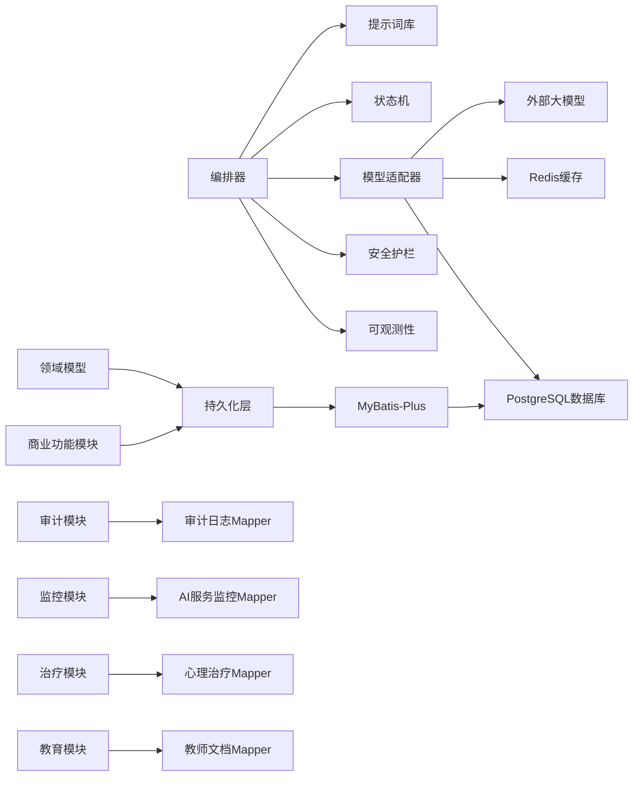

**章节来源**
- [design/BEACON.md:1-200](file://design/BEACON.md#L1-L200)

## 性能考虑
- **并发与批处理**：对非实时任务采用批量处理与异步队列，降低峰值压力
- **缓存策略**：热点提示词与中间结果缓存，减少重复计算
- **连接池与超时**：为模型适配层设置合理的连接池、读写超时与重试上限
- **降级与熔断**：当外部模型不可用时，自动降级到轻量策略或排队等待
- **资源隔离**：按租户/场景隔离资源，避免相互影响
- **成本优化**：按需选择模型规格，结合缓存与预取降低调用成本
- **内存管理**：合理使用Redis缓存，避免内存泄漏
- **数据库优化**：利用pgvector的向量索引优化相似度搜索性能
- **JVM优化**：合理配置堆大小、GC策略和线程池参数
- **持久化优化**：利用MyBatis-Plus的批量操作和懒加载特性，提升数据访问性能
- **V7功能优化**：新增的审计日志和AI服务监控采用异步写入，避免影响主业务流程性能

## 故障排查指南
- **常见问题定位**：
  - 模型调用失败：检查适配器健康检查、熔断状态与重试计数
  - 提示词渲染异常：核对模板变量注入与版本一致性
  - 安全拦截误报：查看护栏规则阈值与审计日志
  - 性能抖动：观察指标与追踪，定位慢调用与热点路径
  - 数据库连接问题：检查PostgreSQL连接池配置和pgvector扩展状态
  - 缓存失效：验证Redis连接和键过期策略
  - JVM内存问题：监控堆内存使用和GC日志
  - **数据持久化问题**：检查MyBatis-Plus配置、UUID类型映射和数据库连接
  - **V7功能问题**：检查新增实体的Mapper配置和数据库迁移状态
- **诊断工具**：
  - 结构化日志关键字检索
  - 链路追踪ID关联跨组件问题
  - 指标看板对比基线，识别回归
  - PostgreSQL查询计划分析
  - Redis内存使用情况监控
  - JVM性能分析工具（JProfiler、VisualVM）
  - **MyBatis SQL日志**：启用SQL日志输出，分析慢查询和异常SQL
  - **审计日志分析**：通过AuditLog实体追踪用户操作和行为
  - **AI服务监控**：通过ModelCallLog分析模型调用性能和成功率
- **应急措施**：
  - 快速回滚提示词版本
  - 切换备用模型或降级策略
  - 开启限流与熔断保护
  - 重启Redis缓存服务
  - 清理数据库连接池
  - 调整JVM参数和重启应用
  - **重置MyBatis-Plus缓存**：清除实体类和映射配置缓存
  - **恢复V7功能**：重新执行数据库迁移或回滚到稳定版本

**章节来源**
- [design/BEACON.md:1-200](file://design/BEACON.md#L1-L200)

## 结论
BEACON系统以编排器为核心，结合提示词工程、模型适配、安全护栏与可观测性，形成高可用、可扩展且合规可控的AI心理咨询平台。通过明确的接口契约与模块化单体架构，系统能够在保证用户体验的同时，满足安全与合规要求，并为后续功能扩展预留空间。

**更新** 新增的数据持久化层采用领域驱动设计和MyBatis-Plus框架，为系统提供了类型安全、高性能的数据访问能力。UUID主键策略确保了分布式环境下的数据唯一性，PostgreSQL兼容性保证了系统的稳定性和扩展性。V7版本的商业功能扩展进一步增强了系统的实用性和市场竞争力。当前系统架构稳定，所有变更均专注于功能增强和基础设施优化，为系统的长期发展奠定了坚实基础。

## 附录

### 接口定义（示例）
- **会话创建**
  - 方法：POST /api/v1/sessions
  - 请求体：包含用户标识、初始意图、上下文快照
  - 响应：会话ID、初始提示词摘要、下一步动作
- **消息发送**
  - 方法：POST /api/v1/sessions/{id}/messages
  - 请求体：用户消息、阶段标记、附加参数
  - 响应：助手回复、风险提示、操作建议
- **会话查询**
  - 方法：GET /api/v1/sessions/{id}
  - 响应：会话状态、历史摘要、审计摘要
- **V7新增接口**
  - 审计日志查询：GET /api/v1/audit-logs
  - AI服务监控：GET /api/v1/model-calls
  - 心理治疗练习：POST /api/v1/relaxation-sessions
  - 教师文档管理：POST /api/v1/teacher-notes

### 配置选项（示例）
- **模型适配**
  - 模型名称、密钥、超时、重试次数、熔断阈值
- **提示词库**
  - 模板目录、版本策略、热更新开关
- **安全护栏**
  - 风险阈值、关键词白名单、干预策略
- **可观测性**
  - 指标导出地址、日志级别、追踪采样率
- **数据库配置**
  - PostgreSQL连接字符串、pgvector扩展启用、连接池大小
- **缓存配置**
  - Redis连接信息、键过期时间、内存限制
- **JVM配置**
  - 堆大小、GC策略、线程池参数
- **MyBatis-Plus配置**
  - SQL日志输出、分页插件配置、乐观锁配置、UUID生成策略
- **V7功能配置**
  - 审计日志保留策略、AI服务监控阈值、心理治疗练习模板、教师权限配置

### 部署要求（示例）
- **运行环境**
  - Docker容器化部署，支持Linux发行版
  - Java 17+运行时环境（推荐JDK 17或更高版本）
  - Node.js 18+用于前端构建
- **硬件要求**
  - 最低：2核CPU、4GB内存、20GB磁盘
  - 推荐：4核CPU、8GB内存、50GB SSD
- **外部依赖**
  - PostgreSQL 14+数据库服务器
  - Redis 7+缓存服务
  - 大模型服务API可达性
- **网络与安全**
  - TLS证书配置
  - 防火墙规则设置
  - 环境变量与密钥管理
- **监控与告警**
  - Prometheus指标暴露
  - 结构化日志输出
  - 健康检查端点配置
  - JVM性能监控
  - **数据库监控**：MyBatis-Plus SQL监控和性能分析
  - **V7功能监控**：审计日志存储、AI服务调用监控、心理治疗进度跟踪
