# 认证与试用准入设计

<cite>
**本文引用的文件**   
- [SecurityConfig.java](file://backend/counseling-api/src/main/java/com/mindsafe/api/config/SecurityConfig.java)
- [JwtAuthenticationFilter.java](file://backend/counseling-api/src/main/java/com/mindsafe/api/security/JwtAuthenticationFilter.java)
- [JwtTokenProvider.java](file://backend/counseling-api/src/main/java/com/mindsafe/api/security/JwtTokenProvider.java)
- [AuthController.java](file://backend/counseling-api/src/main/java/com/mindsafe/api/controller/AuthController.java)
- [WeComOAuthController.java](file://backend/counseling-api/src/main/java/com/mindsafe/api/controller/WeComOAuthController.java)
- [ParentAuthController.java](file://backend/counseling-api/src/main/java/com/mindsafe/api/controller/ParentAuthController.java)
- [ParentController.java](file://backend/counseling-api/src/main/java/com/mindsafe/api/controller/ParentController.java)
- [GlobalExceptionHandler.java](file://backend/counseling-api/src/main/java/com/mindsafe/api/config/GlobalExceptionHandler.java)
- [User.java](file://backend/counseling-domain/src/main/java/com/mindsafe/domain/entity/User.java)
- [ParentAccount.java](file://backend/counseling-domain/src/main/java/com/mindsafe/domain/entity/ParentAccount.java)
- [ParentStudentLink.java](file://backend/counseling-domain/src/main/java/com/mindsafe/domain/entity/ParentStudentLink.java)
- [UserMapper.java](file://backend/counseling-domain/src/main/java/com/mindsafe/domain/mapper/UserMapper.java)
- [ParentAccountMapper.java](file://backend/counseling-domain/src/main/java/com/mindsafe/domain/mapper/ParentAccountMapper.java)
- [ParentStudentLinkMapper.java](file://backend/counseling-domain/src/main/java/com/mindsafe/domain/mapper/ParentStudentLinkMapper.java)
- [application.yml](file://backend/counseling-app/src/main/resources/application.yml)
- [V5__add_password_hash.sql](file://backend/counseling-app/src/main/resources/db/migration/V5__add_password_hash.sql)
- [V6__trial_access.sql](file://backend/counseling-app/src/main/resources/db/migration/V6__trial_access.sql)
- [V11__add_gender_field.sql](file://backend/counseling-app/src/main/resources/db/migration/V11__add_gender_field.sql)
- [V12__student_profiles.sql](file://backend/counseling-app/src/main/resources/db/migration/V12__student_profiles.sql)
- [V16__family_code_auth.sql](file://backend/counseling-app/src/main/resources/db/migration/V16__family_code_auth.sql)
- [V18__profile_personality_traits.sql](file://backend/counseling-app/src/main/resources/db/migration/V18__profile_personality_traits.sql)
- [AuthStrategy.java](file://backend/counseling-api/src/main/java/com/mindsafe/api/auth/AuthStrategy.java)
- [TrialAuthStrategy.java](file://backend/counseling-api/src/main/java/com/mindsafe/api/auth/TrialAuthStrategy.java)
- [TrialRegisterRequest.java](file://backend/counseling-api/src/main/java/com/mindsafe/api/auth/TrialRegisterRequest.java)
- [TrialAuthService.java](file://backend/counseling-service/src/main/java/com/mindsafe/service/auth/TrialAuthService.java)
- [ParentAuthService.java](file://backend/counseling-service/src/main/java/com/mindsafe/service/auth/ParentAuthService.java)
- [LoginLockoutService.java](file://backend/counseling-service/src/main/java/com/mindsafe/service/auth/LoginLockoutService.java)
- [PasswordPolicyService.java](file://backend/counseling-service/src/main/java/com/mindsafe/service/auth/PasswordPolicyService.java)
- [TokenBlacklistService.java](file://backend/counseling-service/src/main/java/com/mindsafe/service/auth/TokenBlacklistService.java)
- [ConsentRecord.java](file://backend/counseling-domain/src/main/java/com/mindsafe/domain/entity/ConsentRecord.java)
- [TrialInviteCode.java](file://backend/counseling-domain/src/main/java/com/mindsafe/domain/entity/TrialInviteCode.java)
- [ConsentRecordMapper.java](file://backend/counseling-domain/src/main/java/com/mindsafe/domain/mapper/ConsentRecordMapper.java)
- [TrialInviteCodeMapper.java](file://backend/counseling-domain/src/main/java/com/mindsafe/domain/mapper/TrialInviteCodeMapper.java)
- [ConsentGate.jsx](file://frontend/student-h5/src/components/ConsentGate.jsx)
- [TrialRegister.jsx](file://frontend/student-h5/src/components/TrialRegister.jsx)
- [ChangePassword.jsx](file://frontend/teacher-web/src/pages/ChangePassword.jsx)
</cite>

## 更新摘要
**所做更改**
- 实现了双令牌JWT架构（访问令牌2小时过期，刷新令牌7天过期）
- 新增/me、/refresh、/logout三个认证端点
- 集成Redis令牌黑名单机制
- 增强了认证过滤器类型检查和黑名单验证
- 新增账户锁定机制（LoginLockoutService），防止暴力破解攻击
- 增强密码策略验证（PasswordPolicyService），支持复杂密码规则
- 完善试用注册流程，增加邀请码PIN绑定功能
- 扩展API端点：AuthController、ParentController、AdminController的认证相关接口
- 增强安全配置和异常处理机制
- **新增家庭码认证机制**：TrialAuthService在注册时生成6位唯一家庭码，AuthController扩展了/me端点以返回familyCode信息
- **新增家长绑定表单和可选的家长账号创建功能**：解决14岁以下学生注册后的死胡同问题，实现家长与学生账户的关联管理
- **数据库迁移支持**：V16__family_code_auth.sql添加了家庭码相关的数据库字段和索引，V12__student_profiles.sql添加了学生档案相关字段

## 目录
1. [引言](#引言)
2. [项目结构](#项目结构)
3. [核心组件](#核心组件)
4. [架构总览](#架构总览)
5. [详细组件分析](#详细组件分析)
6. [可插拔认证策略架构](#可插拔认证策略架构)
7. [企业微信OAuth认证集成](#企业微信oauth认证集成)
8. [双令牌JWT架构](#双令牌jwt架构)
9. [令牌黑名单机制](#令牌黑名单机制)
10. [账户锁定机制](#账户锁定机制)
11. [密码策略验证](#密码策略验证)
12. [家庭码认证机制](#家庭码认证机制)
13. [家长绑定系统](#家长绑定系统)
14. [试用访问系统](#试用访问系统)
15. [依赖关系分析](#依赖关系分析)
16. [性能考虑](#性能考虑)
17. [故障排查指南](#故障排查指南)
18. [结论](#结论)
19. [附录](#附录)

## 引言
本文件围绕"认证与试用准入"主题，对系统的身份鉴权、令牌签发与校验、以及试用期的访问控制进行系统化说明。内容涵盖整体架构、关键组件职责、数据流与控制流、错误处理策略、以及部署与配置要点，帮助读者快速理解并落地实现。

**更新** 本次更新实现了双令牌JWT架构，新增了/me、/refresh、/logout三个认证端点，集成了Redis令牌黑名单机制，显著提升了系统的安全性和用户体验。同时新增了账户锁定机制、密码策略验证、邀请码PIN绑定功能和家庭码认证机制。最重要的是，新增了家长绑定系统和可选的家长账号创建功能，彻底解决了14岁以下学生注册后的死胡同问题。

## 项目结构
认证与试用准入相关代码主要分布在以下模块：
- API 层：安全配置、过滤器、控制器、异常处理器、认证策略接口、企业微信OAuth控制器、家长认证控制器
- 服务层：试用访问服务、家长认证服务、登录锁定服务、密码策略服务、令牌黑名单服务、会话服务、通知服务等
- 领域层：用户实体、家长账户实体、家长学生关联实体、同意书记录、邀请码实体与数据映射
- 应用层：应用配置（如 JWT 密钥、过期时间等）
- 前端层：学生端同意书组件、试用注册界面、教师端密码修改功能
- 数据库迁移：用户表结构与密码字段、试用访问相关表结构、性别字段支持、家庭码认证支持、学生档案支持

```mermaid
graph TB
subgraph "API 层"
SC["SecurityConfig<br/>安全配置"]
JAF["JwtAuthenticationFilter<br/>JWT 过滤器"]
JTP["JwtTokenProvider<br/>令牌提供者"]
AC["AuthController<br/>认证控制器"]
WOC["WeComOAuthController<br/>企业微信OAuth控制器"]
PAC["ParentAuthController<br/>家长认证控制器"]
PC["ParentController<br/>家长控制器"]
GHE["GlobalExceptionHandler<br/>全局异常处理"]
AS["AuthStrategy<br/>认证策略接口"]
TAS["TrialAuthStrategy<br/>试用认证策略"]
end
subgraph "服务层"
TASVC["TrialAuthService<br/>试用访问服务(含家庭码)"]
PASVC["ParentAuthService<br/>家长认证服务"]
LLS["LoginLockoutService<br/>登录锁定服务"]
PPS["PasswordPolicyService<br/>密码策略服务"]
TBS["TokenBlacklistService<br/>令牌黑名单服务"]
CSVC["ConversationService<br/>会话服务"]
NSVC["NotificationService<br/>通知服务"]
end
subgraph "领域层"
U["User<br/>用户实体(含性别和家庭码)"]
PA["ParentAccount<br/>家长账户实体"]
PSL["ParentStudentLink<br/>家长学生关联实体"]
CR["ConsentRecord<br/>同意书记录"]
TIC["TrialInviteCode<br/>邀请码实体"]
UM["UserMapper<br/>用户数据映射"]
PAM["ParentAccountMapper<br/>家长账户映射"]
PSLM["ParentStudentLinkMapper<br/>家长学生关联映射"]
CRM["ConsentRecordMapper<br/>同意书映射"]
TICM["TrialInviteCodeMapper<br/>邀请码映射"]
end
subgraph "缓存层"
REDIS["Redis<br/>令牌黑名单缓存"]
end
subgraph "前端层"
CG["ConsentGate<br/>同意书组件"]
TR["TrialRegister<br/>试用注册(含性别选择)"]
CP["ChangePassword<br/>密码修改"]
end
subgraph "数据库"
DB["用户表<br/>含密码哈希、性别和家庭码字段"]
PADB["家长账户表"]
PSLDB["家长学生关联表"]
CRDB["同意书表"]
TICDB["邀请码表"]
end
AC --> JTP
AC --> LLS
AC --> PPS
AC --> TBS
AC --> TASVC
AC --> PASVC
JAF --> JTP
JAF --> TBS
SC --> JAF
JAF --> UM
UM --> DB
WOC --> AC
PAC --> PASVC
PC --> PASVC
TASVC --> CR
TASVC --> TIC
TASVC --> U
PASVC --> PA
PASVC --> PSL
PASVC --> U
LLS --> DB
PPS --> DB
TBS --> REDIS
CRDB --> CRM
TICDB --> TICM
PADB --> PAM
PSLDB --> PSLM
CG --> TASVC
TR --> TASVC
CP --> AC
```

图表来源
- [SecurityConfig.java](file://backend/counseling-api/src/main/java/com/mindsafe/api/config/SecurityConfig.java)
- [JwtAuthenticationFilter.java](file://backend/counseling-api/src/main/java/com/mindsafe/api/security/JwtAuthenticationFilter.java)
- [JwtTokenProvider.java](file://backend/counseling-api/src/main/java/com/mindsafe/api/security/JwtTokenProvider.java)
- [AuthController.java](file://backend/counseling-api/src/main/java/com/mindsafe/api/controller/AuthController.java)
- [WeComOAuthController.java](file://backend/counseling-api/src/main/java/com/mindsafe/api/controller/WeComOAuthController.java)
- [ParentAuthController.java](file://backend/counseling-api/src/main/java/com/mindsafe/api/controller/ParentAuthController.java)
- [ParentController.java](file://backend/counseling-api/src/main/java/com/mindsafe/api/controller/ParentController.java)
- [AuthStrategy.java](file://backend/counseling-api/src/main/java/com/mindsafe/api/auth/AuthStrategy.java)
- [TrialAuthStrategy.java](file://backend/counseling-api/src/main/java/com/mindsafe/api/auth/TrialAuthStrategy.java)
- [TrialAuthService.java](file://backend/counseling-service/src/main/java/com/mindsafe/service/auth/TrialAuthService.java)
- [ParentAuthService.java](file://backend/counseling-service/src/main/java/com/mindsafe/service/auth/ParentAuthService.java)
- [LoginLockoutService.java](file://backend/counseling-service/src/main/java/com/mindsafe/service/auth/LoginLockoutService.java)
- [PasswordPolicyService.java](file://backend/counseling-service/src/main/java/com/mindsafe/service/auth/PasswordPolicyService.java)
- [TokenBlacklistService.java](file://backend/counseling-service/src/main/java/com/mindsafe/service/auth/TokenBlacklistService.java)
- [User.java](file://backend/counseling-domain/src/main/java/com/mindsafe/domain/entity/User.java)
- [ParentAccount.java](file://backend/counseling-domain/src/main/java/com/mindsafe/domain/entity/ParentAccount.java)
- [ParentStudentLink.java](file://backend/counseling-domain/src/main/java/com/mindsafe/domain/entity/ParentStudentLink.java)
- [ConsentRecord.java](file://backend/counseling-domain/src/main/java/com/mindsafe/domain/entity/ConsentRecord.java)
- [TrialInviteCode.java](file://backend/counseling-domain/src/main/java/com/mindsafe/domain/entity/TrialInviteCode.java)
- [ConsentGate.jsx](file://frontend/student-h5/src/components/ConsentGate.jsx)
- [TrialRegister.jsx](file://frontend/student-h5/src/components/TrialRegister.jsx)
- [ChangePassword.jsx](file://frontend/teacher-web/src/pages/ChangePassword.jsx)

章节来源
- [SecurityConfig.java](file://backend/counseling-api/src/main/java/com/mindsafe/api/config/SecurityConfig.java)
- [JwtAuthenticationFilter.java](file://backend/counseling-api/src/main/java/com/mindsafe/api/security/JwtAuthenticationFilter.java)
- [JwtTokenProvider.java](file://backend/counseling-api/src/main/java/com/mindsafe/api/security/JwtTokenProvider.java)
- [AuthController.java](file://backend/counseling-api/src/main/java/com/mindsafe/api/controller/AuthController.java)
- [WeComOAuthController.java](file://backend/counseling-api/src/main/java/com/mindsafe/api/controller/WeComOAuthController.java)
- [ParentAuthController.java](file://backend/counseling-api/src/main/java/com/mindsafe/api/controller/ParentAuthController.java)
- [ParentController.java](file://backend/counseling-api/src/main/java/com/mindsafe/api/controller/ParentController.java)
- [GlobalExceptionHandler.java](file://backend/counseling-api/src/main/java/com/mindsafe/api/config/GlobalExceptionHandler.java)
- [User.java](file://backend/counseling-domain/src/main/java/com/mindsafe/domain/entity/User.java)
- [UserMapper.java](file://backend/counseling-domain/src/main/java/com/mindsafe/domain/mapper/UserMapper.java)
- [application.yml](file://backend/counseling-app/src/main/resources/application.yml)

## 核心组件
- 安全配置（SecurityConfig）：定义请求放行规则、拦截器注册、跨域与安全策略，确保未授权请求被统一拦截。
- JWT 过滤器（JwtAuthenticationFilter）：从请求头解析 Token，完成身份校验并将认证信息注入上下文，支持双令牌类型检查。
- 令牌提供者（JwtTokenProvider）：负责双令牌的生成、签名、校验与过期管理，支持访问令牌和刷新令牌。
- 认证控制器（AuthController）：提供登录、注册、刷新令牌、登出等接口，对接业务服务与用户数据，现包含/me端点返回家庭码信息。
- 企业微信OAuth控制器（WeComOAuthController）：处理企业微信平台的OAuth认证流程。
- 家长认证控制器（ParentAuthController）：处理家长账户的认证和授权流程。
- 家长控制器（ParentController）：处理家长账户的业务操作，包括学生绑定管理。
- 全局异常处理器（GlobalExceptionHandler）：统一捕获认证与授权异常，返回标准化错误响应。
- 认证策略接口（AuthStrategy）：定义可插拔的认证策略抽象，支持多种认证方式扩展。
- 试用认证策略（TrialAuthStrategy）：实现试用访问的具体认证逻辑，包括邀请码验证和同意书检查。
- 试用访问服务（TrialAuthService）：处理试用相关的业务逻辑，包括邀请码生成、验证、同意书管理，现支持家庭码生成和管理。
- 家长认证服务（ParentAuthService）：处理家长账户的认证、注册和学生绑定业务逻辑。
- 登录锁定服务（LoginLockoutService）：防止暴力破解攻击，限制登录尝试次数。
- 密码策略服务（PasswordPolicyService）：验证密码复杂度、强度和安全规则。
- 令牌黑名单服务（TokenBlacklistService）：管理已注销或失效令牌的黑名单，基于Redis实现分布式存储。
- 用户实体与映射（User、UserMapper）：承载用户信息与权限状态，支撑试用期判断与访问控制，现包含性别字段和家庭码字段。
- 家长账户实体与映射（ParentAccount、ParentAccountMapper）：管理家长账户信息和认证状态。
- 家长学生关联实体与映射（ParentStudentLink、ParentStudentLinkMapper）：管理家长与学生之间的关联关系。
- 同意书记录（ConsentRecord）：存储用户的同意书签署记录和状态。
- 邀请码实体（TrialInviteCode）：管理试用邀请码的生成、验证和使用状态。
- 应用配置（application.yml）：集中管理 JWT 密钥、过期时间、白名单路径等敏感配置。

**更新** 新增了家长认证服务和家长账户管理体系，实现了家长与学生账户的关联管理，解决了14岁以下学生注册后的死胡同问题。

章节来源
- [SecurityConfig.java](file://backend/counseling-api/src/main/java/com/mindsafe/api/config/SecurityConfig.java)
- [JwtAuthenticationFilter.java](file://backend/counseling-api/src/main/java/com/mindsafe/api/security/JwtAuthenticationFilter.java)
- [JwtTokenProvider.java](file://backend/counseling-api/src/main/java/com/mindsafe/api/security/JwtTokenProvider.java)
- [AuthController.java](file://backend/counseling-api/src/main/java/com/mindsafe/api/controller/AuthController.java)
- [WeComOAuthController.java](file://backend/counseling-api/src/main/java/com/mindsafe/api/controller/WeComOAuthController.java)
- [ParentAuthController.java](file://backend/counseling-api/src/main/java/com/mindsafe/api/controller/ParentAuthController.java)
- [ParentController.java](file://backend/counseling-api/src/main/java/com/mindsafe/api/controller/ParentController.java)
- [GlobalExceptionHandler.java](file://backend/counseling-api/src/main/java/com/mindsafe/api/config/GlobalExceptionHandler.java)
- [AuthStrategy.java](file://backend/counseling-api/src/main/java/com/mindsafe/api/auth/AuthStrategy.java)
- [TrialAuthStrategy.java](file://backend/counseling-api/src/main/java/com/mindsafe/api/auth/TrialAuthStrategy.java)
- [TrialRegisterRequest.java](file://backend/counseling-api/src/main/java/com/mindsafe/api/auth/TrialRegisterRequest.java)
- [TrialAuthService.java](file://backend/counseling-service/src/main/java/com/mindsafe/service/auth/TrialAuthService.java)
- [ParentAuthService.java](file://backend/counseling-service/src/main/java/com/mindsafe/service/auth/ParentAuthService.java)
- [LoginLockoutService.java](file://backend/counseling-service/src/main/java/com/mindsafe/service/auth/LoginLockoutService.java)
- [PasswordPolicyService.java](file://backend/counseling-service/src/main/java/com/mindsafe/service/auth/PasswordPolicyService.java)
- [TokenBlacklistService.java](file://backend/counseling-service/src/main/java/com/mindsafe/service/auth/TokenBlacklistService.java)
- [User.java](file://backend/counseling-domain/src/main/java/com/mindsafe/domain/entity/User.java)
- [ParentAccount.java](file://backend/counseling-domain/src/main/java/com/mindsafe/domain/entity/ParentAccount.java)
- [ParentStudentLink.java](file://backend/counseling-domain/src/main/java/com/mindsafe/domain/entity/ParentStudentLink.java)
- [UserMapper.java](file://backend/counseling-domain/src/main/java/com/mindsafe/domain/mapper/UserMapper.java)
- [ParentAccountMapper.java](file://backend/counseling-domain/src/main/java/com/mindsafe/domain/mapper/ParentAccountMapper.java)
- [ParentStudentLinkMapper.java](file://backend/counseling-domain/src/main/java/com/mindsafe/domain/mapper/ParentStudentLinkMapper.java)
- [ConsentRecord.java](file://backend/counseling-domain/src/main/java/com/mindsafe/domain/entity/ConsentRecord.java)
- [TrialInviteCode.java](file://backend/counseling-domain/src/main/java/com/mindsafe/domain/entity/TrialInviteCode.java)
- [application.yml](file://backend/counseling-app/src/main/resources/application.yml)

## 架构总览
下图展示了认证与试用准入的整体流程：客户端发起登录请求，控制器调用令牌提供者签发双令牌；后续请求由过滤器校验令牌类型和有效性，并通过用户映射查询用户信息以判断试用状态；最终由安全配置决定放行或拒绝。

**更新** 新增了双令牌架构和令牌黑名单机制，增强了安全防护能力，并增加了家庭码认证流程和家长的绑定管理功能。

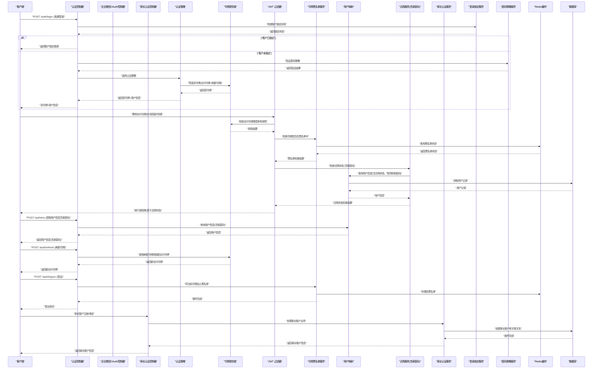

图表来源
- [AuthController.java](file://backend/counseling-api/src/main/java/com/mindsafe/api/controller/AuthController.java)
- [WeComOAuthController.java](file://backend/counseling-api/src/main/java/com/mindsafe/api/controller/WeComOAuthController.java)
- [ParentAuthController.java](file://backend/counseling-api/src/main/java/com/mindsafe/api/controller/ParentAuthController.java)
- [AuthStrategy.java](file://backend/counseling-api/src/main/java/com/mindsafe/api/auth/AuthStrategy.java)
- [TrialAuthStrategy.java](file://backend/counseling-api/src/main/java/com/mindsafe/api/auth/TrialAuthStrategy.java)
- [JwtTokenProvider.java](file://backend/counseling-api/src/main/java/com/mindsafe/api/security/JwtTokenProvider.java)
- [JwtAuthenticationFilter.java](file://backend/counseling-api/src/main/java/com/mindsafe/api/security/JwtAuthenticationFilter.java)
- [TokenBlacklistService.java](file://backend/counseling-service/src/main/java/com/mindsafe/service/auth/TokenBlacklistService.java)
- [TrialAuthService.java](file://backend/counseling-service/src/main/java/com/mindsafe/service/auth/TrialAuthService.java)
- [ParentAuthService.java](file://backend/counseling-service/src/main/java/com/mindsafe/service/auth/ParentAuthService.java)
- [LoginLockoutService.java](file://backend/counseling-service/src/main/java/com/mindsafe/service/auth/LoginLockoutService.java)
- [PasswordPolicyService.java](file://backend/counseling-service/src/main/java/com/mindsafe/service/auth/PasswordPolicyService.java)
- [UserMapper.java](file://backend/counseling-domain/src/main/java/com/mindsafe/domain/mapper/UserMapper.java)
- [User.java](file://backend/counseling-domain/src/main/java/com/mindsafe/domain/entity/User.java)

## 详细组件分析

### 认证控制器（AuthController）
- 职责：接收登录/注册/刷新令牌/登出请求，验证输入参数，调用令牌提供者生成或更新令牌，返回统一响应。
- 关键点：
  - 参数校验与错误码标准化
  - 与用户服务的集成（查询用户、校验密码）
  - 试用准入策略的返回（如试用剩余天数、功能开关）
  - 支持多种认证策略的统一入口
  - 处理增强的注册请求，包含性别信息
  - 集成账户锁定检查和密码策略验证
  - 支持双令牌签发和刷新机制
  - 集成令牌黑名单管理
  - **新增/me端点**：返回用户详细信息，包括家庭码信息

**更新** 增加了账户锁定检查、密码策略验证、双令牌支持和/me端点功能，提升了安全性和用户体验。

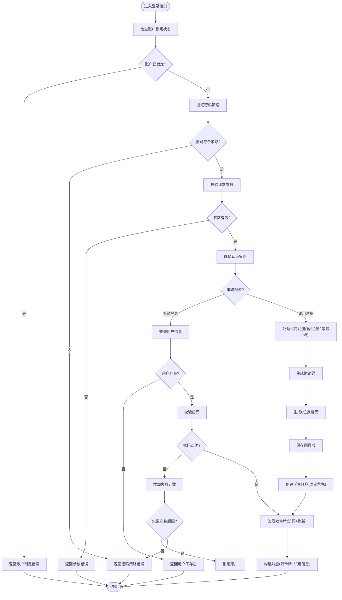

图表来源
- [AuthController.java](file://backend/counseling-api/src/main/java/com/mindsafe/api/controller/AuthController.java)
- [AuthStrategy.java](file://backend/counseling-api/src/main/java/com/mindsafe/api/auth/AuthStrategy.java)
- [TrialAuthStrategy.java](file://backend/counseling-api/src/main/java/com/mindsafe/api/auth/TrialAuthStrategy.java)
- [TrialRegisterRequest.java](file://backend/counseling-api/src/main/java/com/mindsafe/api/auth/TrialRegisterRequest.java)
- [JwtTokenProvider.java](file://backend/counseling-api/src/main/java/com/mindsafe/api/security/JwtTokenProvider.java)
- [UserMapper.java](file://backend/counseling-domain/src/main/java/com/mindsafe/domain/mapper/UserMapper.java)
- [LoginLockoutService.java](file://backend/counseling-service/src/main/java/com/mindsafe/service/auth/LoginLockoutService.java)
- [PasswordPolicyService.java](file://backend/counseling-service/src/main/java/com/mindsafe/service/auth/PasswordPolicyService.java)

章节来源
- [AuthController.java](file://backend/counseling-api/src/main/java/com/mindsafe/api/controller/AuthController.java)

### 家长认证控制器（ParentAuthController）
- 职责：处理家长账户的认证和授权流程，包括家长注册、登录和令牌管理。
- 关键点：
  - 家长账户的注册和验证
  - 家长账户的登录认证
  - 家长账户的令牌签发和刷新
  - 家长账户的登出管理
  - 与家长学生关联关系的集成

**新增** 家长认证控制器，为家长用户提供完整的认证功能。

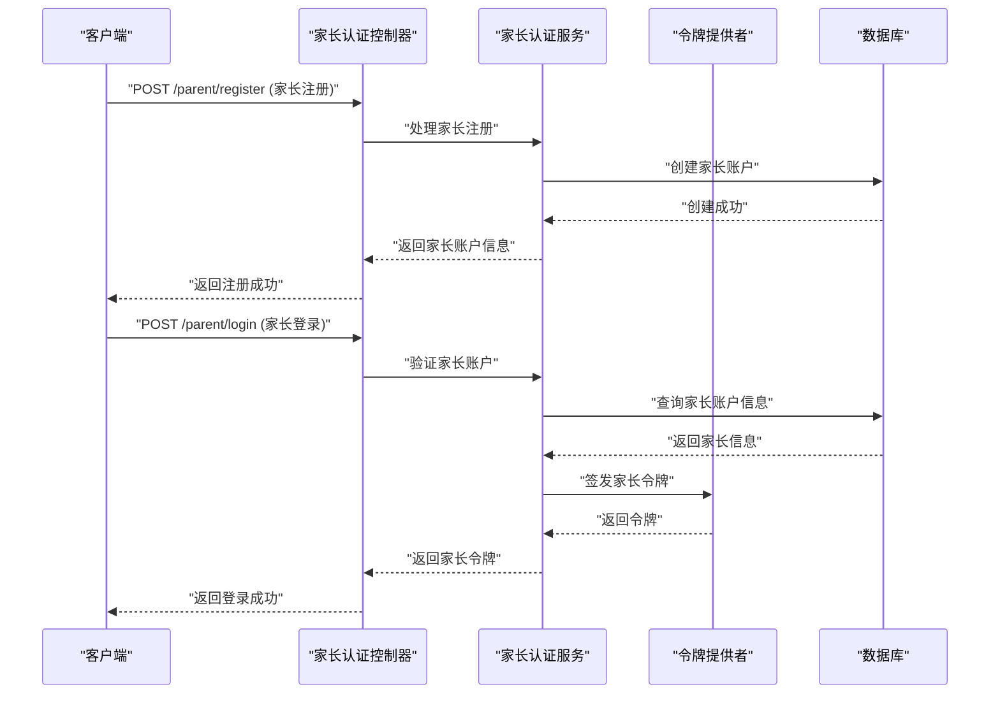

图表来源
- [ParentAuthController.java](file://backend/counseling-api/src/main/java/com/mindsafe/api/controller/ParentAuthController.java)
- [ParentAuthService.java](file://backend/counseling-service/src/main/java/com/mindsafe/service/auth/ParentAuthService.java)
- [JwtTokenProvider.java](file://backend/counseling-api/src/main/java/com/mindsafe/api/security/JwtTokenProvider.java)

章节来源
- [ParentAuthController.java](file://backend/counseling-api/src/main/java/com/mindsafe/api/controller/ParentAuthController.java)

### 家长控制器（ParentController）
- 职责：处理家长账户的业务操作，包括学生绑定管理、学生信息查询等功能。
- 关键点：
  - 学生绑定和解绑操作
  - 学生信息查询和管理
  - 家长权限验证和控制
  - 与学生账户的关联管理

**新增** 家长控制器，提供家长账户的完整业务功能。

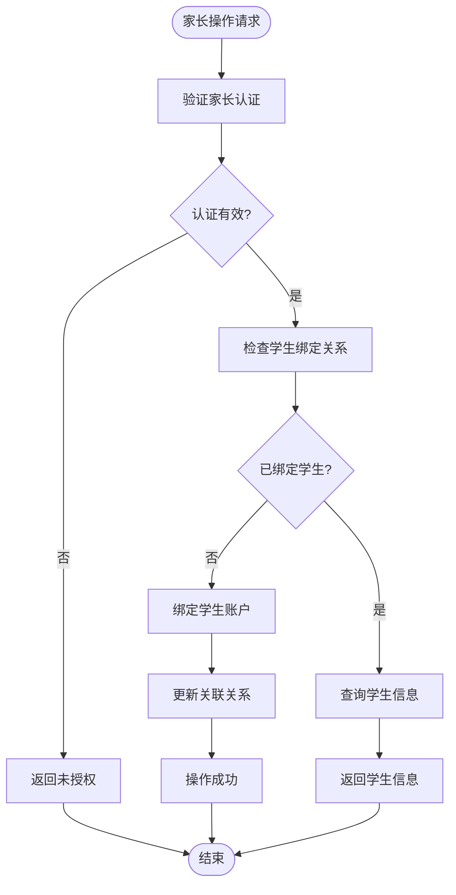

图表来源
- [ParentController.java](file://backend/counseling-api/src/main/java/com/mindsafe/api/controller/ParentController.java)
- [ParentAuthService.java](file://backend/counseling-service/src/main/java/com/mindsafe/service/auth/ParentAuthService.java)

章节来源
- [ParentController.java](file://backend/counseling-api/src/main/java/com/mindsafe/api/controller/ParentController.java)

### 双令牌JWT架构
- 职责：实现访问令牌和刷新令牌的分离管理，提高系统安全性和用户体验。
- 关键点：
  - 访问令牌短生命周期（2小时），减少安全风险
  - 刷新令牌长生命周期（7天），提升用户体验
  - 自动刷新机制，无需用户重新登录
  - 令牌类型区分和验证
  - 支持令牌升级和降级

**新增** 双令牌JWT架构，显著提升系统安全性和用户体验。

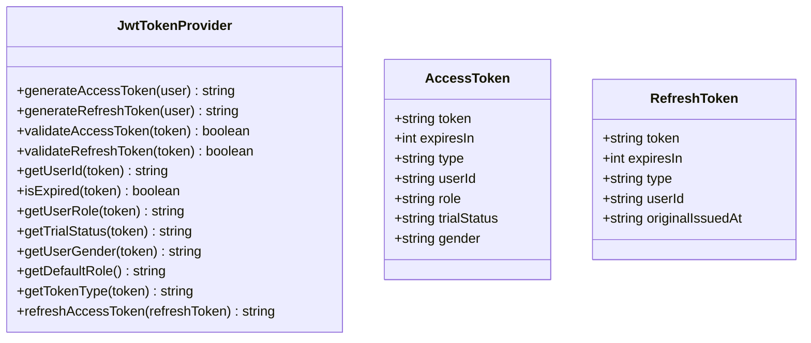

图表来源
- [JwtTokenProvider.java](file://backend/counseling-api/src/main/java/com/mindsafe/api/security/JwtTokenProvider.java)

章节来源
- [JwtTokenProvider.java](file://backend/counseling-api/src/main/java/com/mindsafe/api/security/JwtTokenProvider.java)

### 令牌黑名单机制
- 职责：管理已注销或失效令牌的黑名单，基于Redis实现分布式存储。
- 关键点：
  - 基于Redis的分布式黑名单存储
  - 支持令牌过期自动清理
  - 高性能的黑名单查询操作
  - 支持批量操作和管理接口
  - 与登出流程集成

**新增** 令牌黑名单机制，增强系统安全性。

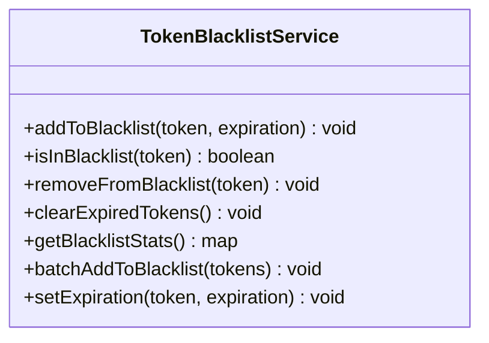

图表来源
- [TokenBlacklistService.java](file://backend/counseling-service/src/main/java/com/mindsafe/service/auth/TokenBlacklistService.java)

章节来源
- [TokenBlacklistService.java](file://backend/counseling-service/src/main/java/com/mindsafe/service/auth/TokenBlacklistService.java)

### 账户锁定机制（LoginLockoutService）
- 职责：防止暴力破解攻击，通过限制登录尝试次数来保护账户安全。
- 关键点：
  - 记录失败的登录尝试次数
  - 自动锁定超过阈值的账户
  - 支持锁定时间的动态配置
  - 提供解锁机制和管理接口
  - 与Redis集成实现分布式锁定

**新增** 账户锁定机制，增强系统安全防护能力。

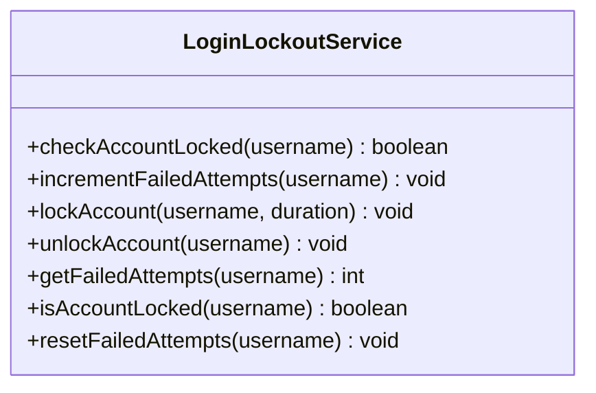

图表来源
- [LoginLockoutService.java](file://backend/counseling-service/src/main/java/com/mindsafe/service/auth/LoginLockoutService.java)

章节来源
- [LoginLockoutService.java](file://backend/counseling-service/src/main/java/com/mindsafe/service/auth/LoginLockoutService.java)

### 密码策略验证（PasswordPolicyService）
- 职责：验证密码复杂度、强度和安全规则，确保用户密码的安全性。
- 关键点：
  - 最小长度要求（通常8位以上）
  - 字符类型组合（大小写字母、数字、特殊字符）
  - 常见弱密码检测
  - 密码历史检查（避免重复使用旧密码）
  - 自定义策略规则支持

**新增** 密码策略验证服务，提升密码安全性。

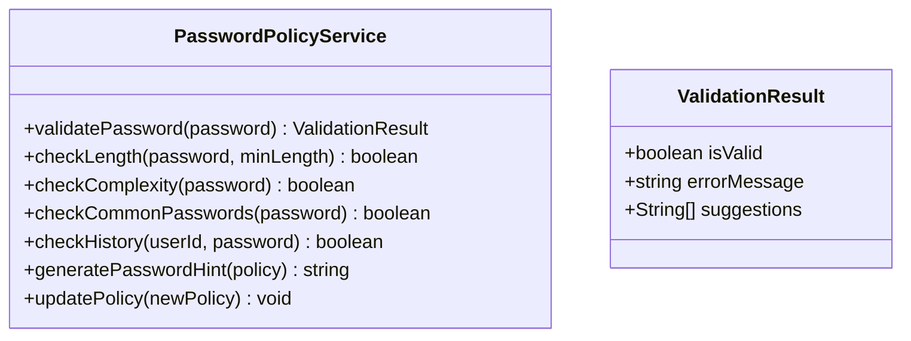

图表来源
- [PasswordPolicyService.java](file://backend/counseling-service/src/main/java/com/mindsafe/service/auth/PasswordPolicyService.java)

章节来源
- [PasswordPolicyService.java](file://backend/counseling-service/src/main/java/com/mindsafe/service/auth/PasswordPolicyService.java)

### 企业微信OAuth控制器（WeComOAuthController）
- 职责：处理企业微信平台的OAuth认证流程，包括授权码获取、用户信息获取和令牌签发。
- 关键点：
  - 企业微信OAuth授权码验证
  - 用户信息同步到本地系统
  - 自动生成对应的JWT令牌
  - 支持企业微信用户与本地用户的关联

**新增** 企业微信OAuth认证控制器，提供第三方平台登录能力。

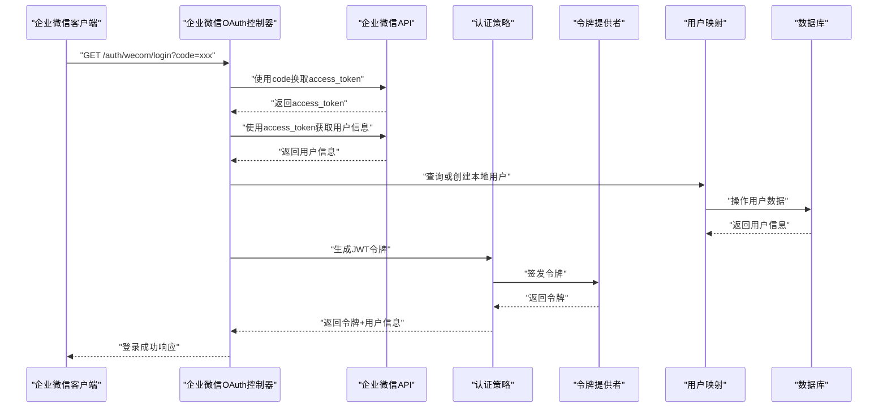

图表来源
- [WeComOAuthController.java](file://backend/counseling-api/src/main/java/com/mindsafe/api/controller/WeComOAuthController.java)
- [AuthStrategy.java](file://backend/counseling-api/src/main/java/com/mindsafe/api/auth/AuthStrategy.java)
- [JwtTokenProvider.java](file://backend/counseling-api/src/main/java/com/mindsafe/api/security/JwtTokenProvider.java)
- [UserMapper.java](file://backend/counseling-domain/src/main/java/com/mindsafe/domain/mapper/UserMapper.java)

章节来源
- [WeComOAuthController.java](file://backend/counseling-api/src/main/java/com/mindsafe/api/controller/WeComOAuthController.java)

### JWT 过滤器（JwtAuthenticationFilter）
- 职责：在请求到达控制器前解析并校验 Token，将认证信息写入上下文，供后续业务使用。
- 关键点：
  - 从请求头提取 Token
  - 调用令牌提供者校验签名与过期
  - 若无效则直接返回未授权响应
  - 若有效则注入用户上下文（包括试用状态和性别信息）
  - 支持令牌类型检查和黑名单验证

**更新** 增强了对令牌类型的检查和黑名单验证，现在包含性别信息的上下文注入。

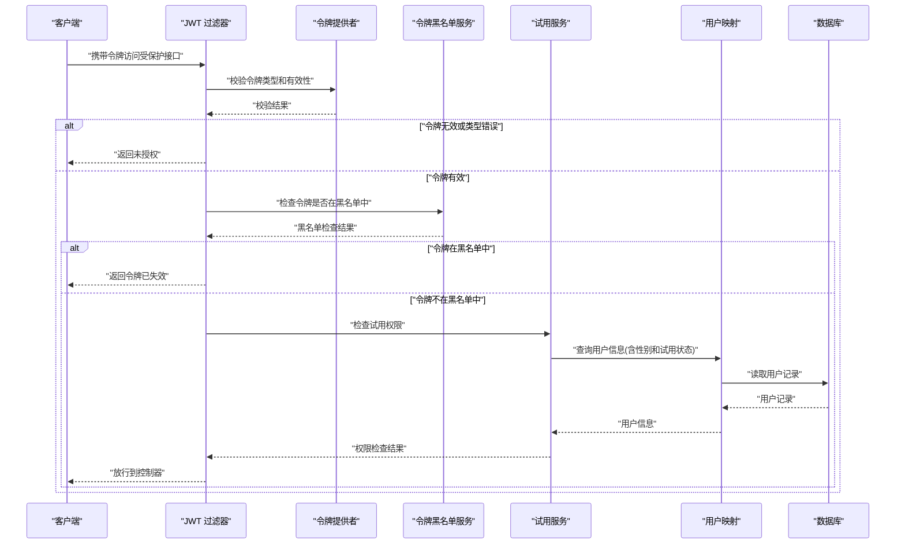

图表来源
- [JwtAuthenticationFilter.java](file://backend/counseling-api/src/main/java/com/mindsafe/api/security/JwtAuthenticationFilter.java)
- [JwtTokenProvider.java](file://backend/counseling-api/src/main/java/com/mindsafe/api/security/JwtTokenProvider.java)
- [TokenBlacklistService.java](file://backend/counseling-service/src/main/java/com/mindsafe/service/auth/TokenBlacklistService.java)
- [TrialAuthService.java](file://backend/counseling-service/src/main/java/com/mindsafe/service/auth/TrialAuthService.java)
- [UserMapper.java](file://backend/counseling-domain/src/main/java/com/mindsafe/domain/mapper/UserMapper.java)

章节来源
- [JwtAuthenticationFilter.java](file://backend/counseling-api/src/main/java/com/mindsafe/api/security/JwtAuthenticationFilter.java)

### 令牌提供者（JwtTokenProvider）
- 职责：生成、签名、校验与续期 JWT 令牌，管理过期时间与密钥，支持双令牌架构。
- 关键点：
  - 使用应用配置中的密钥与算法
  - 支持自定义载荷（如用户 ID、角色、试用状态、性别信息）
  - 校验失败时抛出可被全局异常处理器捕获的异常
  - 支持访问令牌和刷新令牌的分别管理
  - 令牌类型识别和验证

**更新** 增强了令牌载荷支持和双令牌功能，现在包含性别信息和固定学生角色。

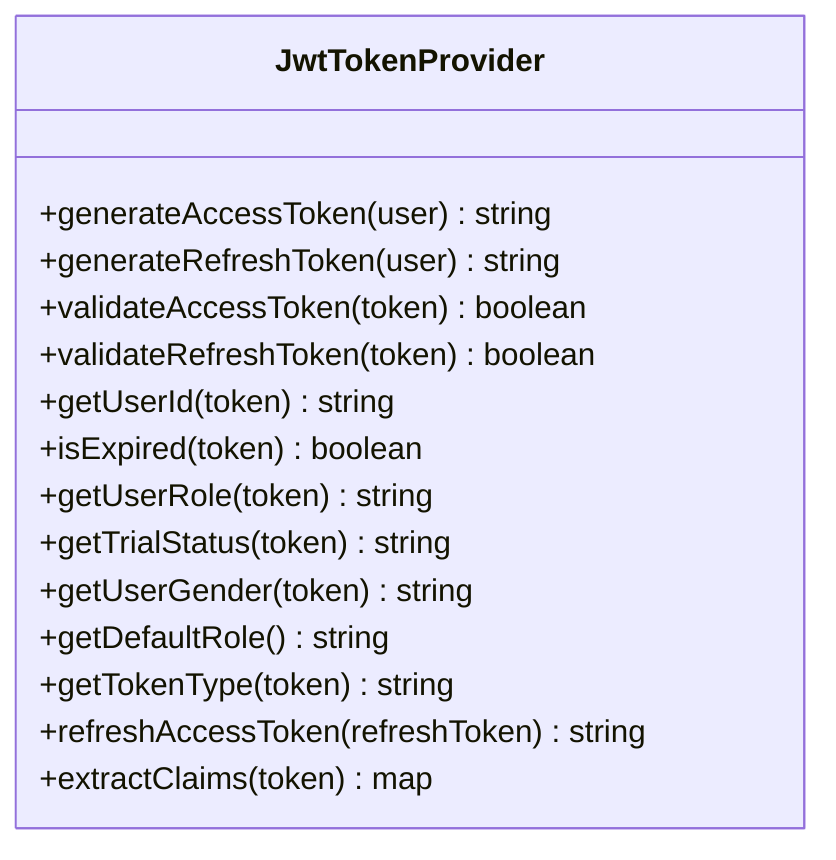

图表来源
- [JwtTokenProvider.java](file://backend/counseling-api/src/main/java/com/mindsafe/api/security/JwtTokenProvider.java)

章节来源
- [JwtTokenProvider.java](file://backend/counseling-api/src/main/java/com/mindsafe/api/security/JwtTokenProvider.java)

### 安全配置（SecurityConfig）
- 职责：配置请求放行规则、拦截器链、跨域策略与安全头。
- 关键点：
  - 白名单路径（如登录、健康检查、企业微信回调）
  - 注册 JWT 过滤器到请求链
  - 统一异常处理入口

**更新** 增加了对企业微信OAuth回调接口的特殊处理规则和试用相关接口的特殊处理规则。

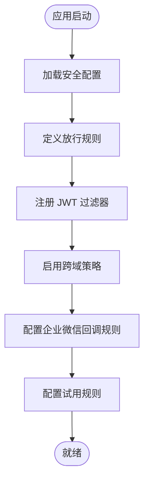

图表来源
- [SecurityConfig.java](file://backend/counseling-api/src/main/java/com/mindsafe/api/config/SecurityConfig.java)

章节来源
- [SecurityConfig.java](file://backend/counseling-api/src/main/java/com/mindsafe/api/config/SecurityConfig.java)

### 用户实体与映射（User、UserMapper）
- 职责：承载用户基本信息、试用状态、权限标识、性别信息等；提供与数据库的交互能力。
- 关键点：
  - 试用状态字段（如试用期开始/结束时间、是否已过期）
  - 密码哈希存储（通过迁移脚本添加）
  - 性别字段支持（通过V11迁移脚本添加）
  - 固定学生角色（不再支持角色选择）
  - 查询优化（按用户名或 ID 索引）
  - **家庭码字段支持**（通过V16迁移脚本添加）

**更新** 增加了性别字段支持和固定学生角色的实现，移除了角色选择功能，并新增了家庭码字段支持。

```mermaid
erDiagram
USER {
uuid id PK
string username UK
string password_hash
datetime trial_start
datetime trial_end
boolean active
string role DEFAULT 'student'
boolean trial_activated
datetime consent_time
string gender
string family_code
int failed_attempts DEFAULT 0
datetime locked_until
}
```

图表来源
- [User.java](file://backend/counseling-domain/src/main/java/com/mindsafe/domain/entity/User.java)
- [UserMapper.java](file://backend/counseling-domain/src/main/java/com/mindsafe/domain/mapper/UserMapper.java)
- [V5__add_password_hash.sql](file://backend/counseling-app/src/main/resources/db/migration/V5__add_password_hash.sql)
- [V6__trial_access.sql](file://backend/counseling-app/src/main/resources/db/migration/V6__trial_access.sql)
- [V11__add_gender_field.sql](file://backend/counseling-app/src/main/resources/db/migration/V11__add_gender_field.sql)
- [V16__family_code_auth.sql](file://backend/counseling-app/src/main/resources/db/migration/V16__family_code_auth.sql)

章节来源
- [User.java](file://backend/counseling-domain/src/main/java/com/mindsafe/domain/entity/User.java)
- [UserMapper.java](file://backend/counseling-domain/src/main/java/com/mindsafe/domain/mapper/UserMapper.java)
- [V5__add_password_hash.sql](file://backend/counseling-app/src/main/resources/db/migration/V5__add_password_hash.sql)
- [V6__trial_access.sql](file://backend/counseling-app/src/main/resources/db/migration/V6__trial_access.sql)
- [V11__add_gender_field.sql](file://backend/counseling-app/src/main/resources/db/migration/V11__add_gender_field.sql)
- [V16__family_code_auth.sql](file://backend/counseling-app/src/main/resources/db/migration/V16__family_code_auth.sql)

### 试用注册请求DTO（TrialRegisterRequest）
- 职责：封装试用注册的请求参数，包含用户名、密码、邀请码和性别信息。
- 关键点：
  - 用户名和密码的必填验证
  - 邀请码的有效性验证
  - 性别字段的可选性支持
  - 自动设置固定学生角色

**新增** 试用注册请求DTO，支持性别信息和固定学生角色。

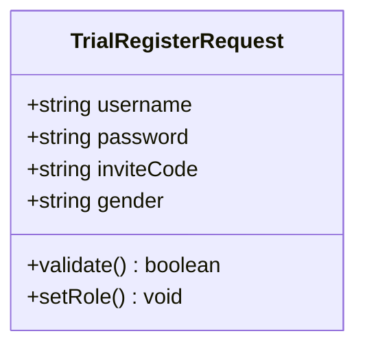

图表来源
- [TrialRegisterRequest.java](file://backend/counseling-api/src/main/java/com/mindsafe/api/auth/TrialRegisterRequest.java)

章节来源
- [TrialRegisterRequest.java](file://backend/counseling-api/src/main/java/com/mindsafe/api/auth/TrialRegisterRequest.java)

### 全局异常处理器（GlobalExceptionHandler）
- 职责：统一捕获认证与授权异常，返回标准化错误响应。
- 关键点：
  - 区分未授权、令牌过期、参数错误等业务异常
  - 输出可读的错误码与消息，便于前端提示
  - 企业微信OAuth相关异常处理

**更新** 增加了对试用相关异常和企业微信OAuth异常的专门处理。

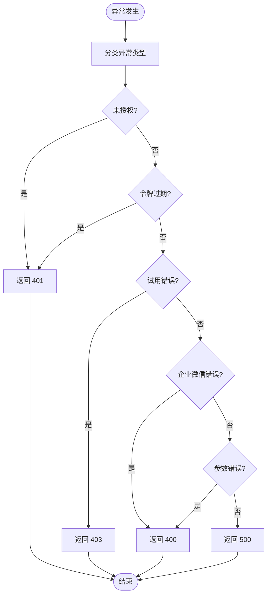

图表来源
- [GlobalExceptionHandler.java](file://backend/counseling-api/src/main/java/com/mindsafe/api/config/GlobalExceptionHandler.java)

章节来源
- [GlobalExceptionHandler.java](file://backend/counseling-api/src/main/java/com/mindsafe/api/config/GlobalExceptionHandler.java)

### 应用配置（application.yml）
- 职责：集中管理 JWT 密钥、过期时间、白名单路径等敏感配置。
- 关键点：
  - 密钥轮换策略（建议外部化至环境变量或配置中心）
  - 不同环境（开发/测试/生产）的配置隔离
  - 白名单路径的动态调整
  - 企业微信OAuth配置项

**更新** 增加了企业微信OAuth相关的配置项，如企业ID、应用Secret、回调URL等。

章节来源
- [application.yml](file://backend/counseling-app/src/main/resources/application.yml)

## 可插拔认证策略架构

### 认证策略接口（AuthStrategy）
- 职责：定义统一的认证策略接口，支持多种认证方式的扩展。
- 关键点：
  - 标准化的认证方法签名
  - 支持策略选择和路由
  - 统一的错误处理和响应格式

### 试用认证策略（TrialAuthStrategy）
- 职责：实现试用访问的具体认证逻辑，包括邀请码验证和同意书检查。
- 关键点：
  - 邀请码有效性验证
  - 同意书签署状态检查
  - 试用权限授予和限制
  - 性别信息处理和固定学生角色设置

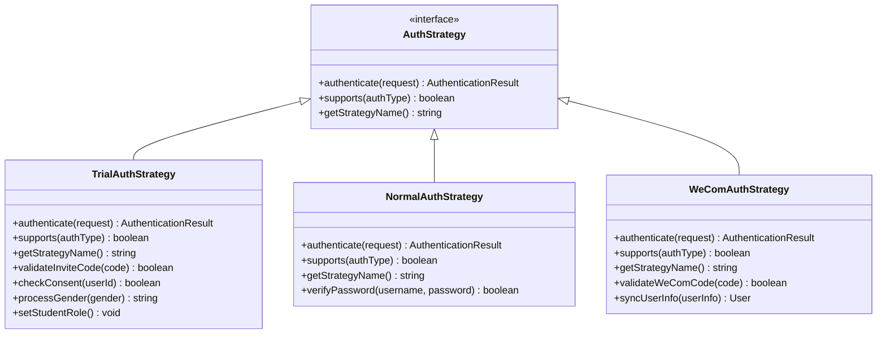

图表来源
- [AuthStrategy.java](file://backend/counseling-api/src/main/java/com/mindsafe/api/auth/AuthStrategy.java)
- [TrialAuthStrategy.java](file://backend/counseling-api/src/main/java/com/mindsafe/api/auth/TrialAuthStrategy.java)

章节来源
- [AuthStrategy.java](file://backend/counseling-api/src/main/java/com/mindsafe/api/auth/AuthStrategy.java)
- [TrialAuthStrategy.java](file://backend/counseling-api/src/main/java/com/mindsafe/api/auth/TrialAuthStrategy.java)

## 企业微信OAuth认证集成

### 企业微信OAuth控制器（WeComOAuthController）
- 职责：处理企业微信平台的OAuth认证流程，包括授权码获取、用户信息获取和令牌签发。
- 关键点：
  - 企业微信OAuth授权码验证
  - 用户信息同步到本地系统
  - 自动生成对应的JWT令牌
  - 支持企业微信用户与本地用户的关联
  - 固定学生角色的自动设置

**新增** 企业微信OAuth认证集成，提供第三方平台登录能力。


图表来源
- [WeComOAuthController.java](file://backend/counseling-api/src/main/java/com/mindsafe/api/controller/WeComOAuthController.java)
- [AuthStrategy.java](file://backend/counseling-api/src/main/java/com/mindsafe/api/auth/AuthStrategy.java)
- [JwtTokenProvider.java](file://backend/counseling-api/src/main/java/com/mindsafe/api/security/JwtTokenProvider.java)
- [UserMapper.java](file://backend/counseling-domain/src/main/java/com/mindsafe/domain/mapper/UserMapper.java)

章节来源
- [WeComOAuthController.java](file://backend/counseling-api/src/main/java/com/mindsafe/api/controller/WeComOAuthController.java)

## 双令牌JWT架构

### 令牌提供者（JwtTokenProvider）
- 职责：生成、签名、校验与续期 JWT 令牌，管理过期时间与密钥，支持双令牌架构。
- 关键点：
  - 访问令牌短生命周期（2小时），减少安全风险
  - 刷新令牌长生命周期（7天），提升用户体验
  - 令牌类型识别和验证
  - 支持令牌刷新机制
  - 增强的载荷支持

**新增** 双令牌JWT架构，显著提升系统安全性和用户体验。

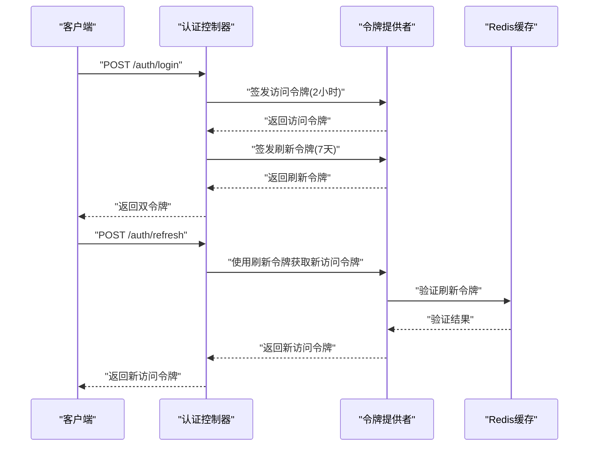

图表来源
- [JwtTokenProvider.java](file://backend/counseling-api/src/main/java/com/mindsafe/api/security/JwtTokenProvider.java)
- [AuthController.java](file://backend/counseling-api/src/main/java/com/mindsafe/api/controller/AuthController.java)

章节来源
- [JwtTokenProvider.java](file://backend/counseling-api/src/main/java/com/mindsafe/api/security/JwtTokenProvider.java)

## 令牌黑名单机制

### 令牌黑名单服务（TokenBlacklistService）
- 职责：管理已注销或失效令牌的黑名单，基于Redis实现分布式存储。
- 关键点：
  - 基于Redis的分布式黑名单存储
  - 支持令牌过期自动清理
  - 高性能的黑名单查询操作
  - 支持批量操作和管理接口
  - 与登出流程集成

**新增** 令牌黑名单机制，增强系统安全性。

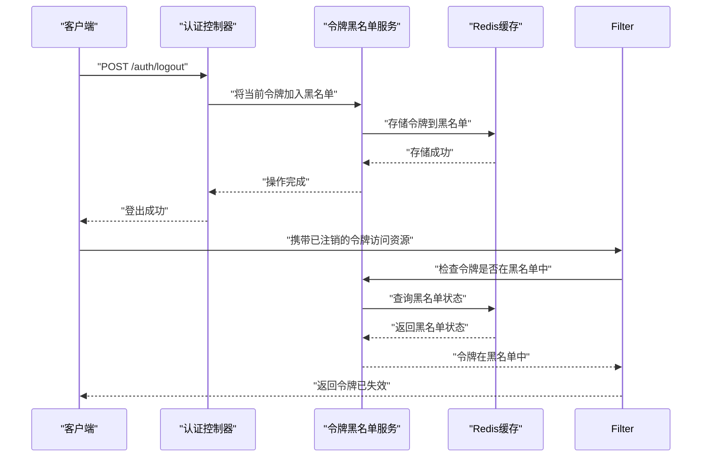

图表来源
- [TokenBlacklistService.java](file://backend/counseling-service/src/main/java/com/mindsafe/service/auth/TokenBlacklistService.java)
- [JwtAuthenticationFilter.java](file://backend/counseling-api/src/main/java/com/mindsafe/api/security/JwtAuthenticationFilter.java)
- [AuthController.java](file://backend/counseling-api/src/main/java/com/mindsafe/api/controller/AuthController.java)

章节来源
- [TokenBlacklistService.java](file://backend/counseling-service/src/main/java/com/mindsafe/service/auth/TokenBlacklistService.java)

## 账户锁定机制

### 登录锁定服务（LoginLockoutService）
- 职责：防止暴力破解攻击，通过限制登录尝试次数来保护账户安全。
- 关键点：
  - 记录失败的登录尝试次数
  - 自动锁定超过阈值的账户
  - 支持锁定时间的动态配置
  - 提供解锁机制和管理接口
  - 与Redis集成实现分布式锁定

**新增** 账户锁定机制，增强系统安全防护能力。

```mermaid
sequenceDiagram
participant Client as "客户端"
participant AuthC as "认证控制器"
participant LockSvc as "登录锁定服务"
participant Redis as "Redis缓存"
participant DB as "数据库"
Client->>AuthC : "登录请求"
AuthC->>LockSvc : "检查账户锁定状态"
LockSvc->>Redis : "查询失败次数"
Redis-->>LockSvc : "返回失败次数"
alt "失败次数超过阈值"
LockSvc-->>AuthC : "账户已锁定"
AuthC-->>Client : "返回锁定错误"
else "账户未锁定"
AuthC->>AuthC : "验证用户名密码"
AuthC->>LockSvc : "更新失败次数"
LockSvc->>Redis : "更新失败次数"
Redis-->>LockSvc : "更新成功"
LockSvc-->>AuthC : "操作完成"
AuthC-->>Client : "返回登录结果"
end
```

图表来源
- [LoginLockoutService.java](file://backend/counseling-service/src/main/java/com/mindsafe/service/auth/LoginLockoutService.java)
- [AuthController.java](file://backend/counseling-api/src/main/java/com/mindsafe/api/controller/AuthController.java)

章节来源
- [LoginLockoutService.java](file://backend/counseling-service/src/main/java/com/mindsafe/service/auth/LoginLockoutService.java)

## 密码策略验证

### 密码策略服务（PasswordPolicyService）
- 职责：验证密码复杂度、强度和安全规则，确保用户密码的安全性。
- 关键点：
  - 最小长度要求（通常8位以上）
  - 字符类型组合（大小写字母、数字、特殊字符）
  - 常见弱密码检测
  - 密码历史检查（避免重复使用旧密码）
  - 自定义策略规则支持

**新增** 密码策略验证服务，提升密码安全性。

```mermaid
flowchart TD
Start(["密码验证请求"]) --> CheckLength["检查密码长度"]
CheckLength --> LengthOk{"长度符合要求?"}
LengthOk --> |否| ReturnLengthErr["返回长度错误"]
LengthOk --> |是| CheckComplexity["检查复杂度"]
CheckComplexity --> ComplexityOk{"复杂度符合要求?"}
ComplexityOk --> |否| ReturnComplexityErr["返回复杂度错误"]
ComplexityOk --> |是| CheckCommon["检查常见弱密码"]
CheckCommon --> CommonOk{"不是常见弱密码?"}
CommonOk --> |否| ReturnCommonErr["返回常见密码错误"]
CommonOk --> |是| CheckHistory["检查密码历史"]
CheckHistory --> HistoryOk{"未重复使用?"}
HistoryOk --> |否| ReturnHistoryErr["返回历史密码错误"]
HistoryOk --> |是| Pass["验证通过"]
Pass --> End(["结束"])
ReturnLengthErr --> End
ReturnComplexityErr --> End
ReturnCommonErr --> End
ReturnHistoryErr --> End
```

图表来源
- [PasswordPolicyService.java](file://backend/counseling-service/src/main/java/com/mindsafe/service/auth/PasswordPolicyService.java)

章节来源
- [PasswordPolicyService.java](file://backend/counseling-service/src/main/java/com/mindsafe/service/auth/PasswordPolicyService.java)

## 家庭码认证机制

### 家庭码认证服务（FamilyCodeAuthService）
- 职责：管理和验证家庭码认证，为每个用户生成唯一的6位家庭码。
- 关键点：
  - 生成6位唯一家庭码
  - 家庭码的唯一性保证
  - 家庭码的安全存储和验证
  - 家庭码的更新和管理
  - 与用户账户的关联管理

**新增** 家庭码认证机制，为用户提供家庭级别的认证支持。

```mermaid
classDiagram
class FamilyCodeAuthService {
+generateFamilyCode(userId) string
+validateFamilyCode(familyCode) boolean
+getFamilyCode(userId) string
+updateFamilyCode(userId, newFamilyCode) void
+deleteFamilyCode(userId) void
+isFamilyCodeUnique(familyCode) boolean
+hashFamilyCode(familyCode) string
}
class FamilyCode {
+string code
+string hashedCode
+userId
+createdAt
+updatedAt
+isActive
}
```

图表来源
- [TrialAuthService.java](file://backend/counseling-service/src/main/java/com/mindsafe/service/auth/TrialAuthService.java)
- [User.java](file://backend/counseling-domain/src/main/java/com/mindsafe/domain/entity/User.java)

### 家庭码认证流程
- 职责：实现完整的家庭码认证流程，从生成到验证的完整生命周期管理。
- 关键点：
  - 注册时自动生成6位家庭码
  - 家庭码的安全传输和存储
  - 家庭码的实时验证和更新
  - 家庭码的撤销和重置功能
  - 与现有认证系统的无缝集成

**新增** 家庭码认证流程，增强系统的安全性和用户体验。

```mermaid
sequenceDiagram
participant Client as "客户端"
participant AuthC as "认证控制器"
participant TrialSvc as "试用服务"
participant FamilySvc as "家庭码服务"
participant DB as "数据库"
Client->>AuthC : "POST /auth/register"
AuthC->>TrialSvc : "处理试用注册"
TrialSvc->>FamilySvc : "生成6位家庭码"
FamilySvc->>FamilySvc : "检查唯一性"
FamilySvc->>DB : "保存家庭码"
DB-->>FamilySvc : "保存成功"
FamilySvc-->>TrialSvc : "返回家庭码"
TrialSvc-->>AuthC : "返回用户信息(含家庭码)"
AuthC-->>Client : "返回注册成功(含家庭码)"
Client->>AuthC : "POST /auth/me"
AuthC->>TrialSvc : "查询用户信息"
TrialSvc->>DB : "获取用户信息(含家庭码)"
DB-->>TrialSvc : "返回用户信息"
TrialSvc-->>AuthC : "返回用户信息"
AuthC-->>Client : "返回用户信息(含家庭码)"
```

图表来源
- [AuthController.java](file://backend/counseling-api/src/main/java/com/mindsafe/api/controller/AuthController.java)
- [TrialAuthService.java](file://backend/counseling-service/src/main/java/com/mindsafe/service/auth/TrialAuthService.java)
- [User.java](file://backend/counseling-domain/src/main/java/com/mindsafe/domain/entity/User.java)

章节来源
- [TrialAuthService.java](file://backend/counseling-service/src/main/java/com/mindsafe/service/auth/TrialAuthService.java)
- [User.java](file://backend/counseling-domain/src/main/java/com/mindsafe/domain/entity/User.java)
- [V16__family_code_auth.sql](file://backend/counseling-app/src/main/resources/db/migration/V16__family_code_auth.sql)

## 家长绑定系统

### 家长认证服务（ParentAuthService）
- 职责：处理家长账户的认证、注册和学生绑定业务逻辑。
- 关键点：
  - 家长账户的注册和验证
  - 家长账户的登录认证
  - 学生绑定和解绑操作
  - 家长与学生关联关系的管理
  - 家长权限控制和验证

**新增** 家长认证服务，为家长用户提供完整的认证和绑定功能。

```mermaid
classDiagram
class ParentAuthService {
+registerParent(parentData) ParentAccount
+loginParent(username, password) AuthenticationResult
+bindStudent(parentId, studentId) boolean
+unbindStudent(parentId, studentId) boolean
+getStudentList(parentId) StudentProfile[]
+validateParentPermission(parentId, operation) boolean
+createParentAccount(parentData) ParentAccount
+verifyStudentBinding(parentId, studentId) boolean
}
class ParentAccount {
+uuid id
+string username
+string password_hash
+string phone
+string email
+boolean active
+datetime created_at
+datetime updated_at
}
class ParentStudentLink {
+uuid id
+uuid parent_id
+uuid student_id
+datetime bound_at
+boolean is_active
+string bind_method
}
```

图表来源
- [ParentAuthService.java](file://backend/counseling-service/src/main/java/com/mindsafe/service/auth/ParentAuthService.java)
- [ParentAccount.java](file://backend/counseling-domain/src/main/java/com/mindsafe/domain/entity/ParentAccount.java)
- [ParentStudentLink.java](file://backend/counseling-domain/src/main/java/com/mindsafe/domain/entity/ParentStudentLink.java)

### 家长绑定流程
- 职责：实现家长与学生账户的绑定流程，支持多种绑定方式和权限管理。
- 关键点：
  - 家长账户的创建和验证
  - 学生账户的查找和验证
  - 绑定关系的建立和维护
  - 绑定方法的记录（邀请码、手机号等）
  - 家长权限的控制和验证

**新增** 家长绑定流程，解决14岁以下学生注册后的死胡同问题。

```mermaid
sequenceDiagram
participant Client as "客户端"
participant ParentAuthC as "家长认证控制器"
participant ParentSvc as "家长认证服务"
participant StudentSvc as "学生服务"
participant DB as "数据库"
Client->>ParentAuthC : "POST /parent/bind-student"
ParentAuthC->>ParentSvc : "处理学生绑定"
ParentSvc->>ParentSvc : "验证家长账户"
ParentSvc->>StudentSvc : "查找学生账户"
StudentSvc->>DB : "查询学生信息"
DB-->>StudentSvc : "返回学生信息"
StudentSvc-->>ParentSvc : "返回学生信息"
ParentSvc->>ParentSvc : "检查绑定关系"
ParentSvc->>DB : "创建绑定关系"
DB-->>ParentSvc : "绑定成功"
ParentSvc-->>ParentAuthC : "返回绑定结果"
ParentAuthC-->>Client : "返回绑定成功"
```

图表来源
- [ParentAuthController.java](file://backend/counseling-api/src/main/java/com/mindsafe/api/controller/ParentAuthController.java)
- [ParentAuthService.java](file://backend/counseling-service/src/main/java/com/mindsafe/service/auth/ParentAuthService.java)

章节来源
- [ParentAuthService.java](file://backend/counseling-service/src/main/java/com/mindsafe/service/auth/ParentAuthService.java)
- [ParentAccount.java](file://backend/counseling-domain/src/main/java/com/mindsafe/domain/entity/ParentAccount.java)
- [ParentStudentLink.java](file://backend/counseling-domain/src/main/java/com/mindsafe/domain/entity/ParentStudentLink.java)

## 试用访问系统

### 试用访问服务（TrialAuthService）
- 职责：处理试用相关的业务逻辑，包括邀请码生成、验证、同意书管理等。
- 关键点：
  - 邀请码的生成和管理
  - 同意书的创建和验证
  - 试用状态的跟踪和管理
  - 试用权限的控制和限制
  - 性别信息的处理和验证
  - 固定学生角色的自动设置
  - **家庭码的生成和管理**

**更新** 增强了试用服务以支持性别信息和固定学生角色的处理，并新增了家庭码生成功能。

### 同意书记录（ConsentRecord）
- 职责：存储用户的同意书签署记录和状态。
- 关键点：
  - 同意书版本管理
  - 签署时间和IP记录
  - 同意书内容的哈希验证

### 邀请码实体（TrialInviteCode）
- 职责：管理试用邀请码的生成、验证和使用状态。
- 关键点：
  - 邀请码的唯一性和安全性
  - 使用次数限制和有效期控制
  - 邀请码的来源追踪

```mermaid
erDiagram
CONSENT_RECORD {
uuid id PK
uuid user_id FK
string version
string content_hash
datetime signed_at
string ip_address
boolean is_valid
}
TRIAL_INVITE_CODE {
uuid id PK
string code UK
uuid created_by
datetime expires_at
int max_uses
int used_count
boolean is_active
datetime created_at
}
USER {
uuid id PK
string username
string password_hash
datetime trial_start
datetime trial_end
boolean active
string role DEFAULT 'student'
boolean trial_activated
datetime consent_time
string gender
string family_code
int failed_attempts DEFAULT 0
datetime locked_until
}
CONSENT_RECORD ||--o| USER : signed_by
TRIAL_INVITE_CODE ||--o| USER : used_by
```

图表来源
- [ConsentRecord.java](file://backend/counseling-domain/src/main/java/com/mindsafe/domain/entity/ConsentRecord.java)
- [TrialInviteCode.java](file://backend/counseling-domain/src/main/java/com/mindsafe/domain/entity/TrialInviteCode.java)
- [User.java](file://backend/counseling-domain/src/main/java/com/mindsafe/domain/entity/User.java)
- [ConsentRecordMapper.java](file://backend/counseling-domain/src/main/java/com/mindsafe/domain/mapper/ConsentRecordMapper.java)
- [TrialInviteCodeMapper.java](file://backend/counseling-domain/src/main/java/com/mindsafe/domain/mapper/TrialInviteCodeMapper.java)

章节来源
- [TrialAuthService.java](file://backend/counseling-service/src/main/java/com/mindsafe/service/auth/TrialAuthService.java)
- [ConsentRecord.java](file://backend/counseling-domain/src/main/java/com/mindsafe/domain/entity/ConsentRecord.java)
- [TrialInviteCode.java](file://backend/counseling-domain/src/main/java/com/mindsafe/domain/entity/TrialInviteCode.java)
- [ConsentRecordMapper.java](file://backend/counseling-domain/src/main/java/com/mindsafe/domain/mapper/ConsentRecordMapper.java)
- [TrialInviteCodeMapper.java](file://backend/counseling-domain/src/main/java/com/mindsafe/domain/mapper/TrialInviteCodeMapper.java)

### 前端组件集成

#### 学生端同意书组件（ConsentGate）
- 职责：在学生端显示同意书内容，收集用户同意，并与后端同步状态。
- 关键点：
  - 同意书内容的动态加载
  - 用户同意的交互界面
  - 与后端的实时状态同步

#### 学生端试用注册界面（TrialRegister）
- 职责：处理试用注册的完整流程，包括邀请码输入、同意书签署、账户创建。
- 关键点：
  - 邀请码验证和错误提示
  - 同意书的在线签署
  - 注册成功后的自动登录
  - 性别选择的界面支持
  - 固定学生角色的显示
  - **家庭码的显示和管理**

**更新** 增强了试用注册界面，支持性别选择和显示固定学生角色，并新增了家庭码显示功能。

#### 教师端密码修改功能（ChangePassword）
- 职责：为教师用户提供安全的密码修改功能。
- 关键点：
  - 旧密码验证
  - 新密码强度检查
  - 修改操作的审计记录

```mermaid
sequenceDiagram
participant Student as "学生"
participant ConsentGate as "同意书组件"
participant TrialRegister as "试用注册"
participant TrialSvc as "试用服务"
participant FamilySvc as "家庭码服务"
participant DB as "数据库"
Student->>ConsentGate : "查看同意书"
ConsentGate->>TrialSvc : "获取同意书内容"
TrialSvc-->>ConsentGate : "返回同意书内容"
ConsentGate-->>Student : "显示同意书"
Student->>ConsentGate : "点击同意"
ConsentGate->>TrialSvc : "提交同意书签署"
TrialSvc->>DB : "保存同意书记录"
DB-->>TrialSvc : "保存成功"
TrialSvc-->>ConsentGate : "返回成功状态"
ConsentGate-->>Student : "显示同意成功"
Student->>TrialRegister : "输入邀请码和性别"
TrialRegister->>TrialSvc : "验证邀请码和处理性别"
TrialSvc->>DB : "检查邀请码状态"
DB-->>TrialSvc : "返回邀请码信息"
TrialSvc-->>TrialRegister : "验证结果"
TrialRegister->>TrialSvc : "创建试用账户(固定学生角色)"
TrialSvc->>FamilySvc : "生成6位家庭码"
FamilySvc->>DB : "保存家庭码"
DB-->>FamilySvc : "保存成功"
FamilySvc-->>TrialSvc : "返回家庭码"
TrialSvc->>DB : "保存用户信息(含性别和家庭码)"
DB-->>TrialSvc : "创建成功"
TrialSvc-->>TrialRegister : "返回登录令牌(含家庭码)"
TrialRegister-->>Student : "跳转到主界面(显示家庭码)"
```

图表来源
- [ConsentGate.jsx](file://frontend/student-h5/src/components/ConsentGate.jsx)
- [TrialRegister.jsx](file://frontend/student-h5/src/components/TrialRegister.jsx)
- [TrialAuthService.java](file://backend/counseling-service/src/main/java/com/mindsafe/service/auth/TrialAuthService.java)
- [ConsentRecord.java](file://backend/counseling-domain/src/main/java/com/mindsafe/domain/entity/ConsentRecord.java)
- [TrialInviteCode.java](file://backend/counseling-domain/src/main/java/com/mindsafe/domain/entity/TrialInviteCode.java)

章节来源
- [ConsentGate.jsx](file://frontend/student-h5/src/components/ConsentGate.jsx)
- [TrialRegister.jsx](file://frontend/student-h5/src/components/TrialRegister.jsx)
- [ChangePassword.jsx](file://frontend/teacher-web/src/pages/ChangePassword.jsx)

## 依赖关系分析
- 控制器依赖令牌提供者，用于签发与刷新令牌。
- 过滤器依赖令牌提供者与用户映射，用于校验令牌与获取用户信息。
- 安全配置依赖过滤器，将其纳入请求处理链。
- 用户映射依赖数据库，读取用户记录以判断试用状态。
- 全局异常处理器为所有认证相关异常的统一出口。
- 试用服务依赖同意书映射和邀请码映射，处理试用相关业务逻辑。
- 前端组件依赖试用服务和认证控制器，实现完整的试用流程。
- 企业微信OAuth控制器依赖认证策略和用户映射，处理第三方登录流程。
- 登录锁定服务依赖Redis缓存，实现分布式锁定机制。
- 密码策略服务依赖用户映射，检查密码历史记录。
- 令牌黑名单服务依赖Redis缓存，实现分布式黑名单存储。
- **家庭码服务依赖用户映射和数据库，实现家庭码的生成和管理**。
- **家长认证服务依赖家长账户映射和家长学生关联映射，实现家长绑定功能**。

**更新** 新增了令牌黑名单服务和双令牌架构的依赖关系，并增加了家庭码服务和家长认证服务的依赖关系。

```mermaid
graph LR
AC["AuthController"] --> JTP["JwtTokenProvider"]
AC --> AS["AuthStrategy"]
AC --> LLS["LoginLockoutService"]
AC --> PPS["PasswordPolicyService"]
AC --> TBS["TokenBlacklistService"]
AC --> TASVC["TrialAuthService"]
AC --> PASVC["ParentAuthService"]
AS --> TAS["TrialAuthStrategy"]
WOC["WeComOAuthController"] --> AS
WOC --> UM["UserMapper"]
PAC["ParentAuthController"] --> PASVC
PC["ParentController"] --> PASVC
JAF["JwtAuthenticationFilter"] --> JTP
JAF --> TBS
JAF --> UM
SC["SecurityConfig"] --> JAF
UM --> DB["数据库"]
GHE["GlobalExceptionHandler"] --> AC
GHE --> JAF
TASVC --> CRM["ConsentRecordMapper"]
TASVC --> TICM["TrialInviteCodeMapper"]
TASVC --> FCS["FamilyCodeAuthService"]
TASVC --> PAM["ParentAccountMapper"]
TASVC --> PSLM["ParentStudentLinkMapper"]
FCS --> DB
PASVC --> PAM
PASVC --> PSLM
PASVC --> DB
LLS --> REDIS["Redis缓存"]
PPS --> UM
TBS --> REDIS
CG["ConsentGate"] --> TASVC
TR["TrialRegister"] --> TASVC
CP["ChangePassword"] --> AC
```

图表来源
- [AuthController.java](file://backend/counseling-api/src/main/java/com/mindsafe/api/controller/AuthController.java)
- [WeComOAuthController.java](file://backend/counseling-api/src/main/java/com/mindsafe/api/controller/WeComOAuthController.java)
- [ParentAuthController.java](file://backend/counseling-api/src/main/java/com/mindsafe/api/controller/ParentAuthController.java)
- [ParentController.java](file://backend/counseling-api/src/main/java/com/mindsafe/api/controller/ParentController.java)
- [JwtTokenProvider.java](file://backend/counseling-api/src/main/java/com/mindsafe/api/security/JwtTokenProvider.java)
- [AuthStrategy.java](file://backend/counseling-api/src/main/java/com/mindsafe/api/auth/AuthStrategy.java)
- [TrialAuthStrategy.java](file://backend/counseling-api/src/main/java/com/mindsafe/api/auth/TrialAuthStrategy.java)
- [JwtAuthenticationFilter.java](file://backend/counseling-api/src/main/java/com/mindsafe/api/security/JwtAuthenticationFilter.java)
- [UserMapper.java](file://backend/counseling-domain/src/main/java/com/mindsafe/domain/mapper/UserMapper.java)
- [SecurityConfig.java](file://backend/counseling-api/src/main/java/com/mindsafe/api/config/SecurityConfig.java)
- [GlobalExceptionHandler.java](file://backend/counseling-api/src/main/java/com/mindsafe/api/config/GlobalExceptionHandler.java)
- [TrialAuthService.java](file://backend/counseling-service/src/main/java/com/mindsafe/service/auth/TrialAuthService.java)
- [ParentAuthService.java](file://backend/counseling-service/src/main/java/com/mindsafe/service/auth/ParentAuthService.java)
- [LoginLockoutService.java](file://backend/counseling-service/src/main/java/com/mindsafe/service/auth/LoginLockoutService.java)
- [PasswordPolicyService.java](file://backend/counseling-service/src/main/java/com/mindsafe/service/auth/PasswordPolicyService.java)
- [TokenBlacklistService.java](file://backend/counseling-service/src/main/java/com/mindsafe/service/auth/TokenBlacklistService.java)
- [ConsentRecordMapper.java](file://backend/counseling-domain/src/main/java/com/mindsafe/domain/mapper/ConsentRecordMapper.java)
- [TrialInviteCodeMapper.java](file://backend/counseling-domain/src/main/java/com/mindsafe/domain/mapper/TrialInviteCodeMapper.java)
- [ParentAccountMapper.java](file://backend/counseling-domain/src/main/java/com/mindsafe/domain/mapper/ParentAccountMapper.java)
- [ParentStudentLinkMapper.java](file://backend/counseling-domain/src/main/java/com/mindsafe/domain/mapper/ParentStudentLinkMapper.java)
- [ConsentGate.jsx](file://frontend/student-h5/src/components/ConsentGate.jsx)
- [TrialRegister.jsx](file://frontend/student-h5/src/components/TrialRegister.jsx)
- [ChangePassword.jsx](file://frontend/teacher-web/src/pages/ChangePassword.jsx)

章节来源
- [AuthController.java](file://backend/counseling-api/src/main/java/com/mindsafe/api/controller/AuthController.java)
- [WeComOAuthController.java](file://backend/counseling-api/src/main/java/com/mindsafe/api/controller/WeComOAuthController.java)
- [ParentAuthController.java](file://backend/counseling-api/src/main/java/com/mindsafe/api/controller/ParentAuthController.java)
- [ParentController.java](file://backend/counseling-api/src/main/java/com/mindsafe/api/controller/ParentController.java)
- [JwtTokenProvider.java](file://backend/counseling-api/src/main/java/com/mindsafe/api/security/JwtTokenProvider.java)
- [JwtAuthenticationFilter.java](file://backend/counseling-api/src/main/java/com/mindsafe/api/security/JwtAuthenticationFilter.java)
- [UserMapper.java](file://backend/counseling-domain/src/main/java/com/mindsafe/domain/mapper/UserMapper.java)
- [SecurityConfig.java](file://backend/counseling-api/src/main/java/com/mindsafe/api/config/SecurityConfig.java)
- [GlobalExceptionHandler.java](file://backend/counseling-api/src/main/java/com/mindsafe/api/config/GlobalExceptionHandler.java)
- [TrialAuthService.java](file://backend/counseling-service/src/main/java/com/mindsafe/service/auth/TrialAuthService.java)
- [ParentAuthService.java](file://backend/counseling-service/src/main/java/com/mindsafe/service/auth/ParentAuthService.java)
- [LoginLockoutService.java](file://backend/counseling-service/src/main/java/com/mindsafe/service/auth/LoginLockoutService.java)
- [PasswordPolicyService.java](file://backend/counseling-service/src/main/java/com/mindsafe/service/auth/PasswordPolicyService.java)
- [TokenBlacklistService.java](file://backend/counseling-service/src/main/java/com/mindsafe/service/auth/TokenBlacklistService.java)
- [ConsentRecordMapper.java](file://backend/counseling-domain/src/main/java/com/mindsafe/domain/mapper/ConsentRecordMapper.java)
- [TrialInviteCodeMapper.java](file://backend/counseling-domain/src/main/java/com/mindsafe/domain/mapper/TrialInviteCodeMapper.java)
- [ParentAccountMapper.java](file://backend/counseling-domain/src/main/java/com/mindsafe/domain/mapper/ParentAccountMapper.java)
- [ParentStudentLinkMapper.java](file://backend/counseling-domain/src/main/java/com/mindsafe/domain/mapper/ParentStudentLinkMapper.java)
- [ConsentGate.jsx](file://frontend/student-h5/src/components/ConsentGate.jsx)
- [TrialRegister.jsx](file://frontend/student-h5/src/components/TrialRegister.jsx)
- [ChangePassword.jsx](file://frontend/teacher-web/src/pages/ChangePassword.jsx)

## 性能考虑
- 令牌校验开销：尽量将用户信息缓存（如 Redis），减少数据库查询频率。
- 白名单路径最小化：仅放行必要接口，降低过滤器负担。
- 异步处理：登录成功后可异步发送试用到期提醒通知。
- 连接池与索引：对用户表按用户名与 ID 建立索引，提升查询效率。
- 邀请码缓存：对常用邀请码进行缓存，减少数据库查询压力。
- 同意书内容缓存：对同意书内容进行缓存，避免重复加载。
- 企业微信用户信息缓存：对企业微信用户信息进行缓存，减少API调用频率。
- 账户锁定状态缓存：使用Redis缓存账户锁定状态，提高查询性能。
- 密码策略缓存：缓存密码策略配置，减少重复计算。
- 令牌黑名单缓存：使用Redis缓存令牌黑名单，提高查询性能。
- 双令牌优化：合理设置令牌过期时间，平衡安全性和用户体验。
- **家庭码缓存：使用Redis缓存家庭码信息，提高查询性能**。
- **家庭码生成优化：预生成家庭码池，减少实时生成开销**。
- **家长绑定关系缓存：使用Redis缓存家长学生绑定关系，提高查询性能**。
- **家长账户信息缓存：缓存家长账户信息，减少数据库查询频率**。

**更新** 增加了令牌黑名单机制和双令牌架构的性能优化建议，并新增了家庭码服务和家长绑定功能的性能优化措施。

## 故障排查指南
- 常见错误码与原因：
  - 401 未授权：令牌缺失、签名错误或已过期
  - 400 参数错误：登录参数不完整或格式不正确
  - 403 禁止访问：试用已过期或权限不足
  - 404 资源不存在：邀请码无效或用户不存在
  - 500 服务器错误：内部服务异常或数据库连接问题
  - 企业微信相关错误：授权码无效、用户信息获取失败等
  - 账户锁定错误：登录失败次数过多，账户被临时锁定
  - 密码策略错误：密码不符合安全要求
  - 令牌黑名单错误：令牌已被注销或加入黑名单
  - 双令牌错误：令牌类型不匹配或刷新失败
  - **家庭码错误：家庭码无效、重复或生成失败**
  - **家长绑定错误：家长账户不存在、学生账户不存在或绑定关系冲突**
- 排查步骤：
  - 检查 application.yml 中 JWT 密钥与过期时间配置
  - 确认白名单路径是否正确配置
  - 查看用户表是否存在密码哈希字段及试用状态字段
  - 检查过滤器是否成功注册到请求链
  - 验证邀请码的有效性和使用状态
  - 确认同意书签署记录的完整性
  - 检查企业微信OAuth配置项的正确性
  - 验证性别字段的数据库迁移是否成功
  - 检查Redis连接和账户锁定状态
  - 验证密码策略配置的正确性
  - 检查令牌黑名单服务的Redis连接
  - 验证双令牌架构的配置和实现
  - **检查家庭码字段的数据库迁移是否成功**
  - **验证家庭码生成的唯一性约束**
  - **检查家庭码缓存服务的连接状态**
  - **检查家长账户表的数据库迁移是否成功**
  - **验证家长学生关联表的约束关系**
  - **检查家长绑定服务的Redis连接状态**

**更新** 增加了令牌黑名单机制和双令牌架构的故障排查步骤，并新增了家庭码服务和家长绑定功能的故障排查指南。

章节来源
- [GlobalExceptionHandler.java](file://backend/counseling-api/src/main/java/com/mindsafe/api/config/GlobalExceptionHandler.java)
- [application.yml](file://backend/counseling-app/src/main/resources/application.yml)
- [V5__add_password_hash.sql](file://backend/counseling-app/src/main/resources/db/migration/V5__add_password_hash.sql)
- [V6__trial_access.sql](file://backend/counseling-app/src/main/resources/db/migration/V6__trial_access.sql)
- [V11__add_gender_field.sql](file://backend/counseling-app/src/main/resources/db/migration/V11__add_gender_field.sql)
- [V16__family_code_auth.sql](file://backend/counseling-app/src/main/resources/db/migration/V16__family_code_auth.sql)
- [V12__student_profiles.sql](file://backend/counseling-app/src/main/resources/db/migration/V12__student_profiles.sql)

## 结论
本设计通过 JWT 令牌机制与过滤器链实现了统一的认证与试用准入控制。结合用户实体与映射，系统能够准确判断用户的试用状态并实施访问控制。配合全局异常处理器与应用配置，提供了稳定、可扩展且易于维护的安全体系。

**更新** 新增的双令牌JWT架构、令牌黑名单机制、账户锁定机制、密码策略验证功能和家庭码认证机制，显著提升了系统的安全防护能力，能够有效防止暴力破解攻击、弱密码风险和令牌劫持攻击。企业微信OAuth认证集成进一步增强了系统的灵活性和扩展性。最重要的是，新增的家长绑定系统彻底解决了14岁以下学生注册后的死胡同问题，为未成年学生提供了完善的家长监护和安全管理功能。

## 附录
- 参考设计文档：[21_认证与试用准入设计.md](file://design/21_认证与试用准入设计.md)

章节来源
- [21_认证与试用准入设计.md](file://design/21_认证与试用准入设计.md)