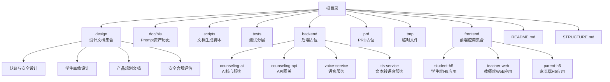
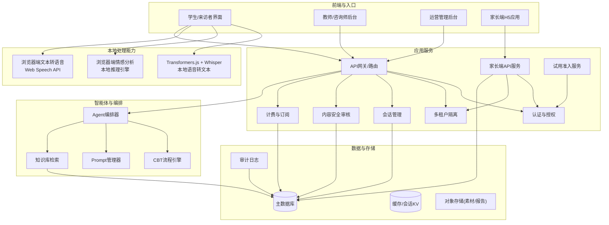
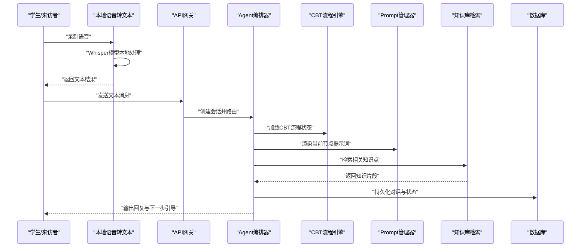
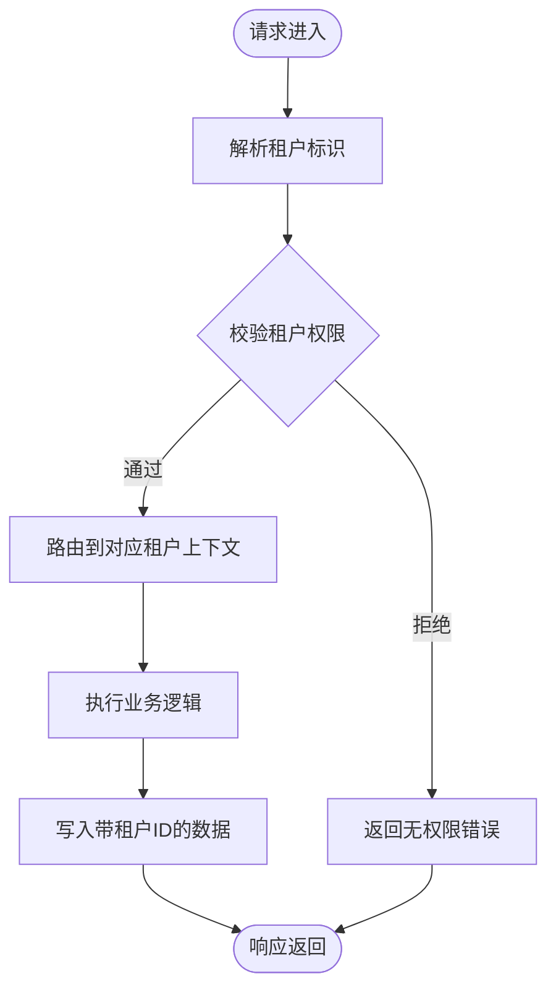
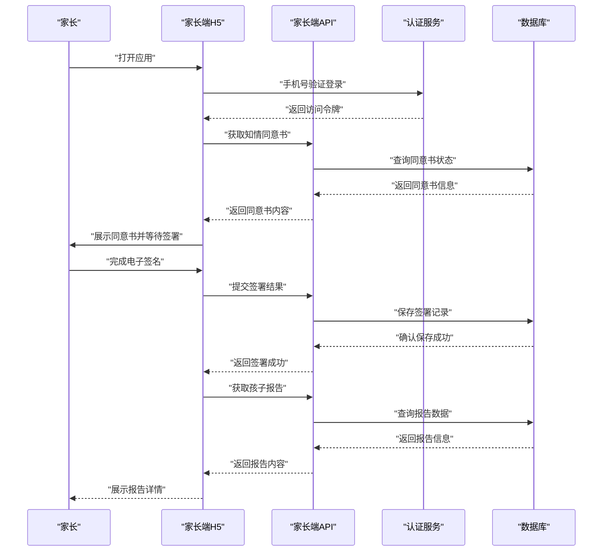
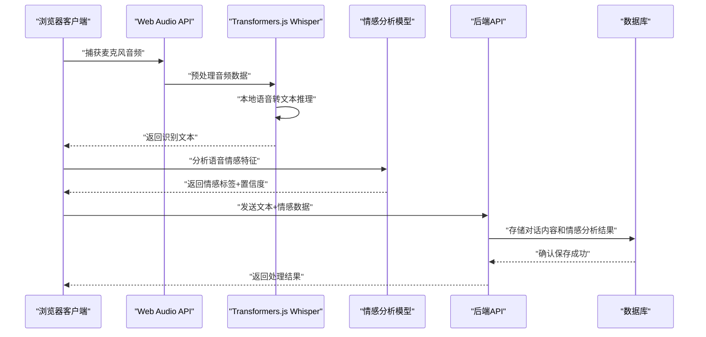
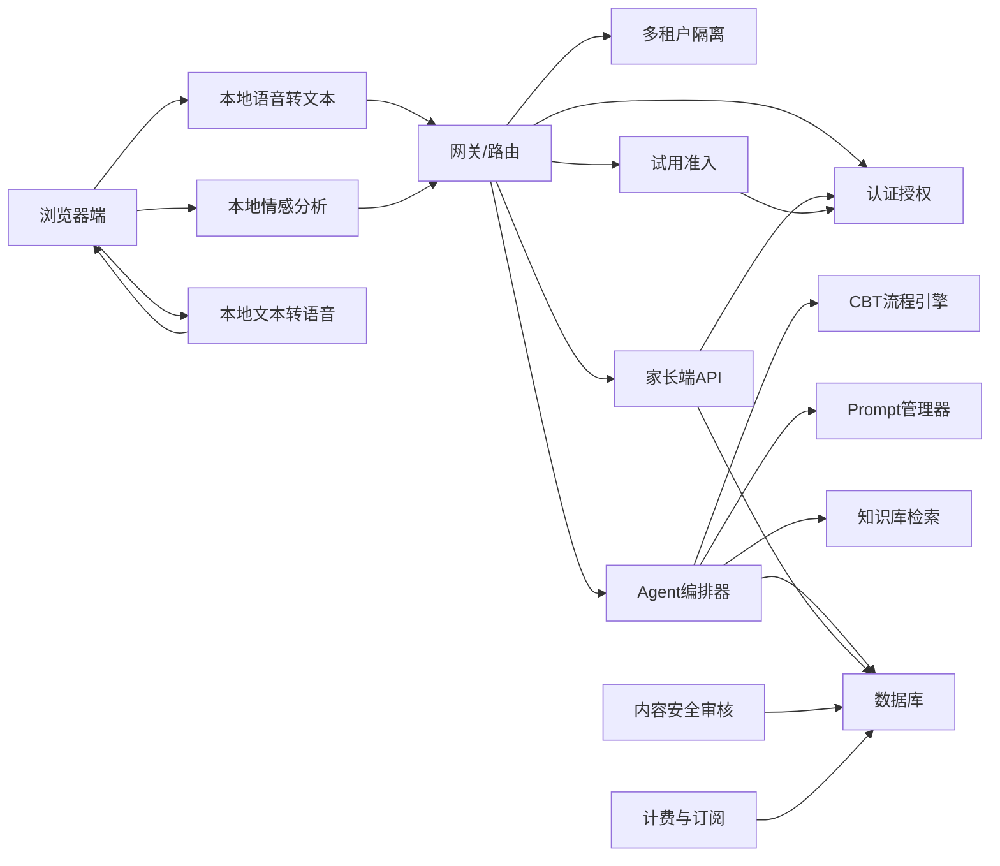

# 设计概览

<cite>
**本文引用的文件**
- [README.md](file://README.md)
- [STRUCTURE.md](file://STRUCTURE.md)
- [design/02_Prompt体系详细设计.md](file://design/02_Prompt体系详细设计.md)
- [design/04_风险识别规则库.md](file://design/04_风险识别规则库.md)
- [design/05_老师后台设计.md](file://design/05_老师后台设计.md)
- [design/07_SaaS多学校隔离架构.md](file://design/07_SaaS多学校隔离架构.md)
- [design/08_MVP最小可行版本.md](file://design/08_MVP最小可行版本.md)
- [design/12_技术架构.md](file://design/12_技术架构.md)
- [design/13_Agent工作流.md](file://design/13_Agent工作流.md)
- [design/15_心理知识库建设方案.md](file://design/15_心理知识库建设方案.md)
- [design/16_API接口设计.md](file://design/16_API接口设计.md)
- [design/17_前端架构设计.md](file://design/17_前端架构设计.md)
- [design/19_界面详细设计.md](file://design/19_界面详细设计.md)
- [design/20_端到端流程设计.md](file://design/20_端到端流程设计.md)
- [design/21_认证与试用准入设计.md](file://design/21_认证与试用准入设计.md)
- [design/24_身份认证优化方案.md](file://design/24_身份认证优化方案.md)
- [design/26_家长端H5与小程序设计.md](file://design/26_家长端H5与小程序设计.md)
- [design/29_学生画像与年龄适配设计.md](file://design/29_学生画像与年龄适配设计.md)
- [design/30_产品全景优化规划.md](file://design/30_产品全景优化规划.md)
- [design/31_等保二级差距评估.md](file://design/31_等保二级差距评估.md)
- [design/BEACON.md](file://design/BEACON.md)
- [design/TASK-TRACKER.md](file://design/TASK-TRACKER.md)
- [doc/his/20260529-初始探索prompt记录.md](file://doc/his/20260529-初始探索prompt记录.md)
- [frontend/parent-h5/src/main.jsx](file://frontend/parent-h5/src/main.jsx)
- [frontend/parent-h5/package.json](file://frontend/parent-h5/package.json)
- [frontend/parent-h5/vite.config.js](file://frontend/parent-h5/vite.config.js)
- [backend/counseling-ai/src/main/java/com/mindsafe/ai/voice/VoiceAnalysisService.java](file://backend/counseling-ai/src/main/java/com/mindsafe/ai/voice/VoiceAnalysisService.java)
- [backend/counseling-ai/src/main/java/com/mindsafe/ai/voice/TtsService.java](file://backend/counseling-ai/src/main/java/com/mindsafe/ai/voice/TtsService.java)
- [backend/counseling-api/src/main/java/com/mindsafe/api/controller/VoiceController.java](file://backend/counseling-api/src/main/java/com/mindsafe/api/controller/VoiceController.java)
- [backend/tts-service/app.py](file://backend/tts-service/app.py)
- [backend/voice-service/app.py](file://backend/voice-service/app.py)
</cite>

## 更新摘要
**所做更改**
- 更新了文档版本至2.5，添加了新设计文档的导航链接
- 新增了多个设计文档的引用：认证与试用准入设计、身份认证优化方案、学生画像与年龄适配设计、产品全景优化规划、等保二级差距评估
- 完善了设计文档体系的完整性，增强了文档间的交叉引用关系
- 保持了原有的语音处理架构和家长端H5应用内容

## 目录
1. [引言](#引言)
2. [项目结构](#项目结构)
3. [核心组件](#核心组件)
4. [架构总览](#架构总览)
5. [关键组件详解](#关键组件详解)
6. [家长端H5应用](#家长端h5应用)
7. [本地语音处理架构](#本地语音处理架构)
8. [依赖关系分析](#依赖关系分析)
9. [性能考量](#性能考量)
10. [故障排查指南](#故障排查指南)
11. [结论](#结论)
12. [附录](#附录)

## 引言
本设计概览面向AI心理咨询系统，聚焦于产品定位、整体架构、核心模块与数据流，以及工程化落地要点。文档基于仓库中的设计与说明材料进行梳理，旨在为产品、研发与运营提供统一认知基线，帮助快速理解系统边界、交互方式与扩展点。**本次重大更新引入了基于Transformers.js和Whisper模型的本地语音处理架构，完全消除了对外部语音转文本服务的依赖，实现了真正的客户端本地处理能力。** 同时，文档已更新至2.5版本，新增了对认证安全、学生画像、产品规划和安全合规等方面设计文档的完整引用。

## 项目结构
仓库采用"设计先行、代码后置"的组织方式：
- design：存放总体设计、产品架构、Agent工作流、数据库结构、SaaS多租户隔离、合规与安全等设计文档（已转换为Markdown格式并整合为独立文档）
- doc/his：沉淀Prompt资产与版本记录
- scripts：用于生成或整理设计文档的脚本
- tests：测试分层（单元、集成、端到端）
- backend：后端实现占位目录（当前为空）
- prd：产品需求文档占位目录
- tmp：临时文件
- frontend：前端应用集合，包含学生H5、教师Web和家长端H5
- README.md、STRUCTURE.md：顶层说明与仓库结构说明

**图表来源**
- [STRUCTURE.md](file://STRUCTURE.md)
- [README.md](file://README.md)

**章节来源**
- [README.md](file://README.md)
- [STRUCTURE.md](file://STRUCTURE.md)

## 核心组件
围绕AI心理咨询场景，系统由以下核心组件构成：
- 产品与业务层：产品架构、商业模式与采购逻辑、老师后台
- 智能体与工作流：Agent工作流、CBT对话流程树、Prompt体系
- 技术与数据层：技术架构、数据库结构、SaaS多学校隔离
- 安全与合规：儿童安全对话规范、政策与合规风险、风险识别规则库
- 知识支撑：心理知识库建设方案
- **更新** 本地语音处理：基于Transformers.js和Whisper模型的浏览器端语音转文本和情感分析
- **新增** 家长端H5应用：家校协同的心理支持入口，提供知情同意、报告查看等功能
- **新增** 认证与安全体系：完善的身份认证、试用准入和权限管理机制
- **新增** 学生画像系统：基于年龄和年级的个性化适配能力
- **新增** 产品全景规划：完整的演进路线和功能规划

这些组件共同形成"用户交互—智能体编排—知识检索—数据存储—合规治理"的闭环。

**章节来源**
- [design/12_技术架构.md](file://design/12_技术架构.md)
- [design/13_Agent工作流.md](file://design/13_Agent工作流.md)
- [design/07_SaaS多学校隔离架构.md](file://design/07_SaaS多学校隔离架构.md)
- [design/15_心理知识库建设方案.md](file://design/15_心理知识库建设方案.md)
- [design/05_老师后台设计.md](file://design/05_老师后台设计.md)
- [design/04_风险识别规则库.md](file://design/04_风险识别规则库.md)
- [design/26_家长端H5与小程序设计.md](file://design/26_家长端H5与小程序设计.md)
- [design/21_认证与试用准入设计.md](file://design/21_认证与试用准入设计.md)
- [design/29_学生画像与年龄适配设计.md](file://design/29_学生画像与年龄适配设计.md)
- [design/30_产品全景优化规划.md](file://design/30_产品全景优化规划.md)

## 架构总览
系统以"多角色、多租户、可编排"的形态运行：
- 角色：学生/来访者、教师/咨询师、管理员、平台运营、**家长**
- 能力：会话编排（Agent）、CBT流程驱动、提示词管理、知识库检索、内容安全审核、数据隔离与审计
- 部署：SaaS多学校隔离，支持按校维度配置与计费

**章节来源**
- [design/12_技术架构.md](file://design/12_技术架构.md)
- [design/07_SaaS多学校隔离架构.md](file://design/07_SaaS多学校隔离架构.md)
- [design/13_Agent工作流.md](file://design/13_Agent工作流.md)
- [design/26_家长端H5与小程序设计.md](file://design/26_家长端H5与小程序设计.md)
- [design/21_认证与试用准入设计.md](file://design/21_认证与试用准入设计.md)

## 关键组件详解

### 产品与业务架构
- 目标用户与价值主张：面向学校场景，提供可规模化的心理健康支持与干预辅助
- 角色与权限：学生、教师、管理员、平台运营、**家长**；细粒度权限控制
- 商业化与采购：按学校/班级/人数订阅，结合功能包与增值服务
- **新增** 产品全景规划：完整的演进路线，从MVP到企业级解决方案的渐进式发展

**章节来源**
- [design/05_老师后台设计.md](file://design/05_老师后台设计.md)
- [design/30_产品全景优化规划.md](file://design/30_产品全景优化规划.md)

### 智能体与对话编排
- Agent编排器：负责意图识别、上下文维护、工具调用与结果聚合
- CBT流程引擎：将认知行为疗法的关键步骤固化为可执行流程节点
- Prompt管理器：集中管理提示词模板、版本与A/B策略

**章节来源**
- [design/13_Agent工作流.md](file://design/13_Agent工作流.md)
- [design/02_Prompt体系详细设计.md](file://design/02_Prompt体系详细设计.md)
- [design/15_心理知识库建设方案.md](file://design/15_心理知识库建设方案.md)

### 多租户与数据隔离
- 隔离策略：按学校维度进行数据隔离，确保跨校数据不可见
- 鉴权与会话：在网关层注入租户上下文，贯穿后续所有服务调用
- 审计与合规：记录关键操作与访问轨迹，满足监管要求

**章节来源**
- [design/07_SaaS多学校隔离架构.md](file://design/07_SaaS多学校隔离架构.md)

### 安全与合规
- 风险识别规则库：建立标准化的风险识别规则和预警机制
- 儿童安全对话规范：敏感词过滤、危机预警、转人工策略、最小必要原则
- 政策与合规风险：个人信息保护、未成年人保护、数据安全与跨境传输限制
- 内容审核：输入输出双向审核，异常路径熔断与告警
- **更新** 本地数据处理：所有音频数据在浏览器端处理，不上传服务器，增强隐私保护
- **新增** 认证安全体系：完善的JWT认证、试用准入控制和权限管理机制
- **新增** 等保二级合规：满足网络安全等级保护二级要求

**章节来源**
- [design/04_风险识别规则库.md](file://design/04_风险识别规则库.md)
- [design/21_认证与试用准入设计.md](file://design/21_认证与试用准入设计.md)
- [design/24_身份认证优化方案.md](file://design/24_身份认证优化方案.md)
- [design/31_等保二级差距评估.md](file://design/31_等保二级差距评估.md)

### 知识库与Prompt资产
- 知识库：结构化条目、标签体系、版本管理与引用溯源
- Prompt体系：模板化、参数化、环境化与灰度发布
- 资产记录：Prompt迭代历史与效果评估

**章节来源**
- [design/15_心理知识库建设方案.md](file://design/15_心理知识库建设方案.md)
- [design/02_Prompt体系详细设计.md](file://design/02_Prompt体系详细设计.md)
- [doc/his/20260529-初始探索prompt记录.md](file://doc/his/20260529-初始探索prompt记录.md)

### 学生画像与年龄适配
- **新增** 学生画像系统：基于年龄、年级和心理特征的个性化适配
- **新增** 年龄适配策略：针对不同年龄段学生的差异化交互模式
- **新增** 心理特征分析：自动识别学生心理状态和需求特征

**章节来源**
- [design/29_学生画像与年龄适配设计.md](file://design/29_学生画像与年龄适配设计.md)

## 家长端H5应用

### 应用概述
家长端H5应用是AI心理咨询系统的重要组成部分，为家长提供便捷的移动端入口，实现家校协同的心理支持。该应用基于现代前端技术栈构建，支持移动设备优化体验。

### 技术架构
- **前端框架**：React + Vite，提供现代化的开发体验和优秀的性能表现
- **UI组件库**：基于Ant Design Mobile，适配移动端交互模式
- **状态管理**：使用React Hooks进行轻量级状态管理
- **网络请求**：统一的API封装，支持JWT认证和错误处理
- **构建工具**：Vite构建系统，支持热重载和快速开发

### 核心功能模块
- **知情同意管理**：在线签署电子知情同意书，支持多种签署方式
- **报告查看**：实时查看孩子的心理咨询报告和成长档案
- **验证登录**：基于手机号和验证码的安全登录机制
- **消息通知**：接收重要的心理预警和咨询安排通知

### 用户交互流程

### 安全与隐私保护
- **数据加密**：敏感数据传输采用HTTPS加密
- **身份验证**：基于JWT的无状态认证机制
- **权限控制**：严格的家长-孩子关联关系验证
- **数据脱敏**：报告中自动隐藏敏感个人信息
- **审计日志**：完整记录家长端操作行为

### 部署与运维
- **容器化部署**：基于Nginx的静态资源服务器
- **CDN加速**：静态资源通过CDN分发提升访问速度
- **监控告警**：前端错误监控和用户行为分析
- **版本管理**：支持灰度发布和快速回滚

**章节来源**
- [frontend/parent-h5/src/main.jsx](file://frontend/parent-h5/src/main.jsx)
- [frontend/parent-h5/package.json](file://frontend/parent-h5/package.json)
- [frontend/parent-h5/vite.config.js](file://frontend/parent-h5/vite.config.js)
- [design/26_家长端H5与小程序设计.md](file://design/26_家长端H5与小程序设计.md)

## 本地语音处理架构

### 架构概述
系统已从依赖外部语音转文本服务转变为完全基于浏览器端的本地处理能力。这一架构升级采用了Transformers.js和Whisper模型，实现了高质量的语音转文本和情感分析功能，同时确保了数据的隐私性和安全性。

### 核心技术栈
- **语音转文本**：Transformers.js + Whisper模型，支持中文和英文语音识别
- **情感分析**：浏览器端机器学习模型，实时分析语音情感特征
- **文本转语音**：Web Speech API，提供自然的语音合成
- **音频处理**：原生Web Audio API，支持实时音频流处理
- **模型优化**：模型量化和压缩，优化浏览器端加载和推理性能

### 本地处理流程

### 隐私保护优势
- **零数据上传**：所有音频处理在浏览器端完成，原始音频数据不离开用户设备
- **模型本地化**：AI模型预加载到浏览器，无需网络连接即可运行
- **内存管理**：音频数据仅在内存中处理，处理完成后立即释放
- **权限控制**：严格的用户授权机制，仅在有明确授权时访问麦克风

### 性能优化策略
- **模型懒加载**：按需加载语音模型，减少初始页面加载时间
- **Web Worker**：使用Web Worker进行重型计算，避免阻塞主线程
- **缓存策略**：模型文件和音频数据缓存，提升重复使用性能
- **降级方案**：在不支持WebGL的设备上自动降级到CPU推理

**章节来源**
- [backend/counseling-ai/src/main/java/com/mindsafe/ai/voice/VoiceAnalysisService.java](file://backend/counseling-ai/src/main/java/com/mindsafe/ai/voice/VoiceAnalysisService.java)
- [backend/counseling-ai/src/main/java/com/mindsafe/ai/voice/TtsService.java](file://backend/counseling-ai/src/main/java/com/mindsafe/ai/voice/TtsService.java)
- [backend/counseling-api/src/main/java/com/mindsafe/api/controller/VoiceController.java](file://backend/counseling-api/src/main/java/com/mindsafe/api/controller/VoiceController.java)

## 依赖关系分析
- 组件耦合：Agent编排器对CBT流程、Prompt与知识库存在强依赖；多租户与鉴权作为横切关注点贯穿全链路
- 外部依赖：数据库、对象存储、内容安全服务、计费与订阅服务
- 潜在环依赖：应避免Agent直接反向依赖网关层，保持单向调用链
- **更新** 本地处理能力：移除了对外部语音服务的依赖，所有语音处理在浏览器端完成
- **新增** 家长端依赖：家长端H5应用依赖认证服务和家长端API，与主系统通过统一网关进行通信
- **新增** 认证依赖：完善的JWT认证、试用准入和权限控制机制

**章节来源**
- [design/12_技术架构.md](file://design/12_技术架构.md)
- [design/13_Agent工作流.md](file://design/13_Agent工作流.md)
- [design/07_SaaS多学校隔离架构.md](file://design/07_SaaS多学校隔离架构.md)
- [design/26_家长端H5与小程序设计.md](file://design/26_家长端H5与小程序设计.md)
- [design/21_认证与试用准入设计.md](file://design/21_认证与试用准入设计.md)

## 性能考量
- 并发与吞吐：网关限流、连接池与异步编排，避免长阻塞
- 缓存策略：热点知识片段与会话摘要缓存，降低重复计算
- 批处理与分页：批量导入知识库、分页查询对话记录
- 资源隔离：按租户分配资源配额，防止单租户影响全局
- **更新** 本地处理优化：浏览器端并行推理、Web Worker多线程处理、模型量化优化
- **新增** 家长端优化：静态资源CDN加速、移动端网络优化、离线缓存策略
- **新增** 内存管理：音频数据及时释放、模型懒加载、WebAssembly优化
- **新增** 认证性能：JWT令牌缓存、会话复用、分布式锁优化

## 故障排查指南
- 常见问题定位：
  - 会话中断：检查网关超时、Agent编排重试与幂等性
  - 内容审核拦截：核对敏感词库更新与阈值策略
  - 多租户越权：验证租户上下文注入与权限校验链路
  - 知识库检索失败：确认索引健康与向量检索服务可用性
  - **更新** 本地语音处理失败：检查浏览器兼容性、Web Audio API支持、模型加载状态
  - **新增** 家长端登录失败：验证手机号验证服务、JWT令牌生成、家长-孩子关联关系
  - **新增** 认证失败：检查JWT配置、试用码有效性、权限验证逻辑
- 日志与追踪：
  - 全链路Trace ID透传
  - 关键节点埋点（意图识别、流程跳转、知识命中、审核结果）
  - **更新** 本地处理日志：浏览器控制台日志、Web Worker通信日志、模型推理性能指标
  - **新增** 家长端操作日志（登录行为、报告访问、同意书签署）
  - **新增** 认证日志（登录尝试、权限变更、试用注册）
- 回滚与降级：
  - Prompt版本灰度与一键回滚
  - 非关键路径降级（如关闭推荐知识）
  - **更新** 本地语音降级：切换到手动文本输入模式、启用备用语音识别服务
  - **新增** 家长端服务降级（切换到基础报告查看模式）
  - **新增** 认证降级（切换到本地缓存认证、简化权限验证）

**章节来源**
- [design/13_Agent工作流.md](file://design/13_Agent工作流.md)
- [design/07_SaaS多学校隔离架构.md](file://design/07_SaaS多学校隔离架构.md)
- [design/26_家长端H5与小程序设计.md](file://design/26_家长端H5与小程序设计.md)
- [design/21_认证与试用准入设计.md](file://design/21_认证与试用准入设计.md)

## 结论
本设计概览从产品、智能体编排、数据与合规四个维度构建了AI心理咨询系统的整体蓝图。通过明确的角色与权限、可编排的Agent与CBT流程、严格的儿童安全与合规约束，以及SaaS多租户隔离，系统在可扩展性与安全性之间取得平衡。**本次重大架构升级引入了基于Transformers.js和Whisper模型的本地语音处理能力，完全消除了对外部服务的依赖，显著提升了系统的隐私保护能力和响应性能。新增的家长端H5应用进一步完善了家校协同的心理支持生态，使家长能够便捷地参与孩子的心理健康管理。同时，文档更新至2.5版本，新增了对认证安全、学生画像、产品规划和安全合规等方面设计文档的完整引用，形成了更加完善的设计文档体系。** 这一架构转变不仅提升了用户体验，也为系统的长期发展奠定了坚实的技术基础。后续建议优先完善后端实现与测试体系，逐步引入监控与可观测性，持续优化Prompt与知识库质量，保障用户体验与服务稳定性。

## 附录
- 任务跟踪与里程碑：参考任务跟踪文档，了解阶段目标与交付物
- MVP规划：参考最小可行版本文档，了解产品演进路线
- 顶层说明：README与仓库结构说明便于新成员快速上手
- **新增** 认证与安全设计：详细的身份认证、试用准入和权限控制方案
- **新增** 学生画像设计：基于年龄和年级的个性化适配策略
- **新增** 产品全景规划：完整的演进路线和功能发展规划
- **新增** 安全合规评估：等保二级合规要求和差距分析

**章节来源**
- [design/TASK-TRACKER.md](file://design/TASK-TRACKER.md)
- [design/08_MVP最小可行版本.md](file://design/08_MVP最小可行版本.md)
- [README.md](file://README.md)
- [STRUCTURE.md](file://STRUCTURE.md)
- [design/21_认证与试用准入设计.md](file://design/21_认证与试用准入设计.md)
- [design/29_学生画像与年龄适配设计.md](file://design/29_学生画像与年龄适配设计.md)
- [design/30_产品全景优化规划.md](file://design/30_产品全景优化规划.md)
- [design/31_等保二级差距评估.md](file://design/31_等保二级差距评估.md)
