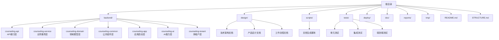
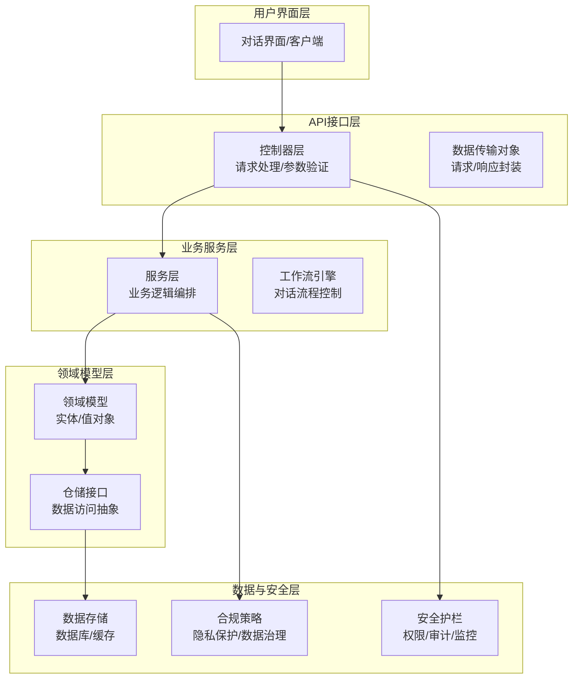
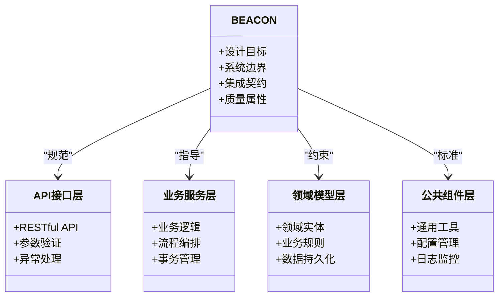
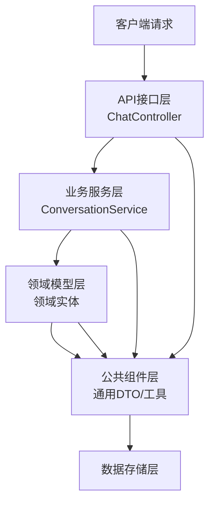
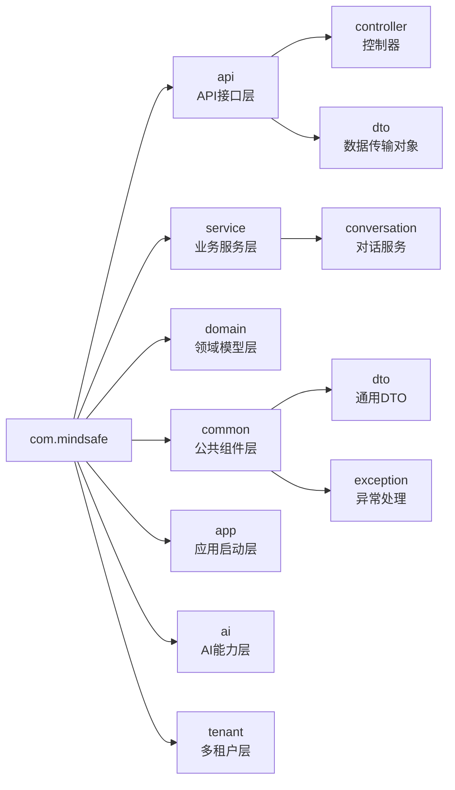
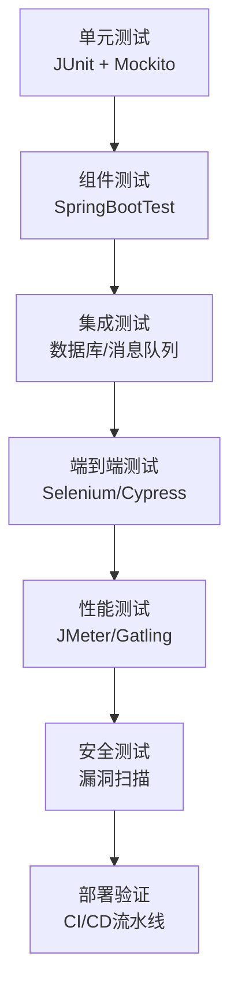
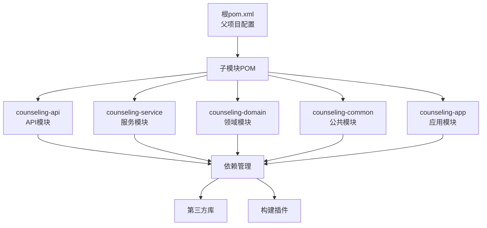
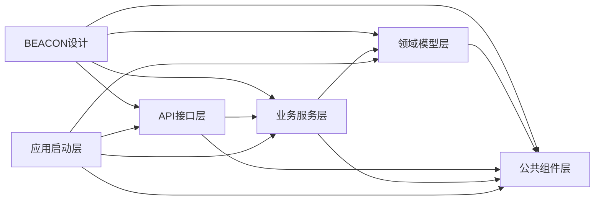

# 项目概述

<cite>
**本文引用的文件**   
- [README.md](file://README.md)
- [STRUCTURE.md](file://STRUCTURE.md)
- [backend/pom.xml](file://backend/pom.xml)
- [backend/counseling-api/src/main/java/com/mindsafe/api/controller/ChatController.java](file://backend/counseling-api/src/main/java/com/mindsafe/api/controller/ChatController.java)
- [backend/counseling-common/src/main/java/com/mindsafe/common/dto/ApiResponse.java](file://backend/counseling-common/src/main/java/com/mindsafe/common/dto/ApiResponse.java)
- [backend/counseling-service/src/main/java/com/mindsafe/service/conversation/ConversationService.java](file://backend/counseling-service/src/main/java/com/mindsafe/service/conversation/ConversationService.java)
- [backend/counseling-app/src/main/java/com/mindsafe/app/MindSafeApplication.java](file://backend/counseling-app/src/main/java/com/mindsafe/app/MindSafeApplication.java)
- [design/12_技术架构.md](file://design/12_技术架构.md)
- [design/01_产品架构图.md](file://design/01_产品架构图.md)
- [design/13_Agent工作流.md](file://design/13_Agent工作流.md)
</cite>

## 更新摘要
**变更内容**   
- 增强了项目结构文档，详细说明了包命名约定、测试策略、工件管理和模块依赖层次结构
- 更新了分层架构设计，明确了严格的分层方法
- 新增了后端模块的详细结构和依赖关系说明
- 完善了Java/Spring Boot项目的企业级特性描述

## 目录
1. [引言](#引言)
2. [项目结构](#项目结构)
3. [核心组件](#核心组件)
4. [架构总览](#架构总览)
5. [详细组件分析](#详细组件分析)
6. [技术栈与实现](#技术栈与实现)
7. [依赖分析](#依赖分析)
8. [性能考虑](#性能考虑)
9. [故障排查指南](#故障排查指南)
10. [结论](#结论)
11. [附录](#附录)

## 引言
本项目为AI心理咨询系统，围绕"安全、可解释、可演进"的设计原则，构建以对话为核心的智能心理支持能力。系统聚焦于：
- 面向用户的自然语言交互与引导式对话
- 基于提示工程与流程编排的咨询策略实现
- 可扩展的Agent工作流与Prompt体系
- 面向儿童等敏感群体的安全护栏与合规约束
- 与外部模型与服务的安全集成边界

在AI心理咨询领域，本项目的价值在于将专业咨询方法（如认知行为疗法CBT）与AI能力结合，提供可复现、可审计、可迭代的对话体验，同时通过明确的系统边界与治理机制保障用户安全与隐私。

**更新** 项目已完成从Python/LangGraph到Java/Spring Boot的技术栈迁移，并采用严格的分层架构设计，提升了系统的企业级特性和可维护性。

## 项目结构
仓库采用"文档驱动+脚本化资产生成"的组织方式，核心设计说明位于 design 目录，自动化脚本位于 scripts 目录，测试与源码分别位于 tests 与 backend 目录。顶层 README 与 STRUCTURE 提供全局概览与结构说明。

**更新** 新增了详细的后端模块结构，体现了严格的分层架构设计和模块化组织。

图表来源
- [STRUCTURE.md](file://STRUCTURE.md)
- [README.md](file://README.md)

章节来源
- [README.md](file://README.md)
- [STRUCTURE.md](file://STRUCTURE.md)

## 核心组件
- BEACON系统设计：定义整体设计理念、目标与边界，指导后续模块划分与集成策略。
- Prompt资产与体系：集中管理提示词模板、版本与迭代记录，支撑对话策略与风格一致性。
- Agent工作流与CBT流程：通过脚本化文档生成，沉淀可执行的对话流程与分支逻辑。
- 儿童安全与合规：针对未成年人场景的安全策略与护栏设计。
- 业务模式与商业化：用于对齐产品定位与商业模式，指导功能优先级与扩展方向。
- Java/Spring Boot后端：采用严格分层架构，提供企业级REST API、会话管理和业务逻辑处理。

**更新** 新增了详细的后端分层架构组件，包括API接口层、业务服务层、领域模型层和公共组件层。

章节来源
- [design/12_技术架构.md](file://design/12_技术架构.md)
- [design/13_Agent工作流.md](file://design/13_Agent工作流.md)

## 架构总览
从系统视角看，AI心理咨询系统由"用户界面层—API接口层—业务服务层—领域模型层—数据与安全层"构成。BEACON作为总体设计蓝图，贯穿各层并明确职责边界与集成点。

**更新** 新增了完整的分层架构视图，清晰展示了各层的职责和依赖关系。

图表来源
- [design/12_技术架构.md](file://design/12_技术架构.md)
- [design/01_产品架构图.md](file://design/01_产品架构图.md)

## 详细组件分析

### BEACON系统设计
BEACON作为总体设计蓝图，明确了系统的目标、范围、关键能力与非功能性要求，并对与其他组件的关系进行约定。其要点包括：
- 设计目标：安全优先、可解释、可演进、可度量
- 系统边界：对话编排与策略执行分离；提示词与流程可独立迭代
- 集成关系：与LLM、工具、存储、安全护栏的接口契约
- 质量属性：可用性、可观测性、可回滚、可审计

**更新** 新增了分层架构类图，体现了新的模块化设计思想。

图表来源
- [design/12_技术架构.md](file://design/12_技术架构.md)

章节来源
- [design/12_技术架构.md](file://design/12_技术架构.md)

### 后端分层架构设计
采用严格的分层架构，确保代码的可维护性、可测试性和可扩展性。

**更新** 新增了详细的分层架构流程图，展示了请求处理的完整链路。

图表来源
- [backend/counseling-api/src/main/java/com/mindsafe/api/controller/ChatController.java](file://backend/counseling-api/src/main/java/com/mindsafe/api/controller/ChatController.java)
- [backend/counseling-service/src/main/java/com/mindsafe/service/conversation/ConversationService.java](file://backend/counseling-service/src/main/java/com/mindsafe/service/conversation/ConversationService.java)
- [backend/counseling-common/src/main/java/com/mindsafe/common/dto/ApiResponse.java](file://backend/counseling-common/src/main/java/com/mindsafe/common/dto/ApiResponse.java)

章节来源
- [backend/counseling-api/src/main/java/com/mindsafe/api/controller/ChatController.java](file://backend/counseling-api/src/main/java/com/mindsafe/api/controller/ChatController.java)
- [backend/counseling-service/src/main/java/com/mindsafe/service/conversation/ConversationService.java](file://backend/counseling-service/src/main/java/com/mindsafe/service/conversation/ConversationService.java)
- [backend/counseling-common/src/main/java/com/mindsafe/common/dto/ApiResponse.java](file://backend/counseling-common/src/main/java/com/mindsafe/common/dto/ApiResponse.java)

### 包命名约定与模块组织
遵循清晰的包命名约定，确保代码结构的统一性和可读性。

**更新** 新增了详细的包结构图，体现了规范的命名约定和模块划分。

图表来源
- [backend/counseling-api/src/main/java/com/mindsafe/api/](file://backend/counseling-api/src/main/java/com/mindsafe/api/)
- [backend/counseling-service/src/main/java/com/mindsafe/service/](file://backend/counseling-service/src/main/java/com/mindsafe/service/)
- [backend/counseling-common/src/main/java/com/mindsafe/common/](file://backend/counseling-common/src/main/java/com/mindsafe/common/)

章节来源
- [backend/counseling-api/src/main/java/com/mindsafe/api/](file://backend/counseling-api/src/main/java/com/mindsafe/api/)
- [backend/counseling-service/src/main/java/com/mindsafe/service/](file://backend/counseling-service/src/main/java/com/mindsafe/service/)
- [backend/counseling-common/src/main/java/com/mindsafe/common/](file://backend/counseling-common/src/main/java/com/mindsafe/common/)

### 测试策略与质量保证
采用多层测试策略，确保代码质量和系统稳定性。

**更新** 新增了完整的测试金字塔图，展示了多层次的质量保证体系。

图表来源
- [tests/unit/](file://tests/unit/)
- [tests/integration/](file://tests/integration/)
- [tests/e2e/](file://tests/e2e/)

章节来源
- [tests/unit/](file://tests/unit/)
- [tests/integration/](file://tests/integration/)
- [tests/e2e/](file://tests/e2e/)

### 工件管理与构建配置
使用Maven进行统一的工件管理和构建配置。

**更新** 新增了Maven构建配置图，展示了模块间的依赖关系。

图表来源
- [backend/pom.xml](file://backend/pom.xml)

章节来源
- [backend/pom.xml](file://backend/pom.xml)

## 技术栈与实现

### 后端技术栈
- **Java 17+**: 企业级编程语言，提供强大的类型安全和性能保证
- **Spring Boot 3.x**: 现代化Java应用框架，提供自动配置、嵌入式服务器和微服务支持
- **Spring Security**: 企业级安全框架，提供认证、授权和防护机制
- **Spring Data JPA**: 数据访问抽象层，简化数据库操作
- **Maven**: 项目管理和构建工具，支持多模块项目管理
- **JUnit 5**: 单元测试框架，支持现代测试实践
- **Mockito**: Mock框架，用于单元测试中的依赖模拟

### 前端技术栈
- **React/Vue.js**: 现代前端框架，提供响应式用户界面
- **WebSocket**: 实时通信支持
- **TypeScript**: 类型安全的JavaScript超集

### AI/ML技术栈
- **LangChain理念**: 保留了LangChain的设计理念，但采用Java实现
- **OpenAI API/本地模型**: 大语言模型服务集成
- **向量数据库**: 语义搜索和知识检索

**更新** 完善了Java/Spring Boot技术栈描述，新增了Maven、JUnit 5和Mockito等企业级开发工具。

## 依赖分析
- 内部依赖
  - BEACON对对话编排、提示词仓库、安全护栏具有指导与约束作用
  - API接口层依赖业务服务层和公共组件层
  - 业务服务层依赖领域模型层和公共组件层
  - 领域模型层依赖公共组件层
  - 应用启动层依赖所有其他模块
- 外部依赖
  - 大模型服务：负责文本生成与推理
  - 工具与插件：量表、知识库、评估工具等
  - 存储与日志：会话、审计与可观测性数据
  - 第三方API：支付、短信、邮件等服务
- 耦合与内聚
  - 通过BEACON定义的接口契约降低耦合度
  - 分层架构提升内聚性与可维护性
  - Maven多模块设计提高了组件的可测试性

**更新** 新增了分层架构的依赖关系图，清晰展示了模块间的依赖方向。

图表来源
- [backend/pom.xml](file://backend/pom.xml)
- [design/12_技术架构.md](file://design/12_技术架构.md)

章节来源
- [backend/pom.xml](file://backend/pom.xml)
- [design/12_技术架构.md](file://design/12_技术架构.md)

## 性能考虑
- 提示词缓存与复用：对高频模板进行缓存，减少重复计算
- 流式输出与增量渲染：提升首字延迟与用户体验
- 并发与限流：对模型调用进行并发控制与降级策略
- 可观测性：埋点与指标采集，支撑容量规划与问题定位
- Spring Boot异步处理和连接池优化
- Redis缓存层减少数据库压力
- 负载均衡和水平扩展支持
- **新增** Maven构建优化和增量编译
- **新增** 多线程处理和线程池管理
- **新增** JVM调优和内存管理

## 故障排查指南
- 常见问题定位
  - 提示词版本不一致：核对版本登记与变更记录
  - 流程分支异常：检查流程配置与条件判断
  - 安全误判/漏判：调整阈值与规则，补充样本
  - Spring Boot应用启动失败：检查端口冲突和配置文件
  - 数据库连接问题：验证连接字符串和权限设置
  - API响应超时：检查下游服务健康状态和超时配置
  - **新增** Maven构建失败：检查依赖版本冲突和仓库配置
  - **新增** 单元测试失败：检查Mock配置和测试数据
  - **新增** 模块依赖错误：检查POM配置和依赖声明
- 诊断手段
  - 查看会话与审计日志
  - 回放关键步骤与模型调用
  - 使用离线评测集回归验证
  - Spring Boot Actuator端点监控
  - APM工具进行链路追踪
  - 结构化日志分析和告警
  - **新增** Maven调试模式和详细日志
  - **新增** 单元测试覆盖率分析
  - **新增** 依赖树分析和冲突检测

## 结论
本项目以BEACON为总体设计蓝图，围绕"安全、可解释、可演进"的原则，构建了以对话编排与提示词体系为核心的AI心理咨询系统。通过严格的分层架构设计和清晰的系统边界与集成契约，系统在保障用户安全的前提下，实现了策略的可复用与持续迭代，具备良好的扩展性与可维护性。

**更新** 完成向Java/Spring Boot的技术栈迁移并采用严格分层架构后，系统获得了更强的企业级特性、更好的性能和更完善的生态系统支持，为大规模部署和生产环境提供了坚实基础。

## 附录
- 术语表
  - BEACON：系统总体设计蓝图
  - 提示词：用于引导模型行为的指令与模板
  - 流程引擎：承载对话流程与分支逻辑的执行单元
  - 安全护栏：用于风险识别、转介与熔断的策略集合
  - Spring Boot：基于Java的企业级应用开发框架
  - REST API：基于HTTP协议的Web服务接口标准
  - **新增** 分层架构：将系统划分为不同职责层次的架构模式
  - **新增** Maven：Java项目管理和构建工具
  - **新增** 多模块项目：包含多个相互依赖的模块的项目结构
- 参考文档
  - 顶层概览与结构说明参见 README 与 STRUCTURE
  - 技术架构详细说明参见 design/12_技术架构.md
  - 产品架构设计参见 design/01_产品架构图.md
  - **新增** 后端模块结构参见 backend/pom.xml
  - **新增** API接口设计参见 backend/counseling-api/src/main/java/com/mindsafe/api/controller/ChatController.java
  - **新增** 服务层设计参见 backend/counseling-service/src/main/java/com/mindsafe/service/conversation/ConversationService.java

章节来源
- [README.md](file://README.md)
- [STRUCTURE.md](file://STRUCTURE.md)
- [design/12_技术架构.md](file://design/12_技术架构.md)
- [design/01_产品架构图.md](file://design/01_产品架构图.md)
- [backend/pom.xml](file://backend/pom.xml)
- [backend/counseling-api/src/main/java/com/mindsafe/api/controller/ChatController.java](file://backend/counseling-api/src/main/java/com/mindsafe/api/controller/ChatController.java)
- [backend/counseling-service/src/main/java/com/mindsafe/service/conversation/ConversationService.java](file://backend/counseling-service/src/main/java/com/mindsafe/service/conversation/ConversationService.java)
