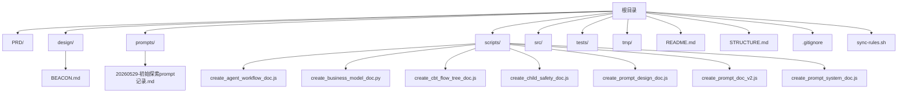
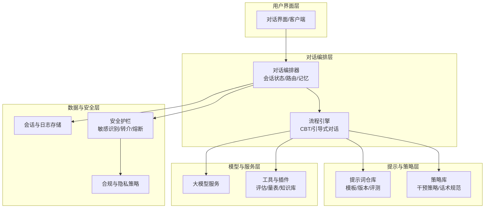
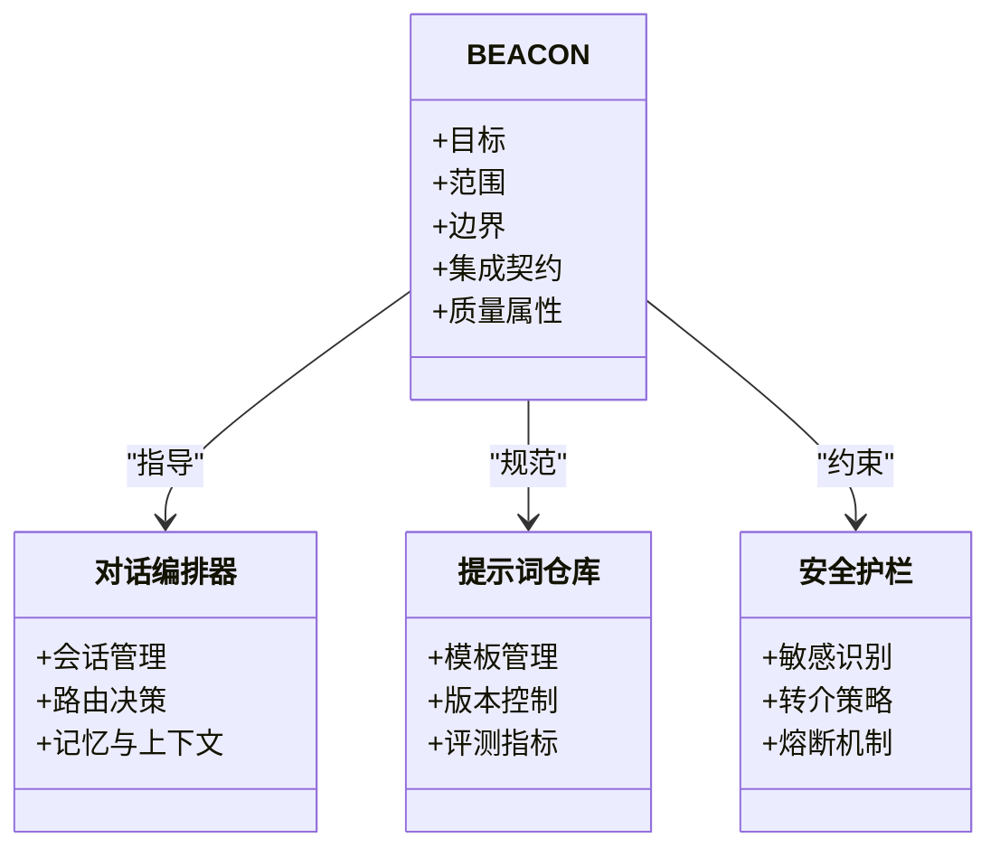
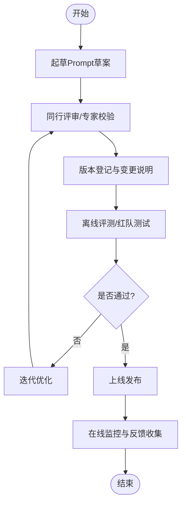
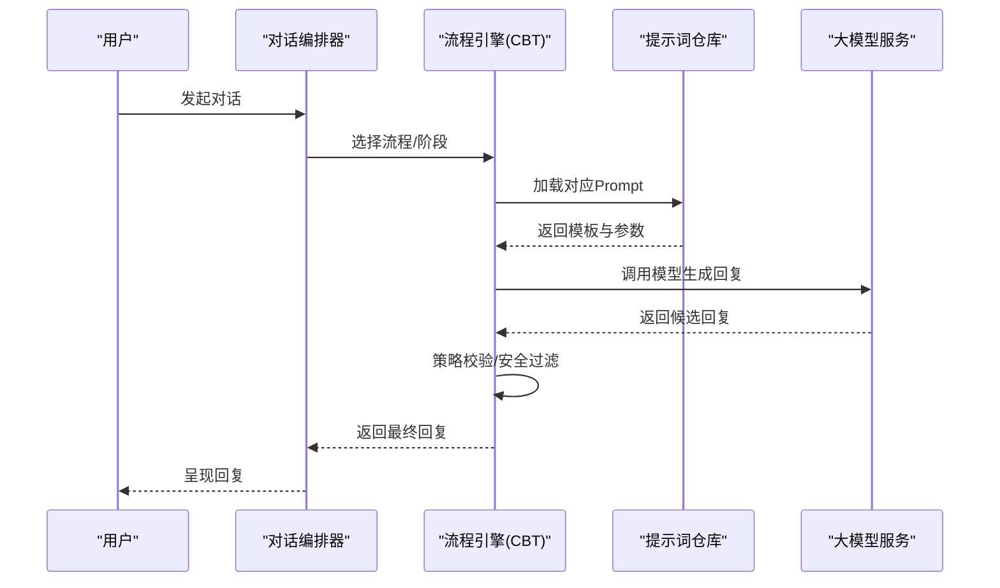
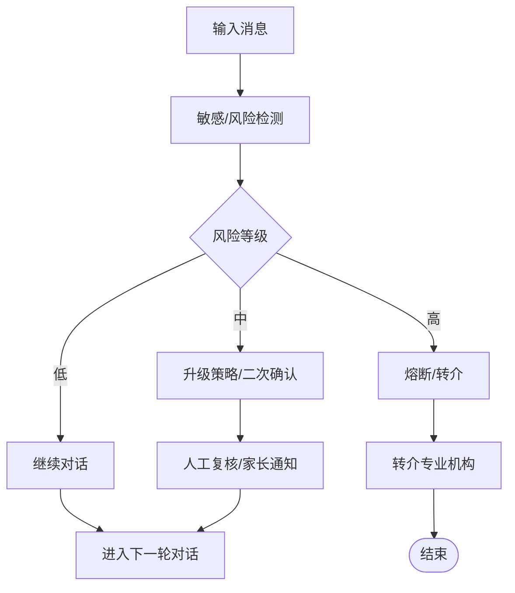
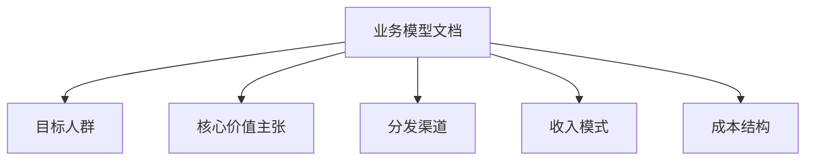
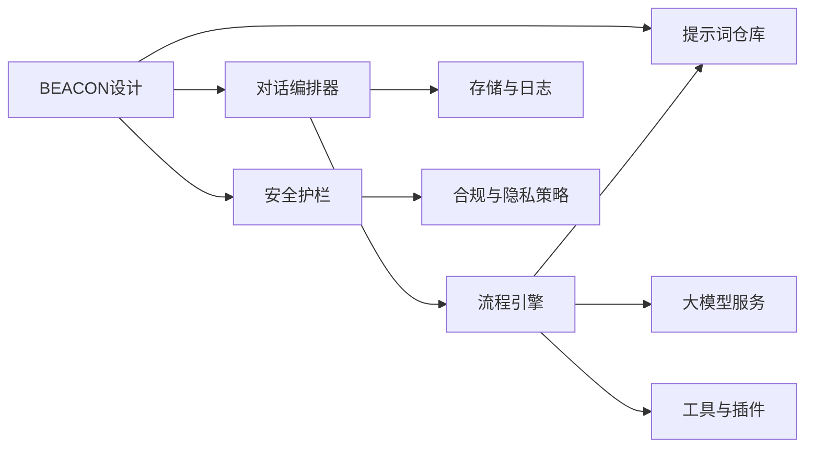

# 项目概述

<cite>
**本文引用的文件**   
- [README.md](file://README.md)
- [STRUCTURE.md](file://STRUCTURE.md)
- [design/BEACON.md](file://design/BEACON.md)
- [prompts/20260529-初始探索prompt记录.md](file://prompts/20260529-初始探索prompt记录.md)
</cite>

## 目录
1. [引言](#引言)
2. [项目结构](#项目结构)
3. [核心组件](#核心组件)
4. [架构总览](#架构总览)
5. [详细组件分析](#详细组件分析)
6. [依赖分析](#依赖分析)
7. [性能考虑](#性能考虑)
8. [故障排查指南](#故障排查指南)
9. [结论](#结论)
10. [附录](#附录)

## 引言
本项目为AI心理咨询系统，围绕“安全、可解释、可演进”的设计原则，构建以对话为核心的智能心理支持能力。系统聚焦于：
- 面向用户的自然语言交互与引导式对话
- 基于提示工程与流程编排的咨询策略实现
- 可扩展的Agent工作流与Prompt体系
- 面向儿童等敏感群体的安全护栏与合规约束
- 与外部模型与服务的安全集成边界

在AI心理咨询领域，本项目的价值在于将专业咨询方法（如认知行为疗法CBT）与AI能力结合，提供可复现、可审计、可迭代的对话体验，同时通过明确的系统边界与治理机制保障用户安全与隐私。

## 项目结构
仓库采用“文档驱动+脚本化资产生成”的组织方式，核心设计说明位于 design 目录，提示词资产位于 prompts 目录，自动化脚本位于 scripts 目录，测试与源码分别位于 tests 与 src 目录。顶层 README 与 STRUCTURE 提供全局概览与结构说明。

图表来源
- [STRUCTURE.md](file://STRUCTURE.md)
- [README.md](file://README.md)

章节来源
- [README.md](file://README.md)
- [STRUCTURE.md](file://STRUCTURE.md)

## 核心组件
- BEACON系统设计：定义整体设计理念、目标与边界，指导后续模块划分与集成策略。
- Prompt资产与体系：集中管理提示词模板、版本与迭代记录，支撑对话策略与风格一致性。
- Agent工作流与CBT流程：通过脚本化文档生成，沉淀可执行的对话流程与分支逻辑。
- 儿童安全与合规：针对未成年人场景的安全策略与护栏设计。
- 业务模式与商业化：用于对齐产品定位与商业模式，指导功能优先级与扩展方向。

章节来源
- [design/BEACON.md](file://design/BEACON.md)
- [prompts/20260529-初始探索prompt记录.md](file://prompts/20260529-初始探索prompt记录.md)

## 架构总览
从系统视角看，AI心理咨询系统由“用户界面层—对话编排层—提示与策略层—模型与服务层—数据与安全层”构成。BEACON作为总体设计蓝图，贯穿各层并明确职责边界与集成点。

图表来源
- [design/BEACON.md](file://design/BEACON.md)

## 详细组件分析

### BEACON系统设计
BEACON作为总体设计蓝图，明确了系统的目标、范围、关键能力与非功能性要求，并对与其他组件的关系进行约定。其要点包括：
- 设计目标：安全优先、可解释、可演进、可度量
- 系统边界：对话编排与策略执行分离；提示词与流程可独立迭代
- 集成关系：与LLM、工具、存储、安全护栏的接口契约
- 质量属性：可用性、可观测性、可回滚、可审计

图表来源
- [design/BEACON.md](file://design/BEACON.md)

章节来源
- [design/BEACON.md](file://design/BEACON.md)

### Prompt资产与体系
Prompt资产是策略落地的载体，强调版本化、可追踪与可评测。初始探索记录体现了早期思路与迭代路径，为后续系统化Prompt工程奠定基础。

图表来源
- [prompts/20260529-初始探索prompt记录.md](file://prompts/20260529-初始探索prompt记录.md)

章节来源
- [prompts/20260529-初始探索prompt记录.md](file://prompts/20260529-初始探索prompt记录.md)

### Agent工作流与CBT流程
通过脚本化文档生成，沉淀标准化的对话流程与分支逻辑，确保CBT等方法的稳定落地与可复用。

图表来源
- [design/BEACON.md](file://design/BEACON.md)

章节来源
- [design/BEACON.md](file://design/BEACON.md)

### 儿童安全与合规
针对未成年人场景，建立前置识别、分级响应与转介机制，确保在高风险情境下及时引入人工或专业资源。

图表来源
- [design/BEACON.md](file://design/BEACON.md)

章节来源
- [design/BEACON.md](file://design/BEACON.md)

### 业务模式与商业化
通过脚本生成商业模型文档，对齐产品定位、目标人群与变现路径，指导功能优先级与资源投入。

图表来源
- [design/BEACON.md](file://design/BEACON.md)

章节来源
- [design/BEACON.md](file://design/BEACON.md)

## 依赖分析
- 内部依赖
  - BEACON对对话编排、提示词仓库、安全护栏具有指导与约束作用
  - 提示词仓库为流程引擎提供模板与参数
  - 流程引擎协调模型服务与工具插件
- 外部依赖
  - 大模型服务：负责文本生成与推理
  - 工具与插件：量表、知识库、评估工具等
  - 存储与日志：会话、审计与可观测性数据
- 耦合与内聚
  - 通过BEACON定义的接口契约降低耦合度
  - 提示词与流程解耦，提升内聚性与可维护性

图表来源
- [design/BEACON.md](file://design/BEACON.md)

章节来源
- [design/BEACON.md](file://design/BEACON.md)

## 性能考虑
- 提示词缓存与复用：对高频模板进行缓存，减少重复计算
- 流式输出与增量渲染：提升首字延迟与用户体验
- 并发与限流：对模型调用进行并发控制与降级策略
- 可观测性：埋点与指标采集，支撑容量规划与问题定位

[本节为通用建议，不直接分析具体文件]

## 故障排查指南
- 常见问题定位
  - 提示词版本不一致：核对版本登记与变更记录
  - 流程分支异常：检查流程配置与条件判断
  - 安全误判/漏判：调整阈值与规则，补充样本
- 诊断手段
  - 查看会话与审计日志
  - 回放关键步骤与模型调用
  - 使用离线评测集回归验证

章节来源
- [design/BEACON.md](file://design/BEACON.md)

## 结论
本项目以BEACON为总体设计蓝图，围绕“安全、可解释、可演进”的原则，构建了以对话编排与提示词体系为核心的AI心理咨询系统。通过清晰的系统边界与集成契约，系统在保障用户安全的前提下，实现了策略的可复用与持续迭代，具备良好的扩展性与可维护性。

[本节为总结性内容，不直接分析具体文件]

## 附录
- 术语表
  - BEACON：系统总体设计蓝图
  - 提示词：用于引导模型行为的指令与模板
  - 流程引擎：承载对话流程与分支逻辑的执行单元
  - 安全护栏：用于风险识别、转介与熔断的策略集合
- 参考文档
  - 顶层概览与结构说明参见 README 与 STRUCTURE

章节来源
- [README.md](file://README.md)
- [STRUCTURE.md](file://STRUCTURE.md)