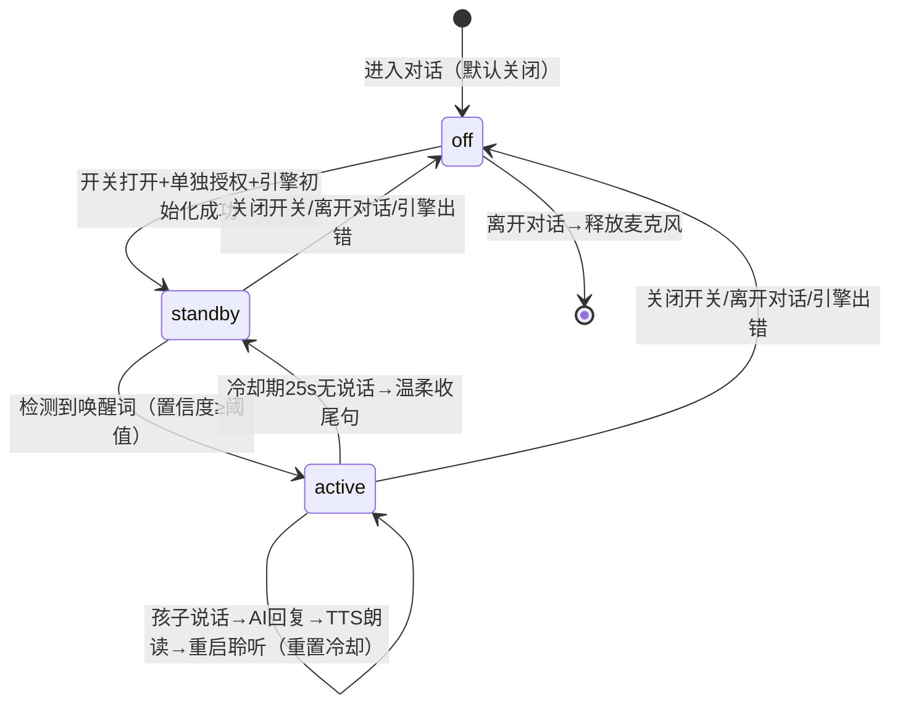
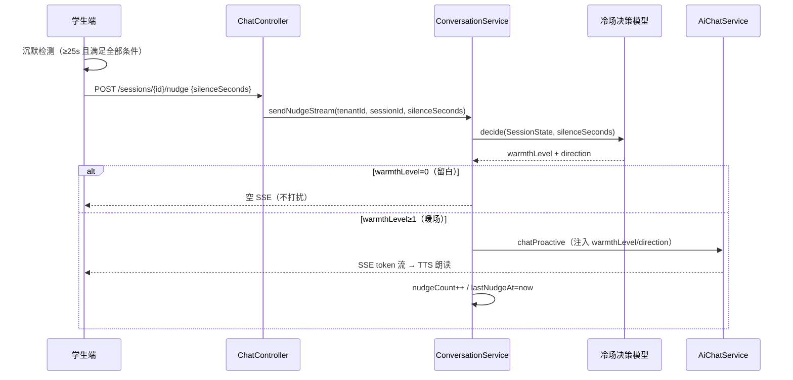

# 28 - 语音唤醒与冷场引导设计

> 版本：v1.0 | 创建日期：2026-07-26
> 定位：学生端对话体验增强三合一——语音唤醒词（"哈喽波波"）+ 冷场决策模型（该留白还是该暖场）+ 波波音色人设（中性角色 + 男女/温柔音色）
> 关联文档：`design/14_儿童安全对话规范.md`（§4.2 允许沉默）、`design/18_Prompt模板库.md`（TSK-004）、`design/19_界面详细设计.md`（§8.3 TTS 语音层）、`design/23_学生心理画像设计.md`（沟通偏好）、`design/27_波波小精灵品牌与宠物交互设计.md`（品牌与四态状态机）
> ⚠️ **实现现状（2026-07-28 核对）**：本篇三大功能**已全部落地** 🟩——`NudgeDecisionModel`（14 用例测试）、昵称问候、nudge 端点、TSK-004、前端唤醒/冷场全套 hooks、xiaotaiyang 男声修复（§4.2 表"待补"已过时）。剩余为真机验收与两项待用户确认（授权措辞+唤醒词定稿）。四态对照与 47/48 对齐见 §十二。

---

## 一、背景与目标

学生当前只能"按住波波说话"，对低龄孩子偏麻烦。本方案新增三个**叠加式**能力（不改动、不冲突现有按住说话）：

1. **语音唤醒**：说"哈喽波波"即可唤起对话，无需动手。唤醒后进入"会话窗"，窗内自由说话不用重复唤醒；冷却期（沉默超时）满后回到待唤醒态，需再说唤醒词。
2. **冷场处理**：对话中孩子长时间不说话时，由**冷场决策模型**（多信号加权，**关联学生画像**）判断"该留白还是该暖场、往哪个方向暖"——该留白时把安静还给孩子（让他思考），该暖场时波波基于情绪氛围与话题温柔破冰（化解 design/14 §4.2"允许沉默"张力）。画像关联：话多的孩子适当偏留白，沉默性格的孩子偏主动暖场。
3. **音色人设**：波波角色中性（小海豚、无性别），但音色可分男女/温柔——按性别自动推荐（男生→阳光大哥哥男声，女生→温暖大姐姐女声），设置里可手动切换。

**已确认的两个技术分叉**（钱敏健决策）：
- 唤醒检测：**Transformers.js + Whisper 本地离线转写**（WebAssembly，音频全程留在设备，合规优先；无需平台注册/AccessKey/商业许可）
- 冷场引导：**后端 LLM 上下文生成**（新增 nudge 接口，复用现有 SSE/TTS/安全过滤管线）

**四个关键设计原则（来自需求确认）**：
- **监听严格限定在对话内**：语音监听只在进入对话后才启动，离开对话即停；登录前、未进入对话前一律不监听（隐私即设计）。
- **问候语引导唤醒**：波波先说"哈喽，[昵称]！"，用"哈喽+名字"模式自然引导孩子回应"哈喽波波"，问候即唤醒交互的 onboarding。
- **冷场先判断再行动**：不是"一冷场就暖"，由决策模型根据情绪场景、孩子说的话、所处状态、**学生画像（沟通偏好）**算出"该留白（让他思考）还是该暖场、往哪个方向暖"。
- **角色中性、音色可选**：波波品牌形象固定（中性海豚），音色跟随所选人设；波波的所有发声（问候/回复/唤醒确认/冷场引导）统一用同一音色，保证一致。

---

## 二、功能一：语音唤醒（Transformers.js + Whisper 本地引擎）

### 2.1 交互流程与状态机

新增**模式级状态** `voiceCallMode`（与 design/27 的 boboState 四态正交，boboState 继续负责对话反馈）：

**监听生命周期（重要）：Whisper 唤醒引擎只在"进入对话后"才启动监听（会话创建、ChatRoom 挂载），离开对话立即释放麦克风。登录前、情绪选择页、未进入对话前一律不监听。** 这是隐私即设计（privacy-by-design）——麦克风不做全 App 常驻，仅存在于一次对话内。

```
〔进入对话 / 会话创建〕
off ──[开关打开 + 单独授权 + 唤醒引擎初始化成功]──> standby
standby ──[检测到唤醒词，置信度≥阈值]──> active
    动作：TTS 短确认"我在呢！" → 确认播完后开始捕捉孩子说话
active ──[孩子说话(识别出最终结果)]──> 走现有 sendMessage 流程
    → AI 流式回复(thinking) → TTS 朗读(speaking) → 朗读结束后重启聆听 + 重置冷却计时
active ──[冷却期内无说话，默认 25s]──> standby
    动作：TTS 温柔收尾"我先安静陪着你，想说话随时叫我哦" → 恢复唤醒词监听
active/standby ──[关闭开关 / 离开对话 / 引擎出错]──> off
〔离开对话 / 会话结束〕 ──> 释放唤醒引擎，关闭麦克风
```

状态机图：



- **冷却期语义**（对应需求）：唤醒后的会话窗内说话自由、无需重复唤醒；窗的存活靠"沉默超时"维持——每次 AI 说完后等 25s，孩子接话则续窗，沉默满 25s 则关窗回 standby，下次需再说唤醒词。
- **防自听回声**：TTS 朗读期间暂停语音识别，朗读结束后才重启聆听（避免波波听到自己的声音）。
- **iOS 稳健性**：每个"聆听回合"用独立 SpeechRecognition 实例（说完即止、说完重启），比常驻 continuous 模式在 iOS Safari 更稳。
- **待唤醒视觉**：BoBoPet 新增 `waitingWake` 态——侧耳倾听姿势 + 柔和脉冲光晕 + 提示文案"叫我'哈喽波波'"。

### 2.2 问候语引导："哈喽，[昵称]！"（唤醒词 onboarding）

每个学生都有自己的昵称（`User.pseudonym`）。波波打招呼时先说"哈喽，[昵称]！"，用"哈喽+名字"的对话模式自然引导孩子回应"哈喽波波"——问候语本身就是唤醒交互的引导。

- **后端改动**：`ConversationServiceImpl.buildGreeting` 增加 `pseudonym` 参数（`createSession` 已加载 user 对象，直接取 `user.getPseudonym()`），问候语改为"哈喽，[昵称]！+ 现有情绪问候"。例："哈喽，小明！看起来你今天心情不错呀！想和我聊聊什么开心的事吗？😊"
- **传递链路**：`SessionInfo.greeting` → `EmotionSelect` → `ChatRoom` 展示 + TTS 朗读（现有链路，前端零改动）。
- **引导闭环**：孩子听到"哈喽，小明！"→ 学会"哈喽+名字"模式 → 语音唤醒开启后波波待唤醒态提示"叫我'哈喽波波'"→ 孩子回应"哈喽波波"→ 唤醒成功。问候示范 + 待唤醒提示，两段式自然引导。
- **始终生效**：问候个性化不依赖语音唤醒模式（本身就是友好体验），前端无需感知模式状态。

### 2.3 技术集成

- 依赖：`@huggingface/transformers`（Whisper 本地转写）+ `onnxruntime-web`（WASM 推理）。AudioWorklet 麦克风采集 → 16kHz 降采样 → 滑窗累积（2.5s 窗 +1s 重叠）→ VAD 静音过滤 → Whisper 本地转写 → 文本匹配唤醒词及变体。音频全程本地 WASM 处理，不上传。
- 唤醒词匹配：无需训练自定义模型，对 Whisper 中文转写文本匹配"哈喽波波"及同音变体（哈罗波波/哈喽啵啵/hello波波 等，见 `config/wakeWord.js` 的 `WAKE_PATTERNS`），匹配前做归一化（小写 + 去标点空白）。
- 模型：`onnx-community/whisper-tiny`（多语言含中文，量化后约 20MB），首次启用从 HF 国内镜像（hf-mirror.com）下载一次，之后走浏览器 Cache API 缓存；真机唤醒率不理想可升级 whisper-base（约 45MB，中文更好）。模型 ID 与滑窗参数已纳入统一配置纳管（design/57），通过 `application.yml` 的 `mindsafe.system-config.wake-word` 节点管理，运行时经 GET /api/v1/system/config 下发前端。
- ONNX Runtime WASM（约 12-22MB）：构建时由 vite 插件从 node_modules 复制到 `dist/ort/`（不进 git，CI 可复现），运行时从本机服务器 `/mindsafe/ort/` 加载，不走 jsdelivr CDN（国内不稳定）；asyncify 变体供 Chrome/Android，plain 变体供 Safari/iOS。
- 零外部账号：无需任何平台注册 / AccessKey / 商业许可（Whisper MIT、onnxruntime Apache 2.0、Transformers.js Apache 2.0）。这是从 Porcupine 切换过来的核心原因。
- 降级：浏览器不支持 AudioWorklet / 模型下载或推理初始化失败 → 隐藏语音唤醒开关，按住说话主路径不受影响。

### 2.4 合规与授权（重点）

- **监听严格限定在对话会话内（隐私即设计）**：唤醒引擎仅在一次对话期间运行（会话创建后启动、离开即释放），登录前/未进入对话前不监听；此点在授权弹窗中明确告知，是本方案最重要的合规保障。
- **登录页声音登录为按钮显式触发（2026-07-23 修订）**：登录页不做任何被动监听；「🎤 声音进入」按钮点击后才弹出全屏声纹识别覆盖层并申请麦克风，识别结束/取消立即释放。登录页原"🎙️ 语音唤醒"勾选框（曾控制登录页被动监听）已删除，唤醒偏好只保留聊天室内开关，与本节"登录前不监听"原则完全一致。
- **监听仅在本地**：唤醒词检测音频不出设备（Whisper WASM 本地推理），满足"本地处理、最小数据"。
- **单独授权弹窗**（新增，与现有按住说话授权分离）：明确告知"进入对话且开启后，波波会用麦克风听你是否叫它，这部分只在设备本地处理、不上传；唤醒后你说的话会用设备语音服务转文字；离开对话后不再监听"。**如实披露**，不含糊。
- **现有授权文案合规缺口**（需用户拍板）：`VoiceConsentDialog` 现写"所有分析在学校本地服务器完成"，但 SpeechRecognition 实际经设备 OS 语音服务（Google/Apple）。建议本次一并改为诚实表述。措辞属合规事项，由用户审定。
- **开源许可（无需商业采购）**：Whisper（MIT）+ onnxruntime-web（Apache 2.0）+ Transformers.js（Apache 2.0）均为开源，学校 SaaS 商业场景可直接使用，无需采购商业许可（这是从 Porcupine 切换过来的重要原因之一）。

---

## 三、功能二：冷场处理（决策模型 + 后端 LLM）

### 3.1 设计张力与化解

design/14 §4.2 要求"允许沉默、不催促"；需求要求冷场时主动暖场。化解关键：**不是"一冷场就暖"，而是先判断"该留白还是该暖场、往哪个方向暖"**——
- **该留白时留白**：孩子在思考、刚倾诉、情绪激动需要平复时，沉默是有价值的，波波安静陪伴（适当的冷场让他做些思考）；
- **该暖场时暖场**：孩子卡住、疏离、冷场过久时，波波温柔破冰；
- 无论哪种，都传递"不想说也没关系，我陪着你"；一次只说一句短句（≤40 字）；连续暖场最多 2 次后转为安静陪伴；孩子一说话即重置；不引入新的沉重话题、不原样重复上一问。

"该留白还是该暖场、往哪个方向暖"由下面的**冷场决策模型**计算（需求原话："通过一个类似模型的方式算出来、做判断该做哪个方向"）。

### 3.2 冷场决策模型（核心）

**模型职责**：冷场发生时，由多信号加权计算出两个输出——
1. **暖场强度 warmthLevel**：0=留白（不说话）/ 1=轻陪伴（安慰句、不提问）/ 2=引导破冰（轻松小问题）；
2. **暖场方向 direction**：决定这句话往哪个方向说（见下表）。

**决策信号**（均可从 SessionState / 对话历史取得，后端计算）：

| 信号 | 取值来源 | 对决策的影响 |
|------|---------|------------|
| A 情绪唤醒度 | emotionTag + 语音情绪记录 | 高唤醒负面（愤怒/激动）→先留白让其平复；恐惧→只轻陪伴不提问；低落→适时轻暖；开心→可早点轻松破冰 |
| B 沉默时长 | 前端上报 silenceSeconds | 分档：<25s 倾向留白；25-45s 倾向轻陪伴；>45s 倾向引导破冰（渐进升级） |
| C 上一轮类型 | 最后一条消息内容/意图 | AI 刚问了思考型问题→延长留白（沉默是在思考）；孩子刚倾诉→留白后只轻陪伴不深挖；孩子只答"嗯/哦/不知道"→降难度引导（给选择题） |
| D 会话阶段 | turnCount | 前期（≤2 轮）轻暖建立关系；后期（≥10 轮）倾向留白/温柔收束 |
| E 风险 | 融合风险级 | 硬门槛：橙色及以上/escalated → 不做日常暖场（走安全流程） |
| F 沟通偏好（画像） | StudentProfile.communication_pref.expression_depth | 话多（≥0.6）→-1 偏留白（想说自然会说，沉默多在组织语言）；沉默性格（≤0.4）→+1 偏暖场（需更多主动引导）；无画像/首次对话→0 |

**硬规则（优先于评分，不可覆盖）**：
- 风险 ≥ 橙色 或 escalated → 留白（安全流程接管）；
- 孩子刚倾诉沉重内容（宽限期内）→ 留白，之后仅轻陪伴，绝不引导深挖；
- AI 刚提思考型问题且沉默未达"思考时长"→ 留白（把思考时间还给孩子，design/14 §4.2）。

**加权评分卡**（输出 warmthLevel，权重/阈值可配置调优）：

```
warmScore = 沉默时长分(B) + 情绪分(A) + 上一轮分(C) + 阶段分(D) + 画像分(F)
  B：<25s→0   25-45s→+1   >45s→+2
  A：开心→+1  低落/紧张→+1  恐惧→0(且上限=轻陪伴)  愤怒→-1  中性→0
  C：敷衍回答→+1  普通→0  思考型问题→-1  沉重倾诉→-2(且上限=轻陪伴)
  D：前期→+1  中期→0  后期→-1
  F：话多(expression_depth≥0.6)→-1  沉默性格(≤0.4)→+1  无画像/首次→0
warmScore ≤0 → 留白(0)； =1 → 轻陪伴(1)； ≥2 → 引导破冰(2)
```

**暖场方向 direction**（由情绪+上一轮类型映射，注入 Prompt 引导 LLM 往该方向说）：

| 情形 | 方向 |
|------|------|
| 恐惧/紧张 | 安全感方向："这里很安全，我陪着你" |
| 低落/难过 | 共情陪伴方向：接住感受，不追问 |
| 愤怒（平复后） | 降温/身体方向：深呼吸、喝水等小动作 |
| 开心 | 话题延续方向：顺着刚才的高兴事 |
| 孩子答"不知道"/敷衍 | 降难度方向：换成二选一选择题（LANG-001 句式） |
| 沉重倾诉后 | 稳定化方向：肯定+陪伴，绝不深挖 |

**决策表示例**：

| 场景 | 情绪 | 沉默 | 上一轮 | 输出 |
|------|------|------|--------|------|
| AI 问"那一刻脑袋里冒出什么话"后 20s | 紧张 | 20s | 思考型问题 | 留白（在思考） |
| 同上但沉默 50s | 紧张 | 50s | 思考型问题 | 轻陪伴+降难度（"是不是有点像…还是…？"） |
| 孩子说"没人和我玩"后沉默 40s | 低落 | 40s | 倾诉 | 轻陪伴+共情（不深挖） |
| 聊体育课很开心后停顿 30s | 开心 | 30s | 普通 | 引导破冰+话题延续 |
| 孩子连续"嗯""哦"后 35s | 中性 | 35s | 敷衍 | 引导破冰+降难度（选择题） |
| 同上但画像显示孩子平时话多 | 中性 | 35s | 敷衍+话多画像 | F=-1 → 轻陪伴（留白让他自己组织语言） |
| 同上但画像显示孩子沉默少言 | 中性 | 35s | 敷衍+沉默画像 | F=+1 → 引导破冰+降难度（更主动一点） |

**运行位置**：决策模型在**后端**（`ConversationService` 内，可取 SessionState 的情绪记录/轮次/风险/最后消息/**画像沟通偏好**），前端只负责检测沉默并上报 `silenceSeconds`。权重与阈值配置化，便于上线后调优与回归测试。

**画像加载**：`createSession` 时查询 `student_profiles`（已加载 user，仅多一次画像查询），将 `communication_pref.expression_depth` 缓存进 `SessionState.expressionDepth`（nullable，首次对话为 null → F 计 0，不阻塞）。

### 3.3 触发与决策流程

**前端沉默检测**（全部满足才上报）：会话已创建且至少一轮互动；孩子 ≥25s 未发送消息；AI 未在说话/流式/录音；`voiceCallMode==='off'`（唤醒模式的沉默由冷却关窗处理）；距上次暖场 ≥20s 且本轮连续暖场 <2 次；未 escalated。

满足 → 调 nudge 接口（带 silenceSeconds）→ **后端决策模型**计算 warmthLevel/direction → 留白则返回空（前端不做任何事，把安静还给孩子）；轻陪伴/引导则返回 SSE 流 → 追加 AI 消息 + TTS 朗读（波波 speaking 态、冒话语气泡，复用现有体验）。



### 3.4 后端 Nudge 接口

- `ChatController` 新增 `POST /api/v1/chat/sessions/{sessionId}/nudge`，body `{ silenceSeconds }`，返回与 messages 相同的 `Flux<StreamMessageEvent>` SSE。
- `ConversationService.sendNudgeStream(...)`：
  - 取 `SessionState`；不存在 → 返回空；
  - **调用冷场决策模型**（3.2）：输入 silenceSeconds + SessionState（情绪记录/turnCount/风险/最后消息/画像）→ 输出 warmthLevel + direction；
  - warmthLevel=0（留白）→ 返回空 Flux（不打扰，把安静还给孩子）；
  - 防御性护栏：`SessionState` 新增 `nudgeCount`（学生消息时清零）+ `lastNudgeAt`，超限/间隔不足 → 返回空；
  - warmthLevel≥1 → 调 `aiChatService.chatProactive(...)`（注入 warmthLevel + direction），AI 回复落库（`persistAiMessageSummary`），`nudgeCount++`。
- `AiChatService.chatProactive(sessionId, emotionTag, gender, profilePrompt, nudgeInstruction)`：
  - **不向 ChatMemory 写入伪造的学生消息**（关键：不污染对话记忆）；
  - 读取历史 → 渲染 SYS-001 + **追加 nudge 指令（含 warmthLevel/direction）到 system 层** → 流式 LLM；
  - 复用 Layer1 `OutputContentFilter` + Layer2 `OutputReviewService` 安全管线；AI 回复正常写入记忆（孩子看到的连续性保留）。

### 3.5 新增 Prompt（TSK-004，按决策结果参数化）

新文件 `prompts/tasks/proactive_nudge_zh-CN_v1.0.0.md`（counseling-app classpath），`PromptTemplateService` 加 `TSK_004` 常量。指令由决策模型注入 `{{warmth_level}}` 与 `{{direction}}`：

> 孩子已安静约 {{silence_seconds}} 秒。决策：暖场强度={{warmth_level}}（1=轻陪伴只安慰不提问；2=引导破冰可提一个轻松小问题），方向={{direction}}。请结合刚才的对话主题与情绪氛围，按该强度和方向说一句温柔的话。规则：①绝不催促，传达"不想说也没关系，我陪着你"；②只说一句短句，≤40 字；③强度=1 时只安慰不提问；强度=2 时提一个与主题相关的轻松开放问题或二选一选择题；④不引入新的沉重话题、不深挖刚才的倾诉；⑤不原样重复你上一句的问话。

---

## 四、功能三：波波音色人设（中性角色 + 男女/温柔音色）

> ⚠️ **本节已由 `design/56_TTS音色矩阵与方言设计.md` 升级替代**（2026-07-28）。音色从 4 种扩展为 7 种差异化矩阵 + 方言条件启用。以下 §4.1 设计原则仍有效，§4.2~4.4 的具体音色表以 design/56 为准。

### 4.1 设计原则：角色与音色分离

波波**品牌角色中性**（小海豚、无性别、形象固定），但**音色可有性别/气质差异**（延续 design/19 §8.3 的性别化音色偏好）：角色是品牌层，音色是体验层，两者不冲突。

| 层 | 定义 |
|------|------|
| 角色（品牌） | 波波 = 小海豚，中性形象固定，不随音色变化（品牌资产，与 design/27 一致） |
| 音色（体验） | 可选音色人设：男声（阳光大哥哥）/ 女声（温暖大姐姐 / 活泼小伙伴 / 温柔讲故事者），按性别自动推荐，设置里可手动切换 |

### 4.2 音色人设表（3 女 + 1 男，覆盖男/女/温柔）

| persona | 名称 | 性别/气质 | 默认适用 | edge-tts 音色 | CosyVoice speaker |
|---------|------|---------|--------|---------------|-------------------|
| xiaoxing | 小星 🌟 | 女 · 温暖大姐姐 | 女生默认 | zh-CN-XiaoxiaoNeural | 中文女 |
| qiqiu | 气球 🎈 | 女 · 活泼小伙伴 | - | zh-CN-XiaoyiNeural | 中文女 |
| yueliang | 月亮 🌙 | 女 · 温柔讲故事者 | - | zh-CN-XiaohanNeural | 中文女 |
| xiaotaiyang | 小太阳 ☀️ | 男 · 阳光大哥哥 | 男生默认 | zh-CN-YunxiNeural（待补） | 中文男（待补） |

前端 `useVoicePersona` 已有 4 人设 + 性别默认推荐（男→小太阳，女→小星）+ SettingsPanel 切换（现有能力，前端零改动）。

### 4.3 现状缺口（后端缺陷，本次一并修复）

1. **后端 `tts-service` 缺 xiaotaiyang**：`VOICE_PERSONAS` 只有 3 个女声；前端传 `persona=xiaotaiyang`（男生默认）时后端回落 xiaoxing 女声——**男生实际听到女声，性别化音色未生效**；
2. **CosyVoice2 路径硬编码 `"中文女"` 说话人**：本地模型启用时所有人设都是同一女声（仅语气 instruct 不同），音色切换只在 edge-tts 降级路径生效。

### 4.4 修复方案

- `tts-service/app.py` VOICE_PERSONAS 补 `xiaotaiyang`：`edge_voice=zh-CN-YunxiNeural`（少年男声，契合阳光大哥哥）、`base_instruct="用开朗有活力的语气说"`、`speed=1.05`；
- CosyVoice2 路径：硬编码 `"中文女"` 改为 **persona→speaker 映射**（CosyVoice2-0.5B 内置说话人含中文女/中文男）——3 个女人设→中文女，xiaotaiyang→中文男；
- **统一音色**：波波的所有发声（问候"哈喽，[昵称]！" / AI 回复 / 唤醒确认"我在呢！" / 冷场引导 / 冷却收尾句）均走现有 TTS 管线（`useTtsPlayer` → `/api/v1/tts/synthesize` 带 persona），自动跟随所选音色，两个新功能无需额外处理。

---

## 五、三个功能的协同

| 场景 | 处理 |
|------|------|
| 唤醒模式 off（默认） | 按住说话/打字 + 冷场引导（nudge） |
| 唤醒模式 on · standby | 波波待唤醒，不做冷场引导（已在"等待"态） |
| 唤醒模式 on · active 中沉默 | 冷却 25s 到期 → 温柔收尾句 → 回 standby（即唤醒模式的"冷场处理"） |
| 音色人设 | 所有 TTS 输出（问候/回复/唤醒确认/冷场引导/收尾句）统一跟随所选 persona |

三功能共享"温柔、允许沉默"原则；冷场引导（LLM nudge）只服务主对话路径，唤醒模式的沉默由状态机收尾句兜底，互不重复触发；音色人设是全部功能的统一声音层。


---

## 六、接口定义

### 6.1 冷场暖场接口（新增）

```
POST /api/v1/chat/sessions/{sessionId}/nudge
Content-Type: application/json
Accept: text/event-stream
Authorization: Bearer <JWT>
```

请求体：

```json
{ "silenceSeconds": 35 }
```

| 字段 | 类型 | 必填 | 说明 |
|------|------|------|------|
| silenceSeconds | int | 是 | 孩子已沉默的秒数（前端检测，≥25 才调用） |

响应：与 `/messages` 相同的 `Flux<StreamMessageEvent>` SSE。

- **留白（warmthLevel=0）**：返回空流（无任何事件，前端不做任何事）；
- **暖场（warmthLevel≥1）**：`token` 事件流（逐字）+ 结尾 `done` 事件，与正常 AI 回复格式一致，前端按现有逻辑追加消息 + TTS 朗读。

DTO：`NudgeRequest(Integer silenceSeconds)`（counseling-api dto.chat 包）。

### 6.2 内部服务接口（新增）

```java
// ConversationService
Flux<StreamMessageEvent> sendNudgeStream(UUID tenantId, UUID sessionId, int silenceSeconds);

// AiChatService
Flux<StreamMessageEvent> chatProactive(UUID sessionId, String emotionTag, String gender,
                                       String profilePrompt, String nudgeInstruction);
```

### 6.3 问候语变更（现有接口，行为变化）

`POST /api/v1/chat/sessions` 返回的 `SessionInfo.greeting` 由"嗨！..."变为"哈喽，[昵称]！..."（昵称取自 `User.pseudonym`；昵称为空时回退原问候语）。接口结构不变，前端零改动。

---

## 七、实施阶段（设计先行）

### 阶段 0：设计文档（本方案落地）
- 新建 `design/28_语音唤醒与冷场引导设计.md`（本文档）；
- 同步更新 `design/18_Prompt模板库.md`（登记 TSK-004）、`design/DESIGN-OVERVIEW.md`、`design/TASK-TRACKER.md`、`design/BEACON.md`。

### 阶段 1：后端（问候语昵称 + 冷场决策模型 + nudge + 音色补齐，独立可测，不依赖外部）
- `ConversationServiceImpl.buildGreeting` 增加昵称参数，问候语改为"哈喽，[昵称]！..."（唤醒引导，见 2.2）；
- **冷场决策模型**（3.2）：多信号加权计算 warmthLevel/direction + 硬规则覆盖，权重/阈值配置化；**画像关联**：`createSession` 加载 `student_profiles.communication_pref.expression_depth` 进 `SessionState.expressionDepth`（信号 F）；
- `prompts/tasks/proactive_nudge_zh-CN_v1.0.0.md` + `PromptTemplateService.TSK_004`（按 warmthLevel/direction 参数化）；
- `AiChatService(Impl).chatProactive`；
- `ConversationService(Impl).sendNudgeStream` + `SessionState` nudge 字段（nudgeCount/lastNudgeAt/情绪记录/最后消息类型）；
- `ChatController` `/nudge` 端点；
- **音色补齐**（功能三）：`tts-service/app.py` 补 xiaotaiyang 人设（zh-CN-YunxiNeural）+ CosyVoice2 persona→speaker 映射（去硬编码"中文女"）；
- 单元/集成测试（问候含昵称；**决策模型：思考型问题留白、倾诉后不深挖、愤怒先留白、敷衍降难度、风险门槛、话多→留白/沉默→暖场（画像信号 F）**；护栏、不污染记忆、安全过滤、escalated 拒绝；**xiaotaiyang 返回男声、/personas 返回 4 项**）。

### 阶段 2：前端冷场引导
- `ChatRoom.jsx` 沉默检测计时器 + nudge 调用 + TTS 朗读 + 护栏（2 次上限、说话重置）；
- 构建验证 + 手工验证。

### 阶段 3：Whisper 语音唤醒（Transformers.js 本地，无外部依赖）
- `config/wakeWord.js`（唤醒词变体 + 模型配置 + VAD 阈值）→ `hooks/useWakeWord.js`（Whisper 滑窗转写 + 本地 wasm）→ `hooks/useVoiceCallMode.js` 状态机 → `VoiceCallConsentDialog` 单独授权 → `BoBoPet` waitingWake 态 → `ChatRoom` 集成；
- **会话内监听**：唤醒引擎在 ChatRoom 挂载（会话创建）后启动、卸载（离开对话）时释放，严格限定在对话期间；
- 真机测试（唤醒率、防自听回声、冷却关窗、iOS 兼容、进入前不监听）。

### 阶段 4：集成回归 + 文档同步 + 发布
- 回归：按住说话主路径、红色风险流程不受影响；
- 文档同步后按用户指令提交/推送/发布。

---

## 八、外部依赖与需用户决策项

1. ~~Picovoice Console 账号 + AccessKey + 训练唤醒词~~ —— **已不需要**（切换为 Transformers.js + Whisper 开源方案，零外部账号）；
2. ~~Picovoice 商业许可采购~~ —— **已不需要**（Whisper MIT / onnxruntime Apache 2.0，商业场景可直接使用）；
3. ~~`.env` 增加 AccessKey~~ —— **已不需要**（Whisper 方案无任何密钥配置）；
4. **授权弹窗措辞**（新增语音唤醒单独授权 + 修正现有"本地处理"诚实性表述——合规措辞由用户审定）——**✅ 已定稿 B 分层告知（2026-07-28 钱敏健）**：学生端弹窗用童语化简句（如"开启后波波会在聊天时听你叫它，离开就不听啦"），完整技术性说明（本地检测/转写加密上传境内服务器/转写即删/离开对话不监听）由 22 篇告知条款承担（22 §6.3 已定稿 A 如实区分披露）；`VoiceConsentDialog` 现有"所有分析在学校本地服务器完成"表述按同口径修正；
5. **唤醒词定稿**（推荐"哈喽波波"，可后续加"你好波波"变体）——**✅ 已定稿（2026-07-28 钱敏健）**：主唤醒词=**"你好波波"**，保留"哈喽波波"为同音变体。

---

## 九、风险与对策

| 风险 | 对策 |
|------|------|
| Whisper 中文唤醒词识别率不确定 | 按住说话始终可用作兜底；同音变体匹配 + VAD 静音过滤抑幻觉；可升级 whisper-base；窗长/VAD 阈值可调 |
| iOS Safari AudioWorklet 兼容 | 真机测试；不支持则隐藏开关、主路径不受影响 |
| 误唤醒 | 确认句"我在呢"+25s 无说话自动关窗，危害低 |
| 冷场引导打扰想安静的孩子 | **决策模型优先留白**（思考型问题/倾诉后/愤怒均先留白）+ 严格 2 次上限 + 明确允许沉默 + escalated 禁用 |
| 决策模型权重不准（暖场过多/过少） | 权重/阈值配置化，上线后按真实会话调优；决策表用例回归测试；留白是安全默认（宁少勿多） |
| CosyVoice2 内置"中文男"音色与"阳光大哥哥"气质有差距 | 可接受（有男声即修复主要缺口）；后续可用 CosyVoice2 zero-shot 克隆专属男声参考音频，或 xiaotaiyang 单独走 edge-tts 路径 |

---

## 十、测试计划

- **后端**：问候语含昵称（"哈喽，[昵称]！"）；**冷场决策模型用例（思考型问题后留白、倾诉后只轻陪伴不深挖、愤怒先留白、敷衍回答降难度、风险门槛拒绝、沉默时长分档、画像信号话多→留白/沉默→暖场/首次对话 F=0）**；nudge 端点单测/集成测试（护栏、记忆不污染、安全过滤、escalated 拒绝）；**音色：xiaotaiyang 合成返回男声（edge-tts YunxiNeural / CosyVoice 中文男）、/personas 列表含 4 项**；
- **前端冷场**：计时器触发、2 次上限、说话重置、与 TTS/录音互斥；
- **语音唤醒**：真机唤醒率、防自听回声、冷却关窗、iOS/Android 兼容；**会话内监听验证（登录前/未进入对话不监听，离开对话即释放）**；
- **回归**：按住说话主路径、红色风险升级流程、现有四态状态机不受影响。

---

## 十一、验收标准

1. 会话问候语为"哈喽，[昵称]！+ 情绪问候"（昵称为空时回退原问候语），前端正常展示与朗读；
2. 冷场决策模型按决策表输出 warmthLevel/direction（硬规则优先：风险门槛/倾诉不深挖/思考型问题留白）；画像信号 F 生效（话多偏留白、沉默偏暖场、无画像不阻塞）；
3. `/nudge` 端点：留白返回空流；暖场返回 SSE 且经双层安全过滤；不写入伪造学生消息（记忆不污染）；护栏（2 次上限、间隔、escalated 拒绝）生效；
4. 前端沉默 ≥25s 且满足全部条件时调用 nudge，暖场话术 TTS 朗读 + 波波 speaking 态；孩子一说话即重置；
5. `tts-service` `/personas` 返回 4 项；`persona=xiaotaiyang` 合成返回男声（edge-tts YunxiNeural / CosyVoice 中文男）；
6. 语音唤醒（阶段 3，外部依赖就绪后）：说"哈喽波波"唤醒 → 确认句 → 自由对话 → 25s 沉默关窗回待唤醒；登录前/未进入对话不监听，离开对话释放麦克风；
7. 回归：按住说话主路径、红色风险升级流程、波波四态状态机均不受影响；
8. 学生端 `vite build` 通过，后端编译 + 测试通过。

---

## 十二、实现现状核对与设计深化（2026-07-28 增补）

> 本章为"设计深化工程"P1 批次增补。图例：🟩 已生效 ｜ 🟧 已实现零调用 ｜ 🟫 仅骨架/部分实现 ｜ ⬜ 未实现。

### 12.1 四态对照表

| 设计项 | 章节 | 状态 | 核对证据 |
|--------|------|------|---------|
| 昵称问候"哈喽，[昵称]！" | §2.2 | 🟩 | `ConversationServiceImpl.buildGreeting`，测试覆盖含昵称/回退两分支 |
| 冷场决策模型 | §3.2 | 🟩 | `NudgeDecisionModel` + `NudgeDecisionModelTest` 14 用例（决策表场景全覆盖，含画像信号 F 三分支） |
| nudge 端点 + 护栏 + chatProactive | §3.3-3.5 | 🟩 | `sendNudgeStream`（escalated/次数/间隔护栏、留白空流、记忆不污染）测试覆盖；TSK-004 已登记 `PromptTemplateService`（18 §16.1 已核对） |
| 前端沉默检测 | §3.3 | 🟩 | `hooks/useSilenceNudge.js`（125 行） |
| Whisper 本地唤醒 | §二 | 🟩 | `config/wakeWord.js` + `hooks/useWakeWord.js`（269 行）+ `useVoiceCallMode.js`（159 行）；**真机唤醒率验收（§十 第3条）状态未知，列为验收核对项** |
| waitingWake 待唤醒态 | §2.1 | 🟩 | `BoBoPet.jsx` 五态（27 §十已登记） |
| 音色人设 4 项 + xiaotaiyang 男声 | §四 | 🟩 | `tts-service/app.py` VOICE_PERSONAS 含 xiaotaiyang（YunxiNeural + CosyVoice "中文男"），persona→speaker 映射已实现——**§4.2 表中"待补"、§4.3"现状缺口"已过时，本节登记为已修复**（正文保留作实施记录） |
| 前端音色选择 | §4.2 | 🟩 | `hooks/useVoicePersona.js`（70 行，性别默认推荐） |

**结论**：本篇是 55 篇中少数"文档与实现基本同步"的篇目，无虚假设计。深化重点在跨篇对齐与合规收尾，不在功能补设计。

### 12.2 与 47/48 语音闭环的边界对齐（triage 要求）

前端已存在声纹系列文件：`hooks/useVoiceprint.js`（218 行）、`utils/voiceprintStore.js`、`config/voiceprint.js`——归属 design/47/48（声纹/语音闭环），与本篇职责不重叠。需在 47/48 深化时确认一条**共享资源约束**：

- **麦克风互斥**：Whisper 唤醒监听（本篇）、按住说话录音、声纹采集（47/48）三者共用麦克风，同一时刻只能一个持有音频流。本篇 §2.1 已定义"TTS 播放暂停识别、录音时唤醒暂停"，47/48 深化时须补充声纹采集与唤醒监听的互斥规则（建议：声纹采集仅在设置页进行，此时不在对话内、唤醒引擎天然未启动——零成本互斥，KISS）。

### 12.3 合规收尾（与 22 联动，✅ 已定稿 2026-07-28）

| # | 事项 | 现状 | 去向 |
|---|------|------|------|
| 1 | 唤醒单独授权弹窗措辞 | §2.4 设计"如实披露"；`VoiceConsentDialog` 现有"所有分析在学校本地服务器完成"表述与 SpeechRecognition 走设备 OS 语音服务的事实不符（§八 第4条） | **✅ 已定稿 B 分层告知**：学生端童语化简句+22 篇承担技术性说明（22 §6.3 A 如实区分披露）；VoiceConsentDialog 表述同口径修正 |
| 2 | 唤醒词定稿 | §八 第5条，推荐"哈喽波波" | **✅ 已定稿**：主唤醒词"你好波波"，"哈喽波波"保留为同音变体 |
| 3 | TTS 降级出网 | xiaotaiyang 走 edge-tts YunxiNeural 降级时同样出网微软云 | 已归 22 §6.3（TTSFX），本篇不重复决策 |

### 12.4 任务归口

| 事项 | 归口 | 优先级 | 责任人 |
|------|------|--------|--------|
| 唤醒授权措辞 + 唤醒词定稿 | ✅ 已定稿（2026-07-28）："你好波波"主唤醒词 + B 分层告知（§12.3）；弹窗文案修正随开发落地 | P1 | 钱敏健+法务 |
| 真机唤醒率验收（§十 第3条） | 验收核对项 | P1 | Agent |
| 声纹采集与唤醒监听互斥规则 | 47/48 深化时登记 | P2（本批次后） | Agent |
| §4.2/§4.3 过时表述 | 本节已登记，正文保留作实施记录（DRY，不改写历史） | 已闭环 | — |

