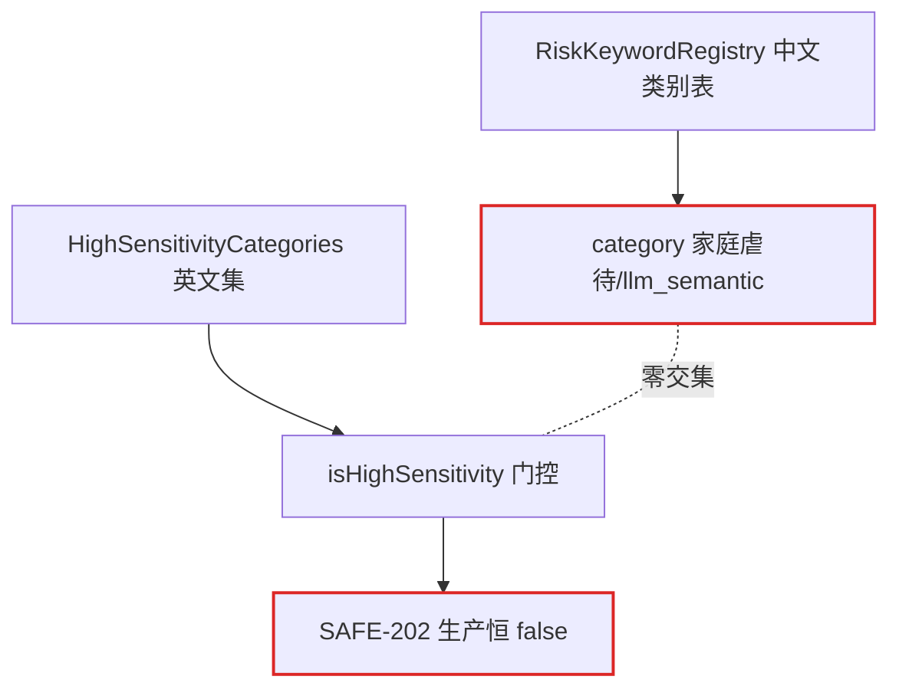

# doing/72 架构深化候选清单（方案与 SPEC）

> 编号：DOC-063 | 创建：2026-08-06 | 状态：⏳ 待议决（12 个深化候选已定稿，待选定后进入设计细化与实施）
> 来源：improve-codebase-architecture 全量架构审查（3 路并行探索 agent 交叉印证：后端 Java / 前端三端 / Python 服务与部署链路）
> 审查基线：develop @ abb9594（DOC-061 批次 A~D 完成后），工作区干净
> 词汇表：design/13_领域词汇表.md（§11 架构词汇：模块/接口/深度/接缝/适配器/杠杆/局域性/删除测试）
> 关联：doing/71（DOC-061 深度审计问题清单，批次 E 待排期）；ARCH-001~010（his/61~70）；frozen/38 计费套餐、frozen/59 量表施测

---

## §1 审查概述

### 1.1 方法与范围

| 维度 | 内容 |
|---|---|
| 探索方式 | 3 路独立 agent 只读探索（后端 Java 6 模块 / 前端三端 / Python 双服务 + 部署链路），交叉印证 |
| 热点定位 | 最近 60 提交：student-h5 语音链路（useWakeWord/LoginPage/VoiceLoginOverlay）、后端声纹与 LLM 链路、部署脚本（setup-server/cd.yml/service-manager）为高频变更区 |
| 判定标准 | 删除测试（复杂度被集中=深化机会，被移动=转发层）；「一个适配器=假设性接缝，两个=真实接缝」；假功能（测试绿、生产死）必除 |
| 产出 | 12 个深化候选（DC-001~DC-012）+ Top recommendation + 3 处台账失实附注 |

### 1.2 候选总览

| 编号 | 候选 | 域 | 推荐强度 | 核心问题 |
|---|---|---|---|---|
| DC-001 | 风险分级·收敛为单一类别源 | 后端 | 🟢 Strong | 类别三套词汇零交集，SAFE-202 高敏门控生产恒 false |
| DC-002 | 备份接缝·cron 指向不存在的文件 | 部署 | 🟢 Strong | setup-server.sh 自相矛盾，每日备份静默失败 |
| DC-003 | 配置透传契约·声明/透传/生效散落 | 部署 | 🟢 Strong | DASHSCOPE_TTS_MODEL 死配置，prod compose 未透传 |
| DC-004 | 双部署通道·健康判定与发布前置收敛 | 部署 | 🟢 Strong | 健康三套判定，deploy.sh 无模型门禁/无回滚 |
| DC-005 | 认证传输·三端收敛为共享模块 | 前端 | 🟢 Strong | tryRefresh 三份逐字重复，401 语义不一致 |
| DC-006 | 声纹·领域逻辑从控制器下沉 | 后端 | 🟡 Worth exploring | 354 行控制器承载整个声纹域，测试被迫反射注入 |
| DC-007 | 声纹注册·两处复制收敛为一个 hook | 前端 | 🟡 Worth exploring | LoginPage/SettingsPanel 逐字重复，失败文案不一致 |
| DC-008 | 情绪·五处表示收敛为一 | 后端 | 🟡 Worth exploring | 同一 anxious 双译冲突，跨包跳转 5 模块 |
| DC-009 | 唤醒词·本地模型加载器双实现 | 前端 | 🟡 Worth exploring | Transformers.js 初始化 40 行逐段重复 |
| DC-010 | 会话编排·策略决策从神方法下沉 | 后端 | 🟡 Worth exploring | sendMessageStream 254 行内联 11 概念，24 依赖 |
| DC-011 | 音色引擎·真实接缝缺适配器层 | Python | 🟡 Worth exploring | 降级编排散落 synthesize，每请求建线程 |
| DC-012 | 会话装配·规则从神组件中抽离 | 前端 | ⚪ Speculative | ChatRoom 615 行 12 hooks，规则不可独立测试 |

> 实施状态（2026-07-28）：DC-001~DC-003、DC-005~DC-012 共 11 项已实施落地（见 §28 批次表）；DC-004 未立项（YAGNI——双部署通道为紧急热修能力，2026-08-06 实战验证有效，冻结争议）。

---

## §2 DC-001 风险分级 · 收敛为单一类别源 🟢 Strong

- **FILES**：`counseling-ai/.../risk/RiskKeywordRegistry.java` L128-176/L249-261；`counseling-ai/.../safety/HighSensitivityCategories.java` L24-32；`service/conversation/ConversationServiceImpl.java` L251/L705；`service/conversation/ConversationRiskProcessor.java` L90
- **PROBLEM**：类别三套词汇（中文类别表 / 英文集 self_harm / llm_semantic）零交集，`isHighSensitivity()` 门控**生产恒 false**——SAFE-202 高敏模式是死接缝（假功能）
- **SOLUTION**：类别收敛为单一类型化值对象；高敏判定/risk_events 落库/教师端展示/测试共用同一表示；SAFE-202 真实接线或删门
- **WINS**：locality 风险类别一处定义 · 删除测试：死门控可被消灭而非移动 · leverage：词典/判定/展示同步生效 · 教师端与 AI 简报不再双译



> ⚠️ **台账失实**：ARCH-003 声称类别已收敛，但高敏判定仍独立；SAFE-202 门控为假功能。

## §3 DC-002 备份接缝 · cron 指向不存在的文件 🟢 Strong

- **FILES**：`deploy/setup-server.sh` L88/L102；`deploy/backup.sh` L3/L20-27；`deploy/restore.sh` L14-23；`deploy/docker-compose.prod.yml` L7-12/L200
- **PROBLEM**：同一脚本内自相矛盾——L88 `cp backup.sh → /guju/mindsafe/deploy/`，L102 cron 却指向 `/guju/mindsafe/backup.sh`（从不被任何脚本创建）→ **每日 02:00 备份静默失败**；DB 连接事实（容器/库/卷）在 backup/restore/compose 三处硬编码，卷名靠正则猜测
- **SOLUTION**：DB 连接事实收敛为单一配置片段（backup/restore 共用）；cron 写入前校验脚本存在并 fail-fast；卷名由 compose 项目名派生
- **WINS**：生产故障级：备份从静默失败转为可见 · locality：DB 事实一处定义两处引用 · 删除测试：restore 不再复制探测逻辑

> ⚠️ **台账失实**：doing/71 §7 AUD-061 记录「cron 已由 AUD-032 接线」——接线了，但指向的路径从未被创建。

## §4 DC-003 配置透传契约 · 声明/透传/生效三处散落 🟢 Strong

- **FILES**：`deploy/.env.example` L102；`deploy/docker-compose.prod.yml` L158-159；`deploy/docker-compose.yml` L48；`backend/tts-service/app.py` L74/L90；`DEPLOY-GUIDE.md` L401
- **PROBLEM**：prod compose 仅透传 `DASHSCOPE_API_KEY`，`DASHSCOPE_TTS_MODEL` 在 .env.example 定义、文档宣称「改 env 生效」——**死配置**；Python 超时/CORS 变量（TTS_SYNTHESIZE_TIMEOUT/TTS_CORS_ORIGINS）无任何部署入口，只能改代码
- **SOLUTION**：「环境变量清单」作唯一事实源（声明/透传/消费/默认四列），compose 与 .env.example 做 diff 校验；Python 运行时参数补入 prod 透传
- **WINS**：删除测试：死配置从「假装生效」转为可验证 · locality：一次 diff 暴露所有透传缺口 · leverage：新增变量一处登记全链路核对

> ⚠️ **台账失实**：his/57 P8 标记 ✅ 完成，但只修在非 prod compose（docker-compose.yml）上，prod 未修。

## §5 DC-004 双部署通道 · 健康判定与发布前置收敛 🟢 Strong

- **FILES**：`deploy.sh` L202-207/L252；`.github/workflows/cd.yml` L206-212/L248-251/L283；`service-manager.sh` L74-103
- **PROBLEM**：「健康」概念三套判定（compose healthcheck / service-manager docker exec / cd.yml 公网 curl）；前端模型投放仅 CD 通道执行（prepare-models + `--verify` 门禁 + dist.prev 回滚），热修通道 deploy.sh 既无模型准备又 rsync 排除 models——热修可能发出无语音模型的 dist
- **SOLUTION**：健康判定与前端发布前置（模型准备+校验）抽为共享脚本，双通道同一入口；热修缺模型显式 fail-fast
- **WINS**：删除测试：deploy.sh 不再重复实现 · locality：健康判定一处定义 · 热修通道获得模型门禁与回滚能力

## §6 DC-005 认证传输 · 三端收敛为共享模块 🟢 Strong

- **FILES**：`frontend/student-h5/src/api.ts` L14-46/L88-108/L162-179（471 行）；`frontend/teacher-web/src/api.ts` L28-45/L54-74（340 行）；`frontend/parent-h5/src/api/index.ts` + `utils/auth.ts`
- **PROBLEM**：tryRefresh 三份几乎逐字相同；401 登出策略语义不一致（student/teacher `clearToken + location.reload` vs parent `clearAuth + location.href='/parent/'`）；错误模型分裂（student 有 ApiError 业务码分支，teacher/parent 只 throw Error）
- **SOLUTION**：抽共享「认证传输模块」：token 适配器 + authFetch + refresh + 统一 401 语义；三端只留端点声明与 DTO
- **WINS**：leverage：一次修复（如刷新竞态）传导三端 · 401 语义收敛为单一决策 · 删除测试：三份复制变一份实现

## §7 DC-006 声纹 · 领域逻辑从控制器下沉 🟡 Worth exploring

- **FILES**：`counseling-api/.../controller/VoiceprintController.java`（354 行）；`VoiceprintControllerTest.java` L69-73（ReflectionTestUtils.setField 注入 @Value）
- **PROBLEM**：控制器承担余弦相似度（L294-304）、SHA-256 指纹（L310-323）、XFF IP 解析（L285-292）、embedding JSON（L325-339）、租户内 1:N 比对（L182-243）、双 token 签发（L258-261）、审计（L263）、限流（L162-174）——声纹验证域逻辑无任何 Service 承载，7 个构造器依赖全部直连 Mapper/Provider；测试被迫反射注入，领域逻辑不可脱离 Web 层复用
- **SOLUTION**：抽取声纹域接口（enroll/verify），控制器只做 HTTP 编解码；相似度/阈值/指纹为纯函数；local/remote 双模式经同一接口形成真实接缝（AUD-062 已裁决 remote 保留）
- **WINS**：两个适配器 justify 接缝（local/remote）· 测试经领域接口而非反射 · locality：比对/阈值/指纹一处定义

## §8 DC-007 声纹注册 · 两处复制收敛为一个 hook 🟡 Worth exploring

- **FILES**：`frontend/student-h5/src/components/LoginPage.tsx` L459-487；`SettingsPanel.tsx` L91-122
- **PROBLEM**：local 分支 `enrollVoiceprint → issueVoiceCredential → saveVoiceCredential`、remote 分支 `remoteVoiceprintEnroll → markRemoteVoiceprintEnrolled` 两处几乎逐字重复；失败文案不一致（「声音数据保存失败，请检查网络后重试」vs「声纹保存错误，请检查网络后重试」）；已注册查询 hasAnyVoiceprint 双处各查一次
- **SOLUTION**：抽「声纹注册」领域 hook `useVoiceEnrollment`：mode 探测 + local/remote 分支 + 凭证签发 + 失败回退；LoginPage 与 SettingsPanel 各缩减为一行调用
- **WINS**：删除测试：任一调用处删除后流程仍完整 · locality：租户/凭证/标记规则单点维护 · 失败文案收敛一致

## §9 DC-008 情绪 · 五处表示收敛为一 🟡 Worth exploring

- **FILES**：`ConversationContextAgent.java` L32-43（anxious→紧张）；`TeacherController.java` L501-506（anxious→**焦虑**，冲突）；`EntryMoodStrategyResolver.java` L60-74（disgusted→angry 归一化）；`ConversationUtils.java` L110-111（DISTRESS_EMOTIONS 独立成员集）；`EmotionVocabulary.java` L35-42（isNegative 唯一入口）
- **PROBLEM**：同一 anxious 在教师导出与 AI 上下文简报呈现不同中文；理解「情绪」需跳转 5 个模块；无一致性护栏（删任一映射表行为变化但无人察觉）
- **SOLUTION**：情绪收敛为单一模块：规范 key + 中文标签 + 归一化/负面判定同居一处（或至少统一导入），展示表与判定表共享同一 key 权威
- **WINS**：locality：跨包跳转 5→1 · 删除测试：删任一散落映射行为可被检测 · 双译冲突根除

> ⚠️ **台账失实**：ARCH-003 声称情绪集合收敛于 EmotionVocabulary，展示/归一化/成员集仍各自独立。

## §10 DC-009 唤醒词 · 本地模型加载器双实现 🟡 Worth exploring

- **FILES**：`student-h5/src/hooks/useWakeWord.ts`（525 行，模型加载 L118-198）；`useVoiceprint.ts`（370 行，模型加载 L59-160）；`workers/wakeWordWorker.ts`；`config/wakeWord.ts`（135 行）
- **PROBLEM**：Transformers.js 初始化约 40 行逐段重复（SharedArrayBuffer/SIMD 检测、env.remoteHost、useWasmCache=false、numThreads=1、wasmPaths、graphOptimizationLevel、进度聚合）；useWakeWord 装 7 职责（环境探测/模型单例/Worker 通信/主线程降级/麦克风/iOS resume/滑窗 VAD）；概念跳转 6+ 模块
- **SOLUTION**：抽共享「本地模型加载器」（环境探测/单例/进度/降级），两 hook 只留领域逻辑；Worker 消息协议收敛到 worker 模块内
- **WINS**：删除测试：两份实现变单一真源 · locality：模型配置一处修改两链生效 · hook 接口收窄

## §11 DC-010 会话编排 · 策略决策从神方法下沉 🟡 Worth exploring

- **FILES**：`service/conversation/ConversationServiceImpl.java`（758 行，构造器 L97-120 共 24 依赖）；`sendMessageStream` L200-454（254 行）
- **PROBLEM**：C1 拆分后策略决策仍内联：RED 硬短路文案（L326-339）、时长引导语（L222/L342）、nudge 降级（L495-504）、高敏标记写死在神方法里；删除测试=复杂度被移动（编排职责与策略职责无边界）
- **SOLUTION**：方法内联 if 决策下沉为领域纯函数模块（风险策略/对话策略），编排层只做「按序调用」——sendMessageStream 成为可读流程脚本
- **WINS**：locality：风险文案与门控同居策略模块 · 策略模块可独立测试（纯函数） · 存量债：24 依赖逐步收窄

## §12 DC-011 音色引擎 · 真实接缝缺适配器层 🟡 Worth exploring

- **FILES**：`backend/tts-service/app.py` L339-381（synthesize 内联三级降级）/L384-497（双引擎实现）/L186-203（引擎可用性探测）/L431（每请求 threading.Thread）
- **PROBLEM**：双引擎（CosyVoice SDK + edge-tts）+ 前端 speechSynthesis 第三级——接缝真实存在却无适配器模块；`_synthesize_dashscope` 每请求建线程，wait_for 超时后 SDK 线程无法取消仍悬挂（对比 voice-service 已做进程级单例池，AUD-016）
- **SOLUTION**：「可用引擎探测→降级顺序→重试」收拢为独立策略模块（可注入 fake 引擎单测）；两引擎各成接口一致的适配器模块；超时后主动取消 SDK 线程或复用连接池
- **WINS**：两个适配器 justify 真实接缝 · 降级路径可单测（fake 引擎）· 线程生命周期收口于适配器

## §13 DC-012 会话装配 · 规则从神组件中抽离 ⚪ Speculative

- **FILES**：`student-h5/src/components/ChatRoom.tsx`（615 行：9 useState + 4 useRef + 8 useCallback + 10 useEffect + 12 自定义 hooks）
- **PROBLEM**：安卓音频路由保护策略（L187-209 三个 effect + userInteracted 态）、唤醒授权联动（L110-125）、boboState 六路三目（L299-304）埋在组件内——删除测试：规则随之消失，无可独立测试的模块
- **SOLUTION**：「安卓音频路由保护」（播放释放麦克风/600ms 预热/首次交互解锁）与「唤醒授权联动」（授权→预加载→开关状态机）各抽独立 hook，装配层只留调用与 JSX
- **WINS**：规则获得可测试模块（hook 单测）· locality：音频路由规则一处维护 · 装配层接口收窄

---

## §14 Top recommendation

**DC-001 风险分级·收敛为单一类别源** —— 一个收敛 = 修复生产恒 false 的 SAFE-202 死门控 + 消除中文/英文/llm_semantic 三重词汇 + 落库/教师端/测试共用同一表示。它是三路探索中唯一「修复假功能与统一词汇同时发生」的候选，且与 ARCH-003 声称收敛的未竟之事同源，杠杆与台账一致性双收。

**DC-002 备份 cron 断裂**属故障级（每日静默失败），虽是单点修复，建议**先行排障**（改 cron 路径 + fail-fast 校验），再以 DC-001 作为架构深化起点。

---

## §15 附注与后续

1. **台账失实 3 处**（本审查发现，与 doing/71 台账一致性原则同源）：① doing/71 §7 AUD-061 备份 cron「已接线」但路径断裂；② his/57 P8 配置透传标记完成但 prod 未修；③ ARCH-003 声称类别/情绪收敛但展示/判定仍独立。建议随对应候选修复时一并修正台账记录。
2. **与 doing/71 的关系**：本清单为架构深化候选（DC 编号），doing/71 为审计问题清单（AUD 编号）——DC-002/003/004 与 AUD-032/002/004 相关联但侧重不同（前者为架构收敛，后者为缺陷修复），实施时相互引用避免重复。
3. **选定候选后**：按 doing 工作流先在本文档补充设计细化与 SPEC（接缝形状/接口草案/测试方案），再进入 TDD 实施。

---

# SPEC 章节（2026-08-06 深度设计定稿）

> 范围：DC-004 双部署通道由用户单独处理，**不纳入本批实施**；其余 11 个候选全部按本 SPEC 进入 TDD。
> 实施顺序：部署域（DC-002/003）→ Python（DC-011）→ 后端（DC-001/008 → DC-006/010）→ 前端（DC-005/007 → DC-009/012）→ 台账修正 + 全量回归 + 文档同步 + 提交。
> 每批完成标记时间戳；台账修正 3 处随对应候选一并处理（AUD-061→DC-002、his/57 P8→DC-003、ARCH-003→DC-001/DC-008）。

## §16 DC-001 SPEC · 风险分级收敛为单一类别源

**接缝形状**：真实接缝修复——`HighSensitivityCategories.isHighSensitivity` 门控生产恒 false，但消费链真实（`ConversationServiceImpl` L251 门控 → L379 OrchestrationContext 策略注入），修复门控即激活整链，非假功能删除。

**接口草案**（`counseling-ai/.../risk/RiskKeywordRegistry.java` 追加）：

```java
/** SAFE-202 高敏类别（中文权威类别子集）：对应原英文集 physical_abuse/sexual_abuse/domestic_violence/neglect/self_harm/suicidal_ideation；bereavement 中文无对应类别不新增（YAGNI） */
public static final Set<String> HIGH_SENSITIVITY_CATEGORIES = Set.of("自伤/自杀", "他伤/暴力", "家庭虐待/忽视", "性侵/性骚扰", "严重抑郁/绝望");
/** 不降级类别（性侵/虐待类不可因否定/语境降级）——RISK-104 字符串 contains 语义收敛 */
public static final Set<String> NON_DEGRADABLE_CATEGORIES = Set.of("性侵/性骚扰", "家庭虐待/忽视");
public static boolean isHighSensitivityCategory(String category);
public static boolean isNonDegradableCategory(String category);
```

**改造点**：
1. `HighSensitivityCategories` 删英文 CATEGORIES，`isHighSensitivity` 委托 `RiskKeywordRegistry.isHighSensitivityCategory`（保留类名与消费点，注释说明 SAFE-202 接线）
2. `RiskDetectorServiceImpl.isSensitiveCategory`（L142-145）改调 `RiskKeywordRegistry.isNonDegradableCategory`（语义不变：性侵+虐待不降级）
3. `ConversationRiskProcessor.applySemanticRisk`（L90）：语义升级时若关键词结果已有类别则保留（真实类别落库 + 高敏门控可命中），否则维持 `"llm_semantic"`

**行为变更**：语义升级风险事件类别从 `llm_semantic` 变为原关键词类别（如「离家/失联」）；教师端展示随之变化——此为接线而非回归。

**测试方案**：
- `RiskKeywordRegistryTest` 增：isHighSensitivityCategory / isNonDegradableCategory 命中与不命中
- `RiskRegistryConsistencyTest` 增：高敏/不降级类别必须是 `RISK_KEYWORDS` 既有类别的子集（防漂移护栏）
- 新增 `HighSensitivityCategoriesTest`：委托语义（中文类别命中/英文类别不命中）
- `ConversationRiskProcessor` 既有测试补：applySemanticRisk 保留类别分支
- `ConversationServiceImplTest`（或等价集成测试）补：category=「性侵/性骚扰」→ session.highSensitivity=true（门控真接线）

**验收标准**：`grep HighSensitivityCategories` 消费点仍存在；英文类别常量零残留；风险事件落库类别为中文；SAFE-202 门控不再恒 false（测试证明）。台账：ARCH-003 记录修正（类别判定已收敛、高敏接线完成）。

## §17 DC-002 SPEC · 备份 cron 路径修复 + DB 事实收敛

**接缝形状**：故障级排障——cron 指向 `/guju/mindsafe/backup.sh`（从不被创建，`deploy.sh` L267 整目录 rsync 证明 `/guju/mindsafe/deploy/backup.sh` 恒存在）→ 每日 02:00 静默失败。

**改造点**：
1. `deploy/setup-server.sh` L102：`CRON_LINE` 改 `/guju/mindsafe/deploy/backup.sh`；写入前 `[ -f "$SCRIPT_DIR/backup.sh" ] || { echo 错误; exit 1; }` fail-fast；L88 补复制 `backup-common.sh`
2. 新增 `deploy/backup-common.sh`：DB 连接事实（容器/库/用户）单一定义 + `detect_backup_volume`（卷名正则探测 `(^|_)dbbackups$`）+ log 函数；`backup.sh`/`restore.sh` source 之并删除各自重复定义
3. `deploy/backup.sh` L3-4 注释修正（部署位置：服务器 `/guju/mindsafe/deploy/backup.sh`）

**测试方案**（Bash 断言脚本 `tests/unit/backup-common.sh`，bash -n + source 后断言）：
- source 后 DB 变量非空、detect_backup_volume 对含 dbbackups 的卷名命中、不含则不命中
- `setup-server.sh`：`grep` 断言 cron 路径与文件校验行存在

**验收标准**：cron 指向的文件在部署链路恒存在（deploy/ 整目录 rsync）；写入前 fail-fast；backup/restore 不再各自定义 DB 事实。台账：doing/71 AUD-061 修正（cron 路径断裂已修复）。

## §18 DC-003 SPEC · 配置透传契约补齐

**改造点**（prod 为首要，非 prod 同步）：
1. `deploy/docker-compose.prod.yml` tts environment 补：`DASHSCOPE_TTS_MODEL: ${DASHSCOPE_TTS_MODEL:-}`、`TTS_SYNTHESIZE_TIMEOUT: ${TTS_SYNTHESIZE_TIMEOUT:-30}`、`TTS_CORS_ORIGINS: ${TTS_CORS_ORIGINS:-}`
2. `deploy/docker-compose.yml`（非 prod）补：`TTS_SYNTHESIZE_TIMEOUT`、`TTS_CORS_ORIGINS`（DASHSCOPE_TTS_MODEL 已有）
3. `deploy/.env.example` 补登记：`TTS_SYNTHESIZE_TIMEOUT`、`TTS_CORS_ORIGINS`
4. `DEPLOY-GUIDE.md` L401 修正（改 .env 对 prod 同样生效）

**测试方案**：新增 `scripts/verify-config-passthrough.sh`（bash）：解析 `.env.example` 中 tts 相关变量清单，断言全部出现在两个 compose 的 tts service environment 中；缺失即退出 1。

**验收标准**：脚本退出 0；`.env.example` 与两 compose 无 tts 变量缺漏；DEPLOY-GUIDE 与实际一致。台账：his/57 P8 修正（prod 已补透传）。

## §19 DC-005 SPEC · 认证传输三端收敛为共享模块

**接缝形状**：三处实现（student `api.ts` L88-108/L162-179、teacher `api.ts` L28-45/L54-74、parent `api/index.ts` L22-72）≈ 逐字复制 → 真实接缝。三端为独立 vite 项目（无 workspace），采用**相对导入共享源码**方案（vite/vitest 天然支持，无需 npm 包/构建链路改造）。

**接口草案**（新建 `frontend/shared/src/auth-transport/`，代码须过 parent 严格 tsconfig 标准）：

```ts
// tokenStorage.ts
export interface TokenStorage {
  getToken(): string | null; setToken(t: string): void
  getRefreshToken(): string | null; setRefreshToken(t: string): void
  clear(): void
}
export function createSessionStorageTokens(prefix: string): TokenStorage

// refresh.ts
export async function refreshTokens(storage: TokenStorage, baseUrl?: string): Promise<boolean>  // 原 tryRefresh 逻辑

// authFetch.ts
export function createAuthFetch(storage: TokenStorage, baseUrl?: string): (url: string, init?: RequestInit) => Promise<Response>
// 401 → refreshTokens 成功 → 重放一次；仍 401 → 返回原始 Response（登出决策交调用方）

// sessionExpired.ts
export function handleSessionExpired(storage: TokenStorage, loginPath?: string): never
// loginPath 缺省 → location.reload()；传入 → location.href = loginPath。统一 401 登出语义为单一决策点

// apiError.ts
export class ApiError extends Error { code: number }
export function toApiError(json: { code?: number; message?: string }): ApiError
```

**改造点**：
1. 三端 tsconfig `include` 追加 `"../../shared/src"`
2. 三端 vitest.config include 追加 shared 测试路径（`../shared/src/**/*.test.ts`），保证共享模块在三端门禁内
3. student `api.ts`：token 存取函数改 `createSessionStorageTokens('mindsafe_student_')`；tryRefresh/authFetch 换共享实现；`api()` 401 分支改 `handleSessionExpired(storage)`；`ApiError` 改共享导出并 re-export 兼容现有 import（isConsentRequired 等不动）
4. teacher `api.ts`：同样收敛；`api()`/`downloadBlob`/`importStudentsCsv` 的 401 分支统一 `handleSessionExpired(storage)`
5. parent `api/index.ts`：request() 401 分支改 `handleSessionExpired(storage, '/parent/')`；`tryRefresh` 删除改共享；`utils/auth.ts` 保留 getToken 返回 `''` 的现状（共享 TokenStorage 用 null——parent 适配层包装，避免改全部调用点）

**测试方案**：
- `frontend/shared/src/auth-transport/*.test.ts`：tokenStorage（CRUD/clear）、refreshTokens（无 rt→false/成功双 token/网络异常→false）、createAuthFetch（401 刷新重放/刷新失败原样返回/非 401 透传/Headers 实例合并）、handleSessionExpired（loginPath 分支/reload 分支）、ApiError/toApiError
- 三端既有测试回归：student `api.test.ts`（tryRefresh 语义不变）、teacher `authFetch.test.ts`、parent `apiContract.test.ts`

**验收标准**：三端 `tryRefresh` 零副本（grep 每端 ≤1 处且指向共享）；401 登出统一 `handleSessionExpired`；student 错误模型（ApiError 带 code）传导 teacher/parent（渐进，throw 改 ApiError 不破坏 message）；三端 build + vitest 全绿。

**实现记录（2026-07-28）**：三端收敛完成，测试 819/189/66 全绿 + tsc 零错。细化两点：① student `tryRefresh` 导出别名一并删除（比验收更严，验收 grep 零残留），`api.test.ts` 改直测共享 `refreshTokens(tokenStorage)`；② 三端 vitest.config 需加 `server.fs.allow: ['.', '../shared/src']`（Vite 默认拦截 root 之外源码，不加则 shared 测试 Failed Suites）；parent `apiContract.test.ts` 源码端点阈值 5→4（refresh 移入共享后 request 端点实为 4 个）。

## §20 DC-006 SPEC · 声纹域逻辑从控制器下沉

**接缝形状**：354 行控制器承载整个声纹域（1:N 比对/余弦/SHA-256/XFF/IP 解析/JSON 编解码），7 依赖直连，测试反射注入 → 域逻辑不可脱离 Web 层复用。

**接口草案**（`counseling-service` 新包 `com.mindsafe.service.voiceprint`）：

```java
/** 纯函数（静态、无依赖、可单测） */
public final class VoiceprintDomain {
    public static double cosineSimilarity(List<Double> a, List<Double> b);       // 长度不等/空 → 0
    public static String fingerprint(List<List<Double>> embeddings);             // SHA-256 hex
    public static String resolveClientIp(HttpServletRequest req);                // XFF 解析（保留现语义）
    public static String toJson(List<Double> emb); public static List<Double> parseEmbedding(String json);
}

@Service
public class VoiceprintVerifyService {
    public VoiceprintVerifyService(VoiceprintEmbeddingMapper mapper,
        @Value("${mindsafe.voiceprint.verify-threshold:0.70}") double threshold) {}
    public record BestMatch(double score, UUID userId, UUID tenantId) {}
    public Optional<BestMatch> findBestMatch(UUID tenantId, List<List<Double>> inputEmbeddings);
    // 租户过滤（查询条件 + 防御性二次过滤）+ 分组 + 1:N 比对 + 损坏记录跳过（C4 留痕）
}

@Service
public class VoiceprintEnrollService {
    public VoiceprintEnrollService(VoiceprintEmbeddingMapper mapper,
        @Value("${mindsafe.voiceprint.max-templates:8}") int maxTemplates) {}
    public int enroll(UUID userId, UUID tenantId, List<List<Double>> embeddings); // 删旧 → 写入 → 限 maxTemplates
}
```

**改造点**：`VoiceprintController` 删除内联域逻辑（L182-339），保留：HTTP 编解码、限流（IP + 指纹，指纹计算调 `VoiceprintDomain.fingerprint`）、双 token 签发、审计、租户上下文。

**测试方案**：
- 新增 `VoiceprintDomainTest`（纯函数全路径：余弦边界/指纹确定性/XFF 多级/JSON 往返/损坏解析返回 null）
- 新增 `VoiceprintVerifyServiceTest`（mock mapper：跨租户模板不可达/无记录返回 empty/bestMatch/损坏记录跳过不吞没）
- 新增 `VoiceprintEnrollServiceTest`（删旧写新/数量上限/参数校验）
- `VoiceprintControllerTest` 改造：不再 `ReflectionTestUtils.setField` 注入阈值（域服务构造器直传）

**验收标准**：控制器 <120 行且无域算法；测试经域服务接口而非反射；AUD-062 双模式语义不变（local 前端比对 / remote 服务端比对）。

**实现细化记录（2026-08-07 tdd06 完成 ✅）**：
- `Optional<BestMatch> findBestMatch` 无法区分「无候选静默」与「有候选未达标」（后者需记 VOICEPRINT_VERIFY_FAILED 审计）→ 微调为 `record VerifyOutcome(boolean matched, double score, UUID userId, UUID tenantId)` + `hasCandidate()`；阈值判定内聚域内
- 验收「控制器 <120 行」与保留职责（IP+指纹双限流/双 token 签发/审计/租户上下文/DTO）冲突 → 修正为 **≤200 行且无域算法**（实际 194 行，355→194，-45%）
- `resolveClientIp` 增强：尾随/重复逗号空段跳过（防御性解析，trailingCommaTrimmed 测试覆盖）
- 测试经 `VerifyOutcome` 直构 mock 域服务，无反射注入（验收达成）；`VoiceprintControllerTest` 12 用例 + 域服务/纯函数 19 用例全绿

## §21 DC-007 SPEC · 声纹注册收敛为一个流程

**接缝形状**：LoginPage L459-487 与 SettingsPanel L91-122 逐字重复（local：enroll→issueVoiceCredential→saveVoiceCredential；remote：remoteVoiceprintEnroll→markRemoteVoiceprintEnrolled），失败文案不一致。

**接口草案**（student-h5）：

```ts
// utils/voiceprintEnrollment.ts（纯 async 编排，无 React 依赖）
export interface EnrollParams { embeddings: number[][]; userId: string; pseudonym: string }
export interface EnrollResult { mode: 'local' | 'remote'; enrolled: number }
export async function enrollVoiceprintFlow(params: EnrollParams, mode: 'local' | 'remote'): Promise<EnrollResult>
// remote：remoteVoiceprintEnroll → markRemoteVoiceprintEnrolled
// local：enrollVoiceprint → issueVoiceCredential（失败 console.warn 不阻断，现状语义）→ saveVoiceCredential

// hooks/useVoiceEnrollment.ts
export function useVoiceEnrollment() {
  // { enroll: (params, mode) => Promise<EnrollResult>, enrolling: boolean, error: string | null }
}
```

**改造点**：LoginPage/SettingsPanel 调用处各缩减为 `enroll(params, vpMode)` 一行 + 统一错误文案「声音数据保存失败，请检查网络后重试」；`setHasVoiceprint(true)` 由调用处保留。

**测试方案**：
- 新增 `voiceprintEnrollment.test.ts`：remote 分支（mock api + storage）、local 分支、凭证签发失败不阻断、异常上抛
- `LoginPage.test.tsx`/`SettingsPanel.test.tsx` 回归

**验收标准**：grep `issueVoiceCredential` 调用点仅剩 shared 流程；两处文案一致；双模式行为不变。

**实现记录（2026-07-28）**：LoginPage/SettingsPanel 均收敛为 `enroll(params, vpMode)` 一行 + hook（`useVoiceEnrollment` 含统一文案/错误上抛）；LoginPage 错误面板静态标题同步统一为「声音数据保存失败」；`voiceprintEnrollment.test.ts` 5 用例绿，两组件既有测试回归通过。

## §22 DC-008 SPEC · 情绪五处表示收敛

**接缝形状**：anxious 双译冲突（AI 简报「紧张」vs 教师导出「焦虑」）；DISTRESS_EMOTIONS 独立成员集含非规范码值 scared/nervous（`isNegative("scared")` 四条判定路径均不命中 → UNKNOWN，直接替换会漏判）。

**接口草案**（`EmotionVocabulary.java` 追加）：

```java
/** 展示标签表（儿童友好主场景：anxious→紧张；教师端同源）。覆盖 SER + 展示全码值 */
public static final Map<String, String> ZH_LABELS = Map.ofEntries(
    Map.entry("happy", "开心"), Map.entry("sad", "难过"), Map.entry("angry", "生气"),
    Map.entry("scared", "害怕"), Map.entry("fearful", "恐惧"), Map.entry("nervous", "紧张"),
    Map.entry("anxious", "紧张"), Map.entry("neutral", "平静"), Map.entry("calm", "平静"),
    Map.entry("excited", "兴奋"), Map.entry("surprised", "惊讶"), Map.entry("disgusted", "厌恶"),
    Map.entry("tired", "疲惫"), Map.entry("withdrawn", "沉默"), Map.entry("lonely", "孤独"), Map.entry("crisis", "危机"));
public static String labelOf(String code); // null/空白 → ""；未知码值原样返回
```

**关键决策（scared/nervous 坑）**：`NEGATIVE_KEYS` 增补 `"scared"`、`"nervous"`（二者为系统真实码值且语义负面，权威集扩增后 `DISTRESS_EMOTIONS` 可安全删除）；`NEGATIVE_CHINESE` 增补 `"紧张"`。

**改造点**：
1. `ConversationContextAgent` L32-43：删本地 EMOTION_LABELS，改调 `EmotionVocabulary.labelOf`
2. `TeacherController` L501-511：删本地 EMOTION_ZH/emotionZh，改调 `labelOf`（**行为变更**：教师导出 anxious 显示「焦虑」→「紧张」，记录于本 SPEC）
3. `ConversationUtils` L110-111：删 `DISTRESS_EMOTIONS`，调用点改 `EmotionVocabulary.isNegative`
4. `EntryMoodStrategyResolver.mapVoiceEmotion`（disgusted→angry）：**保留**——这是编排策略域的语义归一化，非词汇表示，SPEC 明示不收敛

**测试方案**：
- `EmotionVocabularyTest` 增：labelOf 全码值/未知原样/空白空串；isNegative("scared")=true、isNegative("nervous")=true；ZH_LABELS 键 ⊆ 全码值
- `TeacherController`/`ConversationContextAgent` 既有测试回归（导出报告中文标签断言更新为「紧张」）
- `ConversationUtils` 调用点测试回归（sad/angry/scared/nervous 均判负面）

**验收标准**：grep 中文标签映射残留仅 `EmotionVocabulary.ZH_LABELS` 一处；anxious 全系统单译；DISTRESS_EMOTIONS 零残留；台账 ARCH-003 记录（展示/判定已收敛至单一模块）。

## §23 DC-009 SPEC · 本地模型加载器双实现收敛

**接缝形状**：useWakeWord.getTranscriber（L118-198）与 useVoiceprint.getModelBundle（L59-160）约 40 行 Transformers.js 初始化逐段重复（SAB/SIMD 检测、env 配置、wasmPaths、进度、失败降级），仅模型加载调用不同（pipeline vs AutoModel+AutoFeatureExtractor）。

**接口草案**（student-h5 新建 `utils/transformersLoader.ts`）：

```ts
export class UnsupportedEnvironmentError extends Error { readonly unsupported = true }
export function checkWasmEnvironment(): void  // SAB + SIMD 检测，不满足抛 UnsupportedEnvironmentError
export function buildRemoteHost(base: string, modelHost: string): string  // 'SAME_ORIGIN' → base + 'models/'；相对 → origin 拼接；绝对原样
export async function loadTransformersModel<T>(opts: {
  modelHost: string
  load: (hf: typeof import('@huggingface/transformers')) => Promise<T>
  onProgress?: (p: number) => void      // 聚合：progress_total 优先，否则文件平均
  onError?: (err: unknown) => void      // 非 unsupported 错误（含 message+stack 前 3 行，现状语义）
}): Promise<T>
// 内部：checkWasmEnvironment → 动态 import → env 配置（remoteHost/remotePathTemplate/allowLocalModels/useWasmCache/numThreads/wasmPaths）→ persist → load
```

**改造点**：useWakeWord.getTranscriber / useVoiceprint.getModelBundle 重构为 `loadTransformersModel` 调用（单例 + 状态机保留在各 hook）；两处进度聚合逻辑删除改回调；两处重复的环境检查/配置删除。

**测试方案**：
- 新增 `transformersLoader.test.ts`：checkWasmEnvironment 三分支（mock `globalThis.SharedArrayBuffer`/`WebAssembly.validate`）；buildRemoteHost 三态；loadTransformersModel env 配置与失败重置（vi.mock 动态 import + vi.resetModules 测单例失败重试）
- `useWakeWord.test.ts`/`useVoiceprint.test.ts` 回归

**验收标准**：grep `SharedArrayBuffer` 在 hooks 目录仅剩 loader 一处；`env.remoteHost` 赋值仅 loader 一处；两 hook 模型加载路径测试全绿。

## §24 DC-010 SPEC · 会话编排策略决策下沉

**接缝形状**：`sendMessageStream` 254 行内联 11 概念，策略决策（RED 硬短路文案 L326-339、时长引导语 L341-352、nudge 降级 L495-504）写死在编排层——删除测试=复杂度被移动。编排顺序即主链路领域逻辑，不强行重构（KISS）。

**接口草案**（counseling-service 新包 `com.mindsafe.service.conversation.strategy`）：

```java
public final class RiskResponseStrategy {
    /** RED → 预审核危机文案（年级适配）；安全模式（非本轮 RED）→ 陪伴文案；其他 → null */
    public static String resolveSafetyReply(RiskLevel fusedLevel, boolean inSafetyMode, int grade, CrisisResourceProvider provider);
    /** AUTH-030 时长超限引导语（含热线） */
    public static String buildTimeLimitGuidance();
}

public final class NudgeStrategy {
    /** 情绪旅程约束：非 STABLE 且 warmth>1 → 强制轻陪伴；连续积极≥3 → 方向偏积极肯定（NudgeDecision 不可变 → 返回新实例） */
    public static NudgeDecisionModel.NudgeDecision adjust(NudgeDecisionModel.NudgeDecision d,
        StrategyProfile.EmotionState state, int reliefCount);
}
```

**改造点**：`ConversationServiceImpl` L326-339/L341-352 改调 `RiskResponseStrategy`；L496-504 改调 `NudgeStrategy.adjust`（decision 参数移入）。

**测试方案**：
- 新增 `RiskResponseStrategyTest`：RED 年级文案/安全模式陪伴/正常返回 null/文案非空
- 新增 `NudgeStrategyTest`：ACTIVATED+高 warmth 降级 1/reliefCount≥3 方向调整/STABLE 不干预/参数不可变（原对象不变）
- `ConversationServiceImpl` 既有测试回归（RED 短路、时长超限、nudge 全链路）

**验收标准**：L326-352 与 L495-504 无策略字符串残留（文案常量移入 strategy 包）；策略模块零 Spring 依赖（纯静态）可独立单测。

**实现细化记录（2026-08-07 tdd06 完成 ✅）**：
- 顺带收敛死代码：`ConversationUtils.redSafetyReply`（生产零引用，与 `CrisisResourceProvider.getRedSafetyReply` 重复实现）删除；原 ConversationServiceImplTest 断言改写为经 `RiskResponseStrategy` + 真实 `CrisisResourceProvider` 验证（resolveSafetyReply_redGradeVariants）
- `RiskLevel` 权威包为 `com.mindsafe.common.enums`（非 `com.mindsafe.ai.risk`），策略与测试统一引用
- 策略字符串残留 grep 零命中；`RiskResponseStrategyTest` 5 用例 + `NudgeStrategyTest` 10 用例全绿

## §25 DC-011 SPEC · 音色引擎适配器层

**接缝形状**：双引擎（CosyVoice SDK + edge-tts）+ 前端 speechSynthesis 第三级——真实接缝无适配器；`_synthesize_dashscope` 每请求 threading.Thread，wait_for 超时后线程悬挂（对比 voice-service 进程级单例池 AUD-016）。

**接口草案**（backend/tts-service 新建两模块）：

```python
# tts_engines.py
class TTSBackendError(Exception): ...
class TTSBackend(ABC):
    name: str
    def is_available(self) -> bool: ...        # 引擎可用性探测（迁移现 L186-203 逻辑）
    async def synthesize(self, text: str, voice_id: str, speed: float, instruction: str | None = None) -> bytes: ...
class DashScopeBackend(TTSBackend): ...        # 迁移 _synthesize_dashscope；共享 ThreadPoolExecutor(max_workers=2, daemon)
                                               # + future.result(timeout) 超时丢弃；并发受池上限排队，不再无限建线程
class EdgeBackend(TTSBackend): ...             # 迁移 _synthesize_edge

# tts_policy.py
class DegradationPolicy:
    def __init__(self, backends: list[TTSBackend], timeout: float, log=...): ...
    async def synthesize_with_degradation(self, text, voice_id, speed, instruction=None) -> TtsResult
    # 按声明顺序：失败记日志（引擎/错误）→ 下一个；全失败 raise TTSSynthesisFailed
@dataclass
class TtsResult: audio: bytes; engine: str
```

**改造点**：`app.py` synthesize 删除内联三级降级，改装配 `DegradationPolicy([DashScopeBackend(...), EdgeBackend(...)], TTS_SYNTHESIZE_TIMEOUT)`；对外端点行为不变（StreamingResponse/降级链/503 语义）。

**测试方案**：
- 新增 `test_tts_policy.py`：fake 引擎注入——首引擎失败→降级第二；全失败→TTSSynthesisFailed；成功→结果与 engine 名；超时→降级
- 新增 `test_tts_engines.py`：mock dashscope SDK 成功/异常/超时（fake 时间）；edge mock 网络失败
- `test_app.py` 迁移涉及 `_synthesize_dashscope` 直接引用的用例至新模块；端点级用例不动

**验收标准**：`threading.Thread` 直建零残留（grep）；synthesize 内无引擎实现细节（只留策略调用）；降级顺序测试可注入 fake 引擎；pytest 全绿。

## §26 DC-012 SPEC · ChatRoom 规则抽离

**接缝形状**：安卓音频路由保护（L187-209 三 effect + userInteracted）、唤醒授权联动（L110-125）、boboState 六路三目（L299-304）埋在 615 行组件内——规则不可独立测试。

**接口草案**（student-h5）：

```ts
// utils/chatRoomRules.ts
export type BoboState = 'listening' | 'thinking' | 'speaking' | 'waitingWake' | 'idle'
export function computeBoboState(f: {
  recording: boolean; streaming: boolean; playing: boolean; wakeMode: 'standby' | 'active' | 'off'
}): BoboState  // recording>streaming>playing>standby>active>idle（现 L299-304 语义）

// hooks/useAndroidAudioRouting.ts
export function useAndroidAudioRouting(opts: {
  playing: boolean
  micWanted: boolean        // hasConsent() && (wakeEnabled || userInteracted) 的输入侧由调用方传
  releaseStream(): void; warmUpMic(): void
}): void  // 内部：首次交互监听 + 播放中释放 + 播放结束 600ms 预热（现 L187-209 语义）

// hooks/useWakeConsentFlow.ts
export function useWakeConsentFlow(opts: {
  enabled: boolean
  hasConsent(): boolean; requestConsent(): boolean
  onPreload(): void
}): void  // 挂载时：未授权 → 800ms 后请求；已授权 → 预加载（现 L110-125 语义）
```

**改造点**：ChatRoom L110-125/L187-209/L299-304 三处替换为 hook/纯函数调用；`micWanted` 的 userInteracted 联动语义移入 useAndroidAudioRouting 内部。

**测试方案**：
- 新增 `chatRoomRules.test.ts`：computeBoboState 六态全分支
- 新增 `useAndroidAudioRouting.test.ts`（renderHook + fake timers）：播放中→releaseStream、结束→600ms 预热、未交互→预热挂起、首次 pointerdown→解除
- 新增 `useWakeConsentFlow.test.ts`：未授权→调度弹窗、已授权→onPreload、enabled=false→无动作
- `ChatRoom.test.tsx` 回归

**验收标准**：ChatRoom 无 `pointerdown` 监听、无 600ms 定时器、无 boboState 三目（均移入模块）；三个新模块测试全绿；ChatRoom 测试回归全绿。

## §27 台账修正（随候选一并处理）

| 台账 | 现状失实 | 修正动作 | 随附候选 |
|---|---|---|---|
| doing/71 §7 AUD-061 | 备份 cron「已接线」但路径断裂 | 追加修正记录：路径修复 + fail-fast | DC-002 |
| his/57 P8 | 配置透传标记 ✅ 完成，prod 未修 | 追加修正记录：prod 三透传补齐 | DC-003 |
| ARCH-003 | 声称类别/情绪收敛，判定/展示仍独立 | 追加修正记录：高敏判定接线 + 情绪展示收敛 | DC-001 + DC-008 |

## §28 实施批次与回归策略

| 批次 | 内容 | 验证命令 |
|---|---|---|
| tdd03 | DC-002 + DC-003（部署域）✅ 08-06 | `bash -n` + tests/unit/backup-common.sh + verify-config-passthrough.sh |
| tdd04 | DC-011（Python）✅ 08-06 | `python -m pytest test_tts_policy.py test_tts_engines.py test_app.py` |
| tdd05 | DC-001 + DC-008（后端）✅ 08-06 | `mvn -pl counseling-ai,counseling-service -am test`（相关测试类） |
| tdd06 | DC-006 + DC-010（后端）✅ 08-07 | `mvn -pl counseling-service,counseling-api -am test`（相关测试类） |
| tdd07 | DC-005 + DC-007（前端）✅ 07-28 | 三端 `npx vitest run`（串行）+ `tsc` build 检查 |
| tdd08 | DC-009 + DC-012（前端）✅ 07-28 | student-h5 `npx vitest run` + `tsc` build 检查 |
| fix09 | 台账 3 处 + 全量回归 + 文档同步 ✅ 07-28 | 各端全量测试 + check-commit.sh --last 1 |

> 约束：mvn 编译必带 `-am`；vitest 配置级串行（maxThreads=1）不可并行；每批完成输出时间戳标记；沙箱仅写工作区。
