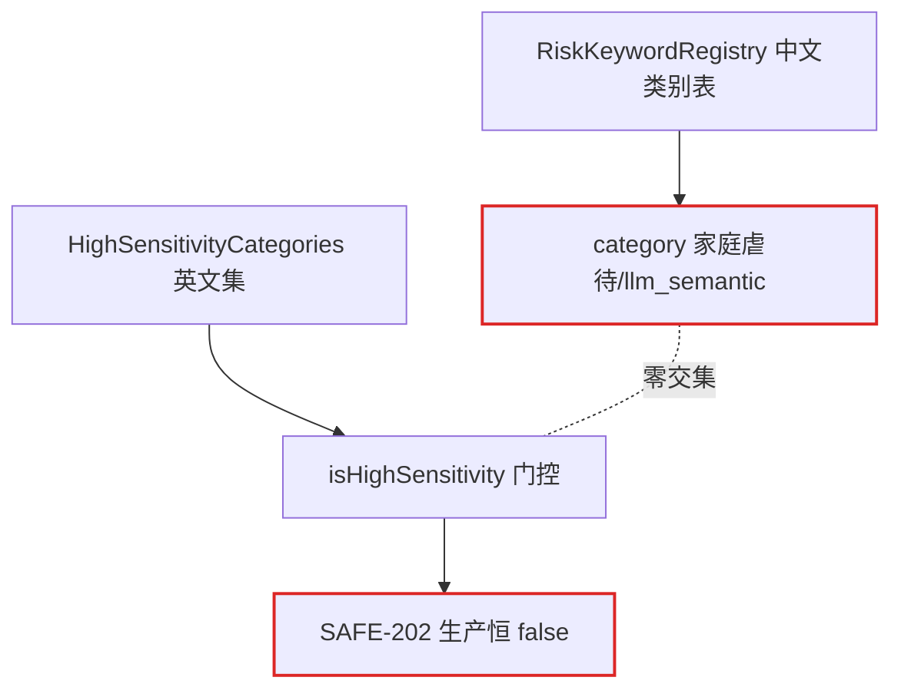

# doing/72 架构深化候选清单（方案与 SPEC）

> 编号：DOC-063 | 创建：2026-08-06 | 状态：⏳ 待议决（12 个深化候选已定稿，待选定后进入设计细化与实施）
> 来源：improve-codebase-architecture 全量架构审查（3 路并行探索 agent 交叉印证：后端 Java / 前端三端 / Python 服务与部署链路）
> 审查基线：develop @ abb9594（DOC-061 批次 A~D 完成后），工作区干净
> 词汇表：design/13_领域词汇表.md（§11 架构词汇：模块/接口/深度/接缝/适配器/杠杆/局域性/删除测试）
> 关联：doing/71（DOC-061 深度审计问题清单，批次 E 待排期）；ARCH-001~010（his/61~70）；frozen/38 计费套餐、frozen/59 量表施测

---

## §1 审查概述

### 1.1 方法与范围

| 维度 | 内容 |
|---|---|
| 探索方式 | 3 路独立 agent 只读探索（后端 Java 6 模块 / 前端三端 / Python 双服务 + 部署链路），交叉印证 |
| 热点定位 | 最近 60 提交：student-h5 语音链路（useWakeWord/LoginPage/VoiceLoginOverlay）、后端声纹与 LLM 链路、部署脚本（setup-server/cd.yml/service-manager）为高频变更区 |
| 判定标准 | 删除测试（复杂度被集中=深化机会，被移动=转发层）；「一个适配器=假设性接缝，两个=真实接缝」；假功能（测试绿、生产死）必除 |
| 产出 | 12 个深化候选（DC-001~DC-012）+ Top recommendation + 3 处台账失实附注 |

### 1.2 候选总览

| 编号 | 候选 | 域 | 推荐强度 | 核心问题 |
|---|---|---|---|---|
| DC-001 | 风险分级·收敛为单一类别源 | 后端 | 🟢 Strong | 类别三套词汇零交集，SAFE-202 高敏门控生产恒 false |
| DC-002 | 备份接缝·cron 指向不存在的文件 | 部署 | 🟢 Strong | setup-server.sh 自相矛盾，每日备份静默失败 |
| DC-003 | 配置透传契约·声明/透传/生效散落 | 部署 | 🟢 Strong | DASHSCOPE_TTS_MODEL 死配置，prod compose 未透传 |
| DC-004 | 双部署通道·健康判定与发布前置收敛 | 部署 | 🟢 Strong | 健康三套判定，deploy.sh 无模型门禁/无回滚 |
| DC-005 | 认证传输·三端收敛为共享模块 | 前端 | 🟢 Strong | tryRefresh 三份逐字重复，401 语义不一致 |
| DC-006 | 声纹·领域逻辑从控制器下沉 | 后端 | 🟡 Worth exploring | 354 行控制器承载整个声纹域，测试被迫反射注入 |
| DC-007 | 声纹注册·两处复制收敛为一个 hook | 前端 | 🟡 Worth exploring | LoginPage/SettingsPanel 逐字重复，失败文案不一致 |
| DC-008 | 情绪·五处表示收敛为一 | 后端 | 🟡 Worth exploring | 同一 anxious 双译冲突，跨包跳转 5 模块 |
| DC-009 | 唤醒词·本地模型加载器双实现 | 前端 | 🟡 Worth exploring | Transformers.js 初始化 40 行逐段重复 |
| DC-010 | 会话编排·策略决策从神方法下沉 | 后端 | 🟡 Worth exploring | sendMessageStream 254 行内联 11 概念，24 依赖 |
| DC-011 | 音色引擎·真实接缝缺适配器层 | Python | 🟡 Worth exploring | 降级编排散落 synthesize，每请求建线程 |
| DC-012 | 会话装配·规则从神组件中抽离 | 前端 | ⚪ Speculative | ChatRoom 615 行 12 hooks，规则不可独立测试 |

---

## §2 DC-001 风险分级 · 收敛为单一类别源 🟢 Strong

- **FILES**：`counseling-ai/.../risk/RiskKeywordRegistry.java` L128-176/L249-261；`counseling-ai/.../safety/HighSensitivityCategories.java` L24-32；`service/conversation/ConversationServiceImpl.java` L251/L705；`service/conversation/ConversationRiskProcessor.java` L90
- **PROBLEM**：类别三套词汇（中文类别表 / 英文集 self_harm / llm_semantic）零交集，`isHighSensitivity()` 门控**生产恒 false**——SAFE-202 高敏模式是死接缝（假功能）
- **SOLUTION**：类别收敛为单一类型化值对象；高敏判定/risk_events 落库/教师端展示/测试共用同一表示；SAFE-202 真实接线或删门
- **WINS**：locality 风险类别一处定义 · 删除测试：死门控可被消灭而非移动 · leverage：词典/判定/展示同步生效 · 教师端与 AI 简报不再双译

> ⚠️ **台账失实**：ARCH-003 声称类别已收敛，但高敏判定仍独立；SAFE-202 门控为假功能。

## §3 DC-002 备份接缝 · cron 指向不存在的文件 🟢 Strong

- **FILES**：`deploy/setup-server.sh` L88/L102；`deploy/backup.sh` L3/L20-27；`deploy/restore.sh` L14-23；`deploy/docker-compose.prod.yml` L7-12/L200
- **PROBLEM**：同一脚本内自相矛盾——L88 `cp backup.sh → /guju/mindsafe/deploy/`，L102 cron 却指向 `/guju/mindsafe/backup.sh`（从不被任何脚本创建）→ **每日 02:00 备份静默失败**；DB 连接事实（容器/库/卷）在 backup/restore/compose 三处硬编码，卷名靠正则猜测
- **SOLUTION**：DB 连接事实收敛为单一配置片段（backup/restore 共用）；cron 写入前校验脚本存在并 fail-fast；卷名由 compose 项目名派生
- **WINS**：生产故障级：备份从静默失败转为可见 · locality：DB 事实一处定义两处引用 · 删除测试：restore 不再复制探测逻辑

> ⚠️ **台账失实**：doing/71 §7 AUD-061 记录「cron 已由 AUD-032 接线」——接线了，但指向的路径从未被创建。

## §4 DC-003 配置透传契约 · 声明/透传/生效三处散落 🟢 Strong

- **FILES**：`deploy/.env.example` L102；`deploy/docker-compose.prod.yml` L158-159；`deploy/docker-compose.yml` L48；`backend/tts-service/app.py` L74/L90；`DEPLOY-GUIDE.md` L401
- **PROBLEM**：prod compose 仅透传 `DASHSCOPE_API_KEY`，`DASHSCOPE_TTS_MODEL` 在 .env.example 定义、文档宣称「改 env 生效」——**死配置**；Python 超时/CORS 变量（TTS_SYNTHESIZE_TIMEOUT/TTS_CORS_ORIGINS）无任何部署入口，只能改代码
- **SOLUTION**：「环境变量清单」作唯一事实源（声明/透传/消费/默认四列），compose 与 .env.example 做 diff 校验；Python 运行时参数补入 prod 透传
- **WINS**：删除测试：死配置从「假装生效」转为可验证 · locality：一次 diff 暴露所有透传缺口 · leverage：新增变量一处登记全链路核对

> ⚠️ **台账失实**：his/57 P8 标记 ✅ 完成，但只修在非 prod compose（docker-compose.yml）上，prod 未修。

## §5 DC-004 双部署通道 · 健康判定与发布前置收敛 🟢 Strong

- **FILES**：`deploy.sh` L202-207/L252；`.github/workflows/cd.yml` L206-212/L248-251/L283；`service-manager.sh` L74-103
- **PROBLEM**：「健康」概念三套判定（compose healthcheck / service-manager docker exec / cd.yml 公网 curl）；前端模型投放仅 CD 通道执行（prepare-models + `--verify` 门禁 + dist.prev 回滚），热修通道 deploy.sh 既无模型准备又 rsync 排除 models——热修可能发出无语音模型的 dist
- **SOLUTION**：健康判定与前端发布前置（模型准备+校验）抽为共享脚本，双通道同一入口；热修缺模型显式 fail-fast
- **WINS**：删除测试：deploy.sh 不再重复实现 · locality：健康判定一处定义 · 热修通道获得模型门禁与回滚能力

## §6 DC-005 认证传输 · 三端收敛为共享模块 🟢 Strong

- **FILES**：`frontend/student-h5/src/api.ts` L14-46/L88-108/L162-179（471 行）；`frontend/teacher-web/src/api.ts` L28-45/L54-74（340 行）；`frontend/parent-h5/src/api/index.ts` + `utils/auth.ts`
- **PROBLEM**：tryRefresh 三份几乎逐字相同；401 登出策略语义不一致（student/teacher `clearToken + location.reload` vs parent `clearAuth + location.href='/parent/'`）；错误模型分裂（student 有 ApiError 业务码分支，teacher/parent 只 throw Error）
- **SOLUTION**：抽共享「认证传输模块」：token 适配器 + authFetch + refresh + 统一 401 语义；三端只留端点声明与 DTO
- **WINS**：leverage：一次修复（如刷新竞态）传导三端 · 401 语义收敛为单一决策 · 删除测试：三份复制变一份实现

## §7 DC-006 声纹 · 领域逻辑从控制器下沉 🟡 Worth exploring

- **FILES**：`counseling-api/.../controller/VoiceprintController.java`（354 行）；`VoiceprintControllerTest.java` L69-73（ReflectionTestUtils.setField 注入 @Value）
- **PROBLEM**：控制器承担余弦相似度（L294-304）、SHA-256 指纹（L310-323）、XFF IP 解析（L285-292）、embedding JSON（L325-339）、租户内 1:N 比对（L182-243）、双 token 签发（L258-261）、审计（L263）、限流（L162-174）——声纹验证域逻辑无任何 Service 承载，7 个构造器依赖全部直连 Mapper/Provider；测试被迫反射注入，领域逻辑不可脱离 Web 层复用
- **SOLUTION**：抽取声纹域接口（enroll/verify），控制器只做 HTTP 编解码；相似度/阈值/指纹为纯函数；local/remote 双模式经同一接口形成真实接缝（AUD-062 已裁决 remote 保留）
- **WINS**：两个适配器 justify 接缝（local/remote）· 测试经领域接口而非反射 · locality：比对/阈值/指纹一处定义

## §8 DC-007 声纹注册 · 两处复制收敛为一个 hook 🟡 Worth exploring

- **FILES**：`frontend/student-h5/src/components/LoginPage.tsx` L459-487；`SettingsPanel.tsx` L91-122
- **PROBLEM**：local 分支 `enrollVoiceprint → issueVoiceCredential → saveVoiceCredential`、remote 分支 `remoteVoiceprintEnroll → markRemoteVoiceprintEnrolled` 两处几乎逐字重复；失败文案不一致（「声音数据保存失败，请检查网络后重试」vs「声纹保存错误，请检查网络后重试」）；已注册查询 hasAnyVoiceprint 双处各查一次
- **SOLUTION**：抽「声纹注册」领域 hook `useVoiceEnrollment`：mode 探测 + local/remote 分支 + 凭证签发 + 失败回退；LoginPage 与 SettingsPanel 各缩减为一行调用
- **WINS**：删除测试：任一调用处删除后流程仍完整 · locality：租户/凭证/标记规则单点维护 · 失败文案收敛一致

## §9 DC-008 情绪 · 五处表示收敛为一 🟡 Worth exploring

- **FILES**：`ConversationContextAgent.java` L32-43（anxious→紧张）；`TeacherController.java` L501-506（anxious→**焦虑**，冲突）；`EntryMoodStrategyResolver.java` L60-74（disgusted→angry 归一化）；`ConversationUtils.java` L110-111（DISTRESS_EMOTIONS 独立成员集）；`EmotionVocabulary.java` L35-42（isNegative 唯一入口）
- **PROBLEM**：同一 anxious 在教师导出与 AI 上下文简报呈现不同中文；理解「情绪」需跳转 5 个模块；无一致性护栏（删任一映射表行为变化但无人察觉）
- **SOLUTION**：情绪收敛为单一模块：规范 key + 中文标签 + 归一化/负面判定同居一处（或至少统一导入），展示表与判定表共享同一 key 权威
- **WINS**：locality：跨包跳转 5→1 · 删除测试：删任一散落映射行为可被检测 · 双译冲突根除

> ⚠️ **台账失实**：ARCH-003 声称情绪集合收敛于 EmotionVocabulary，展示/归一化/成员集仍各自独立。

## §10 DC-009 唤醒词 · 本地模型加载器双实现 🟡 Worth exploring

- **FILES**：`student-h5/src/hooks/useWakeWord.ts`（525 行，模型加载 L118-198）；`useVoiceprint.ts`（370 行，模型加载 L59-160）；`workers/wakeWordWorker.ts`；`config/wakeWord.ts`（135 行）
- **PROBLEM**：Transformers.js 初始化约 40 行逐段重复（SharedArrayBuffer/SIMD 检测、env.remoteHost、useWasmCache=false、numThreads=1、wasmPaths、graphOptimizationLevel、进度聚合）；useWakeWord 装 7 职责（环境探测/模型单例/Worker 通信/主线程降级/麦克风/iOS resume/滑窗 VAD）；概念跳转 6+ 模块
- **SOLUTION**：抽共享「本地模型加载器」（环境探测/单例/进度/降级），两 hook 只留领域逻辑；Worker 消息协议收敛到 worker 模块内
- **WINS**：删除测试：两份实现变单一真源 · locality：模型配置一处修改两链生效 · hook 接口收窄

## §11 DC-010 会话编排 · 策略决策从神方法下沉 🟡 Worth exploring

- **FILES**：`service/conversation/ConversationServiceImpl.java`（758 行，构造器 L97-120 共 24 依赖）；`sendMessageStream` L200-454（254 行）
- **PROBLEM**：C1 拆分后策略决策仍内联：RED 硬短路文案（L326-339）、时长引导语（L222/L342）、nudge 降级（L495-504）、高敏标记写死在神方法里；删除测试=复杂度被移动（编排职责与策略职责无边界）
- **SOLUTION**：方法内联 if 决策下沉为领域纯函数模块（风险策略/对话策略），编排层只做「按序调用」——sendMessageStream 成为可读流程脚本
- **WINS**：locality：风险文案与门控同居策略模块 · 策略模块可独立测试（纯函数） · 存量债：24 依赖逐步收窄

## §12 DC-011 音色引擎 · 真实接缝缺适配器层 🟡 Worth exploring

- **FILES**：`backend/tts-service/app.py` L339-381（synthesize 内联三级降级）/L384-497（双引擎实现）/L186-203（引擎可用性探测）/L431（每请求 threading.Thread）
- **PROBLEM**：双引擎（CosyVoice SDK + edge-tts）+ 前端 speechSynthesis 第三级——接缝真实存在却无适配器模块；`_synthesize_dashscope` 每请求建线程，wait_for 超时后 SDK 线程无法取消仍悬挂（对比 voice-service 已做进程级单例池，AUD-016）
- **SOLUTION**：「可用引擎探测→降级顺序→重试」收拢为独立策略模块（可注入 fake 引擎单测）；两引擎各成接口一致的适配器模块；超时后主动取消 SDK 线程或复用连接池
- **WINS**：两个适配器 justify 真实接缝 · 降级路径可单测（fake 引擎）· 线程生命周期收口于适配器

## §13 DC-012 会话装配 · 规则从神组件中抽离 ⚪ Speculative

- **FILES**：`student-h5/src/components/ChatRoom.tsx`（615 行：9 useState + 4 useRef + 8 useCallback + 10 useEffect + 12 自定义 hooks）
- **PROBLEM**：安卓音频路由保护策略（L187-209 三个 effect + userInteracted 态）、唤醒授权联动（L110-125）、boboState 六路三目（L299-304）埋在组件内——删除测试：规则随之消失，无可独立测试的模块
- **SOLUTION**：「安卓音频路由保护」（播放释放麦克风/600ms 预热/首次交互解锁）与「唤醒授权联动」（授权→预加载→开关状态机）各抽独立 hook，装配层只留调用与 JSX
- **WINS**：规则获得可测试模块（hook 单测）· locality：音频路由规则一处维护 · 装配层接口收窄

---

## §14 Top recommendation

**DC-001 风险分级·收敛为单一类别源** —— 一个收敛 = 修复生产恒 false 的 SAFE-202 死门控 + 消除中文/英文/llm_semantic 三重词汇 + 落库/教师端/测试共用同一表示。它是三路探索中唯一「修复假功能与统一词汇同时发生」的候选，且与 ARCH-003 声称收敛的未竟之事同源，杠杆与台账一致性双收。

**DC-002 备份 cron 断裂**属故障级（每日静默失败），虽是单点修复，建议**先行排障**（改 cron 路径 + fail-fast 校验），再以 DC-001 作为架构深化起点。

---

## §15 附注与后续

1. **台账失实 3 处**（本审查发现，与 doing/71 台账一致性原则同源）：① doing/71 §7 AUD-061 备份 cron「已接线」但路径断裂；② his/57 P8 配置透传标记完成但 prod 未修；③ ARCH-003 声称类别/情绪收敛但展示/判定仍独立。建议随对应候选修复时一并修正台账记录。
2. **与 doing/71 的关系**：本清单为架构深化候选（DC 编号），doing/71 为审计问题清单（AUD 编号）——DC-002/003/004 与 AUD-032/002/004 相关联但侧重不同（前者为架构收敛，后者为缺陷修复），实施时相互引用避免重复。
3. **选定候选后**：按 doing 工作流先在本文档补充设计细化与 SPEC（接缝形状/接口草案/测试方案），再进入 TDD 实施。
